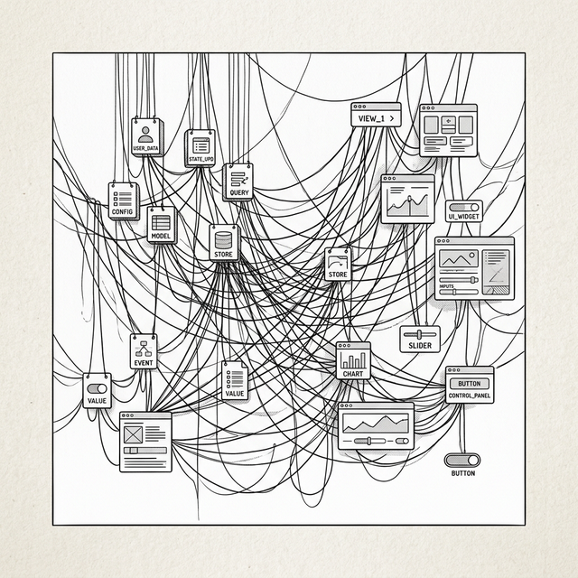

# Chapter 3: The Dawn of Data Binding



## 3.1 Seeking Balance

Po sat at his desk, turning over the "string concatenation" code from the last chapter, brow furrowed.

**🐼**: Shifu, I'm stuck in a dilemma. Raw DOM operations (chapter one) have good performance but are hard to maintain. String templates (chapter two) produce clean code but re-render the whole page every time, which is terrible for UX. Is there no middle road? Something you can write happily but that only updates the changed part?

**🧙‍♂️**: What you're longing for is **precision**. Imagine when this cup of tea goes cold — you want me to heat just this cup, not warm up all the air in the room.

**🐼**: Exactly! If the `count` in the data changes, I only want to update the `<span>` showing the number. Don't touch anything else.

**🧙‍♂️**: To do that, your data must stop being a silent, inert thing. It must learn to **shout**.

**🐼**: Shout?

**🧙‍♂️**: When data changes, it needs to announce: "I changed! Whoever cares about me, come and update!" This is the **Observer Pattern**. Built on this, the early MVC frameworks were born.

## 3.2 Data That Talks

**🧙‍♂️**: What we need now is a new kind of data model — one that can **automatically notify** everyone who cares when data changes. In other words, data that "talks."

**🐼**: Automatic notification? You mean I no longer need to manually call update functions — the data will "shout" on its own?

**🧙‍♂️**: Exactly. This is the core of the **Observer Pattern** — the publisher sends a notification when state changes, and subscribers execute their updates upon receiving it. How would you implement this "shouting" mechanism?

**🐼**: I think I need two things: a way to "register a listener" so others can say "I care about your changes," and a way to "trigger notifications" to tell everyone who cares when data changes. Let me write a base class.

```javascript
class EventEmitter {
  constructor() {
    this.listeners = {};
  }

  on(event, callback) {
    if (!this.listeners[event]) {
      this.listeners[event] = [];
    }
    this.listeners[event].push(callback);
  }

  off(event, callback) {
    if (!this.listeners[event]) return;
    this.listeners[event] = this.listeners[event].filter(f => f !== callback);
  }

  emit(event, payload) {
    if (this.listeners[event]) {
      this.listeners[event].forEach(cb => cb(payload));
    }
  }
}

class Model extends EventEmitter {
  constructor(data) {
    super();
    this.data = data;
  }

  set(key, value) {
    if (this.data[key] !== value) {
      this.data[key] = value;
      // Data changed — shout it out!
      this.emit('change', { key, value });
      this.emit(`change:${key}`, value);
    }
  }

  get(key) {
    return this.data[key];
  }
}
```

**🐼**: I get it. `Model` becomes a data container that can "speak," and anyone who subscribes to it will be notified when data changes.

## 3.3 Rewriting the Todo List with MVC

**🧙‍♂️**: Good. Now use this `Model` to rewrite our Todo List. Let's feel what "surgical updates" are like.

**🐼**: Got it. I'll put the Todo data in the Model, and when data changes, precisely update the corresponding DOM nodes.

```javascript
// === Model ===
const todoModel = new Model({
  todos: [
    { id: 1, text: 'Learn JavaScript', done: true }, 
    { id: 2, text: 'Learn Templates', done: false }
  ],
  inputValue: '',
});

// === View ===
const listEl = document.getElementById('todo-list');
const inputEl = document.getElementById('todo-input');
const statsEl = document.getElementById('stats');

// === Binding: View → Model ===
inputEl.addEventListener('input', (e) => {
  todoModel.set('inputValue', e.target.value);
});

document.getElementById('add-btn').addEventListener('click', () => {
  const value = todoModel.get('inputValue');
  if (!value) return;
  const todos = todoModel.get('todos').slice();
  todos.push({ id: Date.now(), text: value, done: false });
  todoModel.set('todos', todos);
  todoModel.set('inputValue', '');
});

// === Binding: Model → View ===
// When the list changes, fully update the list area
todoModel.on('change:todos', () => renderFullList());

// When input value changes, [precisely update] the input box
todoModel.on('change:inputValue', (v) => {
  inputEl.value = v;                      
});

// We omit the renderFullList function that creates DOM details and focus on the binding relationship.
renderFullList();
```

**🐼**: Great! I can type in the input box without losing focus! Because when I update the list, I never touched the `input` element. Every time data changes, only the related DOM gets updated.

**🧙‍♂️**: Notice that `renderList` internally still uses `listEl.innerHTML = ''` to rebuild the list — that part is still "destroy and rebuild." The key is: **the input box wasn't recreated**. We only rebuilt the changed part (the list), leaving the unchanged part (the input) alone. That's what "surgical updates" means — not perfect, but much better than chapter two's full rebuild.

This is the magic of **data binding**. Backbone.js, Knockout.js, and even early AngularJS are outstanding representatives of this school. By making data "proactively notify," we achieved surgical DOM updates.

**🐼**: And the stats don't need to be maintained separately anymore. As long as `change:todos` triggers, the stats update automatically. Much more elegant than calling `updateStats()` everywhere in chapter one.

## 3.4 The Backlash of Complexity

**🧙‍♂️**: Enjoy this moment of precision, Po. Because you'll soon fall into a chaotic mess.

**🐼**: Why? This looks perfect.

**🧙‍♂️**: Let me show you. Imagine you want to add a few new features to this Todo List: **let users switch between "All/Done/Active" filter views, add a done count stat, and provide a "Clear done" button at the bottom**.

Look at what the code turns into:

```javascript
// Model A: todo list
const todoModel = new Model({ todos: [...], filter: 'all' });

// Model B: stats (depends on Model A)
const statsModel = new Model({ total: 0, done: 0 });

// When View A updates → sync Model B
todoModel.on('change:todos', (todos) => {
  statsModel.set('total', todos.length);
  statsModel.set('done', todos.filter(t => t.done).length);
});

// Model B changes → update View B (stats panel)
statsModel.on('change:total', (v) => updateStatsView());
statsModel.on('change:done', (v) => updateStatsView());

// filter changes → also update View A (re-filter list)
todoModel.on('change:filter', () => {
  renderFilteredList();  
});

// User clicks View B "Clear done" → remove done items from Model A
clearDoneBtn.addEventListener('click', () => {
  const remaining = todoModel.get('todos').filter(t => !t.done);
  todoModel.set('todos', remaining);
  // this triggers change:todos → updates statsModel → updates View B ...
});
```

**🐼**: Wait... I count Model A notifying Model B, Model B updating View B, View B's action changing Model A, Model A notifying Model B again...

**🧙‍♂️**: This is the **"Ping Pong Effect"**. When two-way binding and event flows get tangled, no one can say how many chain reactions one data change will trigger. And —

**🐼**: — when debugging, I just see some View suddenly change, but I don't know which event chain fired first.

**🧙‍♂️**: There's also a more subtle killer — **Zombie Views**. If you remove the list view from the DOM when switching pages, but forget to unsubscribe it from `todoModel` (`todoModel.off(...)`), what happens?

**🐼**: When `todoModel` changes, it will still try to execute the callback, updating a DOM element that no longer exists?

**🧙‍♂️**: Yes. This causes memory leaks and errors. You have to act like a bomb disposal expert, carefully unbinding every event when destroying a component. Miss one and your app gets slower and slower over time, full of ghost-like bugs.

## 3.5 A Historical Note: Backbone.js

**🧙‍♂️**: **Backbone.js** was one of the first frameworks to bring MVC structure to frontend applications.

```javascript
// Backbone.js style (2010)
const TodoModel = Backbone.Model.extend({
  defaults: { title: '', done: false }
});

const TodoView = Backbone.View.extend({
  tagName: 'li',
  
  events: {
    'click .toggle': 'toggleDone'
  },

  initialize: function() {
    // Manual binding: Model change → re-render View
    this.listenTo(this.model, 'change', this.render);
  },

  toggleDone: function() {
    this.model.set('done', !this.model.get('done'));
  },

  render: function() {
    this.$el.html('<input class="toggle" type="checkbox">' + this.model.get('title'));
    return this;
  }
});
```

**🐼**: Looks very structured! Model, View, event binding are all clearly separated.

**🧙‍♂️**: Yes, but notice that `this.listenTo` and the manual `this.render`. You have to manually build a pipeline for every Model-View relationship. Miss one and it's a bug.

## 3.6 Reaching the Crossroads

**🧙‍♂️**: We've gone through three stages:

1. **Raw DOM**: Moving bricks manually — tedious and messy.
2. **String templates**: Tear down and rebuild — clean but slow.
3. **MVC**: Fine surgery — but because state and events are intertwined, it became a maintenance nightmare.

**🐼**: Shifu, this is so discouraging. Either verbose (raw), or brutal (templates), or chaotic (MVC).

Is there really a way that's simple to write like templates (declarative), updates fast like data binding (high performance), and doesn't require me to manually manage all those event listeners?

**🧙‍♂️**: That's a greedy wish. But history always has clever people who try to satisfy greed by breaking the rules. In the next chapter you'll see a new approach.

---

### 📦 Try It Yourself

Save the following code as `ch03.html` to experience how Observer-pattern data binding achieves surgical DOM updates and solves the focus-loss problem:

```html
<!DOCTYPE html>
<html lang="en">
<head>
  <meta charset="UTF-8">
  <title>Chapter 3 — Data Binding Todo List</title>
  <style>
    body { font-family: sans-serif; padding: 20px; max-width: 600px; margin: 0 auto; background: #f9f9f9; }
    .card { border: 1px solid #ddd; border-radius: 8px; padding: 15px; margin: 15px 0; background: white; }
    .card h3 { margin-top: 0; }
    button { padding: 6px 12px; cursor: pointer; margin: 4px; border-radius: 4px; border: 1px solid #ccc; background: #eee; }
    button.active { background: #007bff; color: white; border-color: #007bff; }
    li { padding: 8px 0; border-bottom: 1px solid #eee; display: flex; justify-content: space-between; align-items: center; list-style: none; }
    li .task-content { display: flex; align-items: center; gap: 8px; }
    li.done span { text-decoration: line-through; color: #999; }
    li .delete-btn { background: #ff4444; color: white; border: none; padding: 4px 8px; border-radius: 4px; cursor: pointer; }
    input[type="text"] { padding: 8px; width: 60%; border-radius: 4px; border: 1px solid #ccc; }
    #stats { font-size: 14px; color: #666; margin-top: 10px; }
    #empty-msg { color: #999; font-style: italic; font-size: 14px; margin-top: 10px; }
    #log { background: #f5f5f5; padding: 10px; border-radius: 4px; font-family: monospace; font-size: 12px; max-height: 150px; overflow-y: auto; }
    .filters { margin: 10px 0; }
  </style>
</head>
<body>
  <div class="card">
    <h3>My Todo List</h3>
    <p style="font-size: 12px; color: #666;">This demo shows <strong>Observer Pattern</strong> data binding.<br>
     Input focus will no longer be lost, and there's a simple Filter to demonstrate state sync.</p>
    
    <div>
      <input type="text" id="todo-input" placeholder="Add a task">
      <button id="add-btn">Add</button>
    </div>

    <div class="filters" id="filters">
      <button data-filter="all" class="filter-btn active">All</button>
      <button data-filter="active" class="filter-btn">Active</button>
      <button data-filter="completed" class="filter-btn">Completed</button>
    </div>

    <p id="stats">Total 0 items</p>
    <p id="empty-msg">No data</p>
    <ul id="todo-list" style="padding-left: 0; margin-bottom: 0;"></ul>
  </div>

  <div class="card">
    <h3>📋 Event Log</h3>
    <div id="log"></div>
  </div>

  <script>
    // --- 1. EventEmitter (Observer Pattern core) ---
    class EventEmitter {
      constructor() { this.listeners = {}; }
      on(event, cb) {
        if (!this.listeners[event]) this.listeners[event] = [];
        this.listeners[event].push(cb);
      }
      off(event, cb) {
        if (!this.listeners[event]) return;
        this.listeners[event] = this.listeners[event].filter(f => f !== cb);
      }
      emit(event, payload) {
        if (this.listeners[event]) this.listeners[event].forEach(cb => cb(payload));
      }
    }

    // --- 2. Model (data that "shouts") ---
    class Model extends EventEmitter {
      constructor(data) { super(); this.data = data; }
      set(key, value) {
        if (this.data[key] !== value) {
          const oldValue = this.data[key];
          this.data[key] = value;
          this.emit('change', { key, value, oldValue });
          this.emit('change:' + key, value);
        }
      }
      get(key) { return this.data[key]; }
    }

    // --- 3. App logic ---
    const todoModel = new Model({
      todos: [
        { id: 1, text: 'Learn JavaScript', done: true }, 
        { id: 2, text: 'Learn Templates', done: false }
      ],
      inputValue: '',
      filter: 'all'
    });

    const listEl = document.getElementById('todo-list');
    const inputEl = document.getElementById('todo-input');
    const statsEl = document.getElementById('stats');
    const emptyEl = document.getElementById('empty-msg');
    const logEl = document.getElementById('log');

    function log(msg) {
      const line = document.createElement('div');
      line.textContent = '[' + new Date().toLocaleTimeString() + '] ' + msg;
      logEl.prepend(line);
    }

    function renderList() {
      listEl.innerHTML = '';
      const allTodos = todoModel.get('todos');
      const filter = todoModel.get('filter');
      
      const todos = allTodos.filter(t => {
        if (filter === 'active') return !t.done;
        if (filter === 'completed') return t.done;
        return true;
      });

      todos.forEach((todo) => {
        const li = document.createElement('li');
        if (todo.done) li.classList.add('done');

        const contentDiv = document.createElement('div');
        contentDiv.className = 'task-content';

        const checkbox = document.createElement('input');
        checkbox.type = 'checkbox';
        checkbox.checked = todo.done;
        checkbox.addEventListener('change', () => {
          const updated = todoModel.get('todos').map(t => 
            t.id === todo.id ? { ...t, done: checkbox.checked } : t
          );
          todoModel.set('todos', updated);
        });

        const span = document.createElement('span');
        span.textContent = todo.text;

        contentDiv.appendChild(checkbox);
        contentDiv.appendChild(span);
        li.appendChild(contentDiv);

        const deleteBtn = document.createElement('button');
        deleteBtn.className = 'delete-btn';
        deleteBtn.textContent = '×';
        deleteBtn.addEventListener('click', () => {
          const updated = todoModel.get('todos').filter(t => t.id !== todo.id);
          todoModel.set('todos', updated);
        });
        li.appendChild(deleteBtn);

        listEl.appendChild(li);
      });
      const doneCount = allTodos.filter(t => t.done).length;
      statsEl.textContent = `Done ${doneCount} / Total ${allTodos.length}`;
      emptyEl.style.display = todos.length === 0 ? 'block' : 'none';
      
      // Update filter button active state
      document.querySelectorAll('#filters button').forEach(btn => {
        if (btn.dataset.filter === filter) {
          btn.classList.add('active');
        } else {
          btn.classList.remove('active');
        }
      });
    }

    // Binding: View → Model
    inputEl.addEventListener('input', (e) => {
      todoModel.set('inputValue', e.target.value);
    });

    document.getElementById('add-btn').addEventListener('click', () => {
      const value = todoModel.get('inputValue');
      if (!value) return;
      const todos = todoModel.get('todos').slice();
      todos.push({ id: Date.now(), text: value, done: false });
      todoModel.set('todos', todos);
      todoModel.set('inputValue', '');
    });

    document.querySelectorAll('.filter-btn').forEach(btn => {
      btn.addEventListener('click', (e) => {
        todoModel.set('filter', e.target.dataset.filter);
      });
    });

    // Binding: Model → View (surgical updates — the input is never recreated!)
    todoModel.on('change:todos', (todos) => {
      renderList();
      log('Model.todos changed → list re-rendered (' + todos.length + ' items)');
    });

    todoModel.on('change:filter', (f) => {
      renderList();
      log('Model.filter changed to ' + f + ' → list re-rendered');
    });

    todoModel.on('change:inputValue', (v) => {
      inputEl.value = v; // only update input value, don't recreate the element
      log('Model.inputValue → "' + v + '"');
    });

    // Initialize
    renderList();
    log('App initialized. Input focus will NOT be lost!');
  </script>
</body>
</html>
```
