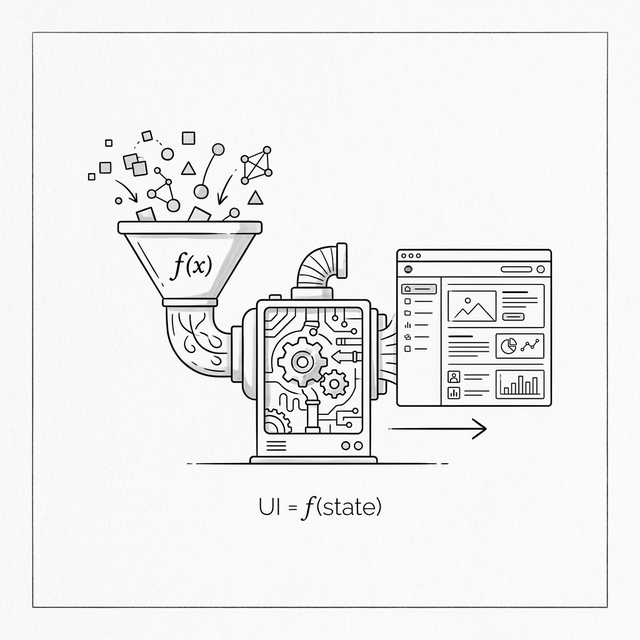

# Chapter 4: The Big Idea — UI as a Function of State



## 4.1 The Desire for Simplicity

Po leaned back in his chair, exhausted. The MVC pattern from the last chapter was precise, but those tangled event listeners made him feel suffocated.

**🐼**: Shifu, for so-called "surgical updates," we had to write tons of `on('change')` code. Every new feature means carefully binding and unbinding events. It's exhausting.

I actually miss the "template engine" from chapter two. Even though its performance and UX were bad, it was truly simple — when data changes, just call `renderApp()` and done.

**🧙‍♂️**: You've grasped the essence of the problem. In MVC, we sacrificed developer simplicity (manually managing dependencies) for performance (only updating local DOM). In the template era, we had developer simplicity (full refresh) but sacrificed performance and UX.

**🐼**: Is there really no way to have both? I want to write code like templates (declarative), but have it run like MVC (fine-grained updates).

In other words, I want a function — give it the current state, and it tells me directly what the interface should look like.

**🧙‍♂️**: You just summarized in one sentence the most important conceptual shift in frontend framework history. In formula form:

$$ UI = f(state) $$

In 2011, engineers at Facebook faced the same dilemma and made the exact same realization. That idea eventually evolved into the React framework. And what we're about to do is implement this idea ourselves.

## 4.2 Rethinking "Refresh"

**🧙‍♂️**: Po, imagine an ideal world where browser DOM operations are lightning fast — negligible. In that world, how would you write code?

**🐼**: I'd just use `innerHTML` to redraw the whole page every time! That's simplest — no need for any `Model`, no listeners.

**🧙‍♂️**: Right. Unfortunately, we already saw in chapter two what full re-renders cost — not only expensive in performance, but they also destroy the entire DOM tree, causing input boxes to lose focus and user state to be lost. Where's the problem?

**🐼**: The problem is directly operating on the real DOM. Full rebuilds are too wasteful.

**🧙‍♂️**: What if we didn't operate on the real DOM directly? Step back first — could we do a "rehearsal" before actually making changes?

**🐼**: A "rehearsal"? You mean... figure out what to change before actually doing it?

**🧙‍♂️**: Something like that. But not in your "head" — in JavaScript. What if instead of rendering UI into real DOM, we rendered it into a plain **JavaScript object**?

**🐼**: A JavaScript object? You mean describe the page structure with an object... like `{ tag: 'div', children: [...] }`?

**🧙‍♂️**: Exactly. These are just plain JS objects — creating them costs almost nothing. Now, suppose you already have the object tree from the last render and you generate a new one — what would you do next?

**🐼**: Compare the two trees... find what's different!

**🧙‍♂️**: And then?

**🐼**: Then only apply the differences to the real DOM! No need to rebuild the entire DOM tree each time!

**🧙‍♂️**: Now connect those two steps — from the developer's perspective, what's the experience?

**🐼**: For developers, they regenerate the entire object tree each time — the code is as simple as writing templates. But for the browser, only truly changed nodes get updated — performance is close to hand-optimized MVC. The only cost is a bit of extra CPU work to compare... wait, isn't this the best of both worlds?!

**🧙‍♂️**: What you just derived step by step is the core idea of the Virtual DOM — this "JavaScript object tree" is called the **Virtual DOM**.

## 4.3 A Pure Mapping

**🧙‍♂️**: Since you've derived the core idea, let's put it into practice. To focus on the VNode structure and diffing, we'll use a simpler Counter example for now and return to the Todo List once the engine matures.

First, we need to change how we describe UI. In the template era, we described UI with strings: `` `<li>${todo.text}</li>` ``

Now, we describe UI with **data structures**.

**🐼**: We use objects instead of strings because objects can be compared layer by layer for differences, while strings are hard to analyze that way, right?

**🧙‍♂️**: Exactly. Objects are structured, naturally suited for algorithmic analysis. Let's write a function that takes state and returns an object tree describing the UI.

First, let's think about what the UI should look like in HTML:

```html
<div id="app">
  <h1>Count: 0</h1>
  <button onclick="increment()">Add</button>
  <ul>
    <li>Buy Milk</li>
    <li>Learn React</li>
  </ul>
</div>
```

Now we describe the **exact same structure** with JavaScript objects. Each HTML tag becomes a `{ tag, props, children }` object.

**🐼**:

```javascript
// State
const state = {
  count: 0,
  todos: ['Buy Milk', 'Learn React']
};

function render(state) {
  return {
    tag: 'div',
    props: { id: 'app' },
    children: [
      {
        tag: 'h1',
        props: {},
        children: ['Count: ' + state.count]
      },
      {
        tag: 'button',
        props: { onclick: () => { state.count++; } }, // note: function reference, not string!
        children: ['Add']
      },
      {
        tag: 'ul',
        props: {},
        children: state.todos.map(todo => ({
          tag: 'li',
          props: {},
          children: [todo]
        }))
      }
    ]
  };
}

const vdom = render(state);
console.log(vdom);
```

**🧙‍♂️**: See, this `vdom` object is a **snapshot** of the UI for the current state. Two key points:

1. **Props are JS values**: `onclick: increment` is a function reference, not a string. This is both safe (no more XSS) and efficient (we can compare references with `===`).
2. **Nested structure maps the UI tree**: The structure of this object tree perfectly mirrors the DOM tree structure.

If `state.count` becomes 1 and you call `render(state)` again, you get a new snapshot.

**🐼**: That step is fast, because I'm just creating JS objects — I haven't touched the real DOM.

**🧙‍♂️**: Right. The magic in the next step is how to translate the "differences" between two snapshots into real DOM operation instructions.

## 4.4 Single Source of Truth

**🧙‍♂️**: In this model, how does data flow?

**🐼**: It looks **one-way**.

1. Data (State) enters the `render` function.
2. `render` outputs Virtual DOM.
3. Virtual DOM ultimately becomes real DOM.

Unlike MVC, where View can directly change Model, and Model can change View, creating a mess. Here, the UI is always a projection of State.

**🧙‍♂️**: This is exactly the **Single Source of Truth** we're pursuing.

- **MVC/MVVM**: View input can directly modify Model, Model triggers View updates, and the source of data becomes ambiguous.
- **React**: UI is a pure function of State. To change the UI, you must change State (the source), then regenerate the entire UI.

**🐼**: I understand. Like a projector — the image always comes from the film. If I want to change the image, I can't wipe the projection screen — I have to swap the film.

**🧙‍♂️**: A brilliant analogy. This principle not only simplifies state management but also lays a solid foundation for the **component system** we'll build later.

The key now is: it makes programs **predictable**. No matter how long your app has been running, give me the State at any moment, and I can know exactly what the UI looks like.

## 4.5 A Historical Note: The Birth of React (2011–2013)

**🧙‍♂️**: This "UI = f(state)" idea wasn't accepted by everyone at first. In 2011, Facebook's ad system became hard to maintain. Engineer **Jordan Walke**, inspired by **XHP** — a PHP extension used internally at Facebook that allowed writing XML/HTML directly in PHP code, blurring the boundary between templates and code — created an early prototype of React internally.

> **Background**: At the time, the mainstream was two-way binding (Angular, Knockout). When Jordan publicly introduced React at JSConf US in 2013, the audience didn't cheer. Everyone thought "writing HTML in JS" (what became JSX) was a huge step backward, and "full re-renders" sounded terribly bad for performance.

**🧙‍♂️**: But that was the genius insight. Jordan realized that as long as the Virtual DOM was fast enough, we could sacrifice a little **runtime performance** for **developer experience**.

## 4.6 Everything Is Ready

**🧙‍♂️**: React isn't some magical black technology. It just made a bold trade-off: it introduced extra CPU computation (generating Virtual DOM, comparing differences) and memory overhead (always keeping a full Virtual DOM tree in memory) to reduce developer cognitive burden (no more manually managing DOM updates).

**🐼**: So the cost is CPU and memory, and what we get is development efficiency and maintainability. Given that modern devices are increasingly powerful, that's a good deal.

**🧙‍♂️**: But Po, ideas alone aren't enough. You say "compare new and old differences" — how specifically do we do that? If I want to turn this `vdom` into a real interface, how do I write the `mount` function? If state changes, how do I use a `patch` function to only update what changed?

**🐼**: That... seems to involve complex algorithms.

**🧙‍♂️**: In the next chapter, we'll go under the hood and build this core engine ourselves.

---

### 📦 Try It Yourself

Save the following code as `ch04.html`. In this chapter we haven't implemented the Diff algorithm yet, but we can first see what **Virtual DOM** actually looks like. In the next chapter we'll replace `innerHTML` here with a `patch` function.

```html
<!DOCTYPE html>
<html lang="en">
<head>
  <meta charset="UTF-8">
  <title>Chapter 4 — The Big Idea</title>
  <style>
    body { font-family: sans-serif; padding: 20px; }
    pre { background: #f4f4f4; padding: 15px; border-radius: 5px; overflow-x: auto; font-size: 13px; }
    button { padding: 8px 16px; font-size: 16px; margin-top: 10px; cursor: pointer; }
    .note { color: #999; font-size: 13px; margin-top: 20px; }
  </style>
</head>
<body>
  <h1>UI = f(state)</h1>
  <p>Click the button and watch the Virtual DOM object change with state.
     Note: we're still using innerHTML in this chapter (next chapter will replace it with patch).</p>
  
  <div id="app">
    <!-- UI will render here -->
  </div>
  
  <h3>Current Virtual DOM snapshot:</h3>
  <pre id="vdom-display"></pre>

  <p class="note">💡 The button's onclick in the VNode is a function reference (not a string),
    which is safer than the template era's <code>onclick="increment()"</code> (no XSS risk)
    and more efficient (can compare references with ===).</p>

  <script>
    // 1. State
    const state = {
      count: 0
    };

    let prevSnapshot = null;

    // 2. Returns a JS object (Virtual DOM) instead of a template string
    // This is the prototype of React.createElement
    function render(state) {
      return {
        tag: 'div',
        props: { style: 'border: 1px solid #ccc; padding: 10px;' },
        children: [
          {
            tag: 'h1',
            props: { style: 'color: #333' },
            children: ['Count: ' + state.count]
          },
          {
            tag: 'p',
            props: {},
            children: ['The UI is a function of state.']
          },
          {
            tag: 'button',
            props: { onclick: increment }, // function reference!
            children: ['Add']
          }
        ]
      };
    }

    function increment() {
      state.count++;
      updateApp();
    }

    // 3. Simulate rendering
    // ⚠️ Still using innerHTML here — next chapter's patch will replace it
    function updateApp() {
      const vnode = render(state);
      
      const display = document.getElementById('vdom-display');
      const newJson = JSON.stringify(vnode, (key, val) => typeof val === 'function' ? '[Function: ' + val.name + ']' : val, 2);
      
      if (prevSnapshot) {
        // Highlight diff
        const oldLines = prevSnapshot.split('\n');
        const newLines = newJson.split('\n');
        let diffHtml = '';
        const maxLen = Math.max(oldLines.length, newLines.length);
        for (let i = 0; i < maxLen; i++) {
          const ol = oldLines[i] || '';
          const nl = newLines[i] || '';
          if (ol !== nl) {
            diffHtml += '<span style="background:#ffe0e0;text-decoration:line-through;">' + ol.replace(/</g,'&lt;') + '</span>\n';
            diffHtml += '<span style="background:#e0ffe0;font-weight:bold;">' + nl.replace(/</g,'&lt;') + '</span>\n';
          } else {
            diffHtml += nl.replace(/</g,'&lt;') + '\n';
          }
        }
        display.innerHTML = diffHtml;
      } else {
        display.textContent = newJson;
      }
      prevSnapshot = newJson;
        
      // Simple brute-force view update (next chapter we'll use Diff + Patch)
      const appEl = document.getElementById('app');
      appEl.innerHTML = `
        <div style="${vnode.props.style}">
           <h1 style="${vnode.children[0].props.style}">${vnode.children[0].children[0]}</h1>
           <p>${vnode.children[1].children[0]}</p>
           <button id="inc-btn">${vnode.children[2].children[0]}</button>
        </div>
      `;
      // Because innerHTML rebuilt the DOM, need to rebind events
      document.getElementById('inc-btn').addEventListener('click', increment);
    }

    // Initialize
    updateApp();
  </script>
</body>
</html>
```
