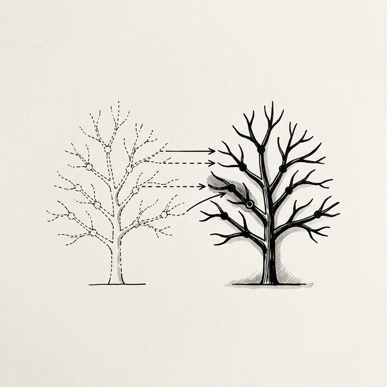
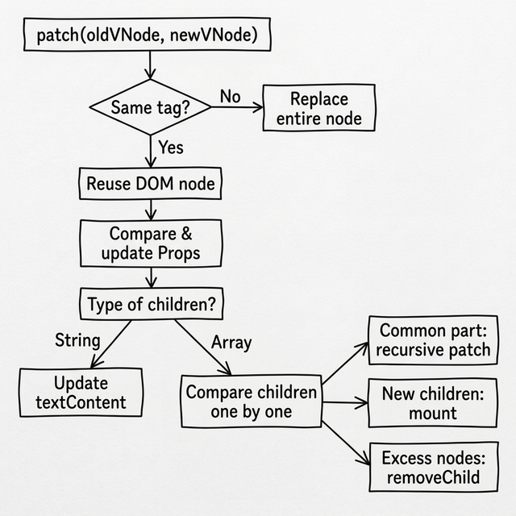

# Chapter 5: Virtual DOM & Reconciliation



## 5.1 The Global Mental Model

Po looked thoughtfully at the `vdom` object generated in the last lesson.

**🐼**: Shifu, I agree that the idea of `UI = f(state)` is beautiful. But every time the state changes, we generate a whole new tree of objects and then compare the differences. Isn't this slower than manipulating the DOM directly?

**🧙‍♂️**: This is a common question. Po, tell me, in a browser, which is more expensive: creating a `div` element (a real DOM node) or creating a plain JavaScript object (a Virtual DOM node)?

**🐼**: It should be the real DOM, right? Because it carries all the browser's attributes, styles, event listeners, and layout calculations.

**🧙‍♂️**: Exactly. Every real DOM node is extremely heavy, while JavaScript objects are very lightweight. The Virtual DOM is a lightweight description of the real DOM. Instead of destroying and rebuilding the massive real DOM tree, it is much more efficient to compare the differences between two lightweight objects in JavaScript, and then precisely update the real DOM.

**🐼**: That sounds like separating calculation from rendering. But before we get into the code details, can you tell me how the whole system works together?

**🧙‍♂️**: Yes. For the Virtual DOM to work, we need three core mechanisms. Try to deduce it: when you have a `state`, what is the first thing you need to do?

**🐼**: I need a function to convert the `state` into that lightweight JavaScript object tree. We can call it `render`.

**🧙‍♂️**: Yes. Once you have the Virtual DOM tree, what's next?

**🐼**: If this is the first time the page loads, I need to "translate" this virtual tree into real DOM and mount it to the page. We can call this process `mount`.

**🧙‍♂️**: Continue. What happens when the user clicks a button and the `state` changes?

**🐼**: I will call `render` again to generate a **new** Virtual DOM tree. Then I need a function to compare the differences between the **new tree** and the **old tree**, and apply those differences to the existing real DOM. This should be called `patch`.

**🧙‍♂️**: Precisely. This is the global mental model of how React works:

```javascript
// --- 1. Define how to generate VDOM ---
function render(state) {
  // Returns a JavaScript object describing the UI
}

// --- 2. Initialization ---
let state = { count: 0 };
let prevVNode = render(state);                        // Generate the first Virtual DOM tree
mount(prevVNode, document.getElementById('app'));     // Mount to real DOM

// --- 3. State Update ---
function update() {
  state.count++;
  const newVNode = render(state);   // Generate a new Virtual DOM tree
  patch(prevVNode, newVNode);       // Compare differences, precisely update real DOM
  prevVNode = newVNode;             // The new tree becomes the baseline for the next comparison
}
```

**🐼**: I can see the big picture now. `render` describes the UI, `mount` handles the initial creation, and `patch` handles efficient updates.

---

## 5.2 Describing the UI: The `h` Function

**🧙‍♂️**: Let's implement the first step. We need a utility function to quickly build virtual nodes. In the community, it is usually called `h` (Hyperscript) or `createElement`.

**🐼**: Is it just used to return that lightweight JavaScript object?

```javascript
function h(tag, props, children) {
  return {
    tag,
    props: props || {},
    children: children || []
  };
}

// Use it to build a VDOM tree
const vnode = h('div', { id: 'app' }, [
  h('h1', null, ['Hello World']),
  h('p',  null, ['This is a VNode'])
]);
```

**🧙‍♂️**: Yes. Note two conventions: first, `children` is always an **array**; second, the elements in the array can be strings (text nodes) or another VNode object.

> 💡 **JSX Preview**: This `h()` function is exactly the target of JSX compilation. When you write `<button onClick={fn}>Add</button>` in React, a compiler (like Babel) will convert it to `React.createElement('button', { onClick: fn }, 'Add')` — its core principle is exactly the same as our `h`.

---

## 5.3 The First Render: The `mount` Function

**🧙‍♂️**: With the Virtual DOM tree, we need to implement the `mount` function. Assume you receive `h('h1', { id: 'title' }, ['Hello'])`, what steps do you need to turn it into a real DOM node?

**🐼**: Let me think...
1. First, create an empty `<h1>` tag based on the `tag`.
2. Then, iterate through `props` and set `id="title"` on the tag.
3. Next, process `children`. Since it contains the string `'Hello'`, put the text inside. If a child is another VNode, recursively call `mount`.
4. Finally, append the created real DOM node into the container on the page.

**🧙‍♂️**: Yes. Let's look at the code. Pay attention to a very crucial line: we attach the created real DOM node to the VNode object.

```javascript
function mount(vnode, container) {
  // Handle text nodes (strings or numbers directly create text)
  if (typeof vnode === 'string' || typeof vnode === 'number') {
    container.appendChild(document.createTextNode(vnode));
    return;
  }

  // Step 1: Create the real DOM element
  // Crucial bridge: save the real DOM node on vnode.el
  const el = (vnode.el = document.createElement(vnode.tag));

  // Step 2: Handle properties (Props)
  for (const key in vnode.props) {
    if (key.startsWith('on')) {
      // Event listener: onclick → click
      el.addEventListener(key.slice(2).toLowerCase(), vnode.props[key]);
    } else if (key === 'className') {
      // React uses className instead of class
      el.setAttribute('class', vnode.props[key]);
    } else if (key === 'style' && typeof vnode.props[key] === 'string') {
      el.style.cssText = vnode.props[key];
    } else {
      el.setAttribute(key, vnode.props[key]);
    }
  }

  // Step 3: Recursively handle child nodes
  if (typeof vnode.children === 'string') {
    el.textContent = vnode.children;
  } else {
    vnode.children.forEach(child => {
      if (typeof child === 'string' || typeof child === 'number') {
        el.appendChild(document.createTextNode(child));
      } else {
        mount(child, el); // Recursively mount child VNode
      }
    });
  }

  // Step 4: Mount to container
  container.appendChild(el);
}
```

**🐼**: Why do we need to save the real DOM node on `vnode.el`?

**🧙‍♂️**: Because a Virtual DOM is just a description object; it cannot change the page by itself. When we execute `patch` to compare the old and new VNodes, once we find a difference, we must know **which specific real DOM node** to modify. `vnode.el` is the **only bridge** from the virtual world to the real world.

---

## 5.4 Reconciliation and the Diff Algorithm

**🧙‍♂️**: Now we come to the core part: the `patch` function. When state changes create a new VNode tree, how do we sync the differences using the fewest real DOM operations? This process is called **Reconciliation**, and the algorithm to find differences is called **Diff**.

**🐼**: If I have a very deep and complex tree, wouldn't comparing every property of every node be very slow?

**🧙‍♂️**: Yes, a traditional tree comparison algorithm has a time complexity of O(n³). React introduces a heuristic assumption: if the `tag` types of two nodes are different (for example, a `div` becomes a `p`), React assumes their internal structures have completely changed. It will directly destroy the old node, build a new node, and skip deep comparison. This reduces the complexity directly to O(n).

**🐼**: What if the `tag` is the same?

**🧙‍♂️**: Then we reuse the existing real DOM node, update only the properties (Props) that have changed, and then recursively compare their children.

This flowchart shows the core decision process of `patch`:



### Step 1: Node Type Changes

**🐼**: If the tags are different, like `h('h1', ...)` becomes `h('p', ...)`, according to what you said, we replace the whole node directly.

**🧙‍♂️**: Yes. We need to find the parent element of the old node and replace it with the new node. Since the new VNode doesn't have a real DOM node yet, we can use a temporary container to `mount` it first.

```javascript
function patch(oldVNode, newVNode) {
  // 1. Different node type: replace directly
  if (oldVNode.tag !== newVNode.tag) {
    const parent = oldVNode.el.parentNode;

    // Use a temporary container, generate newVNode.el via mount
    const tempContainer = document.createElement('div');
    mount(newVNode, tempContainer);

    // Replace the old node with the new node
    parent.replaceChild(newVNode.el, oldVNode.el);
    return;
  }

  // ...
}
```

### Step 2: Reuse DOM and Update Properties

**🐼**: If the tags are the same, it means we can reuse the real DOM. I need to pass the real DOM reference from `oldVNode.el` to `newVNode.el`, and then compare `props`.

**🧙‍♂️**: The logic is correct. Write the code.

```javascript
  // 2. Same node type: reuse real DOM, pass the bridge
  const el = (newVNode.el = oldVNode.el);

  const oldProps = oldVNode.props || {};
  const newProps = newVNode.props || {};

  // Add/Update new properties
  for (const key in newProps) {
    if (oldProps[key] !== newProps[key]) {
      if (key.startsWith('on')) {
        const eventName = key.slice(2).toLowerCase();
        if (oldProps[key]) el.removeEventListener(eventName, oldProps[key]);
        el.addEventListener(eventName, newProps[key]);
      } else if (key === 'className') {
        el.setAttribute('class', newProps[key]);
      } else if (key === 'style' && typeof newProps[key] === 'string') {
        el.style.cssText = newProps[key];
      } else {
        el.setAttribute(key, newProps[key]);
      }
    }
  }

  // Remove old properties that no longer exist
  for (const key in oldProps) {
    if (!(key in newProps)) {
      if (key.startsWith('on')) {
        el.removeEventListener(key.slice(2).toLowerCase(), oldProps[key]);
      } else if (key === 'className') {
        el.removeAttribute('class');
      } else {
        el.removeAttribute(key);
      }
    }
  }
```

### Step 3: Handle Child Nodes

**🧙‍♂️**: The last step is comparing child nodes. Assuming both the old and new children are arrays, what would you do?

**🐼**: Since they are arrays, I will compare them by index.
1. Iterate through the common length, recursively call `patch` on child nodes at the same position.
2. If the new array is longer, `mount` the extra new nodes and append them.
3. If the old array is longer, remove the real DOM corresponding to the extra old nodes.

**🧙‍♂️**: Yes. The implementation is as follows:

```javascript
  // 3. Handle child nodes
  const oldChildren = oldVNode.children;
  const newChildren = newVNode.children;

  if (typeof newChildren === 'string') {
    if (oldChildren !== newChildren) {
      el.textContent = newChildren;
    }
  } else if (typeof oldChildren === 'string') {
    el.textContent = '';
    newChildren.forEach(child => mount(child, el));
  } else {
    // Both are arrays: compare the common part one by one
    const commonLength = Math.min(oldChildren.length, newChildren.length);
    for (let i = 0; i < commonLength; i++) {
      patch(oldChildren[i], newChildren[i]); // Recursive deep comparison
    }

    // More new nodes: mount the remaining ones
    if (newChildren.length > oldChildren.length) {
      newChildren.slice(oldChildren.length).forEach(child => mount(child, el));
    }

    // More old nodes: remove the extra ones
    if (newChildren.length < oldChildren.length) {
      for (let i = oldChildren.length - 1; i >= commonLength; i--) {
        el.removeChild(el.childNodes[i]);
      }
    }
  }
```

**🐼**: If the order of elements in a list changes, like `[A, B, C]` becomes `[C, A, B]`, comparing by index will make `patch` think every node has changed. It will do three unnecessary DOM content updates.

**🧙‍♂️**: That's right. Because of this, React introduced the `key` attribute. By assigning a unique `key` to a node, React's Diff algorithm won't blindly compare by index. Instead, it can recognize the movement of elements and only change the order of real DOM nodes. In our simplified version, we omit the implementation of `key` to focus on the core flow, but in real projects, this is crucial for optimizing list rendering performance.

---

### 📦 Try It Yourself

Save the following code as `ch05.html`. This is our first truly working Mini-React prototype.

**What you will see when you run it**: There is a counter and a button on the page. Every time you click the button, the title color switches between blue and red. The **Patch Log** below will record in real time what DOM operations the Diff algorithm did—you will find that every time, only the exact attribute that changed is updated, and the rest of the nodes remain completely still.

**Key observation**: Click the button twice, compare the contents of the two Patch Logs, and feel the precision of the Diff algorithm.

```html
<!DOCTYPE html>
<html lang="en">
<head>
  <meta charset="UTF-8">
  <title>Chapter 5 — Virtual DOM Implementation</title>
  <style>
    body { font-family: sans-serif; padding: 20px; }
    button { padding: 5px 10px; cursor: pointer; }
    #log {
      background: #f5f5f5; padding: 10px; margin-top: 15px;
      border-radius: 4px; font-family: monospace; font-size: 12px;
      max-height: 200px; overflow-y: auto;
    }
  </style>
</head>
<body>
  <div id="app"></div>
  <h3>Patch Log (What Diff actually did each time):</h3>
  <div id="log"></div>

  <script>
    // ── Log Utility ──────────────────────────────────────────────
    const logEl = document.getElementById('log');
    function patchLog(msg) {
      const line = document.createElement('div');
      line.textContent = '→ ' + msg;
      logEl.prepend(line);
    }

    // ── h: Generate virtual nodes ────────────────────────────────
    function h(tag, props, children) {
      return { tag, props: props || {}, children: children || [] };
    }

    // ── mount: Turn virtual nodes into real DOM and mount ────────
    function mount(vnode, container) {
      if (typeof vnode === 'string' || typeof vnode === 'number') {
        container.appendChild(document.createTextNode(vnode));
        return;
      }

      const el = (vnode.el = document.createElement(vnode.tag));

      for (const key in vnode.props) {
        if (key.startsWith('on')) {
          el.addEventListener(key.slice(2).toLowerCase(), vnode.props[key]);
        } else if (key === 'className') {
          el.setAttribute('class', vnode.props[key]);
        } else if (key === 'style' && typeof vnode.props[key] === 'string') {
          el.style.cssText = vnode.props[key];
        } else {
          el.setAttribute(key, vnode.props[key]);
        }
      }

      if (typeof vnode.children === 'string') {
        el.textContent = vnode.children;
      } else {
        vnode.children.forEach(child => {
          if (typeof child === 'string' || typeof child === 'number') {
            el.appendChild(document.createTextNode(child));
          } else {
            mount(child, el);
          }
        });
      }

      container.appendChild(el);
    }

    // ── patch: Compare old and new nodes and update DOM ──────────
    function patch(oldVNode, newVNode) {
      // Case 1: Different node type → Replace
      if (oldVNode.tag !== newVNode.tag) {
        patchLog(`REPLACE <${oldVNode.tag}> → <${newVNode.tag}>`);
        const parent = oldVNode.el.parentNode;
        const tmp = document.createElement('div');
        mount(newVNode, tmp);
        parent.replaceChild(newVNode.el, oldVNode.el);
        return;
      }

      // Case 2: Same node type → Reuse real DOM, pass el reference
      const el = (newVNode.el = oldVNode.el);
      const oldProps = oldVNode.props || {};
      const newProps = newVNode.props || {};

      // Add/Update properties
      for (const key in newProps) {
        if (oldProps[key] !== newProps[key]) {
          if (key.startsWith('on')) {
            const evt = key.slice(2).toLowerCase();
            if (oldProps[key]) el.removeEventListener(evt, oldProps[key]);
            el.addEventListener(evt, newProps[key]);
          } else if (key === 'className') {
            patchLog(`SET class="${newProps[key]}"`);
            el.setAttribute('class', newProps[key]);
          } else if (key === 'style' && typeof newProps[key] === 'string') {
            patchLog(`SET style="${newProps[key]}"`);
            el.style.cssText = newProps[key];
          } else {
            patchLog(`SET ${key}="${newProps[key]}"`);
            el.setAttribute(key, newProps[key]);
          }
        }
      }

      // Remove old properties
      for (const key in oldProps) {
        if (!(key in newProps)) {
          if (key.startsWith('on')) {
            el.removeEventListener(key.slice(2).toLowerCase(), oldProps[key]);
          } else if (key === 'className') {
            el.removeAttribute('class');
          } else {
            patchLog(`REMOVE attr: ${key}`);
            el.removeAttribute(key);
          }
        }
      }

      // Case 3: Update child nodes
      const oldChildren = oldVNode.children;
      const newChildren = newVNode.children;

      if (typeof newChildren === 'string') {
        if (oldChildren !== newChildren) {
          patchLog(`SET textContent: "${newChildren}"`);
          el.textContent = newChildren;
        }
      } else if (typeof oldChildren === 'string') {
        el.textContent = '';
        newChildren.forEach(c => mount(c, el));
      } else {
        const commonLength = Math.min(oldChildren.length, newChildren.length);

        for (let i = 0; i < commonLength; i++) {
          const oldChild = oldChildren[i];
          const newChild = newChildren[i];

          if ((typeof oldChild === 'string' || typeof oldChild === 'number') &&
              (typeof newChild === 'string' || typeof newChild === 'number')) {
            if (oldChild !== newChild) {
              patchLog(`UPDATE text[${i}]: "${oldChild}" → "${newChild}"`);
              el.childNodes[i].textContent = newChild;
            }
          } else if (typeof oldChild === 'object' && typeof newChild === 'object') {
            patch(oldChild, newChild);
          } else {
            if (typeof newChild === 'string' || typeof newChild === 'number') {
              el.replaceChild(document.createTextNode(newChild), el.childNodes[i]);
            } else {
              const tmp = document.createElement('div');
              mount(newChild, tmp);
              el.replaceChild(newChild.el, el.childNodes[i]);
            }
          }
        }

        if (newChildren.length > oldChildren.length) {
          patchLog(`ADD ${newChildren.length - oldChildren.length} child(ren)`);
          newChildren.slice(oldChildren.length).forEach(c => mount(c, el));
        }

        if (newChildren.length < oldChildren.length) {
          patchLog(`REMOVE ${oldChildren.length - newChildren.length} child(ren)`);
          for (let i = oldChildren.length - 1; i >= commonLength; i--) {
            el.removeChild(el.childNodes[i]);
          }
        }
      }
    }

    // ── Application Logic ─────────────────────────────────────────
    let state = { count: 0 };
    let prevVNode = null;

    function render(state) {
      return h('div', { id: 'container' }, [
        h('h1',
          { style: state.count % 2 === 0 ? 'color:blue' : 'color:red' },
          ['Current Count: ' + state.count]
        ),
        h('button',
          { onclick: () => { state.count++; update(); } },
          ['Increment']
        ),
        h('p', null, ['Open DevTools → Observe that only the changed nodes are updated!'])
      ]);
    }

    function update() {
      patchLog('─── New render cycle ───');
      const newVNode = render(state);
      if (!prevVNode) {
        mount(newVNode, document.getElementById('app'));
      } else {
        patch(prevVNode, newVNode);
      }
      prevVNode = newVNode;
    }

    update(); // Initial render
  </script>
</body>
</html>
```
