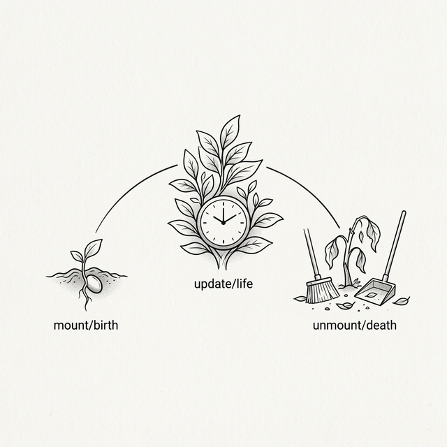

# Chapter 7: Class Components & Lifecycle



## 7.1 Giving Components Memory

Po tried to build a timer using the components from the previous lesson, but quickly ran into trouble.

**🐼**: Shifu, I want to make a timer component that increments a number every second. But I found that our current components have no "memory". Props are passed in from the outside, and the component itself has no way to save and modify its own data.

**🧙‍♂️**: Before frameworks existed, developers were already using various ways to give "components" memory. How would you do it?

**🐼**: If it's an ordinary class, the most natural way would be to **store it in the class's instance properties**, right? For example, I could add `this._count = 0` to the instance, and every time it needs to increment, I just do `this._count++`.

**🧙‍♂️**: Correct. This is the standard practice in object-oriented programming. But it introduces a new problem: after you execute `this._count++`, the number in the console changes, but does the number on the screen change?

**🐼**: No. I only modified the data; I haven't written any code to update the DOM. Do I still have to manually call something like `document.getElementById('counter').innerText = this._count`?

**🧙‍♂️**: This is exactly the pain point of early front-end development. When data changes, you must manually find the corresponding DOM node and modify it. Once the state becomes plentiful, it is easy to forget to update a DOM node somewhere, or update the wrong one.

**🐼**: That's too agonizing. We need the framework to take over. When the component's data changes, the UI should automatically re-render.

**🧙‍♂️**: Yes. For the framework to "sense" data changes, we can no longer simply modify `this._count` directly. We need to introduce **State**. What do you think is the difference between State and Props?

**🐼**: **Props** are like the component's **external parameters**, passed in and controlled by the parent component, and the current component shouldn't modify them directly. **State**, on the other hand, should be the component's **internal memory**, the data owned by the component itself.

## 7.2 Implementing `setState`

**🧙‍♂️**: Precise. When the internal State of a component changes, the UI should automatically update. Suppose we provide an API called `setState`, how do you think it should be used to update the state?

**🐼**: I think it should be like this: I call `this.setState({ count: 1 })`, and the component internally merges the old and new states, then automatically triggers a re-render.

**🧙‍♂️**: Exactly. Let's implement this API. Think about it: if you were to write the internal logic of `setState`, what steps would be required?

**🐼**: First, it definitely needs to merge the incoming new state with the old state, and save it to `this.state`. Then... because the interface needs to be updated, it has to call `this.render()` to generate a new VNode tree?

**🧙‍♂️**: Continue. What happens after the new VNode tree is generated?

**🐼**: Then I need to get the old VNode tree, and call the `patch(oldVNode, newVNode)` we wrote in the previous chapter to compare and update the actual DOM.

**🧙‍♂️**: Very clear logic. Write it out in code.

**🐼**: Okay, I'll add this logic to the `Component` base class:

```javascript
class Component {
  constructor(props) {
    this.props = props || {};
    this.state = {};
  }

  setState(newState) {
    // 1. Merge state (shallow merge)
    this.state = Object.assign({}, this.state, newState);
    // 2. Trigger update
    this._update();
  }

  _update() {
    const oldVNode = this._vnode;
    const newVNode = this.render();
    patch(oldVNode, newVNode);
    // 3. Remember the new VNode
    this._vnode = newVNode;
  }

  render() {
    throw new Error('Component must implement render()');
  }
}
```

**🧙‍♂️**: This connects all our previous achievements: `setState` → `render()` → `patch()` → update the changed DOM.

> 💡 **Simplification Note: Synchronous vs. Batching**
>
> Our simplified `setState` is **synchronous**—every call immediately triggers a re-render. However, real React's `setState` uses **Batching**: if you call `setState` multiple times consecutively within the same event handler, React will only trigger **one** re-render.
>
> ```javascript
> // Without batching, these two lines trigger two renders:
> this.setState({ a: 1 });  // Render #1
> this.setState({ b: 2 });  // Render #2
>
> // With batching, React merges them into { a: 1, b: 2 } and renders only once
> ```
>
> This is one of React's core performance optimizations.

## 7.3 Lifecycle

**🐼**: With `setState`, I can make the timer update the number. But I've hit a practical problem—I need to use `setInterval` to call `setState` every second. However, where should this `setInterval` be written?

**🧙‍♂️**: Do you think it can be written inside `render()`?

**🐼**: No, `render()` is called every time it re-renders, which would constantly create new timers and make a mess. Putting it in `constructor` isn't right either; at that point, the component hasn't been mounted to the page yet.

**🧙‍♂️**: Yes. `setState` solves "how to update", but you are still missing a timing for "when to start". Your `setInterval` needs to start **after** the component is mounted to the DOM.

**🐼**: Wait, I just thought of another problem. If the user switches pages and this timer component is removed from the DOM, but `setInterval` is still running in the background. It will keep calling `setState` on a component that no longer exists. Wouldn't that cause a memory leak?

**🧙‍♂️**: Very sharp. So not only do you need a timing for "component has mounted", what else do you need?

**🐼**: I need a timing for "component is about to be removed" so I can clean up those timers or other side effects.

**🧙‍♂️**: These are the **Lifecycle Methods**. Typically, we call them `componentDidMount` and `componentWillUnmount`.

**🐼**: I understand. Then I need to call it when mounting the component. Let me modify the `mount` function from the previous chapter:

```javascript
// Inside mount, call componentDidMount after the component is mounted
function mount(vnode, container) {
  // ... other logic ...

  if (typeof vnode.tag === 'function') {
    const instance = new vnode.tag(vnode.props);
    vnode._instance = instance;
    const subTree = instance.render();
    instance._vnode = subTree;
    mount(subTree, container);
    vnode.el = subTree.el;

    // 🆕 Component is mounted, trigger lifecycle
    if (instance.componentDidMount) {
      instance.componentDidMount();
    }
    return;
  }

  // ... normal node logic ...
}
```

> 💡 **Simplification Note: `componentWillUnmount` won't be automatically called**
>
> Our simplified version implements `componentDidMount`, but **`componentWillUnmount` will not be automatically called**—when a component is replaced by `patch`, we simply use `replaceChild` and don't go through the old component's cleanup function. To keep the Demo simple, we won't implement it at this stage.

## 7.4 The `this` Trap

**🐼**: Shifu, I'll write my timer component right now!

```javascript
class Timer extends Component {
  constructor(props) {
    super(props);
    this.state = { seconds: 0 };
  }

  componentDidMount() {
    this.timerId = setInterval(function() {
      this.setState({ seconds: this.state.seconds + 1 });
    }, 1000);
  }

  componentWillUnmount() {
    clearInterval(this.timerId);
  }

  render() {
    return h('div', null, [
      h('h2', null, ['Timer: ' + this.state.seconds + 's'])
    ]);
  }
}
```

**🧙‍♂️**: Before you run it, predict: when the `setInterval` callback triggers every second, what does `this` inside it point to?

**🐼**: Since I wrote it inside `componentDidMount`, which is a component method, `this` should just be the component instance, right?

**🧙‍♂️**: Try it.

Po runs the code, and a red error pops up in the console: `TypeError: this.setState is not a function`.

**🐼**: What?! Why isn't `this` the component instance? How can `this.setState` be undefined?

**🧙‍♂️**: Welcome to one of the easiest traps to fall into in JavaScript—**`this` binding**. The value of `this` is not determined when the function is defined, but when the function **is called**.

**🐼**: You mean, when `setInterval` calls my callback, it treats it as a regular function, so `this` becomes the global object `window`?

**🧙‍♂️**: Completely correct. So how are you going to fix it?

**🐼**: I could save `this` to a variable, like `const self = this;`. Or use `.bind(this)` to hard-bind it. But I think the simplest way is to use an **arrow function**, because it doesn't have its own `this`, and will just inherit the `this` from its outer scope.

```javascript
  componentDidMount() {
    this.timerId = setInterval(() => {
      this.setState({ seconds: this.state.seconds + 1 });
    }, 1000);
  }
```

**🧙‍♂️**: Yes. Arrow functions eliminate the problem of "what does `this` point to here" from the source. During the era of class components, `this` binding issues were one of the most common sources of bugs.

**🐼**: This complexity brought about by the language mechanism is a real headache. It has nothing to do with the business logic I want to implement.

**🧙‍♂️**: This is known as **Accidental Complexity**. It later became an important reason that pushed React to shift towards another component form.

## 7.5 Avoiding Waste: shouldComponentUpdate

**🧙‍♂️**: The timer is running now. But consider another scenario: if the parent component re-renders, but the Props passed to the child component haven't changed at all, what happens to the child component?

**🐼**: According to our current `patch` logic... as soon as the parent component re-renders, it will call `render()` on the child component, regardless of whether the Props have changed.

**🧙‍♂️**: What if this is a list of 100 child components, and only the data for the 3rd one changes?

**🐼**: Then all 100 components will re-execute `render()`. That's too wasteful of performance! We need a mechanism to let the component decide for itself whether to update.

**🧙‍♂️**: Correct. We can add a "gatekeeper" method to the component, perhaps called `shouldComponentUpdate`. Where do you think it should be placed to intercept?

**🐼**: It should be **before** actually calling `render()`. In the `patch` branch that handles component node updates, first ask the component if it needs to update. If not, just reuse the old DOM directly.

```javascript
// Upgraded patch (adding shouldComponentUpdate check)
if (oldVNode.tag === newVNode.tag) {
  const instance = (newVNode._instance = oldVNode._instance);
  const nextProps = newVNode.props;
  const nextState = instance.state;

  // 🆕 Ask the component: is it necessary to update?
  if (instance.shouldComponentUpdate &&
      !instance.shouldComponentUpdate(nextProps, nextState)) {
    // Component says "no update needed" — skip render
    instance.props = nextProps;
    newVNode.el = oldVNode.el;
    newVNode._instance = instance;
    return;
  }

  instance.props = nextProps;
  const oldSub = instance._vnode;
  const newSub = instance.render();
  instance._vnode = newSub;
  patch(oldSub, newSub);
  newVNode.el = newSub.el;
}
```

**🧙‍♂️**: Accurate. Note that even if we skipped rendering, we still need to update `instance.props` to `nextProps`. Why?

**🐼**: Because if later the component's own `state` changes and triggers `setState`, it needs to read the latest `this.props` during `render`, otherwise the data would be stale.

**🧙‍♂️**: Yes. The later `React.PureComponent` and `React.memo()` are wrappers around this pattern; they automatically perform a Shallow Comparison to intercept unnecessary renders for you.

## 7.6 The Dilemma of the God Component

**🧙‍♂️**: Class components now look quite complete in features. But, as applications grow larger, you might write code like this:

```javascript
class Dashboard extends Component {
  constructor(props) {
    super(props);
    this.state = { users: [], notifications: [], windowWidth: 0 };
  }

  componentDidMount() {
    this.fetchUsers();
    window.addEventListener('resize', this.handleResize);
    this.ws = new WebSocket('...');
    this.ws.onmessage = (e) => { /* handle notifications */ };
  }

  componentWillUnmount() {
    window.removeEventListener('resize', this.handleResize);
    this.ws.close();
  }

  // ... various other methods ...
}
```

**🐼**: This is simply a hodgepodge. It manages user data, window size listening, and WebSocket notifications all at once.

**🧙‍♂️**: Do you see where the problem is? Look at the code inside `componentDidMount` and `componentWillUnmount`.

**🐼**: Related logic is split apart! Establishing and closing the WebSocket connection are in two different lifecycle methods. And `componentDidMount` is stuffed full of completely unrelated initialization logic.

**🧙‍♂️**: Yes. Class components organize logic by **Timing**—"what to do on mount", "what to do on unmount". But our brains are more accustomed to organizing logic by **Concerns**—"code related to data fetching", "code related to WebSockets".

**🐼**: This causes the code to become more fragmented as the component gets more complex. Can this be solved?

**🧙‍♂️**: People invented patterns like Higher-Order Components (HOC) and Render Props to solve logic reuse and separation in class components. But they all brought new problems. The real breakthrough lies in the near future.

---

> 💡 **Going Deeper: Parent-Child VNode References**
>
> When a component calls `setState`, our `_update` updates the component's internal `_vnode`. But the **parent component's** VNode tree still holds a reference to the old subtree. This means if the parent component re-renders later, it might compare against an outdated tree. In our Demo, this isn't an issue because the parent component won't re-render after a child component's state changes. This is a boundary of our simplified implementation; real React resolves this issue through the Fiber tree's double buffering mechanism, which will be covered in later chapters.

---

### 📦 Try It Yourself

Save the following code as `ch07.html` to experience how class components manage their own state via `setState` and safely execute side effects using lifecycles:

```html
<!DOCTYPE html>
<html lang="en">
<head>
  <meta charset="UTF-8">
  <title>Chapter 7 — Class Components & Lifecycle</title>
  <style>
    body { font-family: sans-serif; padding: 20px; }
    .card { border: 1px solid #ddd; border-radius: 8px; padding: 15px; margin: 15px 0; }
    button { padding: 6px 12px; cursor: pointer; margin: 4px; }
    .timer { font-size: 48px; font-weight: bold; color: #333; }
    .info { color: #666; font-size: 13px; margin-top: 10px; }
  </style>
</head>
<body>
  <div id="app"></div>

  <script>
    // === Mini-React Engine (cumulative) ===

    function h(tag, props, children) {
      return { tag, props: props || {}, children: children || [] };
    }

    class Component {
      constructor(props) {
        this.props = props || {};
        this.state = {};
      }
      setState(newState) {
        this.state = Object.assign({}, this.state, newState);
        this._update();
      }
      _update() {
        if (!this._vnode) return;
        const oldVNode = this._vnode;
        const newVNode = this.render();
        patch(oldVNode, newVNode);
        this._vnode = newVNode;
      }
      render() { throw new Error('Must implement render()'); }
    }

    function mount(vnode, container) {
      if (typeof vnode === 'string' || typeof vnode === 'number') {
        container.appendChild(document.createTextNode(vnode));
        return;
      }
      if (typeof vnode.tag === 'function') {
        const instance = new vnode.tag(vnode.props);
        vnode._instance = instance;
        const subTree = instance.render();
        instance._vnode = subTree;
        mount(subTree, container);
        vnode.el = subTree.el;
        if (instance.componentDidMount) instance.componentDidMount();
        return;
      }
      const el = (vnode.el = document.createElement(vnode.tag));
      for (const key in vnode.props) {
        if (key.startsWith('on')) {
          el.addEventListener(key.slice(2).toLowerCase(), vnode.props[key]);
        } else {
          if (key === 'className') el.setAttribute('class', vnode.props[key]);
          else if (key === 'style' && typeof vnode.props[key] === 'string') el.style.cssText = vnode.props[key];
          else el.setAttribute(key, vnode.props[key]);
        }
      }
      if (typeof vnode.children === 'string') {
        el.textContent = vnode.children;
      } else {
        (vnode.children || []).forEach(child => {
          if (typeof child === 'string' || typeof child === 'number')
            el.appendChild(document.createTextNode(child));
          else mount(child, el);
        });
      }
      container.appendChild(el);
    }

    function patch(oldVNode, newVNode) {
      if (typeof newVNode.tag === 'function') {
        if (oldVNode.tag === newVNode.tag) {
          const instance = (newVNode._instance = oldVNode._instance);
          const nextProps = newVNode.props;
          const nextState = instance.state;
          if (instance.shouldComponentUpdate &&
              !instance.shouldComponentUpdate(nextProps, nextState)) {
            instance.props = nextProps;
            newVNode.el = oldVNode.el;
            newVNode._instance = instance;
            return;
          }
          instance.props = nextProps;
          const oldSub = instance._vnode;
          const newSub = instance.render();
          instance._vnode = newSub;
          patch(oldSub, newSub);
          newVNode.el = newSub.el;
        } else {
          const parent = oldVNode.el.parentNode;
          mount(newVNode, parent);
          parent.replaceChild(newVNode.el, oldVNode.el);
        }
        return;
      }
      if (oldVNode.tag !== newVNode.tag) {
        const parent = oldVNode.el.parentNode;
        const tmp = document.createElement('div');
        mount(newVNode, tmp);
        parent.replaceChild(newVNode.el, oldVNode.el);
        return;
      }
      const el = (newVNode.el = oldVNode.el);
      const oldP = oldVNode.props || {}, newP = newVNode.props || {};
      for (const key in newP) {
        if (oldP[key] !== newP[key]) {
          if (key.startsWith('on')) {
            const evt = key.slice(2).toLowerCase();
            if (oldP[key]) el.removeEventListener(evt, oldP[key]);
            el.addEventListener(evt, newP[key]);
          } else {
            if (key === 'className') el.setAttribute('class', newP[key]);
            else if (key === 'style' && typeof newP[key] === 'string') el.style.cssText = newP[key];
            else el.setAttribute(key, newP[key]);
          }
        }
      }
      for (const key in oldP) {
        if (!(key in newP)) {
          if (key.startsWith('on')) el.removeEventListener(key.slice(2).toLowerCase(), oldP[key]);
          else if (key === 'className') el.removeAttribute('class');
          else if (key === 'style') el.style.cssText = '';
          else el.removeAttribute(key)
        }
      }
      const oldChildren = oldVNode.children || [];
      const newChildren = newVNode.children || [];
      if (typeof newChildren === 'string') {
        if (oldChildren !== newChildren) el.textContent = newChildren;
      } else if (typeof oldChildren === 'string') {
        el.textContent = '';
        newChildren.forEach(c => mount(c, el));
      } else {
        const commonLength = Math.min(oldChildren.length, newChildren.length);
        for (let i = 0; i < commonLength; i++) {
          const oldChild = oldChildren[i], newChild = newChildren[i];
          if (typeof oldChild === 'string' && typeof newChild === 'string') {
            if (oldChild !== newChild) el.childNodes[i].textContent = newChild;
          } else if (typeof oldChild === 'object' && typeof newChild === 'object') {
            patch(oldChild, newChild);
          } else {
            if (typeof newChild === 'string' || typeof newChild === 'number') {
              el.replaceChild(document.createTextNode(newChild), el.childNodes[i]);
            } else {
              const tmp = document.createElement('div');
              mount(newChild, tmp);
              el.replaceChild(newChild.el, el.childNodes[i]);
            }
          }
        }
        if (newChildren.length > oldChildren.length) newChildren.slice(oldChildren.length).forEach(c => mount(c, el));
        if (newChildren.length < oldChildren.length) {
          for (let i = oldChildren.length - 1; i >= commonLength; i--) el.removeChild(el.childNodes[i]);
        }
      }
    }

    // === Timer Component with Lifecycle ===

    class Timer extends Component {
      constructor(props) {
        super(props);
        this.state = { seconds: 0 };
      }

      componentDidMount() {
        // ✅ Using arrow function to solve this binding!
        this.timerId = setInterval(() => {
          this.setState({ seconds: this.state.seconds + 1 });
        }, 1000);
      }

      // ⚠️ In our simplified engine this method won't be automatically called, shown here for best practice
      componentWillUnmount() {
        clearInterval(this.timerId);
      }

      render() {
        const color = this.state.seconds % 2 === 0 ? '#333' : '#0066cc';
        return h('div', { className: 'card' }, [
          h('div', { className: 'timer', style: 'color:' + color }, [
            String(this.state.seconds) + 's'
          ]),
          h('p', { className: 'info' }, [
            'This timer uses setState + patch. Only the number updates, not the whole page.'
          ]),
          h('p', { className: 'info' }, [
            'componentDidMount → starts setInterval | componentWillUnmount → clears it'
          ])
        ]);
      }

    }

    // === shouldComponentUpdate Demo ===

    // Parent: re-renders every second to simulate prop changes
    class Parent extends Component {
      constructor(props) {
        super(props);
        this.state = { tick: 0, important: 0 };
      }
      componentDidMount() {
        this._id = setInterval(() => {
          this.setState({ tick: this.state.tick + 1 });
        }, 1000);
      }
      componentWillUnmount() { clearInterval(this._id); }
      render() {
        return h('div', { className: 'card' }, [
          h('p', { className: 'info' }, [
            'Parent tick: ' + this.state.tick + ' (re-renders every second)'
          ]),
          h('button', { onclick: () => this.setState({ important: this.state.important + 1 }) }, [
            'Change important prop (' + this.state.important + ')'
          ]),
          h(Child, { important: this.state.important, tick: this.state.tick })
        ]);
      }
    }

    // Child: only re-renders when "important" prop changes, ignores "tick"
    class Child extends Component {
      constructor(props) {
        super(props);
        this._renderCount = 0;
      }
      shouldComponentUpdate(nextProps, nextState) {
        // Skip re-render if only "tick" changed
        return nextProps.important !== this.props.important;
      }
      render() {
        this._renderCount++;
        return h('div', { style: 'margin-top:8px; padding:8px; background:#f0f8ff; border-radius:4px;' }, [
          h('p', { className: 'info' }, [
            '✅ Child render count: ' + this._renderCount +
            ' (shouldComponentUpdate blocks tick-only updates)'
          ]),
          h('p', null, ['important = ' + this.props.important])
        ]);
      }
    }

    // === Mount the App ===

    const appVNode = h('div', null, [
      h('h1', null, ['Class Components & Lifecycle']),
      h(Timer, null),
      h('h2', null, ['shouldComponentUpdate Demo']),
      h(Parent, null)
    ]);

    mount(appVNode, document.getElementById('app'));
  </script>
</body>
</html>
```
