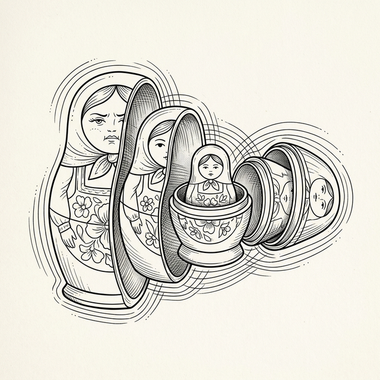

# Chapter 8: Patterns of Reuse



## 8.1 The Need for Reuse

Po built a Timer in Chapter 7. Now he wants to track the mouse position in another component.

**🐼**: Shifu, I want to write a component that tracks the mouse coordinates and displays them.

**🧙‍♂️**: Try it.

```javascript
class MouseTracker extends Component {
  constructor(props) {
    super(props);
    this.state = { x: 0, y: 0 };
    this._onMouseMove = (e) => {
      this.setState({ x: e.clientX, y: e.clientY });
    };
  }

  componentDidMount() {
    window.addEventListener('mousemove', this._onMouseMove);
  }

  componentWillUnmount() {
    window.removeEventListener('mousemove', this._onMouseMove);
  }

  render() {
    return h('p', null, [
      'Position: ' + this.state.x + ', ' + this.state.y
    ]);
  }
}
```

**🐼**: It works great! But now I want to make another component—a circle that follows the mouse. It also needs to track the mouse position, but the display is completely different.

**🧙‍♂️**: So what are you going to do?

**🐼**: Hmm... the most direct way is to write the mouse tracking code **all over again**?

```javascript
class MouseCircle extends Component {
  constructor(props) {
    super(props);
    this.state = { x: 0, y: 0 };       // 👈 Exactly the same
    this._onMouseMove = (e) => {
      this.setState({ x: e.clientX, y: e.clientY });
    };
  }

  componentDidMount() {
    window.addEventListener('mousemove', this._onMouseMove);  // 👈 Exactly the same
  }

  componentWillUnmount() {
    window.removeEventListener('mousemove', this._onMouseMove); // 👈 Exactly the same
  }

  render() {
    // Only this part is different
    return h('div', {
      style: `position:fixed; left:${this.state.x}px; top:${this.state.y}px;
              width:30px; height:30px; border-radius:50%; background:#0066cc;
              transform:translate(-50%,-50%); pointer-events:none;`
    }, []);
  }
}
```

**🐼**: The `constructor`, `componentDidMount`, and `componentWillUnmount` in the two components are almost identical, only `render()` is different. If the mouse tracking logic needs to change later—like adding a throttle—I have to change it in **two places**. If ten components need to track the mouse, that's **ten copies of almost identical code**.

**🧙‍♂️**: You have felt the pain. In programming, this is a violation of the **DRY (Don't Repeat Yourself)** principle. When the same logic is scattered in multiple places, maintenance costs grow linearly with the number of components.

**🐼**: Can I extract the mouse tracking logic like a "feature module" so that any component can use it?

**🧙‍♂️**: This is exactly the problem the React community has been exploring for a decade. In the era of class components, people invented three different patterns to solve it. Each is better than the last, but they all have their flaws. Let's experience them one by one.

## 8.2 Mixins: Mixing Logic In (2013-2015)

**🧙‍♂️**: In the earliest days of React, using `React.createClass`, there was a concept called **Mixin**. The idea is very simple—since multiple components need the same logic, extract it into an object and "mix" it into each component.

**🐼**: What does "mix in" mean?

**🧙‍♂️**: You can think of it as **copy and paste, but done automatically by the framework**. When you write `mixins: [MouseMixin]`, `React.createClass` merges all the methods on the `MouseMixin` object—`getInitialState`, `componentDidMount`, `_onMouseMove`, etc.—**into your component**, as if you wrote them there yourself.

A simple analogy:

```javascript
// The essence of Mixin ≈ merging object properties into the component
Object.assign(YourComponent.prototype, MouseMixin);
// After this, YourComponent has all the methods of MouseMixin
```

An actual Mixin looks like this:

```javascript
// Early React.createClass Mixin (Deprecated)
const MouseMixin = {
  getInitialState: function() {
    return { x: 0, y: 0 };
  },
  componentDidMount: function() {
    window.addEventListener('mousemove', this._onMouseMove);
  },
  componentWillUnmount: function() {
    window.removeEventListener('mousemove', this._onMouseMove);
  },
  _onMouseMove: function(e) {
    this.setState({ x: e.clientX, y: e.clientY });
  }
};
```

When using it, just list it in the `mixins` array:

```javascript
const MouseTracker = React.createClass({
  mixins: [MouseMixin],  // The framework will automatically "mix in" all methods of MouseMixin
  render: function() {
    // You can use this.state.x and this.state.y directly here
    // They are provided by the getInitialState of MouseMixin
    return h('p', null, ['Position: ' + this.state.x + ', ' + this.state.y]);
  }
});
```

**🐼**: I get it! So `MouseTracker` didn't write `componentDidMount` itself, but because `MouseMixin` was mixed in, it "inherited" the `componentDidMount` from the Mixin, and the framework will call it automatically on mount. This way, I don't have to manually copy the mouse tracking code into every component.

**🧙‍♂️**: Correct. It looks convenient, but Mixins have fatal flaws. Suppose you mix in two Mixins at the same time, and they both define `this.state.x`—one for mouse coordinates, the other for scrollbar position. What do you think will happen?

**🐼**: Uh... the one mixed in later will overwrite the earlier one? If so, one of the features would be completely broken! This is a **name collision**, right?

**🧙‍♂️**: Yes. Second is **implicit dependency**. `this.state.x` suddenly appears in the component, but the component didn't define it. Anyone reading the code has no idea where it comes from and has to dig through the source code of all Mixins.

**🐼**: Indeed, if a component uses 5 Mixins, finding a bug is like finding a needle in a haystack. And all their methods are crowded onto the same `this`, making a total mess.

**🧙‍♂️**: This is called the **snowball** effect. Because of these issues, React officially published the famous ["Mixins Considered Harmful"](https://legacy.reactjs.org/blog/2016/07/13/mixins-considered-harmful.html) and deprecated it in the ES6 Class era.

## 8.3 Higher-Order Components: Wrapping with Functions (2015-2018)

**🧙‍♂️**: Since Mixins didn't work, clever developers came up with another way—using a **function that accepts a component and returns a new, enhanced component**. This is the **Higher-Order Component (HOC)**.

```javascript
function withMouse(WrappedComponent) {
  // Returns a new component class
  return class extends Component {
    constructor(props) {
      super(props);
      this.state = { x: 0, y: 0 };
      this._onMouseMove = this._onMouseMove.bind(this);
    }

    componentDidMount() {
      window.addEventListener('mousemove', this._onMouseMove);
    }

    componentWillUnmount() {
      window.removeEventListener('mousemove', this._onMouseMove);
    }

    _onMouseMove(e) {
      this.setState({ x: e.clientX, y: e.clientY });
    }

    render() {
      // Pass the mouse position as props to the wrapped component
      return h(WrappedComponent, {
        ...this.props, // ⚠️ Note: Object spread syntax ({ ...obj }) is an ES2018 feature
        mouse: { x: this.state.x, y: this.state.y }
      }, []);
    }
  };
}

// Usage
class RawDisplay extends Component {
  render() {
    return h('p', null, [
      'Mouse: ' + this.props.mouse.x + ', ' + this.props.mouse.y
    ]);
  }
}

// The enhanced component
const MouseDisplay = withMouse(RawDisplay);
```

**🐼**: This is way better than Mixins! The state is encapsulated in the component inside the `withMouse` function, and passed to the target component via props. This won't directly pollute the target component's `this` like Mixins did.

**🧙‍♂️**: Yes. But what if your component needs not only mouse tracking, but also window size, user info, and theme color? How would you write it?

**🐼**: Just wrap it a few more times? Like `withMouse(withWindowSize(withUser(withTheme(MyComponent))))`.

**🧙‍♂️**: Precisely. But this leads to **Wrapper Hell**. In DevTools, your component tree becomes layers of an onion: `<WithTheme><WithUser><WithWindowSize>...`. Not only that, the problem of Props collisions still exists.

**🐼**: Ah! If `withMouse` passes a prop named `data`, and `withUser` also wants to pass a prop named `data`, the later one still overwrites the earlier one!

**🧙‍♂️**: Exactly. And the code readability is poor. Just looking at the code for `MyComponent`, you have no idea what Props it will eventually receive, because every layer of outer wrapper might secretly inject new data.

## 8.4 Render Props: Giving Rendering Power to the Caller (2017+)

**🧙‍♂️**: To avoid the flaws of HOCs, the community invented a new pattern—**Render Props**. The idea is: let the user pass in a "render function", and let the outside control how to display the data.

```javascript
class Mouse extends Component {
  constructor(props) {
    super(props);
    this.state = { x: 0, y: 0 };
    this._onMouseMove = this._onMouseMove.bind(this);
  }

  componentDidMount() {
    window.addEventListener('mousemove', this._onMouseMove);
  }

  componentWillUnmount() {
    window.removeEventListener('mousemove', this._onMouseMove);
  }

  _onMouseMove(e) {
    this.setState({ x: e.clientX, y: e.clientY });
  }

  render() {
    // Call the user-provided render function and pass data to it
    return this.props.render(this.state);
  }
}

// Usage
// h(Mouse, { render: (mouse) => h('p', null, [`Position: ${mouse.x}, ${mouse.y}`]) })
```

**🐼**: This is indeed very flexible when using it. I can freely decide how to render the data.

**🧙‍♂️**: But what happens when multiple Render Props are combined?

```jsx
// Imagine what it looks like in JSX
<Mouse render={mouse => (
  <WindowSize render={size => (
    <Theme render={theme => (
      <MyComponent mouse={mouse} size={size} theme={theme} />
    )} />
  )} />
)} />
```

**🐼**: Oh my, this is **Callback Hell**!

**🧙‍♂️**: Yes. Besides deep nesting, Render Props have another hidden flaw: **performance issues (unnecessary re-renders caused by anonymous functions)**.

**🐼**: Performance issues?

**🧙‍♂️**: Yes. If an anonymous function is directly defined in `render` as a Render Prop, a brand new function reference is created every time the parent component renders.

**🐼**: I get it! Because the function reference in the prop changed, even if the data didn't change, the child component's Shallow Compare will fail, leading to meaningless re-renders!

**🧙‍♂️**: Absolutely correct. So whether it's HOC or Render Props, each pattern has its limitations.

## 8.5 Comparison at a Glance

| Pattern | Pros | Cons |
|:-----|:-----|:-----|
| **Mixins** | Simple and intuitive | Name collisions, implicit dependencies, deprecated |
| **HOCs** | Flexible composition, no name collisions | Wrapper Hell, Props collisions, hard to debug |
| **Render Props** | Flexible on usage, clear data flow | Callback Hell, deep nesting, anonymous functions break performance optimizations |

**🐼**: Shifu, although the latter two patterns are different, they share a common awkwardness—I just want to reuse some "behavior", but I'm forced to make the component hierarchy more and more complex.

**🧙‍♂️**: You hit the nail on the head. We have been trying to use "structure" (component wrapping) to solve the problem of "behavior" (logic reuse).
What if there was a way to inject a piece of "behavior" directly into a component without changing the component hierarchy?

**🐼**: Isn't that the idea behind Mixins? But Mixins have been proven problematic...

**🧙‍♂️**: The problem with Mixins lies in being "implicit" and "messy". But what if there was a mechanism that, like Mixins, could directly introduce logic, but was as **explicit** and **composable** as a function call, didn't rely on `this`, and had no name collisions?

**🐼**: Then... each behavior would be like a function call. I could just "call" it directly inside the component... like a regular JavaScript function?

**🧙‍♂️**: You are about to open the door to a new world. This is exactly the core idea of **Hooks**.

**🐼**: Let's implement it in our current engine right away!

**🧙‍♂️**: Unfortunately, our current engine (Stack Reconciler) **cannot support such a design at all**. Think about it: if we only use plain functional components, the internal state is destroyed after the function executes. Functions have no "memory".

**🐼**: Oh right... the current engine just rigidly and synchronously calls `render()` recursively. It provides no place for functional components to store state.

**🧙‍♂️**: Well, we will try to solve this problem later.

---

### 📦 Try It Yourself

Save the following code as `ch08.html` to fully demonstrate how HOC and Render Props work in Mini-React.

```html
<!DOCTYPE html>
<html lang="en">
<head>
  <meta charset="UTF-8">
  <title>Chapter 8 — Patterns of Reuse</title>
  <style>
    body { font-family: sans-serif; padding: 20px; }
    .card { border: 1px solid #ddd; border-radius: 8px; padding: 15px; margin: 10px 0; }
    .circle { width: 30px; height: 30px; border-radius: 50%; background: #0066cc; position: fixed; pointer-events: none; transform: translate(-50%, -50%); z-index: 100; }
    h3 { margin-top: 0; }
  </style>
</head>
<body>
  <div id="app"></div>

  <script>
    // === Mini-React Engine (cumulative) ===
    function h(tag, props, children) {
      return { tag, props: props || {}, children: children || [] };
    }

    class Component {
      constructor(props) {
        this.props = props || {};
        this.state = {};
      }
      setState(newState) {
        this.state = Object.assign({}, this.state, newState);
        this._update();
      }
      _update() {
        if (!this._vnode) return;
        const o = this._vnode;
        const n = this.render();
        patch(o, n);
        this._vnode = n;
      }
      render() { throw new Error('Must implement render()'); }
    }

    function mount(vnode, container) {
      if (typeof vnode === 'string' || typeof vnode === 'number') {
        container.appendChild(document.createTextNode(vnode));
        return;
      }
      if (typeof vnode.tag === 'function') {
        const instance = new vnode.tag(vnode.props);
        vnode._instance = instance;
        const subTree = instance.render();
        instance._vnode = subTree;
        mount(subTree, container);
        vnode.el = subTree.el;
        if (instance.componentDidMount) instance.componentDidMount();
        return;
      }
      const el = (vnode.el = document.createElement(vnode.tag));
      for (const key in vnode.props) {
        if (key.startsWith('on')) {
          el.addEventListener(key.slice(2).toLowerCase(), vnode.props[key]);
        } else {
          if (key === 'className') el.setAttribute('class', vnode.props[key]);
          else if (key === 'style' && typeof vnode.props[key] === 'string') el.style.cssText = vnode.props[key];
          else el.setAttribute(key, vnode.props[key]);
        }
      }
      if (typeof vnode.children === 'string') {
        el.textContent = vnode.children;
      } else {
        (vnode.children || []).forEach(child => {
          if (typeof child === 'string' || typeof child === 'number')
            el.appendChild(document.createTextNode(child));
          else mount(child, el);
        });
      }
      container.appendChild(el);
    }

    function patch(oldVNode, newVNode) {
      if (typeof newVNode.tag === 'function') {
        if (oldVNode.tag === newVNode.tag) {
          const instance = (newVNode._instance = oldVNode._instance);
          const nextProps = newVNode.props;
          const nextState = instance.state;
          if (instance.shouldComponentUpdate &&
              !instance.shouldComponentUpdate(nextProps, nextState)) {
            instance.props = nextProps;
            newVNode.el = oldVNode.el;
            newVNode._instance = instance;
            return;
          }
          instance.props = nextProps;
          const oldSub = instance._vnode;
          const newSub = instance.render();
          instance._vnode = newSub;
          patch(oldSub, newSub);
          newVNode.el = newSub.el;
        } else {
          const parent = oldVNode.el.parentNode;
          mount(newVNode, parent);
          parent.replaceChild(newVNode.el, oldVNode.el);
        }
        return;
      }
      if (oldVNode.tag !== newVNode.tag) {
        const parent = oldVNode.el.parentNode;
        const tmp = document.createElement('div');
        mount(newVNode, tmp);
        parent.replaceChild(newVNode.el, oldVNode.el);
        return;
      }
      const el = (newVNode.el = oldVNode.el);
      const oldP = oldVNode.props || {}, newP = newVNode.props || {};
      for (const key in newP) {
        if (oldP[key] !== newP[key]) {
          if (key.startsWith('on')) {
            const evt = key.slice(2).toLowerCase();
            if (oldP[key]) el.removeEventListener(evt, oldP[key]);
            el.addEventListener(evt, newP[key]);
          } else {
            if (key === 'className') el.setAttribute('class', newP[key]);
            else if (key === 'style' && typeof newP[key] === 'string') el.style.cssText = newP[key];
            else el.setAttribute(key, newP[key]);
          }
        }
      }
      for (const key in oldP) {
        if (!(key in newP)) {
          if (key.startsWith('on')) el.removeEventListener(key.slice(2).toLowerCase(), oldP[key]);
          else if (key === 'className') el.removeAttribute('class');
          else if (key === 'style') el.style.cssText = '';
          else el.removeAttribute(key)
        }
      }
      const oldChildren = oldVNode.children || [];
      const newChildren = newVNode.children || [];
      if (typeof newChildren === 'string') {
        if (oldChildren !== newChildren) el.textContent = newChildren;
      } else if (typeof oldChildren === 'string') {
        el.textContent = '';
        newChildren.forEach(c => mount(c, el));
      } else {
        const commonLength = Math.min(oldChildren.length, newChildren.length);
        for (let i = 0; i < commonLength; i++) {
          const oldChild = oldChildren[i], newChild = newChildren[i];
          if (typeof oldChild === 'string' && typeof newChild === 'string') {
            if (oldChild !== newChild) el.childNodes[i].textContent = newChild;
          } else if (typeof oldChild === 'object' && typeof newChild === 'object') {
            patch(oldChild, newChild);
          } else {
            if (typeof newChild === 'string' || typeof newChild === 'number') {
              el.replaceChild(document.createTextNode(newChild), el.childNodes[i]);
            } else {
              const tmp = document.createElement('div');
              mount(newChild, tmp);
              el.replaceChild(newChild.el, el.childNodes[i]);
            }
          }
        }
        if (newChildren.length > oldChildren.length) newChildren.slice(oldChildren.length).forEach(c => mount(c, el));
        if (newChildren.length < oldChildren.length) {
          for (let i = oldChildren.length - 1; i >= commonLength; i--) el.removeChild(el.childNodes[i]);
        }
      }
    }

    // === HOC Pattern: withMouse ===
    function withMouse(WrappedComponent) {
      return class WithMouse extends Component {
        constructor(props) {
          super(props);
          this.state = { x: 0, y: 0 };
          this._handler = (e) => this.setState({ x: e.clientX, y: e.clientY });
        }
        componentDidMount() {
          window.addEventListener('mousemove', this._handler);
        }
        componentWillUnmount() {
          window.removeEventListener('mousemove', this._handler);
        }
        render() {
          return h(WrappedComponent, {
            ...this.props,
            mouse: { x: this.state.x, y: this.state.y }
          }, []);
        }
      };
    }

    // Display component that uses mouse data via HOC
    class RawDisplay extends Component {
      render() {
        const m = this.props.mouse || { x: 0, y: 0 };
        return h('div', { className: 'card' }, [
          h('h3', null, ['HOC Pattern: withMouse']),
          h('p', null, ['Mouse position: ' + m.x + ', ' + m.y]),
        ]);
      }
    }
    const MouseDisplay = withMouse(RawDisplay);

    // === Render Props Pattern: Mouse ===
    class Mouse extends Component {
      constructor(props) {
        super(props);
        this.state = { x: 0, y: 0 };
        this._handler = (e) => this.setState({ x: e.clientX, y: e.clientY });
      }
      componentDidMount() {
        window.addEventListener('mousemove', this._handler);
      }
      componentWillUnmount() {
        window.removeEventListener('mousemove', this._handler);
      }
      render() {
        // Call the render prop function with current state
        return this.props.render(this.state);
      }
    }

    // === App ===
    const appVNode = h('div', null, [
      h('h1', null, ['Patterns of Reuse']),
      h('p', null, ['Move your mouse to see both patterns in action.']),
      
      // HOC version
      h(MouseDisplay, null),
      
      // Render Props version
      h('div', { className: 'card' }, [
        h('h3', null, ['Render Props Pattern: Mouse']),
        h(Mouse, {
          render: (mouse) => h('p', null, [
            'Mouse position: ' + mouse.x + ', ' + mouse.y
          ])
        })
      ]),
    ]);

    mount(appVNode, document.getElementById('app'));
  </script>
</body>
</html>
```