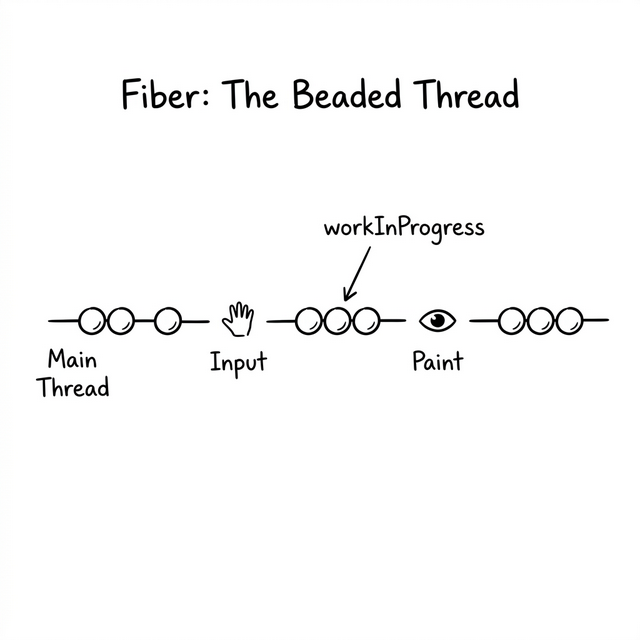
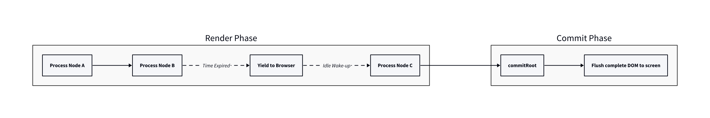
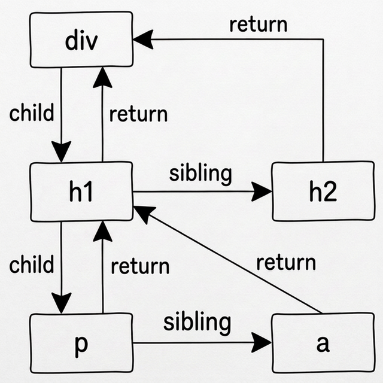

# Chapter 10: The Fiber Architecture — Building a Brand New Mental Model



## 10.1 The Main Thread Crisis

Po looks at the puzzle left from the previous lesson: once a native JavaScript function call stack begins its recursion, it cannot be interrupted. If a virtual DOM tree has 10,000 nodes, the main thread will be locked for hundreds of milliseconds.

**🧙‍♂️**: Remember the `patch` loop we wrote in Chapter 5?

```javascript
// Our old code:
for (let i = 0; i < children.length; i++) {
  patch(oldChild[i], newChild[i]);  // Depth-first recursive calls
}
```

Here, we relied on the JavaScript engine's "call stack" to remember where we were in the traversal. When you recursively call `patch` to handle children, the engine helps you remember: "After the children are processed, I need to return to the parent's loop and continue with the next sibling."

**🐼**: Right. Because we're relying on the engine's call stack, we can't tell the engine, "Hold on a second, I'll be back later." Since I can't stop the JavaScript engine, the only way is—**I won't let the engine remember for me; I'll write the code to track the traversal state myself.**

**🧙‍♂️**: Precise insight. But it’s not just about "how to remember"; we need to fundamentally rethink how the entire rendering engine operates. Before we write any code, let’s build a global blueprint of the new engine in our minds.

## 10.2 The Grand Strategy: Time Slicing and Two Phases

**🧙‍♂️**: Suppose we had some magic that could pause and resume rendering work at any time. Now we need to decide: **When should we pause?**

**🐼**: When the browser is busy, of course! If the user is typing or scrolling, we should stop and yield the main thread to the browser. Once the browser is idle, we continue.

**🧙‍♂️**: Excellent. The browser provides an API called `requestIdleCallback`. It wakes us up to work if there’s idle time after the browser finishes layout and painting for a frame. This is called **Time Slicing**.

**🐼**: Brilliant! So we chop the task of rendering a big tree into small tasks. Each time `requestIdleCallback` wakes us up, we process a few nodes, check the time, and if we're out of time, we yield control back.

**🧙‍♂️**: Sounds perfect. But imagine this: what if we've only rendered half of a large tree when time runs out and we stop? What would the user see on the screen?

**🐼**: Uh... the user would see a partial page where the top half is new and the bottom half is old. Or just a broken page! That definitely won't work!

**🧙‍♂️**: Exactly. It's like a painter painting a portrait. If he lifts the curtain to show the audience every few brushstrokes, the experience is terrible. The right way is to paint the whole picture behind the scenes, then reveal it all at once.

**🐼**: So, we need to split the work into two halves. The first half is done quietly behind the scenes and can be interrupted; the second half is revealed in one go and must never be interrupted!

**🧙‍♂️**: Perfectly summarized. This constitutes the two distinct phases of modern React architecture:
1. **Render Phase**: Gradually build the tree in memory and collect all changes. This phase can be interrupted.
2. **Commit Phase**: Once the Render Phase is complete, sync all collected changes to the real DOM in one breath. This phase is uninterruptible.



## 10.3 Double Buffering: The Draft and The Blueprint

**🐼**: Since the Render Phase is "done quietly behind the scenes," what is being displayed on the page during this long process? And what if an "update" happens during this time?

**🧙‍♂️**: Good questions. This leads to our next core concept. Imagine you are an architect. You have a **Finished Blueprint** in front of you, describing the building as it is now—what the user currently sees on the screen.

Suddenly, a client calls: "Make the windows on the third floor larger." What do you do?

**🐼**: I won't change the original blueprint directly. If I mess up or get called to a meeting halfway through, the blueprint is ruined. I’ll take out a **fresh sheet of draft paper** and draw a new blueprint layer by layer, referring to the original. I'll enlarge the windows on the third floor and copy the other floors as they are.

**🧙‍♂️**: Spot on. We use two global variables to represent them:
- `currentRoot`: The **Finished Blueprint** (the tree currently displayed on the screen).
- `wipRoot` (Work In Progress Root): The **Draft Paper** (the new tree being built in memory).

```
Finished Blueprint (currentRoot)      Draft Paper (wipRoot)
┌─────────────────┐                     ┌──────────────────┐
│ 1st Floor: Same │     ──Copy──→       │ 1st Floor: Same  │
│ 2nd Floor: Same │     ──Copy──→       │ 2nd Floor: Same  │
│ 3rd Floor: Edit │     ──Modify─→      │ 3rd Floor: Large │
└─────────────────┘                     └──────────────────┘
```

After finishing the draft, you swap the new blueprint with the old one in an instant (Commit Phase). This is the famous **Double Buffering** technique from computer graphics.

**🐼**: So while drawing the draft (Render Phase), I need to keep looking at the original (`currentRoot`) for comparison to see what has changed.

**🧙‍♂️**: Yes. To make comparison easier, every node on the new draft has a pointer called **`alternate`**, pointing to the old node at the same position in the original. This is the bridge between the new and old nodes.

## 10.4 Breaking Free: The Fiber Linked List

**🧙‍♂️**: Now we have the macro rhythm of "Time Slicing" and the working mode of "Double Buffering." The final piece of the puzzle is back to the problem in 10.1: **How do we build a traversal data structure that can be paused at any time?**

In our previous Virtual DOM, we used a typical "Tree" structure where a node has a `children` array. This structure is naturally suited for recursion but not for pausing whenever we want. We need a structure that clearly states: which node is currently being processed, and **where to go next** after this node is done.

**🐼**: How do we transform the tree then?

**🧙‍♂️**: The React team abandoned the `children` array as the sole traversal entry. They added three critical navigation pointers to every node:

- **`child`**: Points to its **first** child node.
- **`sibling`**: Points to its **immediate right** sibling node.
- **`return`**: Points to its **parent** node (it "returns" to the parent after processing).

This new node data structure with three navigation pointers is a **Fiber**. Imagine this HTML snippet:

```html
<div>
  <h1>
    <p></p>
    <a></a>
  </h1>
  <h2></h2>
</div>
```

If we convert it into a Fiber structure, it’s no longer just a tree, but a network connected by pointers (a linked list):



**🐼**: Every node is connected by lines. With these three pointers, even if we pause at any moment, we always know "where to go next."

**🧙‍♂️**: Exactly. If it were you, how would you design the "pathfinding" rules for this traversal? To finalize the deepest nodes as early as possible, we should prioritize going deep.

**🐼**: Prioritize going deep... then Rule 1 should be: If there is a `child`, go to the `child` next.

**🧙‍♂️**: Yes. And if you hit a dead end with no children?

**🐼**: Then move horizontally. Rule 2: If there is no `child`, go to the `sibling`.

**🧙‍♂️**: What if there isn't even a `sibling`? That means it's the youngest child, and all of its father's children have been traversed. Where to go then?

**🐼**: Since all the work on the father's side is done... I should find the father's sibling via `return`? That's the "uncle"! If the father has no siblings, keep going up to the grandfather's sibling until we're back at the root.

**🧙‍♂️**: The logic is clear. This is the core magic of the Fiber architecture. it turns an uncontrollable **recursive call stack** into a **linked list traversal loop** that we can manipulate at will. Like a pointer walking through a maze, we can stop at any time to do other things.

## 10.5 The Engine's Blueprint (WorkLoop)

**🧙‍♂️**: Finally, let's use some pseudo-code to connect all the global models we've built today—Time Slicing, Two Phases, and the Traversal Cursor. This is the "heartbeat" mechanism of our new engine: the `workLoop`.

In this loop, besides the `wipRoot` representing the draft tree, we need a global variable **`workInProgress`** to act as the "cursor" walking through the maze, recording the specific node currently being processed.

```javascript
// ====== Engine State ======
let wipRoot = null;         // The draft tree being built (Start of Render Phase)
let workInProgress = null;  // Traversal cursor, the Fiber node being processed

// ====== Engine Heartbeat ======
function workLoop(deadline) {
  let shouldYield = false;
  
  // Phase 1: Render Phase (Interruptible)
  // If the cursor hasn't reached the end and the browser has idle time
  while (workInProgress && !shouldYield) {
    // Core logic: Perform work for one node and return the next node in the maze
    workInProgress = performUnitOfWork(workInProgress);
    
    // Check if the browser is running out of time
    shouldYield = deadline.timeRemaining() < 1;
  }
  
  // Phase 2: Commit Phase (Uninterruptible)
  // If the cursor is finished (draft is complete) and there's a draft tree waiting
  if (!workInProgress && wipRoot) {
    commitRoot(); // Sync to the real DOM in one go and handover to currentRoot
  }

  // Ask the browser to wake us up again in the next idle frame
  requestIdleCallback(workLoop);
}

// Start the engine
requestIdleCallback(workLoop);
```

**🐼**: Wow, this code perfectly translates all the concepts we just discussed! The `while` loop is the Render Phase, and `shouldYield` handles the yielding for Time Slicing. When the `while` loop finishes naturally because `workInProgress` becomes `null`, the synchronous Commit Phase is triggered!

**🧙‍♂️**: Precisely. In this grand blueprint, only two black boxes remain for us to fill in the next chapter:
1. How does `performUnitOfWork` handle a single node? How does it draw the new draft while comparing against the `alternate`?
2. How does `commitRoot` update the draft to the page in one breath?

Ready to write some code, Po?

**🐼**: I can't wait to fill those black boxes!

---

> ℹ️ **Note**: This chapter is purely for establishing the global mental model of Fiber. There is no standalone runnable demo. In the next chapter, we will fill in the blueprint with code and provide a fully functional Fiber engine.