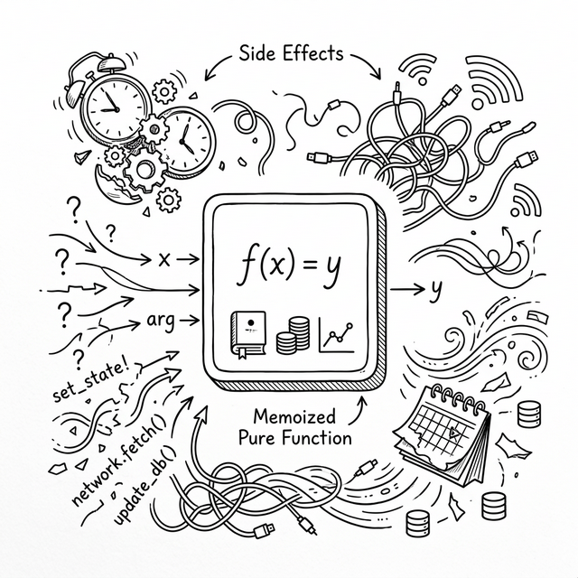

# Chapter 13: Effects and Memoization — Bringing Order to Time



Po stared at the completed `useState` implementation, Shifu's last words still echoing: *"Everything inside a function re-executes from scratch every time state changes."*

## 13.1 The Side Effect Problem

**🐼**: Shifu, I want to convert the `Timer` from chapter seven into a function component! With `useState`, this should be simple, right?

```javascript
// Attempt 1: fatal error
function Timer() {
  const [time, setTime] = useState(0);

  // Start timer directly during render?!
  setInterval(() => {
    setTime(t => t + 1);
  }, 1000);

  return h('div', null, ['Time: ', time]);
}
```

**🧙‍♂️**: Hold on. Do you know what will happen with this code?

**🐼**: The component renders for the first time, starts a `setInterval`. One second later, `setTime` is called. This causes the component to **re-render**... and re-render means "full re-execution" — the entire function runs again!

**🧙‍♂️**: Right. The second render hits `setInterval` again, starting a **second** timer. The third render starts a third... within ten seconds, your browser's main thread gets overwhelmed by thousands of timers and crashes.

This isn't just a timer problem. Any code that tries to send network requests, modify global variables, or directly operate the DOM during rendering will cause disaster. In functional programming, code that escapes pure computation and causes changes in the outside world is called **Side Effects**.

**🐼**: In the class component era, we put this logic in `componentDidMount` or `componentDidUpdate`. How do we do it in function components?

## 13.2 Isolate Side Effects to After Commit

**🧙‍♂️**: We just emphasized with the Fiber architecture that **Render phase** (can be interrupted, might execute multiple times) and **Commit phase** (done all at once, modifies real DOM) are separate.

Where should side effects happen?

**🐼**: Definitely not in Render phase! It can be interrupted and restarted — if there's an API request inside, it would fire a dozen times. Also, if the side effect involves DOM operations (like getting an element's width), it must wait until the page is actually updated. So **side effects must happen after Commit phase!**

**🧙‍♂️**: Exactly. This is why the `useEffect` Hook exists: **it's the moat protecting pure functions**. It lets you declare a piece of code: "Don't run this now. Mount it on the Fiber node, and **after all the DOM has been updated (Commit phase complete)**, run it together."

Here's how to implement it in our minimal engine:

```javascript
function useEffect(callback, dependencies) {
  const oldHook =
    wipFiber.alternate &&
    wipFiber.alternate.hooks &&
    wipFiber.alternate.hooks[hookIndex];

  let hasChanged = true;
  if (oldHook && oldHook.dependencies) {
    hasChanged = dependencies.some(
        (dep, i) => !Object.is(dep, oldHook.dependencies[i])
      );
  }

  // ⚠️ Note the tag field!
  // The hooks array mixes useState hooks and useEffect hooks.
  // commitEffects needs this tag to tell them apart — only process 'effect' type hooks,
  // skip useState hooks, avoiding treating state hooks as side effects to execute.
  const hook = {
    tag: 'effect',
    callback,
    dependencies,
    hasChanged,
    cleanup: oldHook ? oldHook.cleanup : undefined
  };

  wipFiber.hooks.push(hook);
  hookIndex++;
}
```

**🧙‍♂️**: Notice we only do one thing here: compare dependencies (`deps`), judge if changed (`hasChanged`), then store the passed `callback` **as-is** in `wipFiber`. We don't execute it now.

**🐼**: When does it get called?

**🧙‍♂️**: In `commitRoot()` (after all DOM has been synchronously rewritten), we traverse all Fibers and call effects where `hasChanged` is `true`:

```javascript
function commitRoot() {
  deletions.forEach(commitWork);
  commitWork(wipRoot.child);
  
  // 🌟 New: after all DOM work is done, trigger side effects
  commitEffects(wipRoot.child);

  currentRoot = wipRoot;
  wipRoot = null;
}

function commitEffects(fiber) {
  if (!fiber) return;
  
  if (fiber.hooks) {
    fiber.hooks.forEach(hook => {
      // Use tag to skip useState hooks, only process effect type
      if (hook.tag === 'effect' && hook.hasChanged) {
        if (hook.cleanup) hook.cleanup();
        hook.cleanup = hook.callback(); 
      }
    });
  }

  commitEffects(fiber.child);
  commitEffects(fiber.sibling);
}
```

**🐼**: Like after the whole tree renders and DOM is mounted, a dedicated person goes through all the "moats," triggering what needs triggering.

### The Timing of Cleanup Functions

**🐼**: What is `hook.cleanup`? Why save the return value of `callback()`?

**🧙‍♂️**: This is the most confusing part of `useEffect`. Let's look at an example:

```javascript
useEffect(() => {
  const timer = setInterval(() => setTime(t => t + 1), 1000);
  // Return a "cleanup function"
  return () => clearInterval(timer);
}, []);
```

Your effect returns a function — that's the cleanup function. The engine saves it in `hook.cleanup`. Before this effect needs to run again, the engine calls this cleanup function first.

Time line:

```
First render (count = 0):
  └─ commitEffects runs effect A
       └─ starts timer, increments every second
       └─ returns cleanup function a (clears this timer)
       └─ hook.cleanup = cleanup function a

count changes, re-renders (count = 1):
  └─ commitEffects finds effect B needs to run (hasChanged = true)
       └─ first calls hook.cleanup (= cleanup function a) → clears old timer ✓
       └─ runs new effect B
       └─ starts new timer
       └─ hook.cleanup = cleanup function b

Component unmounts:
  └─ calls hook.cleanup (= cleanup function b) → clears last timer ✓
```

**🐼**: The cleanup function doesn't "only run on unmount" — it runs before **every effect re-execution**, to clean up what the previous run left behind?

**🧙‍♂️**: Exactly. This is why timers don't accumulate — before each effect re-execution, the old timer is cleared.

### The Three Forms of the Dependency Array

| Form | Meaning | Typical Use |
|------|------|----------|
| `useEffect(fn, [a, b])` | Run when `a` or `b` changes | Respond to specific data changes (e.g., re-fetch when `userId` changes) |
| `useEffect(fn, [])` | Run only on **first mount** | Initialization (subscribe, establish connection) |
| `useEffect(fn)` | Run after **every render** | Rarely used, almost always a source of bugs |

## 13.3 Escape the Reactive Cage (useRef)

**🐼**: There's another small issue. Sometimes I don't want to trigger a re-render — I just want a place to hold a reference (like a real DOM node, or a plain counter), and modifying it **shouldn't cause a repaint**. `useState` triggers a full re-render every time you call `set`.

**🧙‍♂️**: That's where you need a "black box" that doesn't cause ripples. We call it `useRef`. Its implementation is extremely simple:

```javascript
function useRef(initialValue) {
  // Essentially a useState, but we only take out the ref object,
  // never calling its setState.
  // Directly modifying ref.current = newValue, the engine is none the wiser,
  // naturally no re-render is triggered.
  const [ref] = useState({ current: initialValue });
  return ref;
}
```

**🐼**: What are `useRef`'s actual uses?

**🧙‍♂️**: Two main categories. First, **storing variables that don't need to trigger repaint**, like tracking render count:

```javascript
function App() {
  const renderCount = useRef(0);
  renderCount.current++; // direct modification, no re-render
  return h('p', null, `Rendered ${renderCount.current} times`);
}
```

Second, and more commonly, **holding references to real DOM nodes**. Imagine you need an input box to auto-focus after component mount:

```javascript
function SearchBox() {
  const inputRef = useRef(null);

  useEffect(() => {
    // After Commit phase, inputRef.current is the real DOM node
    if (inputRef.current) {
      inputRef.current.focus();
    }
  }, []); // only run once on first mount

  // Bind ref to real DOM node (React completes this assignment in commit phase)
  return h('input', { ref: inputRef, placeholder: 'Search...' });
}
```

**🐼**: Understood. `useRef` is the safe exit from the "full re-execution" side effect — it can persist data between renders without interfering with the render cycle.

## 13.4 Caching Computed Results (useMemo)

**🐼**: Shifu, I thought of another hidden danger of the "full re-execution" model. Suppose I have an e-commerce page with a long product list...

**🧙‍♂️**: Tell me what problem you're facing.

**🐼**: Look at this code:

```javascript
function ProductPage() {
  const [products] = useState(hugeProductList);  // 10,000 products
  const [keyword, setKeyword] = useState('');
  const [darkMode, setDarkMode] = useState(false);

  // ❌ When toggling darkMode, this filter + stats also re-runs —
  //    even though products and keyword didn't change!
  const filtered = products.filter(p =>
    p.name.includes(keyword) || p.description.includes(keyword)
  );
  const stats = {
    count: filtered.length,
    avgPrice: filtered.reduce((s, p) => s + p.price, 0) / filtered.length,
    maxPrice: Math.max(...filtered.map(p => p.price)),
  };

  // ❌ Every ProductPage re-execution creates a new function object,
  //    making ProductList think props changed, causing it to re-render too
  const handleAddToCart = (id) => { /* ... */ };

  return h('div', { className: darkMode ? 'dark' : 'light' }, [
    h(SearchBar, { keyword, setKeyword }),
    h(StatsPanel, { stats }),
    h(ProductList, { items: filtered, onAdd: handleAddToCart }),
  ]);
}
```

The user just toggled dark mode, but `ProductPage` fully re-executes. 10,000 products are re-filtered, prices re-calculated, `handleAddToCart` re-created... `ProductList` receives "new" props (references changed), and all 10,000 child components re-render.

**🧙‍♂️**: You precisely described the performance cost of the "full re-execution" model. This chain reaction is called **cascading re-renders**. The solution: a mechanism that **returns the last computation result when dependencies haven't changed**. That's `useMemo`.

Its logic is very similar to `useEffect`'s dependency comparison, but the core difference is: `useEffect` hides the callback until Commit phase, while `useMemo` **runs synchronously in Render phase and caches the result**.

```javascript
function useMemo(factory, deps) {
  const oldHook =
    wipFiber.alternate &&
    wipFiber.alternate.hooks &&
    wipFiber.alternate.hooks[hookIndex];

  let hasChanged = true;
  if (oldHook && oldHook.deps) {
    hasChanged = deps.some((dep, i) => !Object.is(dep, oldHook.deps[i]));
  }

  const hook = {
    // If deps changed, recompute now; otherwise return cached old value
    value: hasChanged ? factory() : oldHook.value,
    deps: deps,
  };

  wipFiber.hooks.push(hook);
  hookIndex++;
  return hook.value;
}
```

**🐼**: `useMemo` looks a lot like `useEffect` — both check if dependencies changed.

**🧙‍♂️**: Same mechanism at the core, different purpose and timing:

| Hook | What happens when deps change | When it runs |
|------|-----------------|----------|
| `useEffect` | Execute side effect | After Commit phase (async) |
| `useMemo` | Recompute and cache return value | During Render phase (sync) |

If deps haven't changed, the complex `factory()` callback is completely skipped and the previous cached result is returned unchanged.

**🐼**: Wait... by this logic, `useCallback(fn, deps)` is just `useMemo(() => fn, deps)` as syntax sugar? It just caches a function reference.

**🧙‍♂️**: Exactly. Let's fix the `ProductPage` using these tools:

```javascript
// ✅ useMemo: only recompute when deps change
const filtered = useMemo(
  () => products.filter(p =>
    p.name.includes(keyword) || p.description.includes(keyword)
  ),
  [products, keyword]  // only re-filter when products or keyword changes
);

const stats = useMemo(
  () => ({
    count: filtered.length,
    avgPrice: filtered.reduce((s, p) => s + p.price, 0) / filtered.length,
    maxPrice: Math.max(...filtered.map(p => p.price)),
  }),
  [filtered]
);

// ✅ useCallback: only create new reference when deps change
const handleAddToCart = useCallback(
  (id) => { /* ... */ },
  []  // no deps, function is always the same reference
);

// ✅ React.memo (HOC): only re-render child when props actually change
const ProductList = React.memo(function ProductList({ items, onAdd }) {
  return h('ul', null, items.map(p => h(ProductItem, { ...p, onAdd })));
});
```

Now toggling dark mode: `filtered` reference unchanged → `stats` unchanged → `handleAddToCart` unchanged → `ProductList` props unchanged, the entire product list doesn't re-render.

**🐼**: I understand! Because React flushes the entire function each time, we must manually use `useMemo` to protect expensive computations, and `useCallback` to protect callback function references passed to child components, preventing cascading re-renders!

**🧙‍♂️**: Exactly. The React team actually realized this mental overhead was too heavy. They later developed **React Compiler**, aiming to automatically insert this memoization code at compile time, so developers no longer have to manually write `useMemo` and `useCallback` everywhere.

## 13.5 All Rivers Flow to the Sea

**🧙‍♂️**: At this point, pure functions have collected the four treasures:

1. **Memory and triggering (`useState`)**: Holds internal state, causes the world to re-render.
2. **Moat and interaction (`useEffect`)**: Isolates side effects, cleans up at Commit phase, negotiates with external systems.
3. **Safe harbor (`useRef`)**: Stores changing data that doesn't trigger repaint, or holds real DOM node references.
4. **Throttle valve (`useMemo` / `useCallback`)**: Blocks redundant expensive computations and function creations via dependency comparison.

All four treasures exist because of the same premise — the **"full re-execution" model**. React re-runs the function on every render, and Hooks let you precisely control "what should only happen once," "what computations can be skipped," and "what values don't need to be recreated."

This is the complete picture of the **Hooks Renaissance**. You no longer need to scatter logic across `componentDidMount`, `componentDidUpdate`, and other fragmented lifecycle hooks. Your mental model returns to the highest form: pure, isolated, composable.

However, there's one problem these four treasures all fail to solve — when an app grows large and state needs to travel across many component layers, Props becomes a "package delivery nightmare." That's the starting point of chapter fourteen.

---

### 📦 Try It Yourself

Save the following code as `ch13.html` — a complete demo app integrating all five core Hooks: `useState`, `useEffect`, `useRef`, `useMemo`, and `useCallback`:

```html
<!DOCTYPE html>
<html lang="en">
<head>
  <meta charset="UTF-8">
  <title>Chapter 13 — The Power of All Hooks</title>
  <style>
    body { font-family: sans-serif; padding: 20px; }
    h1 { color: #0066cc; }
    button { padding: 8px 16px; font-size: 14px; cursor: pointer; margin-right: 8px; margin-bottom: 8px; }
    input { padding: 8px; font-size: 14px; width: 80%; margin-bottom: 10px; }
    .card { border: 1px solid #ddd; padding: 15px; border-radius: 8px; margin-bottom: 20px; max-width: 400px; }
    .log-box { font-family: monospace; background: #282c34; color: #abb2bf; padding: 10px; height: 150px; overflow-y: auto; border-radius: 4px; }
  </style>
</head>
<body>
  <div id="app"></div>

  <script>
    // === Minimal Fiber engine (full Hooks support) ===
    function h(type, props, ...children) {
      return {
        type,
        props: {
          ...props,
          children: children.flat().map(child =>
            typeof child === "object" ? child : { type: "TEXT_ELEMENT", props: { nodeValue: child, children: [] } }
          )
        }
      };
    }

    let workInProgress = null, currentRoot = null, wipRoot = null, deletions = null;
    let wipFiber = null, hookIndex = null;

    function render(element, container) {
      wipRoot = { dom: container, props: { children: [element] }, alternate: currentRoot };
      deletions = [];
      workInProgress = wipRoot;
    }

    function workLoop(deadline) {
      let shouldYield = false;
      while (workInProgress && !shouldYield) {
        workInProgress = performUnitOfWork(workInProgress);
        shouldYield = deadline.timeRemaining() < 1;
      }
      if (!workInProgress && wipRoot) commitRoot();
      requestIdleCallback(workLoop);
    }
    requestIdleCallback(workLoop);

    function performUnitOfWork(fiber) {
      const isFunctionComponent = fiber.type instanceof Function;
      if (isFunctionComponent) {
        wipFiber = fiber;
        hookIndex = 0;
        wipFiber.hooks = [];
        const children = [fiber.type(fiber.props)].flat();
        reconcileChildren(fiber, children);
      } else {
        if (!fiber.dom) fiber.dom = createDom(fiber);
        reconcileChildren(fiber, fiber.props.children);
      }

      if (fiber.child) return fiber.child;
      let nextFiber = fiber;
      while (nextFiber) {
        if (nextFiber.sibling) return nextFiber.sibling;
        nextFiber = nextFiber.return;
      }
      return null;
    }

    function createDom(fiber) {
      const dom = fiber.type === "TEXT_ELEMENT" ? document.createTextNode("") : document.createElement(fiber.type);
      updateDom(dom, {}, fiber.props);
      return dom;
    }

    function updateDom(dom, prevProps, nextProps) {
      for (const k in prevProps) {
        if (k !== 'children') {
          if (!(k in nextProps) || prevProps[k] !== nextProps[k]) {
            if (k.startsWith('on')) dom.removeEventListener(k.slice(2).toLowerCase(), prevProps[k]);
            else if (!(k in nextProps)) {
              if (k === 'className') dom.removeAttribute('class');
              else if (k === 'style') dom.style.cssText = '';
              else dom[k] = '';
            }
          }
        }
      }
      for (const k in nextProps) {
        if (k !== 'children' && prevProps[k] !== nextProps[k]) {
          if (k.startsWith('on')) dom.addEventListener(k.slice(2).toLowerCase(), nextProps[k]);
          else {
            if (k === 'className') dom.setAttribute('class', nextProps[k]);
            else if (k === 'style' && typeof nextProps[k] === 'string') dom.style.cssText = nextProps[k];
            else dom[k] = nextProps[k];
          }
        }
      }
    }

    function reconcileChildren(wipFiber, elements) {
      let index = 0, oldFiber = wipFiber.alternate && wipFiber.alternate.child, prevSibling = null;
      while (index < elements.length || oldFiber != null) {
        const element = elements[index];
        let newFiber = null;
        const sameType = oldFiber && element && element.type === oldFiber.type;

        if (sameType) newFiber = { type: oldFiber.type, props: element.props, dom: oldFiber.dom, return: wipFiber, alternate: oldFiber, effectTag: "UPDATE" };
        if (element && !sameType) newFiber = { type: element.type, props: element.props, dom: null, return: wipFiber, alternate: null, effectTag: "PLACEMENT" };
        if (oldFiber && !sameType) { oldFiber.effectTag = "DELETION"; deletions.push(oldFiber); }

        if (oldFiber) oldFiber = oldFiber.sibling;
        if (index === 0) wipFiber.child = newFiber;
        else if (element) prevSibling.sibling = newFiber;
        prevSibling = newFiber;
        index++;
      }
    }

    function commitRoot() {
      deletions.forEach(commitWork);
      commitWork(wipRoot.child);
      commitEffects(wipRoot.child); // trigger side effects after DOM work
      currentRoot = wipRoot;
      wipRoot = null;
    }

    function commitWork(fiber) {
      if (!fiber) return;
      let domParentFiber = fiber.return;
      while (!domParentFiber.dom) domParentFiber = domParentFiber.return;
      const domParent = domParentFiber.dom;

      if (fiber.effectTag === "PLACEMENT" && fiber.dom != null) domParent.appendChild(fiber.dom);
      else if (fiber.effectTag === "UPDATE" && fiber.dom != null) updateDom(fiber.dom, fiber.alternate.props, fiber.props);
      else if (fiber.effectTag === "DELETION") {
        commitDeletion(fiber, domParent);
        return;
      }

      commitWork(fiber.child);
      commitWork(fiber.sibling);
    }
    
    function commitDeletion(fiber, domParent) {
      if (fiber.dom) domParent.removeChild(fiber.dom);
      else commitDeletion(fiber.child, domParent);
    }

    function commitEffects(fiber) {
      if (!fiber) return;
      if (fiber.hooks) {
        fiber.hooks.forEach(hook => {
          if (hook.tag === 'effect' && hook.hasChanged) {
            if (hook.cleanup) hook.cleanup();
            if (hook.callback) hook.cleanup = hook.callback();
          }
        });
      }
      commitEffects(fiber.child);
      commitEffects(fiber.sibling);
    }

    // === Hooks API ===
    function getOldHook() {
      return wipFiber.alternate && wipFiber.alternate.hooks && wipFiber.alternate.hooks[hookIndex];
    }

    function useState(initial) {
      const oldHook = getOldHook();
      const hook = { 
        state: oldHook ? oldHook.state : initial, 
        queue: oldHook ? oldHook.queue : [],
        setState: oldHook ? oldHook.setState : null
      };
      
      hook.queue.forEach(action => hook.state = typeof action === 'function' ? action(hook.state) : action);
      hook.queue.length = 0;

      if (!hook.setState) {
        hook.setState = action => {
          hook.queue.push(action);
          wipRoot = { dom: currentRoot.dom, props: currentRoot.props, alternate: currentRoot };
          workInProgress = wipRoot;
          deletions = [];
        };
      }
      wipFiber.hooks.push(hook);
      hookIndex++;
      return [hook.state, hook.setState];
    }

    function useEffect(callback, deps) {
      const oldHook = getOldHook();
      let hasChanged = true;
      if (oldHook && deps) {
        hasChanged = deps.some((dep, i) => !Object.is(dep, oldHook.deps[i]));
      }
      const hook = { tag: 'effect', callback, deps, hasChanged, cleanup: oldHook ? oldHook.cleanup : undefined };
      wipFiber.hooks.push(hook);
      hookIndex++;
    }

    function useRef(initial) {
      const [ref] = useState({ current: initial });
      return ref;
    }

    function useMemo(factory, deps) {
      const oldHook = getOldHook();
      let hasChanged = true;
      if (oldHook && deps) {
        hasChanged = deps.some((dep, i) => !Object.is(dep, oldHook.deps[i]));
      }
      const hook = { value: hasChanged ? factory() : oldHook.value, deps };
      wipFiber.hooks.push(hook);
      hookIndex++;
      return hook.value;
    }

    function useCallback(callback, deps) {
      return useMemo(() => callback, deps);
    }

    // === Demo app: observe useEffect and useMemo behavior ===
    function App() {
      const [count, setCount] = useState(0);
      const [text, setText] = useState('');
      const renderCount = useRef(0);
      
      renderCount.current++;

      // useEffect: depends on count, doesn't re-run if only text changes
      useEffect(() => {
        console.log("🌊 Effect: component mounted or count changed ->", count);
        return () => console.log("🧹 Cleanup: count is about to change ->", count);
      }, [count]);

      // useMemo: depends on count, text input won't trigger recomputation
      const expensiveValue = useMemo(() => {
        console.log("🧮 Running expensive calculation...");
        return "✨ Expensive result: " + count * 100;
      }, [count]);

      return h('div', { className: 'card' },
        h('h2', null, 'All Hooks Demo'),
        h('p', null, `Total render count: ${renderCount.current}`),
        h('p', null, `Count value: ${count}`),
        h('p', { style: 'color: green;' }, expensiveValue),
        h('button', { onclick: () => setCount(c => c + 1) }, 'Increment count'),
        h('hr', null),
        h('input', { 
          placeholder: 'Type to test (won\'t affect count or expensive calculation)',
          value: text, 
          oninput: (e) => setText(e.target.value) 
        }),
        h('p', null, `You typed: ${text}`),
        h('p', { style: 'font-size: 12px; color: gray;' }, 'Open F12 Console to see when useEffect and useMemo fire')
      );
    }

    render(h(App, null), document.getElementById('app'));
  </script>
</body>
</html>
```
