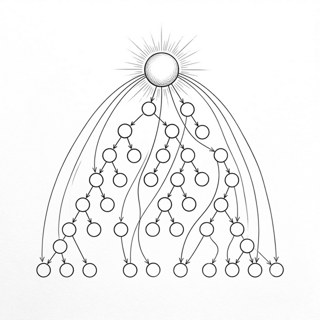

# Chapter 14: State Management and the Cross-Layer Bridge



Po built a larger Todo app with the Hooks from previous chapters. `useState` managed local state, `useEffect` handled side effects, `useMemo` optimized expensive computations. But soon he hit a new problem that none of the four tools could solve.

## 14.1 The Pain of Prop Drilling

**🐼**: Shifu, my app structure looks roughly like this:

```text
App
├── Header            ← needs user.name
├── Sidebar
│   └── UserProfile   ← needs user.name, user.avatar
└── Main
    └── Content
        └── TodoList
            └── TodoItem  ← needs theme.color
```

The user's name is in `App`'s State, but it needs to be used in `Header` and the deeply nested `UserProfile`. The theme color is also in `App`, but needs to reach `TodoItem` five levels deep. Look at how these Props get passed:

```javascript
function App() {
  const [user] = useState({ name: 'Po', avatar: '🧑' });
  const [theme] = useState({ color: '#0066cc' });

  return h('div', null, [
    h(Header,  { user: user }),
    h(Sidebar, { user: user }),
    h(Main,    { user: user, theme: theme }),
  ]);
}

function Main({ user, theme }) {
  // Main doesn't need user, but must pass it down!
  return h(Content, { user: user, theme: theme });
}

function Content({ user, theme }) {
  // Content doesn't need user either, but must pass it down!
  return h(TodoList, { user: user, theme: theme });
}
```

Every layer passes `user` and `theme`, but the middle layers (`Main`, `Content`) don't need this data at all! They're just "delivery workers," accepting and blindly forwarding.

**🧙‍♂️**: This is **Prop Drilling**. As app depth increases, this pattern has two big problems: noise (middle components are forced to accept and pass irrelevant Props) and fragility (adding a new `locale` prop to `TodoItem` means modifying **every component on the entire chain**).

**🐼**: What are the solutions?

**🧙‍♂️**: Two paths. One is to "extract" shared state into a global container (like Redux) that any component can subscribe to directly. The other is to let data "penetrate" the component tree like a signal, bypassing the middle layers (Context API).

Before covering these two paths, let me introduce a tool you'll soon need — `useReducer`.

## 14.2 Centralizing State Logic: useReducer

**🐼**: `useReducer`? How is that different from `useState`?

**🧙‍♂️**: When state logic gets complex, `useState` starts getting messy:

```javascript
// Managing complex state with useState: multiple setters, logic scattered everywhere
function TodoApp() {
  const [todos, setTodos] = useState([]);
  const [filter, setFilter] = useState('all');
  const [loading, setLoading] = useState(false);

  const addTodo = (text) => setTodos(prev => [...prev, { text, done: false }]);
  const removeTodo = (i) => setTodos(prev => prev.filter((_, idx) => idx !== i));
  // Toggle done (also needs to update loading): needs multiple setters...
}
```

**🐼**: That's messy — every operation has to manually assemble new state.

**🧙‍♂️**: `useReducer`'s approach: concentrate all state change logic in a **pure function (Reducer)**, then trigger updates by **dispatching an "Action"**:

```javascript
// Reducer: a pure function describing "how state changes when an action arrives"
function todosReducer(state, action) {
  switch (action.type) {
    case 'ADD':
      return { ...state, todos: [...state.todos, { text: action.text, done: false }] };
    case 'REMOVE':
      return { ...state, todos: state.todos.filter((_, i) => i !== action.index) };
    case 'TOGGLE':
      return {
        ...state,
        todos: state.todos.map((t, i) =>
          i === action.index ? { ...t, done: !t.done } : t
        )
      };
    default:
      return state;
  }
}

function TodoApp() {
  const [state, dispatch] = useReducer(todosReducer, { todos: [], filter: 'all' });

  return h('div', null, [
    h('button', { onclick: () => dispatch({ type: 'ADD', text: 'Buy milk' }) }, 'Add'),
    // ...
  ]);
}
```

**🐼**: Interesting! All state changes have a clear "name" (`action.type`), logic is centralized, easy to trace and debug.

**🧙‍♂️**: You got it. `useReducer` is really just a variant of `useState` — you're extracting "how to update" from scattered setters and putting it all in one function. Remember this pattern, because Redux — which you'll see next — does exactly this: takes the Reducer **out of the component** and into a **global store**.

## 14.3 Global State: createStore (Mini-Redux)

**🧙‍♂️**: The first approach to solving Prop Drilling: extract shared state out of the component tree, into a **global, predictable container**.

**🐼**: Like a public "warehouse"?

**🧙‍♂️**: Exactly. This is **Redux**'s (2015) core idea — identical to `useReducer`, except the Store is now outside the component tree and any component can subscribe directly. Let's implement a minimal version:

```javascript
function createStore(reducer, initialState) {
  let state = initialState;
  let listeners = [];

  return {
    getState() {
      return state;
    },

    dispatch(action) {
      // Reducer: pure function, (old state, action) → new state
      state = reducer(state, action);
      listeners.forEach(fn => fn());
    },

    subscribe(fn) {
      listeners.push(fn);
      return () => {
        listeners = listeners.filter(l => l !== fn);
      };
    }
  };
}
```

Full usage example showing the complete mini-redux workflow:

```javascript
// 1. Define Reducer
function counterReducer(state, action) {
  switch (action.type) {
    case 'INCREMENT': return { ...state, count: state.count + 1 };
    case 'DECREMENT': return { ...state, count: state.count - 1 };
    default: return state;
  }
}

// 2. Create Store: initial state + Reducer
const store = createStore(counterReducer, { count: 0 });

// 3. Subscribe to state changes: fires after every dispatch
store.subscribe(() => {
  const { count } = store.getState();
  document.getElementById('display').textContent = 'Count: ' + count;
});

// 4. User action → dispatch Action → Reducer computes new state → notify subscribers
document.getElementById('inc-btn').addEventListener('click', () => {
  store.dispatch({ type: 'INCREMENT' });
});
```

Note the flow: **user action → dispatch → reducer → new state → subscribers update UI**. The entire data flow is one-way and predictable.

**🐼**: This looks a lot like chapter three's `EventEmitter` — notify subscribers when data changes!

**🧙‍♂️**: Yes, but one key difference: state updates must go through `dispatch` + `reducer`, which is a **pure function**. This means state changes are predictable (given the same input, always the same output), and can be recorded and replayed (Time Travel Debugging).

## 14.4 The Context API in the Fiber Era

**🧙‍♂️**: For simple global data (like theme, user info, language settings), React provides the **Context API**. In the old component architecture it was somewhat obscure. But in our Fiber architecture, implementing it is surprisingly easy.

**🐼**: Why easy?

**🧙‍♂️**: Remember Fiber's data structure? Every Fiber node has a `return` pointer pointing to its parent. This means no matter how deep in the component tree you are, you have a **direct highway to the root**.

```javascript
function createContext(defaultValue) {
  return {
    _currentValue: defaultValue, // fallback default value
  };
}

// A plain wrapper component with a special marker (type === ContextProvider)
function ContextProvider(props) {
  // It just renders children,
  // but its Fiber node carries context and value, waiting for descendants to "claim"
  return props.children;
}
```

When we call `useContext` from a deeply nested child, the intuitive thing happens — walk up the `return` pointer chain to ancestors, find the first node providing this Context:

```javascript
function useContext(contextType) {
  let currentFiber = wipFiber;
  
  // Walk up the return pointer!
  while (currentFiber) {
    if (
      currentFiber.type === ContextProvider && 
      currentFiber.props.context === contextType
    ) {
      // Found it! "Steal" the value from this ancestor's props
      return currentFiber.props.value;
    }
    currentFiber = currentFiber.return;
  }
  
  // Reached root without finding a Provider — return createContext's default value
  return contextType._currentValue;
}
```

**🐼**: Oh! This is literally the scope chain — but for component trees! An inner component needs a value; if it doesn't have one, asks the parent; parent doesn't have it, asks the grandparent... until finding the nearest ancestor that provides this Context.

**🧙‍♂️**: Exactly. And since `useContext` runs during Render phase, if an ancestor's `value` changes and this child component is asked to repaint, it walks up again and naturally picks up the fresh value.

Real React's Context is somewhat more complex — it needs to solve a performance problem: when a Provider's `value` changes, if some middle components have blocked updates via `React.memo`, how can child components still get notified and force an update? React's source code has some sophisticated dependency collection to break through this barrier. But conceptually, **walking up the vine** is the essence of Context.

## 14.5 The Landscape and Future of State Management

**🐼**: With Redux and Context, do I have all the state management weapons?

**🧙‍♂️**: These two patterns are still the backbone of the ecosystem. But for more complex modern apps, they each expose pain points: Redux's boilerplate (Action, Reducer, Store) is too verbose; Context, when values update, causes all components subscribing to that Context to re-execute, lacking fine-grained **surgical update** capability.

So state management's "future" is evolving in two directions: **minimalism** (like Zustand, which greatly simplifies Redux and uses Hook-based precise subscriptions), and **atomic state** (like Jotai / Recoil, breaking state into countless tiny independent "atoms" — only components truly subscribed to a changed atom update, fundamentally solving Context's performance issue).

**🐼**: "Surgical updates" sounds like everyone's ultimate goal?

**🧙‍♂️**: Right on the mark! This pursuit even spawned a framework design fundamentally different from React. Let's look at that very different design — and how it makes us reconsider the essence of the "full re-execution" model.

## 14.6 Extended Reading: React vs Signals (SolidJS)

**🧙‍♂️**: Po, after learning React's state management, I want you to see a completely different mental model — **SolidJS's Signals**.

React's core assumption: on every state change, the entire component function **re-executes** (you met the "full re-execution" model in chapter twelve). SolidJS does the exact opposite — the component function runs **once**, and when state changes, it directly updates the corresponding DOM node — no Virtual DOM, no Diff.

```javascript
// React: entire function re-executes every time count changes
function Counter() {
  const [count, setCount] = useState(0);
  return <h1>Count: {count}</h1>;
}

// SolidJS: function runs once, count() is a "subscription"
function Counter() {
  const [count, setCount] = createSignal(0);
  return <h1>Count: {count()}</h1>;  // only this text node gets updated directly
}
```

| Dimension | React (re-execution) | SolidJS (Signals) |
|:-----|:-----------------|:-------------------|
| **Mental model** | Simple — "each render is a snapshot" | Need to understand reactivity — "which values are Signals" |
| **Default performance** | Requires memo/useMemo for manual optimization | Optimal by default — surgical updates |
| **Code consistency** | High — components are plain functions | Has "traps" — destructuring props loses reactivity |
| **Concurrent ability** | ✅ Can interrupt and resume rendering | ❌ Synchronous updates, hard to implement time slicing |

**🐼**: So React's "full re-execution" model just wastes performance? In the last chapter's e-commerce product list example — toggling dark mode causes the whole page to recompute!

**🧙‍♂️**: Yes. So in React, to avoid "full tree re-execution" performance avalanches, developers need to **manually** use `useMemo`, `useCallback`, and `React.memo` to tell the framework "this doesn't need recomputing," "this doesn't need recreating."

**🐼**: SolidJS doesn't need all these patch-ups at all?

**🧙‍♂️**: Right. In SolidJS, when state updates, only related DOM nodes re-evaluate — functions don't get recreated. That's what "Default performance" in the table means — **SolidJS is surgical by default; React requires manual developer optimization**.

**🐼**: So beyond adding developer burden, what's React's model good for?

**🧙‍♂️**: The key is that React's render process is just "call a function, generate VNode data structure" — it doesn't directly touch the DOM. This makes it **pure and disposable**: React can pause rendering halfway, go handle user input, then come back. That's exactly the foundation for Concurrent Mode from chapter eleven.

SolidJS's Signal changes directly modify the DOM — no intermediate "planning phase," so nothing to pause. Faster, more surgical, but no concurrent ability in return.

**🐼**: So React's "full re-execution" isn't just a flaw — it's what **makes Concurrent Mode possible**?

**🧙‍♂️**: Exactly. This is the **fundamental trade-off** of the two architectures — React chose "redundant planning phase for interruptibility," SolidJS chose "precise direct updates for default performance." No perfect answer, just the best choice for different scenarios.

### SolidJS "Traps"

**🧙‍♂️**: Finally, let me show you some **counterintuitive behaviors** in the Signals mental model, so you can make a fair judgment.

```javascript
// SolidJS trap: destructuring "kills" reactivity
function Greeting(props) {
  // ❌ After destructuring, name becomes a static value, no longer tracking changes!
  const { name } = props;
  return <h1>Hello, {name}</h1>;  // name is always the initial value

  // ✅ Must use props.name to maintain reactivity
  return <h1>Hello, {props.name}</h1>;
}

// React has no such problem! Because it re-executes every time, always gets fresh values.
```

```javascript
// SolidJS trap: eager evaluation "kills" reactivity
function App() {
  const [count, setCount] = createSignal(0);

  // ❌ Evaluating directly in the setup phase, only runs once!
  const doubled = count() * 2;  // always 0

  // ✅ Must wrap in a function for "lazy evaluation"
  const doubled = () => count() * 2;

  return <p>Doubled: {doubled()}</p>;
}
```

**🐼**: I see. React's mental model is more **forgiving** — because it re-executes every time, any expression you write always gets fresh values. SolidJS's mental model is more **efficient** — but you must always understand "where the reactive chain broke."

**🧙‍♂️**: This is the **core trade-off** each framework chose. No perfect answer, only the best choice for different scenarios.

## 14.7 Comparison Overview

| Approach | Pros | Cons | Use Case |
|:-----|:-----|:-----|:---------|
| **Prop Drilling** | Simple, explicit, traceable | Redundant in deep nesting, long change chain | Flat component tree |
| **useReducer** | Centralizes complex state logic | Still local state, can't share across components | Complex state within a single component |
| **Redux** | Predictable, Time Travel Debug | Lots of boilerplate (Action, Reducer, Store) | Large apps, complex state logic |
| **Context API** | Lightweight, no external library | Performance (all subscribed components re-render) | Low-frequency global data |
| **Atomic (Jotai/Recoil)** | Surgical updates, minimal boilerplate | Newer API, smaller ecosystem | Medium-large apps, fine-grained control |

---

### 📦 Try It Yourself

Save the following code as `ch14.html` — a complete app fully upgraded to the Fiber environment (including Context penetration and Mini-Redux state management):

```html
<!DOCTYPE html>
<html lang="en">
<head>
  <meta charset="UTF-8">
  <title>Chapter 14 — Context and State (Fiber Version)</title>
  <style>
    body { font-family: sans-serif; padding: 20px; max-width: 600px; margin: 0 auto; background: #f9f9f9; }
    .card { border: 1px solid #ddd; border-radius: 8px; padding: 15px; margin: 15px 0; background: white; }
    .card h3 { margin-top: 0; }
    button { padding: 6px 12px; cursor: pointer; margin: 4px; border-radius: 4px; border: 1px solid #ccc; background: #eee; }
    li { padding: 8px 0; border-bottom: 1px solid #eee; display: flex; justify-content: space-between; align-items: center; list-style: none; }
    li .task-content { display: flex; align-items: center; gap: 8px; }
    li.done span { text-decoration: line-through; color: #999; }
    li .delete-btn { background: #ff4444; color: white; border: none; padding: 4px 8px; border-radius: 4px; cursor: pointer; }
    input[type="text"] { padding: 8px; width: 60%; border-radius: 4px; border: 1px solid #ccc; }
    #stats { font-size: 14px; color: #666; margin-top: 10px; }
    #empty-msg { color: #999; font-style: italic; font-size: 14px; margin-top: 10px; }
    #log { background: #282c34; color: #abb2bf; padding: 10px; border-radius: 4px; font-family: monospace; font-size: 13px; max-height: 150px; overflow-y: auto; margin-top: 20px; }
  </style>
</head>
<body>
  <h1>State Management (Fiber & Hooks)</h1>
  <div id="app"></div>
  <div id="log"></div>

  <script>
    // ============================================
    // 1. Engine: Mini-React (Fiber + Hooks)
    // ============================================
    function h(type, props, ...children) {
      return {
        type,
        props: {
          ...props,
          children: children.flat().map(child =>
            typeof child === "object" ? child : { type: "TEXT_ELEMENT", props: { nodeValue: child, children: [] } }
          )
        }
      };
    }

    let workInProgress = null, currentRoot = null, wipRoot = null, deletions = null;
    let wipFiber = null, hookIndex = null;

    function render(element, container) {
      wipRoot = { dom: container, props: { children: [element] }, alternate: currentRoot };
      deletions = [];
      workInProgress = wipRoot;
    }

    function workLoop(deadline) {
      let shouldYield = false;
      while (workInProgress && !shouldYield) {
        workInProgress = performUnitOfWork(workInProgress);
        shouldYield = deadline.timeRemaining() < 1;
      }
      if (!workInProgress && wipRoot) commitRoot();
      requestIdleCallback(workLoop);
    }
    requestIdleCallback(workLoop);

    function performUnitOfWork(fiber) {
      const isFunctionComponent = fiber.type instanceof Function;
      if (isFunctionComponent) {
        wipFiber = fiber;
        hookIndex = 0;
        wipFiber.hooks = [];
        const children = [fiber.type(fiber.props)].flat();
        reconcileChildren(fiber, children);
      } else {
        if (!fiber.dom) fiber.dom = createDom(fiber);
        reconcileChildren(fiber, fiber.props.children);
      }
      if (fiber.child) return fiber.child;
      let nextFiber = fiber;
      while (nextFiber) {
        if (nextFiber.sibling) return nextFiber.sibling;
        nextFiber = nextFiber.return;
      }
      return null;
    }

    function createDom(fiber) {
      const dom = fiber.type === "TEXT_ELEMENT" ? document.createTextNode("") : document.createElement(fiber.type);
      updateDom(dom, {}, fiber.props);
      return dom;
    }

    function updateDom(dom, prevProps, nextProps) {
      for (const k in prevProps) {
        if (k !== 'children') {
          if (!(k in nextProps) || prevProps[k] !== nextProps[k]) {
            if (k.startsWith('on')) dom.removeEventListener(k.slice(2).toLowerCase(), prevProps[k]);
            else if (!(k in nextProps)) {
              if (k === 'className') dom.removeAttribute('class');
              else if (k === 'style') dom.style.cssText = '';
              else dom[k] = '';
            }
          }
        }
      }
      for (const k in nextProps) {
        if (k !== 'children' && prevProps[k] !== nextProps[k]) {
          if (k.startsWith('on')) dom.addEventListener(k.slice(2).toLowerCase(), nextProps[k]);
          else {
            if (k === 'className') dom.setAttribute('class', nextProps[k]);
            else if (k === 'style' && typeof nextProps[k] === 'string') dom.style.cssText = nextProps[k];
            else dom[k] = nextProps[k];
          }
        }
      }
    }

    function reconcileChildren(wipFiber, elements) {
      let index = 0, oldFiber = wipFiber.alternate && wipFiber.alternate.child, prevSibling = null;
      while (index < elements.length || oldFiber != null) {
        const element = elements[index];
        let newFiber = null;
        const sameType = oldFiber && element && element.type === oldFiber.type;

        if (sameType) newFiber = { type: oldFiber.type, props: element.props, dom: oldFiber.dom, return: wipFiber, alternate: oldFiber, effectTag: "UPDATE" };
        if (element && !sameType) newFiber = { type: element.type, props: element.props, dom: null, return: wipFiber, alternate: null, effectTag: "PLACEMENT" };
        if (oldFiber && !sameType) { oldFiber.effectTag = "DELETION"; deletions.push(oldFiber); }

        if (oldFiber) oldFiber = oldFiber.sibling;
        if (index === 0) wipFiber.child = newFiber;
        else if (element) prevSibling.sibling = newFiber;
        prevSibling = newFiber;
        index++;
      }
    }

    function commitRoot() {
      deletions.forEach(commitWork);
      commitWork(wipRoot.child);
      commitEffects(wipRoot.child);
      currentRoot = wipRoot;
      wipRoot = null;
    }

    function commitWork(fiber) {
      if (!fiber) return;
      let domParentFiber = fiber.return;
      while (!domParentFiber.dom) domParentFiber = domParentFiber.return;
      const domParent = domParentFiber.dom;

      if (fiber.effectTag === "PLACEMENT" && fiber.dom != null) domParent.appendChild(fiber.dom);
      else if (fiber.effectTag === "UPDATE" && fiber.dom != null) updateDom(fiber.dom, fiber.alternate.props, fiber.props);
      else if (fiber.effectTag === "DELETION") {
        commitDeletion(fiber, domParent);
        return;
      }

      commitWork(fiber.child);
      commitWork(fiber.sibling);
    }
    
    function commitDeletion(fiber, domParent) {
      if (fiber.dom) domParent.removeChild(fiber.dom);
      else commitDeletion(fiber.child, domParent);
    }

    function commitEffects(fiber) {
      if (!fiber) return;
      if (fiber.hooks) {
        fiber.hooks.forEach(hook => {
          if (hook.tag === 'effect' && hook.hasChanged && hook.callback) {
            if (hook.cleanup) hook.cleanup();
            hook.cleanup = hook.callback();
          }
        });
      }
      commitEffects(fiber.child);
      commitEffects(fiber.sibling);
    }

    function useState(initial) {
      const oldHook = wipFiber.alternate && wipFiber.alternate.hooks && wipFiber.alternate.hooks[hookIndex];
      const hook = { 
        state: oldHook ? oldHook.state : initial, 
        queue: oldHook ? oldHook.queue : [],
        setState: oldHook ? oldHook.setState : null
      };
      
      hook.queue.forEach(action => hook.state = typeof action === 'function' ? action(hook.state) : action);
      hook.queue.length = 0;

      if (!hook.setState) {
        hook.setState = action => {
          hook.queue.push(action);
          wipRoot = { dom: currentRoot.dom, props: currentRoot.props, alternate: currentRoot };
          workInProgress = wipRoot;
          deletions = [];
        };
      }
      wipFiber.hooks.push(hook);
      hookIndex++;
      return [hook.state, hook.setState];
    }

    function useEffect(callback, deps) {
      const oldHook = wipFiber.alternate && wipFiber.alternate.hooks && wipFiber.alternate.hooks[hookIndex];
      let hasChanged = true;
      if (oldHook && deps) hasChanged = deps.some((dep, i) => !Object.is(dep, oldHook.deps[i]));
      const hook = { tag: 'effect', callback, deps, hasChanged, cleanup: oldHook ? oldHook.cleanup : undefined };
      wipFiber.hooks.push(hook);
      hookIndex++;
    }

    // ============================================
    // 2. New: Context mechanism
    // ============================================
    function createContext(defaultValue) {
      return { _currentValue: defaultValue };
    }
    
    // ContextProvider only passes through children,
    // but its Fiber node carries context and value for descendants to find via useContext
    function ContextProvider(props) {
      return props.children;
    }

    function useContext(contextType) {
      let currentFiber = wipFiber;
      // Walk up the return pointer, find nearest Provider
      while (currentFiber) {
        if (currentFiber.type === ContextProvider && currentFiber.props.context === contextType) {
          return currentFiber.props.value;
        }
        currentFiber = currentFiber.return;
      }
      return contextType._currentValue;
    }

    // ============================================
    // 3. New: Mini-Redux
    // ============================================
    const logEl = document.getElementById('log');
    function log(msg) {
      const line = document.createElement('div');
      line.textContent = '➤ ' + msg;
      logEl.prepend(line);
    }

    function createStore(reducer, initial) {
      let state = initial;
      let listeners = [];
      return {
        getState: () => state,
        dispatch: (action) => {
          state = reducer(state, action);
          listeners.forEach(fn => fn());
        },
        subscribe: (fn) => {
          listeners.push(fn);
          return () => { listeners = listeners.filter(l => l !== fn); };
        }
      };
    }

    function todosReducer(state, action) {
      switch (action.type) {
        case 'ADD_TODO':
          log('dispatch: ADD_TODO "' + action.text + '"');
          return { ...state, todos: [...state.todos, { text: action.text, done: false }] };
        case 'REMOVE_TODO':
          log('dispatch: REMOVE_TODO index=' + action.index);
          return { ...state, todos: state.todos.filter((_, i) => i !== action.index) };
        case 'TOGGLE_TODO':
          log('dispatch: TOGGLE_TODO index=' + action.index);
          return {
            ...state,
            todos: state.todos.map((t, i) => i === action.index ? { ...t, done: !t.done } : t)
          };
        default:
          return state;
      }
    }

    const store = createStore(todosReducer, { 
      todos: [
        { text: 'Learn React', done: true }, 
        { text: 'Build Mini-React', done: false }
      ] 
    });

    // Custom Hook: connect external Redux Store to Fiber's render mechanism
    // useEffect subscribes to store on mount, unsubscribes on unmount (cleanup function)
    function useStore(store) {
      const [state, setState] = useState(store.getState());
      
      useEffect(() => {
        const unsubscribe = store.subscribe(() => {
          setState(store.getState());
        });
        return unsubscribe;
      }, [store]); 
      
      return state;
    }

    // ============================================
    // 4. App
    // ============================================
    const ThemeContext = createContext('#0066cc');

    function TodoApp() {
      const state = useStore(store); 
      const [inputValue, setInputValue] = useState('');

      const doneCount = state.todos.filter(t => t.done).length;

      return h('div', { className: 'card' },
        h('h3', null, 'My Todo List (Fiber & Hooks)'),
        h('div', null,
          h('input', { 
            type: 'text',
            placeholder: 'Add a task', 
            value: inputValue, 
            oninput: e => setInputValue(e.target.value) 
          }),
          h('button', { 
            id: 'add-btn',
            onclick: () => {
              if (!inputValue.trim()) return;
              store.dispatch({ type: 'ADD_TODO', text: inputValue });
              setInputValue('');
            }
          }, 'Add')
        ),
        h('p', { id: 'stats' }, `Done ${doneCount} / Total ${state.todos.length}`),
        h('p', { id: 'empty-msg', style: `display: ${state.todos.length === 0 ? 'block' : 'none'}` }, 'No data'),
        h('ul', { style: 'padding-left: 0; margin-bottom: 0;' }, state.todos.map((todo, i) => h(TodoItem, { text: todo.text, done: todo.done, index: i })))
      );
    }

    function TodoItem({ text, done, index }) {
      // useContext: walks up Fiber.return chain to find ThemeContext's Provider — no Props needed!
      const themeColor = useContext(ThemeContext);
      
      return h('li', done ? { className: 'done' } : null,
        h('div', { className: 'task-content' }, 
          h('input', Object.assign({ type: 'checkbox', onchange: () => store.dispatch({ type: 'TOGGLE_TODO', index }) }, done ? { checked: true } : {})), 
          h('span', { style: `color: ${done ? '#999' : themeColor}; font-weight: bold;` }, text)
        ),
        h('button', { className: 'delete-btn', onclick: () => store.dispatch({ type: 'REMOVE_TODO', index }) }, '×')
      );
    }

    function App() {
      const [isBlue, setIsBlue] = useState(true);
      const currentColor = isBlue ? '#0066cc' : '#cc6600';

      return h('div', null,
        // ContextProvider wraps the subtree; value changes are picked up by useContext on next render
        h(ContextProvider, { context: ThemeContext, value: currentColor },
          h('div', { className: 'card' },
            h('h3', null, 'Context API Demo'),
            h('p', null, 'The todo list text color below is passed directly across layers via Fiber.return:'),
            h('div', { style: `padding: 10px; border-radius: 4px; color: white; background: ${currentColor}` },
              `Current global color: ${currentColor}`
            ),
            h('button', { onclick: () => setIsBlue(!isBlue), style: 'margin-top: 10px' }, 'Toggle Theme Color')
          ),
          h(TodoApp, null)
        )
      );
    }

    render(h(App, null), document.getElementById('app'));
    log('App started and running in Fiber architecture');
  </script>
</body>
</html>
```
