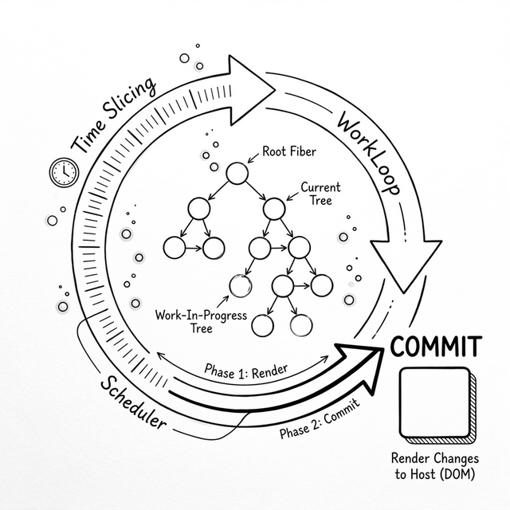

# Appendix A: Mini-React vs React — What We Simplified



In this book, we started from the initial synchronous recursive build (Stack Reconciler) and incrementally evolved the engine into a modern Fiber and Hooks engine of about **400 lines**. It covers Virtual DOM, Time Slicing, Fiber Reconciliation, synchronous Commit, and the core Hooks.

Real React started from the same pain points and evolved into the massive Fiber architecture it is today (hundreds of thousands of lines). This appendix contains the final complete source of our `mini-react`, and helps you understand: **in this final Fiber model, what did we intentionally simplify, and how does real React handle the core architecture?**

---

## What Else Does Real React Handle? (Differences)

Although we have a modern Fiber skeleton, to keep the code readable under 400 lines, real React handles much more detail and advanced architecture:

### 1. Scheduler and Priority Model

We lazily used the browser's native `requestIdleCallback` API.

**Real React**: `requestIdleCallback` isn't supported in all browsers and isn't stable enough. The React team hand-wrote a core library `scheduler` based on `MessageChannel`. React 17/18's concurrent mode also has a "Lane Model" — prioritizing different tasks with bitmasks. For example, a user typing (high priority) interrupts rendering of network request results (low priority). Our `workLoop` has only one priority level with FIFO scheduling.

### 2. Double Buffering Performance Recycling

Every time we call `setState`, we create a brand new `wipRoot` tree:

```js
wipRoot = { dom: currentRoot.dom, alternate: currentRoot, ... }
```

**Real React**: React reuses actual Fiber nodes to maximize performance. It maintains strictly corresponding `current` and `workInProgress` trees. On each render update, React doesn't create new Fiber objects — it reuses the same-level instance from the previous Fiber tree. This greatly reduces JavaScript engine garbage collection (GC) burden.

### 3. Synthetic Event System (SyntheticEvent)

In our code, events are bound directly like this:

```javascript
dom.addEventListener(eventType, nextProps[name]);
```

**Real React**: The actual `onClick` in components isn't bound this way. Due to inconsistent event objects across browsers, and to improve memory performance, React mounts a single global event listener at the top level (container level). All events triggered in child components bubble up to the top and are intercepted by React, wrapped into a cross-browser compatible `SyntheticEvent` object, then trigger our callbacks.

### 4. Diff Algorithm Complexity Guarantee

In `reconcileChildren`, we compare new VNodes with old Fiber nodes by array index.

**Real React**: We completely ignored the large-scale DOM deletion and creation problem caused by array reordering. React's `reconcileChildrenArray` uses a `key`-based algorithm: if only the array order changes, React recognizes `key` to reposition real DOM nodes (move rather than rebuild). This is also why you get a warning when you don't add `key` to long list loops.

### 4.5 The Internal Division of the Render Phase: beginWork and completeWork

We handle all the work for each node inside a single `performUnitOfWork` function.

**Real React**: The real React splits the responsibilities of
`performUnitOfWork` into two separate functions — `beginWork` is called when
descending into a node (responsible for executing function components and running
Reconciliation), and `completeWork` is called when ascending back to the parent
(responsible for creating DOM nodes and bubbling flags from child nodes up to
their parent). This separation allows React to precisely distinguish between the
"enter" and "complete" moments of a node when resuming interrupted concurrent
work. The core depth-first traversal logic is identical to what we have built
in this book.

### 5. Suspense and Concurrency

We covered Suspense in chapter 15 and demonstrated the core `try/catch` mechanism in the teaching code.

**Real React**: Real React Fiber has a powerful "Throw / Catch" recovery mechanism. When Render phase throws a Promise, React "suspends" the rendering, yielding control. After the Promise resolves, since Fiber saved the exact work state, it can precisely resume execution from the original position.

### 6. SSR and RSC

Our mini-react is a CSR (client-side rendering) DOM engine that runs entirely in the browser. Real React has a Renderer independent of the host environment (enabling `react-native` to render native mobile, and `react-dom/server` to render HTML strings). React also splits Client Component / Server Component at the architectural level, enabling on-demand loading and seamless Hydration.

---

### Summary: Evolution from First Principles

While our 400 lines of code omit the massive logic React uses to patch performance and edge cases, you still see the complete internals: **how Fiber breaks long tasks into chunks, how `useState` attaches to the linked list, and why Effects must be committed after the DOM is built**.

With this mental model in hand, when you encounter strange closure traps or Hook errors, think back to this Fiber chain that carries memory.

---

## Complete Mini-React (Fiber) Source Code

Below is the complete Fiber engine built incrementally through chapters 9–15 of this book, usable as a "stepping stone" before reading the real React source code.

> **A note on this file vs chapter demos**
>
> The HTML demos at the end of each chapter were written to be pasted directly into a browser, so they don't use `export`. This file as a standalone ES module uses `export` for the public API. The implementation logic is identical.
>
> Also, the `h()` function here uses a named helper `createTextElement`, while chapter demos inline that logic directly in `h()`. Completely equivalent — the named helper just makes the code more readable here.

```javascript
/**
 * mini-react.js — The Way of React (Modern Fiber Architecture)
 *
 * Complete source of the modern Fiber engine built in chapters 9-15.
 * Contains Fiber architecture, Time-Slicing, and Hooks attached to Fiber nodes.
 * This engine completely replaces the synchronous recursive Stack Reconciler
 * built in chapters 1-8.
 */

// ============================================
// Virtual DOM factory
// ============================================

export function h(type, props, ...children) {
  return {
    type,
    props: {
      ...props,
      // .flat() handles nested arrays (e.g., children that contain arrays)
      // Text nodes are uniformly wrapped as objects so the Fiber traversal
      // algorithm can treat them all the same
      children: children.flat().map(child =>
        typeof child === "object"
          ? child
          : createTextElement(child)
      ),
    },
  };
}

// Wrap string/number text into uniformly formatted VNode objects
// Chapter demos inline this logic in h() — completely equivalent
function createTextElement(text) {
  return {
    type: "TEXT_ELEMENT",
    props: {
      nodeValue: text,
      children: [],
    },
  };
}

// ============================================
// Global state variables (engine "dashboard")
// ============================================

let workInProgress = null; // traversal cursor: Fiber node currently waiting to be processed
let currentRoot = null;    // completed blueprint: the last committed Fiber tree
let wipRoot = null;        // draft paper: root of the new Fiber tree being built
let deletions = null;      // list of old Fiber nodes to delete

let wipFiber = null;       // Fiber node of the function component currently executing
let hookIndex = null;      // which Hook call we're on ("which drawer")

// ============================================
// Public API
// ============================================

export function render(element, container) {
  // Create draft root node, connect to old tree (currentRoot is null on first mount)
  wipRoot = {
    dom: container,
    props: {
      children: [element],
    },
    alternate: currentRoot,
  };
  deletions = [];
  workInProgress = wipRoot;
}

// ============================================
// Work loop (core of time slicing)
// ============================================

function workLoop(deadline) {
  let shouldYield = false;

  // While there's work AND the browser has idle time, keep executing
  while (workInProgress && !shouldYield) {
    workInProgress = performUnitOfWork(workInProgress);
    shouldYield = deadline.timeRemaining() < 1;
  }

  // Cursor reached null means Render Phase ended — enter Commit Phase synchronously
  if (!workInProgress && wipRoot) {
    commitRoot();
  }

  // After yielding main thread, wait for next idle frame to continue
  requestIdleCallback(workLoop);
}

requestIdleCallback(workLoop);

// Process single Fiber node, return the next node to process
function performUnitOfWork(fiber) {
  const isFunctionComponent = fiber.type instanceof Function;

  if (isFunctionComponent) {
    updateFunctionComponent(fiber);
  } else {
    updateHostComponent(fiber);
  }

  // Navigate to next node: prefer child, then sibling, then uncle
  if (fiber.child) return fiber.child;

  let nextFiber = fiber;
  while (nextFiber) {
    if (nextFiber.sibling) return nextFiber.sibling;
    nextFiber = nextFiber.return; // ← return pointer, points to parent node
  }
  return null;
}

// ============================================
// Component updates and child reconciliation
// ============================================

function updateFunctionComponent(fiber) {
  // Set global pointers so useState/useEffect know which Fiber's which drawer
  wipFiber = fiber;
  hookIndex = 0;
  wipFiber.hooks = [];

  // Execute function component, get children (.flat() handles array returns)
  const children = [fiber.type(fiber.props)].flat();
  reconcileChildren(fiber, children);
}

function updateHostComponent(fiber) {
  // Native DOM node: create real DOM (don't mount, Commit Phase handles that)
  if (!fiber.dom) {
    fiber.dom = createDom(fiber);
  }
  reconcileChildren(fiber, fiber.props.children);
}

// Reconcile children: compare new VNodes with old Fibers, tag with effectTag
function reconcileChildren(wipFiber, elements) {
  let index = 0;
  let oldFiber = wipFiber.alternate && wipFiber.alternate.child;
  let prevSibling = null;

  // Loop condition: new elements not done OR old Fibers not done
  // — both sides must reach the end to detect extra old nodes
  while (index < elements.length || oldFiber != null) {
    const element = elements[index];
    let newFiber = null;

    const sameType = oldFiber && element && element.type === oldFiber.type;

    if (sameType) {
      // Same type: reuse old DOM, only update props
      newFiber = {
        type: oldFiber.type,
        props: element.props,
        dom: oldFiber.dom,      // directly reuse old real DOM node
        return: wipFiber,       // ← return, points to parent node
        alternate: oldFiber,    // connect old Fiber, Commit uses it to compare old props
        effectTag: "UPDATE",
      };
    }
    if (element && !sameType) {
      // New element but different type (or no old node): create fresh
      newFiber = {
        type: element.type,
        props: element.props,
        dom: null,
        return: wipFiber,       // ← return, points to parent node
        alternate: null,
        effectTag: "PLACEMENT",
      };
    }
    if (oldFiber && !sameType) {
      // Old node but no corresponding new element (or different type): mark for deletion
      oldFiber.effectTag = "DELETION";
      deletions.push(oldFiber);
    }

    if (oldFiber) oldFiber = oldFiber.sibling;

    if (index === 0) {
      wipFiber.child = newFiber;
    } else if (element) {
      prevSibling.sibling = newFiber;
    }

    prevSibling = newFiber;
    index++;
  }
}

// ============================================
// Commit Phase (synchronously, non-interruptibly write changes to real DOM)
// ============================================

function commitRoot() {
  // Handle deletions first (deleted old Fibers aren't in new tree, need separate handling)
  deletions.forEach(commitWork);
  // Then handle additions and updates
  commitWork(wipRoot.child);
  // After all DOM work, trigger side effects together
  commitEffects(wipRoot.child);

  // New tree becomes current tree, draft paper cleared
  currentRoot = wipRoot;
  wipRoot = null;
}

function commitWork(fiber) {
  if (!fiber) return;

  // Find the nearest ancestor with real DOM.
  // Function components have no DOM, need to skip up until finding a native node.
  let domParentFiber = fiber.return; // ← return, points to parent node
  while (!domParentFiber.dom) {
    domParentFiber = domParentFiber.return; // ← return
  }
  const domParent = domParentFiber.dom;

  if (fiber.effectTag === "PLACEMENT" && fiber.dom != null) {
    // New: mount DOM to page
    domParent.appendChild(fiber.dom);
  } else if (fiber.effectTag === "UPDATE" && fiber.dom != null) {
    // Update: only modify changed props and event listeners
    updateDom(fiber.dom, fiber.alternate.props, fiber.props);
  } else if (fiber.effectTag === "DELETION") {
    // Delete: remove old DOM, return immediately without recursing deleted subtree
    // (old subtree children may have stale effectTags; continuing would re-insert "zombie nodes")
    commitDeletion(fiber, domParent);
    return;
  }

  commitWork(fiber.child);
  commitWork(fiber.sibling);
}

function commitDeletion(fiber, domParent) {
  if (fiber.dom) {
    domParent.removeChild(fiber.dom);
  } else {
    // Function component has no dom, search child for real DOM node
    commitDeletion(fiber.child, domParent);
  }
}

// Traverse entire Fiber tree, execute all pending side effects after DOM work is complete
function commitEffects(fiber) {
  if (!fiber) return;

  if (fiber.hooks) {
    fiber.hooks.forEach(hook => {
      // Use tag === 'effect' to distinguish useEffect hooks from useState hooks
      if (hook.tag === 'effect' && hook.hasChanged && hook.callback) {
        // First run the cleanup function from last side effect
        if (hook.cleanup) hook.cleanup();
        // Run new side effect, save return value as next cleanup
        hook.cleanup = hook.callback();
      }
    });
  }

  commitEffects(fiber.child);
  commitEffects(fiber.sibling);
}

// ============================================
// DOM utility functions
// ============================================

function createDom(fiber) {
  const dom = fiber.type === "TEXT_ELEMENT"
    ? document.createTextNode("")
    : document.createElement(fiber.type);
  updateDom(dom, {}, fiber.props);
  return dom;
}

function updateDom(dom, prevProps, nextProps) {
  // First pass: remove old props and event listeners
  for (const k in prevProps) {
    if (k !== 'children') {
      if (!(k in nextProps) || prevProps[k] !== nextProps[k]) {
        if (k.startsWith('on')) {
          dom.removeEventListener(k.slice(2).toLowerCase(), prevProps[k]);
        } else if (!(k in nextProps)) {
          // Old has it, new doesn't: clear the prop
          if (k === 'className') dom.removeAttribute('class');
          else if (k === 'style') dom.style.cssText = '';
          else dom[k] = '';
        }
      }
    }
  }
  // Second pass: set new props and event listeners
  for (const k in nextProps) {
    if (k !== 'children' && prevProps[k] !== nextProps[k]) {
      if (k.startsWith('on')) {
        dom.addEventListener(k.slice(2).toLowerCase(), nextProps[k]);
      } else {
        if (k === 'className') dom.setAttribute('class', nextProps[k]);
        else if (k === 'style' && typeof nextProps[k] === 'string') dom.style.cssText = nextProps[k];
        else dom[k] = nextProps[k];
      }
    }
  }
}

// ============================================
// Hooks API
// ============================================

export function useState(initial) {
  // Get last hook object from same drawer in old Fiber
  const oldHook =
    wipFiber.alternate &&
    wipFiber.alternate.hooks &&
    wipFiber.alternate.hooks[hookIndex];

  const hook = {
    state: oldHook ? oldHook.state : initial,
    queue: oldHook ? oldHook.queue : [],
    setState: oldHook ? oldHook.setState : null,
  };

  // Settle queue: apply all pending updates to state in order
  hook.queue.forEach(action => {
    hook.state = typeof action === 'function'
      ? action(hook.state)  // supports functional update: setCount(c => c + 1)
      : action;             // also supports direct assignment: setCount(5)
  });
  hook.queue.length = 0;

  // Create setState on first render (reuse same function reference afterwards)
  if (!hook.setState) {
    hook.setState = action => {
      hook.queue.push(action);
      // Create new wipRoot (draft paper), trigger new Render Phase
      wipRoot = {
        dom: currentRoot.dom,
        props: currentRoot.props,
        alternate: currentRoot,
      };
      workInProgress = wipRoot;
      deletions = [];
    };
  }

  wipFiber.hooks.push(hook);
  hookIndex++;
  return [hook.state, hook.setState];
}

export function useReducer(reducer, initialState) {
  // useReducer is syntax sugar for useState:
  // extract "how to update" from scattered setState calls into one reducer function
  const [state, setState] = useState(initialState);

  function dispatch(action) {
    setState(prevState => reducer(prevState, action));
  }

  return [state, dispatch];
}

export function useEffect(callback, deps) {
  const oldHook =
    wipFiber.alternate &&
    wipFiber.alternate.hooks &&
    wipFiber.alternate.hooks[hookIndex];

  // Compare dependency array, judge if side effect needs re-running
  let hasChanged = true;
  if (oldHook && deps) {
    hasChanged = deps.some((dep, i) => !Object.is(dep, oldHook.deps[i]));
  }

  const hook = {
    tag: 'effect',  // ← tag type, lets commitEffects distinguish useState and useEffect hooks
    callback,
    deps,
    hasChanged,
    cleanup: oldHook ? oldHook.cleanup : undefined,
  };

  wipFiber.hooks.push(hook);
  hookIndex++;
}

export function useMemo(factory, deps) {
  const oldHook =
    wipFiber.alternate &&
    wipFiber.alternate.hooks &&
    wipFiber.alternate.hooks[hookIndex];

  let hasChanged = true;
  if (oldHook && deps) {
    hasChanged = deps.some((dep, i) => !Object.is(dep, oldHook.deps[i]));
  }

  const hook = {
    // Deps changed: recompute now; unchanged: return last cached result
    value: hasChanged ? factory() : oldHook.value,
    deps,
  };

  wipFiber.hooks.push(hook);
  hookIndex++;
  return hook.value;
}

export function useCallback(callback, deps) {
  // useCallback is useMemo syntax sugar for caching function references
  return useMemo(() => callback, deps);
}

export function useRef(initialValue) {
  // useRef is essentially useState that never calls setState
  // Directly modifying ref.current doesn't trigger re-render
  const [ref] = useState({ current: initialValue });
  return ref;
}

// ============================================
// Context API (chapter 14)
// ============================================

export function createContext(defaultValue) {
  return {
    _currentValue: defaultValue, // fallback default value when no Provider wraps
  };
}

// ContextProvider is a special wrapper component:
// it just passes through children, but its Fiber node carries context and value,
// for descendant components to "claim" when they walk up the return chain
export function ContextProvider(props) {
  return props.children;
}

export function useContext(contextType) {
  // Walk up the return pointer, looking for the nearest ContextProvider
  let currentFiber = wipFiber;
  while (currentFiber) {
    if (
      currentFiber.type === ContextProvider &&
      currentFiber.props.context === contextType
    ) {
      // Found it! Take value from this ancestor's props
      return currentFiber.props.value;
    }
    currentFiber = currentFiber.return; // ← return, walk upward
  }
  // Walked all the way to root without finding a Provider — return createContext's default
  return contextType._currentValue;
}
```
