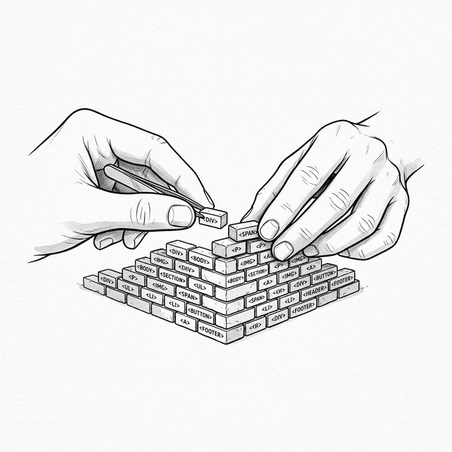

# 第一章：生の DOM —— すべての起点 (The Raw DOM)



## 1.1 ゼロからの挑戦

 ポーは軽くドアを叩き、部屋に入った。師父は目を閉じて精神を整えており、目の前には温かいお茶が置かれている。

**🐼**：師父、React を学びたいです。モダンな Web アプリを構築するための最高のツールだと聞きました。それがどのように動くのか知りたいのです。

**🧙‍♂️**：React は確かに名剣だ。だが、それを使ってお前は何を解決したいのだ？

**🐼**：解決……インターフェース構築の問題でしょうか？それを使えばコードがより明快になり、メンテナンスも容易になるとみんな言っています。

**🧙‍♂️**： 「明快」を理解するためには、まず「混沌」を目の当たりにしなければならん。痛みを知らなければ、良薬のありがたみはわからぬ。React を学び始める前に、まずは原点に戻る必要がある。

**🐼**：原点に、ですか？

**🧙‍♂️**：そうだ。すべてのフレームワークを忘れろ。React も Vue も、Angular も Svelte もない。最も原始的な JavaScript だけを使って、**ToDo リスト (Todo List)** を作ってみるのだ。
要件は以下の通り：

1. 入力欄と「追加」ボタンがあること。
2. ボタンをクリックすると、入力欄の内容が下のリストに追加されること。
3. リスト項目の右側にある削除ボタンをクリックすると、その項目が削除されること。

**🐼**：生の JavaScript だけでですか？そんなに難しくはなさそうです。やってみます。

## 1.2 ポーの試行 (命令的なやり方)

ポーはエディタを開き、`index.html` と `app.js` を作成した。しばらくして、彼は成果を見せた。

**HTML:**
```html
<!DOCTYPE html>
<html>
<body>
  <div id="app">
    <h1>My Todo List</h1>
    <input type="text" id="todo-input" placeholder="Add a task">
    <button id="add-btn">Add</button>
    <ul id="todo-list"></ul>
  </div>
  <script src="app.js"></script>
</body>
</html>
```

**JavaScript (app.js):**
```javascript
const input = document.getElementById('todo-input');
const addBtn = document.getElementById('add-btn');
const list = document.getElementById('todo-list');

addBtn.addEventListener('click', function() {
  const value = input.value;
  
  if (!value) return; // 空の値は無視

  // 1. li 要素を作成
  const li = document.createElement('li');
  
  // 2. テキストノードを作成
  const text = document.createElement('span');
  text.textContent = value;
  
  // 3. 削除ボタンを作成しイベントをバインド
  const deleteBtn = document.createElement('button');
  deleteBtn.textContent = '×';
  deleteBtn.className = 'delete-btn';
  deleteBtn.addEventListener('click', function() {
    list.removeChild(li);
  });

  // 4. 組み立てて ul に追加
  li.appendChild(text);
  li.appendChild(deleteBtn);
  list.appendChild(li);

  // 5. 入力欄をクリア
  input.value = '';
});
```

**🐼**：師父、できました。ロジックは直感的です。入力を取得し、要素を作り、イベントをバインドし、DOM に挿入する。これが最も純粋な JavaScript ですよね？

## 1.3 痛みの分析：命令型プログラミング

**🧙‍♂️**：コードは確かに動く。だが、ポーよ。このコードを書いているとき、お前の思考プロセスはどうなっていた？

**🐼**：手順を考えていました。まず値を取得して、次にタグを作って、それを中に入れて……。

**🧙‍♂️**：その通りだ。それが **命令型プログラミング (Imperative Programming)** だ。お前は現場監督のように、ブラウザという作業員に対して、一歩一歩何をすべきかを指示している。

* 「あの要素を取得しろ」
* 「新しいノードを作成しろ」
* 「そのテキストを書き換えろ」
* 「それをあそこに差し込め」

**🐼**：コンピュータに指令を出すこと、それがプログラミングの本質ではないのですか？

**🧙‍♂️**：単純なタスクなら、それでいい。だが要件が複雑になったらどうなる？
例えば、こんな要件変更が来たとしよう。**「リストが空のときは『データなし』と表示し、データがあるときはその文字を隠せ」**

**🐼**：それなら、追加と削除のときにチェックする判定を入れればいいですね。

```javascript
// ポーが修正したコードの断片
function checkEmpty() {
  if (list.children.length === 0) {
    emptyMsg.style.display = 'block';
  } else {
    emptyMsg.style.display = 'none';
  }
}

// 追加ロジックの末尾で呼び出す
addBtn.addEventListener('click', function() {
   // ... 追加ロジック ...
   checkEmpty();
});

// 削除ロジックの末尾で呼び出す
// ... list.removeChild(li); checkEmpty(); ...
```

**🧙‍♂️**：よろしい。では二つ目の要件変更だ。**「各ToDoにチェックボックスを追加し、完了/未完了をマークできるようにせよ。そしてリストの上に『完了 X / 合計 Y 件』という統計をリアルタイムで表示せよ」**

**🐼**：うーん……それなら、各 `li` に `checkbox` を作成して、スタイルを切り替えるために `change` イベントをバインドする必要がありますね。統計については、追加、削除、そしてチェックボックスを切り替えるたびに、リスト内の全要素を走査してカウントする必要があります……。

```javascript
// checkbox を作成
const checkbox = document.createElement('input');
checkbox.type = 'checkbox';
checkbox.addEventListener('change', function() {
  if (checkbox.checked) {
    li.style.textDecoration = 'line-through';
    li.style.color = '#999';
  } else {
    li.style.textDecoration = 'none';
    li.style.color = '#000';
  }
  updateStats(); // 切り替えるたびに統計を更新
});
li.prepend(checkbox);

// 統計関数
function updateStats() {
  const allItems = list.querySelectorAll('li');
  const doneItems = list.querySelectorAll('li input:checked');
  statsEl.textContent = `完了 ${doneItems.length} / 合計 ${allItems.length} 件`;
}

// 忘れずに：追加、削除のときも updateStats() を呼ぶこと！
```

**🧙‍♂️**：気づいたか？たった二つの要件変更で、お前のコードはすでに乱雑になっている。UI の一部（追加、削除、状態の切り替え）を修正するたびに、それに関連する **すべて** の部分（「データなし」の表示 **および** 統計の数字）を更新することを覚えておかなければならない。一つでも `updateStats()` の呼び出しを忘れれば、画面にはバグが出る。
アプリが大きくなるにつれ、このような手動で管理される依存関係は蔓のように絡み合い、最終的にはメンテナンス不可能な **スパゲッティコード (Spaghetti Code)** になるのだ。

**🐼**：おっしゃる意味がわかりました。すべての状態同期を手動で管理するのは、確かにひどく疲れます。

## 1.4 パフォーマンスの落とし穴：リフローとリペイント (Reflow & Repaint)

**🧙‍♂️**：メンテナンス性の問題だけでなく、もう一つの隠れたコストがある。**パフォーマンス**だ。
お前が `list.appendChild(li)` を実行するとき、ブラウザは単に「描画」しているだけではない。

**🐼**：他に何をする必要があるのですか？

**🧙‍♂️**：レイアウトを再計算（Reflow）し、各要素の位置とサイズを確定させ、それから再描画（Repaint）しなければならん。
もしループの中で DOM を操作したらどうなるか：

```javascript
for (let i = 0; i < 1000; i++) {
  const li = document.createElement('li');
  li.textContent = 'Item ' + i;
  list.appendChild(li);
  li.offsetHeight; // ブラウザに即座のレイアウト計算を強制する
}
```

これは、レンガを一つ運ぶたびに、作業員に建物全体のサイズを測り直させるようなものだ。現代のブラウザは最適化（一括処理）を行うが、このような「思いのまま」の修正方式には、常にパフォーマンスのリスクが潜んでいる。 後でデモを見せよう。5000個のタスクを一気に挿入した後のカクつきを、身をもって体験することになる。

## 1.5 状態の迷走 (State vs DOM)

**🧙‍♂️**：最後にして、最も根本的な問題だ。ポーよ。このアプリにおいて、**データ (State)** は一体どこにある？

**🐼**：データ……それはリストの中にある `li` 要素ですよね？チェックボックスの選択状態も DOM の上にあります。

**🧙‍♂️**：その通りだ。お前のデータは **DOM の中に寄生している** のだ。

- 数を数えたい？ DOM ノードを数えに行く。
- 内容を取得したい？ DOM のテキストを読みに行く。
- 完了したか判断したい？ チェックボックスの `checked` 属性を調べに行く。

これは、**DOM が表示層 (View) であり、同時にデータ層 (Model) でもある** ことを意味する。
UI が複雑になり、例えば巨大なテーブルやチャットツールになったとき、何千もの DOM ノードからデータを「漁って」ロジックを処理するのは、まさに災難だ。

**🐼**：では、正しい方法とは何ですか？

**🧙‍♂️**： **分離** することだ。データ (State) は唯一の信頼できる情報源 (Single Source of Truth) であるべきで、表示 (View) は単なるその投影に過ぎない。データが変わったとき、表示は自動的に最新の状態を反映して更新されるべきであり、私たちが手動であちこちの DOM を継ぎ接ぎして回るべきではないのだ。
しかし、生の JavaScript の時代にそれを実現するには、多大な努力が必要だった。

## 1.6 振り返ってみる

**🧙‍♂️**：さて、生の DOM 操作の限界が見えたか？

1. **命令的**：煩雑な手順の指令。要件が変わるたびにコードが膨張する。
2. **パフォーマンス**：コストの高い DOM 操作。一括更新の意識の欠如。
3. **密結合**：データと表示の混在。「真実」が DOM のあちこちに散らばっている。

**🐼**：はい、師父。機能が増えれば増えるほど、手動で同期すべき場所が増え、一箇所でも忘れるとバグになります。このまま書き続ければ、いつか自分のコードに飲み込まれてしまうでしょう。どう改善すればいいのでしょうか？

**🧙‍♂️**：煩雑な指令から解放されるためには、思考の枠組みを変えなければならん。もはや現場監督のように「どうやるか」を指示するのではなく、直接「何が欲しいか」を記述するのだ。

**🐼**：「何が欲しいか」を記述する？ブラウザに手順を一つずつ教えなければ、どうやって描画すればいいのかわからないのではないですか？

**🧙‍♂️**：インターフェースを一つのテキスト、構造を記述する文字列と見なすことができる。レンガを一つ一つ磨き上げるよりも、壁全体を一気にプリントする方が早い場合もある。

**🐼**：それは……少し乱暴に聞こえます。

**🧙‍♂️**：そうだ。だが、それが新しい時代の幕開けとなるのだ。

---

### 📦 やってみよう

以下のコードを `ch01.html` として保存し、純粋な DOM 操作による煩雑なプロセスと、大量の DOM 更新時のパフォーマンスのカクつきを体験してみよう：

> ⚠️ **以下のデモに関する説明**：デモコードでは、意図的に各 `appendChild` の後に `li.offsetHeight` を呼び出しています。これはブラウザに即座のレイアウト計算（同期リフロー）を**強制**し、複雑な実際のアプリ（巨大なデータテーブルやリッチテキストエディタなど）で遭遇する重量級の DOM 操作をシミュレートしています。この強制リフローがなければ、現代のブラウザは DOM 操作を一括処理するため、カクつきはそれほど顕著ではありません。これを使ってパフォーマンスの問題を**目に見える形**にしています。

```html
<!DOCTYPE html>
<html lang="ja">
<head>
  <meta charset="UTF-8">
  <title>Chapter 1 — Raw DOM Todo List</title>
  <style>
    body { font-family: sans-serif; padding: 20px; max-width: 600px; margin: 0 auto; background: #f9f9f9; }
    .card { border: 1px solid #ddd; border-radius: 8px; padding: 15px; margin: 15px 0; background: white; }
    .card h3 { margin-top: 0; }
    button { padding: 6px 12px; cursor: pointer; margin: 4px; border-radius: 4px; border: 1px solid #ccc; background: #eee; }
    li { padding: 8px 0; border-bottom: 1px solid #eee; display: flex; justify-content: space-between; align-items: center; }
    li .task-content { display: flex; align-items: center; gap: 8px; }
    li.done span { text-decoration: line-through; color: #999; }
    li .delete-btn { background: #ff4444; color: white; border: none; padding: 4px 8px; border-radius: 4px; cursor: pointer; }
    input[type="text"] { padding: 8px; width: 60%; border-radius: 4px; border: 1px solid #ccc; }
    #empty-msg { color: #999; font-style: italic; font-size: 14px; }
    #stats { font-size: 14px; color: #666; margin-top: 10px; }
    .perf-btn { background: #ff4444; color: white; border: none; padding: 8px 16px; cursor: pointer; border-radius: 4px; }
    .perf-btn:hover { background: #cc0000; }
  </style>
</head>
<body>
  <div class="card">
    <h3>My Todo List</h3>
    <div>
      <input type="text" id="todo-input" placeholder="Add a task">
      <button id="add-btn">Add</button>
    </div>
    <p id="stats">完了 0 / 合計 0 件</p>
    <p id="empty-msg">データなし</p>
    <ul id="todo-list" style="padding-left: 0; margin-bottom: 0;"></ul>
  </div>

  <div class="card">
    <p style="margin-top: 0;"><strong>パフォーマンス実験：</strong>下のボタンをクリックして、一度に 5000 個のタスクを挿入し、<br>ブラウザのカクつきを観察してください。</p>
    <button class="perf-btn" id="perf-btn">⚡ 5000 個のタスクを挿入</button>
  </div>

  <script>
    const input = document.getElementById('todo-input');
    const addBtn = document.getElementById('add-btn');
    const list = document.getElementById('todo-list');
    const emptyMsg = document.getElementById('empty-msg');
    const statsEl = document.getElementById('stats');

    // === 痛み 1: 状態が変わるたびに、手動であちこちの UI を同期させなければならない ===
    function checkEmpty() {
      emptyMsg.style.display = list.children.length === 0 ? 'block' : 'none';
    }

    function updateStats() {
      const allItems = list.querySelectorAll('li');
      const doneItems = list.querySelectorAll('li.done');
      statsEl.textContent = `完了 ${doneItems.length} / 合計 ${allItems.length} 件`;
    }

    function addTodoItem(text) {
      const li = document.createElement('li');

      // checkbox を作成
      const checkbox = document.createElement('input');
      checkbox.type = 'checkbox';
      checkbox.addEventListener('change', function() {
        if (checkbox.checked) {
          li.classList.add('done');
        } else {
          li.classList.remove('done');
        }
        updateStats(); // 統計の更新を忘れない！
      });

      const contentDiv = document.createElement('div');
      contentDiv.className = 'task-content';

      // テキストを作成
      const span = document.createElement('span');
      span.textContent = text;

      contentDiv.appendChild(checkbox);
      contentDiv.appendChild(span);
      li.appendChild(contentDiv);

      // 削除ボタン
      const deleteBtn = document.createElement('button');
      deleteBtn.className = 'delete-btn';
      deleteBtn.textContent = '×';
      deleteBtn.addEventListener('click', function() {
        list.removeChild(li);
        checkEmpty();    // 空の状態の更新を忘れない！
        updateStats();   // 統計の更新を忘れない！
      });
      li.appendChild(deleteBtn);

      list.appendChild(li);
      // ⚠️ 同期リフローの強制（上記の説明を参照）
      li.offsetHeight;
      checkEmpty();      // 空の状態の更新を忘れない！
      updateStats();     // 統計の更新を忘れない！
    }

    addBtn.addEventListener('click', function() {
      const value = input.value.trim();
      if (!value) return;
      addTodoItem(value);
      input.value = '';
    });

    // === 痛み 2: パフォーマンス実験 — 大量な DOM 操作によるカクつき ===
    document.getElementById('perf-btn').addEventListener('click', function() {
      const start = performance.now();
      for (let i = 0; i < 5000; i++) {
        addTodoItem('Task #' + (i + 1));
      }
      const elapsed = (performance.now() - start).toFixed(0);
      alert(`5000 個の DOM ノード挿入にかかった時間：${elapsed}ms\n\n(この間、ブラウザはお前の操作に全く応答できません)`);
    });

    checkEmpty();
    updateStats();
  </script>
</body>
</html>
```
