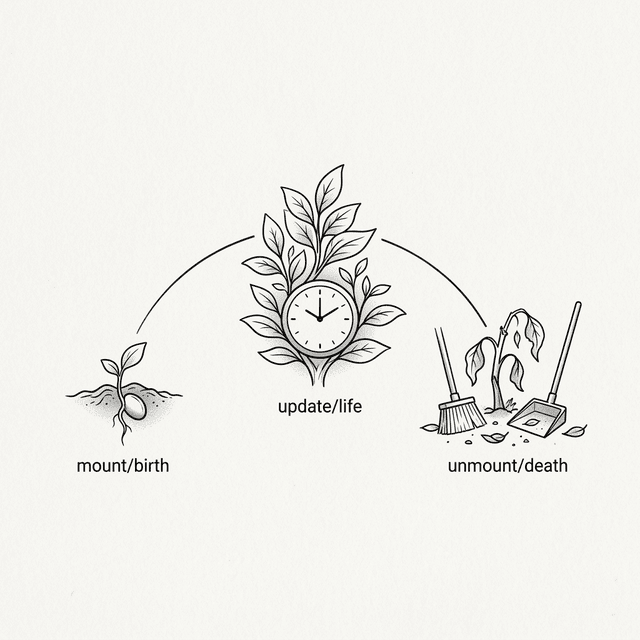

# 第七章：クラスコンポーネントとライフサイクル (Class Components & Lifecycle)



## 7.1 コンポーネントに記憶を授ける

ポーは前章のコンポーネントを使ってタイマーを作ろうとしたが、すぐに壁にぶつかった。

**🐼**：師父、1秒ごとに数字が増えるタイマーコンポーネントを作りたいのですが、今のコンポーネントには「記憶」がないことに気づきました。Props は外から渡されるもので、コンポーネント自身が自分のデータを保存したり変更したりする手段がありません。

**🧙‍♂️**：フレームワークが登場する前、開発者たちはすでに様々な方法でコンポーネントに記憶を持たせようとしていた。お前ならどうする？

**🐼**：もしそれが普通のクラス (class) なら、一番自然なのは **クラスのインスタンス属性 (instance properties) に保存する** ことではないでしょうか？ 例えばインスタンスに `this._count = 0` を追加して、カウントアップが必要なときに `this._count++` するとか。

**🧙‍♂️**：そうだ。それはオブジェクト指向プログラミングにおける標準的なやり方だ。だが、それによって新しい問題が生じる。 `this._count++` を実行したあと、コンソールの中の数字は変わるが、画面上の数字は変わるか？

**🐼**：変わりません。データを修正しただけで、DOM を更新するコードをまだ書いていませんから。まさか、また手動で `document.getElementById('counter').innerText = this._count` のようなコードを呼び出さなきゃいけないのですか？

**🧙‍♂️**：それこそが初期のフロントエンド開発の痛みだったのだ。データが変わるたびに、手動で対応する DOM ノードを探して修正しなければならなかった。状態が増えれば増えるほど、どこかの DOM の更新を忘れたり、間違えたりしやすくなる。

**🐼**：それはあまりに過酷です。フレームワークに肩代わりしてもらう必要がありますね。コンポーネントのデータが変化したとき、UI は自動的に再レンダリングされるべきです。

**🧙‍♂️**：その通りだ。フレームワークがデータの変化を「感知」できるようにするために、もはや単純に直接 `this._count` を修正してはならん。 **State** を導入する必要がある。お前は State と Props の違いは何だと思う？

**🐼**： **Props** はコンポーネントの **外部引数** のようなもので、親コンポーネントから渡され制御される、現在のコンポーネントが直接変更すべきではないもの。対して **State** はコンポーネントの **内部の記憶** であり、コンポーネント自身が所有するデータ、ということですね。

## 7.2 `setState` の実装

**🧙‍♂️**：正確だ。コンポーネント内部の State が変化したとき、UI は自動的に更新されるべきだ。仮に `setState` という API を提供するとして、それを使って状態をどう更新すべきだと思う？

**🐼**：こうあるべきだと思います。 `this.setState({ count: 1 })` を呼び出すと、コンポーネント内部で新旧の状態がマージされ、それから自動的に再レンダリングがトリガーされる、と。

**🧙‍♂️**：よろしい。では、その API を実装してみよう。 `setState` の内部ロジックを書くとしたら、どのような手順が必要になると思う？

**🐼**：まず間違いなく、渡された新しい状態と古い状態をマージして `this.state` に保存することです。次に……画面を更新する必要があるので、 `this.render()` を呼び出して新しい VNode ツリーを生成するのでしょうか？

**🧙‍♂️**：続けろ。新しい VNode ツリーを生成したあとは？

**🐼**：それから古い VNode ツリーを取得し、前章で書いた `patch(oldVNode, newVNode)` を呼び出して比較を行い、実際の DOM を更新します。

**🧙‍♂️**：ロジックは非常に明快だ。コードにしてみろ。

**🐼**：わかりました。 `Component` 基底クラスにこれらのロジックを追加します：

```javascript
class Component {
  constructor(props) {
    this.props = props || {};
    this.state = {};
  }

  setState(newState) {
    // 1. 状態をマージ（浅いコピー）
    this.state = Object.assign({}, this.state, newState);
    // 2. 更新をトリガー
    this._update();
  }

  _update() {
    const oldVNode = this._vnode;
    const newVNode = this.render();
    patch(oldVNode, newVNode);
    // 3. 新しい VNode を覚えておく
    this._vnode = newVNode;
  }

  render() {
    throw new Error('Component must implement render()');
  }
}
```

**🧙‍♂️**：これでお前がこれまで積み上げてきた成果がすべて繋がった： `setState` → `render()` → `patch()` → 変化した DOM の更新だ。

> 💡 **簡略化のための補足：同期 vs バッチ処理**
>
> この簡易版の `setState` は **同期** 的だ。つまり、呼び出すたびに即座に再レンダリングがトリガーされる。しかし本物の React の `setState` は **バッチ処理 (Batching)** を行う。一つのイベントハンドラ内で `setState` が複数回連続で呼ばれても、React はそれらをマージして **一度だけ** の再レンダリングに留めるのだ。
>
> ```javascript
> // バッチ処理がない場合、以下の二行は二回のレンダリングをトリガーする：
> this.setState({ a: 1 });  // レンダリング #1
> this.setState({ b: 2 });  // レンダリング #2
>
> // バッチ処理を行う React は、それらを { a: 1, b: 2 } にマージし、一度だけレンダリングする
> ```
>
> これは React の核心的なパフォーマンス最適化の一つだ。

## 7.3 ライフサイクル (Lifecycle)

**🐼**： `setState` があれば、タイマーの数字を更新できそうです。でも実用上の問題にぶつかりました。 `setInterval` を使って1秒ごとに `setState` を呼び出す必要があるのですが、その `setInterval` はどこに書けばいいのでしょうか？

**🧙‍♂️**： `render()` の中に書くのはどうだ？

**🐼**：ダメです。再レンダリングのたびに `render()` が呼ばれるので、新しいタイマーが次々と作られて収拾がつかなくなります。 `constructor` の中も違いますね。その時点ではまだコンポーネントはページにマウントされていませんから。

**🧙‍♂️**：そうだ。 `setState` は「どう更新するか」を解決したが、お前には「いつ開始するか」というタイミングが欠けている。 `setInterval` はコンポーネントが DOM にマウントされた **あと** に起動させる必要がある。

**🐼**：待ってください、もう一つ思いつきました。もしユーザーがページを切り替えて、このタイマーコンポーネントが DOM から削除されたとしても、 `setInterval` は裏で動き続けますよね。存在しないコンポーネントの `setState` を呼び出し続けることになり、メモリリークの原因になります。

**🧙‍♂️**：非常に鋭いな。だから、「コンポーネントがマウントされた」というタイミングだけでなく、他に何が必要だ？

**🐼**： 「コンポーネントが削除される直前」というタイミングが必要です。そこでタイマーやその他の副作用をクリーンアップできるように。

**🧙‍♂️**：それが **ライフサイクルメソッド (Lifecycle Methods)** だ。一般的にそれらは `componentDidMount` と `componentWillUnmount` と呼ばれている。

**🐼**：なるほど。では、コンポーネントをマウントする際にそれを呼び出す必要がありますね。前章の `mount` 関数を修正してみます：

```javascript
// mount の中で、コンポーネントをマウントした後に componentDidMount を呼び出す
function mount(vnode, container) {
  // ... 他のロジック ...

  if (typeof vnode.tag === 'function') {
    const instance = new vnode.tag(vnode.props);
    vnode._instance = instance;
    const subTree = instance.render();
    instance._vnode = subTree;
    mount(subTree, container);
    vnode.el = subTree.el;

    // 🆕 コンポーネントがマウントされたのでライフサイクルをトリガー
    if (instance.componentDidMount) {
      instance.componentDidMount();
    }
    return;
  }

  // ... 普通のノードのロジック ...
}
```

> 💡 **簡略化のための補足： `componentWillUnmount` は自動で呼ばれない**
>
> この簡易版では `componentDidMount` は実装したが、 **`componentWillUnmount` は自動的には呼ばれない**。コンポーネントが `patch` によって置換される際、私たちは単純に `replaceChild` を行っているだけで、古いコンポーネントのクリーンアップ関数を呼び出していないからだ。デモをシンプルに保つため、この段階では実装を見送ることにする。

## 7.4 `this` の罠

**🐼**：師父、さっそくタイマーコンポーネントを書いてみます！

```javascript
class Timer extends Component {
  constructor(props) {
    super(props);
    this.state = { seconds: 0 };
  }

  componentDidMount() {
    this.timerId = setInterval(function() {
      this.setState({ seconds: this.state.seconds + 1 });
    }, 1000);
  }

  componentWillUnmount() {
    clearInterval(this.timerId);
  }

  render() {
    return h('div', null, [
      h('h2', null, ['Timer: ' + this.state.seconds + 's'])
    ]);
  }
}
```

**🧙‍♂️**：実行する前に予想してみろ。 `setInterval` のコールバックが1秒ごとに実行されるとき、その中の `this` は何を指していると思う？

**🐼**： `componentDidMount` の中に書いていますし、これはコンポーネントのメソッドですから、 `this` は当然コンポーネントのインスタンスですよね？

**🧙‍♂️**：試してみるがいい。

ポーがコードを実行すると、コンソールには赤いエラーが表示された： `TypeError: this.setState is not a function` 。

**🐼**：ええっ？！ なぜ `this` がコンポーネントインスタンスじゃないのですか？ `this.setState` が undefined になるなんて。

**🧙‍♂️**：JavaScript で最もハマりやすい落とし穴、 **`this` バインディング (this binding)** へようこそ。 `this` の値は関数が定義されたときではなく、関数が **呼び出されたとき** に決まるのだ。

**🐼**：つまり、 `setInterval` が私のコールバックを呼び出すとき、それをただの普通の関数として扱ったので、 `this` がグローバルオブジェクトである `window` になってしまった、ということですか？

**🧙‍♂️**：その通り。さて、どうやって修正する？

**🐼**： `this` を一旦変数に保存しておくことができますね（ `const self = this;` ）。あるいは `.bind(this)` を使って固定するとか。でも一番簡単なのは **アロー関数** を使うことだと思います。アロー関数は独自の `this` を持たず、外側のスコープの `this` をそのまま引き継ぎますから。

```javascript
  componentDidMount() {
    this.timerId = setInterval(() => {
      this.setState({ seconds: this.state.seconds + 1 });
    }, 1000);
  }
```

**🧙‍♂️**：よろしい。アロー関数は「ここでの `this` は一体何を指しているのか」という問題を根本から解消してくれる。クラスコンポーネントの時代、 `this` のバインディング問題は最もありふれたバグの原因だったのだ。

**🐼**：言語の仕組みによる複雑さに悩まされるのは本当に頭が痛いです。実現したいビジネスロジックとは何の関係もないことなのに。

**🧙‍♂️**：それは **付随的複雑性 (Accidental Complexity)** と呼ばれている。これが後に、React を別のコンポーネント形態へと向かわせる大きな要因となったのだ。

## 7.5 無駄を省く：shouldComponentUpdate

**🧙‍♂️**：タイマーが動くようになったところで、別のシナリオを考えてみよう。もし親コンポーネントが再レンダリングされたが、子コンポーネントに渡される Props が全く変わっていなかったら、子コンポーネントはどうなると思う？

**🐼**：今の私たちの `patch` ロジックだと……親コンポーネントが再レンダリングされるたびに、Props が変わったかどうかにかかわらず、子コンポーネントの `render()` が呼び出されますね。

**🧙‍♂️**：もしこれが100個の子コンポーネントを持つリストで、3番目のデータだけが変わったとしたら？

**🐼**：100個すべてのコンポーネントが `render()` を再実行してしまいます。それはパフォーマンスの無駄遣いです！ コンポーネント自身が更新すべきかどうかを判断できる仕組みが必要です。

**🧙‍♂️**：そうだ。コンポーネントに「門番」のようなメソッド、例えば `shouldComponentUpdate` を追加しよう。これをどのタイミングで実行すべきだと思う？

**🐼**：実際に `render()` を呼び出す **直前** でしょうね。コンポーネントノードの更新を処理する `patch` の分岐の中で、まずコンポーネントに更新が必要か尋ねる。不要であれば、そのまま古い DOM を再利用すればいい。

```javascript
// アップグレードされた patch (shouldComponentUpdate のチェックを追加)
if (oldVNode.tag === newVNode.tag) {
  const instance = (newVNode._instance = oldVNode._instance);
  const nextProps = newVNode.props;
  const nextState = instance.state;

  // 🆕 コンポーネントに尋ねる：更新する必要がありますか？
  if (instance.shouldComponentUpdate &&
      !instance.shouldComponentUpdate(nextProps, nextState)) {
    // コンポーネントが「更新不要」と言ったので render をスキップ
    instance.props = nextProps;
    newVNode.el = oldVNode.el;
    newVNode._instance = instance;
    return;
  }

  instance.props = nextProps;
  const oldSub = instance._vnode;
  const newSub = instance.render();
  instance._vnode = newSub;
  patch(oldSub, newSub);
  newVNode.el = newSub.el;
}
```

**🧙‍♂️**：正確だ。注意してほしいのだが、レンダリングをスキップしたとしても、依然として `instance.props` を `nextProps` で更新しておく必要がある。なぜだかわかるか？

**🐼**：もしその後、コンポーネント自身の `state` が変化して `setState` がトリガーされたとき、 `render` で最新の `this.props` を読み取る必要があるからです。そうしないとデータが古くなってしまいます。

**🧙‍♂️**：その通りだ。後の `React.PureComponent` や `React.memo()` はこのパターンをカプセル化したもので、Props の浅い比較 (Shallow Comparison) を自動的に行い、不必要なレンダリングをブロックしてくれる。

## 7.6 神コンポーネントの苦境

**🧙‍♂️**：今のクラスコンポーネントは、機能的にかなり完成されているように見える。だが、アプリが大きくなるにつれ、お前はこのようなコードを書くことになるかもしれない：

```javascript
class Dashboard extends Component {
  constructor(props) {
    super(props);
    this.state = { users: [], notifications: [], windowWidth: 0 };
  }

  componentDidMount() {
    this.fetchUsers();
    window.addEventListener('resize', this.handleResize);
    this.ws = new WebSocket('...');
    this.ws.onmessage = (e) => { /* 通知を処理 */ };
  }

  componentWillUnmount() {
    window.removeEventListener('resize', this.handleResize);
    this.ws.close();
  }

  // ... 他にも様々なメソッド ...
}
```

**🐼**：これはもう、ごった煮ですね。ユーザーデータ、ウィンドウサイズ、WebSocket の通知を一手に引き受けて管理しています。

**🧙‍♂️**：どこに問題があるか見えるか？ `componentDidMount` と `componentWillUnmount` の中身を見てみろ。

**🐼**：関連するロジックがバラバラに引き裂かれています！ WebSocket の接続と切断が、それぞれ別のライフサイクルメソッドに分かれています。逆に `componentDidMount` の中には、全く関係のない初期化ロジックが詰め込まれています。

**🧙‍♂️**：そうだ。クラスコンポーネントは **時点 (Timing)** によってロジックを整理しているのだ——「マウント時に何をすべきか」「アンマウント時に何をすべきか」。だが、人間の思考は本来 **関心事 (Concerns)** ごとに整理されるべきだ——「データ取得に関するコード」「WebSocket に関するコード」。

**🐼**：コンポーネントが複雑になればなるほど、コードが断片化していくのですね。これは解決できるのでしょうか？

**🧙‍♂️**：クラスコンポーネントにおいてロジックの再利用と分割を解決するために、高階コンポーネント (HOC) や Render Props といったパターンが発明された。だが、それらはまた新しい問題を引き起こした。真の打開策は、そう遠くない未来に現れる。

---

> 💡 **少し深掘り：親子 VNode の参照問題**
>
> コンポーネントが `setState` を呼び出すと、我々の `_update` はコンポーネント内部の `_vnode` を更新する。しかし、 **親コンポーネント** の VNode ツリーは依然として古い子ツリーの参照を持ち続けている。つまり、もし親コンポーネントがその後に再レンダリングを行うと、古いツリーとの比較が行われる可能性がある。我々のデモの範囲内では、子コンポーネントの状態変化によって親が再レンダリングされることはないので問題にはならない。これは簡易実装における境界条件の一つだが、本物の React は Fiber ツリーのダブルバッファリング機構によってこの問題を解決している。これについては後の章で触れることにしよう。

---

### 📦 やってみよう

以下のコードを `ch07.html` として保存し、クラスコンポーネント内部で `setState` を使って自身の状態を管理し、ライフサイクルを利用して安全に副作用を実行する様子を体験してみよう：

```html
<!DOCTYPE html>
<html lang="ja">
<head>
  <meta charset="UTF-8">
  <title>Chapter 7 — Class Components & Lifecycle</title>
  <style>
    body { font-family: sans-serif; padding: 20px; }
    .card { border: 1px solid #ddd; border-radius: 8px; padding: 15px; margin: 15px 0; }
    button { padding: 6px 12px; cursor: pointer; margin: 4px; }
    .timer { font-size: 48px; font-weight: bold; color: #333; }
    .info { color: #666; font-size: 13px; margin-top: 10px; }
  </style>
</head>
<body>
  <div id="app"></div>

  <script>
    // === Mini-React Engine (累積) ===

    function h(tag, props, children) {
      return { tag, props: props || {}, children: children || [] };
    }

    class Component {
      constructor(props) {
        this.props = props || {};
        this.state = {};
      }
      setState(newState) {
        this.state = Object.assign({}, this.state, newState);
        this._update();
      }
      _update() {
        if (!this._vnode) return;
        const oldVNode = this._vnode;
        const newVNode = this.render();
        patch(oldVNode, newVNode);
        this._vnode = newVNode;
      }
      render() { throw new Error('Must implement render()'); }
    }

    function mount(vnode, container) {
      if (typeof vnode === 'string' || typeof vnode === 'number') {
        container.appendChild(document.createTextNode(vnode));
        return;
      }
      if (typeof vnode.tag === 'function') {
        const instance = new vnode.tag(vnode.props);
        vnode._instance = instance;
        const subTree = instance.render();
        instance._vnode = subTree;
        mount(subTree, container);
        vnode.el = subTree.el;
        if (instance.componentDidMount) instance.componentDidMount();
        return;
      }
      const el = (vnode.el = document.createElement(vnode.tag));
      for (const key in vnode.props) {
        if (key.startsWith('on')) {
          el.addEventListener(key.slice(2).toLowerCase(), vnode.props[key]);
        } else {
          if (key === 'className') el.setAttribute('class', vnode.props[key]);
          else if (key === 'style' && typeof vnode.props[key] === 'string') el.style.cssText = vnode.props[key];
          else el.setAttribute(key, vnode.props[key]);
        }
      }
      if (typeof vnode.children === 'string') {
        el.textContent = vnode.children;
      } else {
        (vnode.children || []).forEach(child => {
          if (typeof child === 'string' || typeof child === 'number')
            el.appendChild(document.createTextNode(child));
          else mount(child, el);
        });
      }
      container.appendChild(el);
    }

    function patch(oldVNode, newVNode) {
      if (typeof newVNode.tag === 'function') {
        if (oldVNode.tag === newVNode.tag) {
          const instance = (newVNode._instance = oldVNode._instance);
          const nextProps = newVNode.props;
          const nextState = instance.state;
          if (instance.shouldComponentUpdate &&
              !instance.shouldComponentUpdate(nextProps, nextState)) {
            instance.props = nextProps;
            newVNode.el = oldVNode.el;
            newVNode._instance = instance;
            return;
          }
          instance.props = nextProps;
          const oldSub = instance._vnode;
          const newSub = instance.render();
          instance._vnode = newSub;
          patch(oldSub, newSub);
          newVNode.el = newSub.el;
        } else {
          const parent = oldVNode.el.parentNode;
          mount(newVNode, parent);
          parent.replaceChild(newVNode.el, oldVNode.el);
        }
        return;
      }
      if (oldVNode.tag !== newVNode.tag) {
        const parent = oldVNode.el.parentNode;
        const tmp = document.createElement('div');
        mount(newVNode, tmp);
        parent.replaceChild(newVNode.el, oldVNode.el);
        return;
      }
      const el = (newVNode.el = oldVNode.el);
      const oldP = oldVNode.props || {}, newP = newVNode.props || {};
      for (const key in newP) {
        if (oldP[key] !== newP[key]) {
          if (key.startsWith('on')) {
            const evt = key.slice(2).toLowerCase();
            if (oldP[key]) el.removeEventListener(evt, oldP[key]);
            el.addEventListener(evt, newP[key]);
          } else {
            if (key === 'className') el.setAttribute('class', newP[key]);
            else if (key === 'style' && typeof newP[key] === 'string') el.style.cssText = newP[key];
            else el.setAttribute(key, newP[key]);
          }
        }
      }
      for (const key in oldP) {
        if (!(key in newP)) {
          if (key.startsWith('on')) el.removeEventListener(key.slice(2).toLowerCase(), oldP[key]);
          else if (key === 'className') el.removeAttribute('class');
          else if (key === 'style') el.style.cssText = '';
          else el.removeAttribute(key)
        }
      }
      const oldChildren = oldVNode.children || [];
      const newChildren = newVNode.children || [];
      if (typeof newChildren === 'string') {
        if (oldChildren !== newChildren) el.textContent = newChildren;
      } else if (typeof oldChildren === 'string') {
        el.textContent = '';
        newChildren.forEach(c => mount(c, el));
      } else {
        const commonLength = Math.min(oldChildren.length, newChildren.length);
        for (let i = 0; i < commonLength; i++) {
          const oldChild = oldChildren[i], newChild = newChildren[i];
          if (typeof oldChild === 'string' && typeof newChild === 'string') {
            if (oldChild !== newChild) el.childNodes[i].textContent = newChild;
          } else if (typeof oldChild === 'object' && typeof newChild === 'object') {
            patch(oldChild, newChild);
          } else {
            if (typeof newChild === 'string' || typeof newChild === 'number') {
              el.replaceChild(document.createTextNode(newChild), el.childNodes[i]);
            } else {
              const tmp = document.createElement('div');
              mount(newChild, tmp);
              el.replaceChild(newChild.el, el.childNodes[i]);
            }
          }
        }
        if (newChildren.length > oldChildren.length) newChildren.slice(oldChildren.length).forEach(c => mount(c, el));
        if (newChildren.length < oldChildren.length) {
          for (let i = oldChildren.length - 1; i >= commonLength; i--) el.removeChild(el.childNodes[i]);
        }
      }
    }

    // === ライフサイクルを持つタイマーコンポーネント ===

    class Timer extends Component {
      constructor(props) {
        super(props);
        this.state = { seconds: 0 };
      }

      componentDidMount() {
        // ✅ アロー関数を使用して this の問題を解決！
        this.timerId = setInterval(() => {
          this.setState({ seconds: this.state.seconds + 1 });
        }, 1000);
      }

      // ⚠️ この簡易エンジンではこのメソッドは自動的に呼ばれませんが、ベストプラクティスとして示します
      componentWillUnmount() {
        clearInterval(this.timerId);
      }

      render() {
        const color = this.state.seconds % 2 === 0 ? '#333' : '#0066cc';
        return h('div', { className: 'card' }, [
          h('div', { className: 'timer', style: 'color:' + color }, [
            String(this.state.seconds) + 's'
          ]),
          h('p', { className: 'info' }, [
            'このタイマーは setState + patch を使用しています。ページ全体ではなく、数字の部分だけが更新されます。'
          ]),
          h('p', { className: 'info' }, [
            'componentDidMount → setInterval を開始 | componentWillUnmount → クリア'
          ])
        ]);
      }

    }

    // === shouldComponentUpdate デモ ===

    // 親コンポーネント：プロパティの変化をシミュレートするため、1秒ごとに再レンダリングを行う
    class Parent extends Component {
      constructor(props) {
        super(props);
        this.state = { tick: 0, important: 0 };
      }
      componentDidMount() {
        this._id = setInterval(() => {
          this.setState({ tick: this.state.tick + 1 });
        }, 1000);
      }
      componentWillUnmount() { clearInterval(this._id); }
      render() {
        return h('div', { className: 'card' }, [
          h('p', { className: 'info' }, [
            '親の tick: ' + this.state.tick + ' (1秒ごとに再レンダリングされます)'
          ]),
          h('button', { onclick: () => this.setState({ important: this.state.important + 1 }) }, [
            '重要なプロパティを変更 (' + this.state.important + ')'
          ]),
          h(Child, { important: this.state.important, tick: this.state.tick })
        ]);
      }
    }

    // 子コンポーネント："important" プロパティが変化したときだけ再レンダリングし、"tick" は無視する
    class Child extends Component {
      constructor(props) {
        super(props);
        this._renderCount = 0;
      }
      shouldComponentUpdate(nextProps, nextState) {
        // "tick" だけが変化した場合は再レンダリングをスキップする
        return nextProps.important !== this.props.important;
      }
      render() {
        this._renderCount++;
        return h('div', { style: 'margin-top:8px; padding:8px; background:#f0f8ff; border-radius:4px;' }, [
          h('p', { className: 'info' }, [
            '✅ 子のレンダリング回数: ' + this._renderCount +
            ' (shouldComponentUpdate が tick のみの更新をブロックしています)'
          ]),
          h('p', null, ['important = ' + this.props.important])
        ]);
      }
    }

    // === アプリのマウント ===

    const appVNode = h('div', null, [
      h('h1', null, ['Class Components & Lifecycle']),
      h(Timer, null),
      h('h2', null, ['shouldComponentUpdate Demo']),
      h(Parent, null)
    ]);

    mount(appVNode, document.getElementById('app'));
  </script>
</body>
</html>
```
