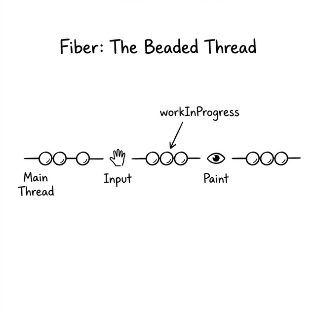
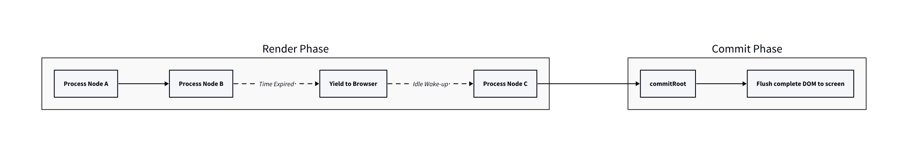
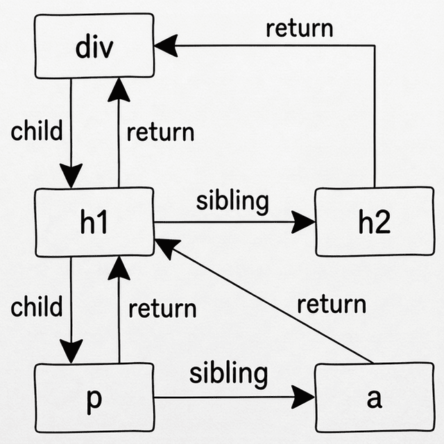

# 第十章：Fiber アーキテクチャ —— 新しいメンタルモデルの構築 (The Fiber Architecture: Mental Model)



## 10.1 メインスレッドの危機

ポーは前章で残された難題に向き合っていた。JavaScript の生の関数コールスタックは、一度再帰が始まると中断することができない。もし仮想 DOM ツリーに 10,000 個のノードがあれば、メインスレッドは何百ミリ秒もロックされてしまう。

**🧙‍♂️**：第五章で書いた `patch` 循環を覚えているか？

```javascript
// かつての古いコード：
for (let i = 0; i < children.length; i++) {
  patch(oldChild[i], newChild[i]);  // 深さ優先の再帰呼び出し
}
```

ここでは、どこまで探索したかを覚えるために JavaScript エンジンの「コールスタック」に依存していた。子ノードを処理するために `patch` を再帰的に呼び出すとき、エンジンは舞台裏で「子ノードの処理が終わったら、前の親ノードのループに戻って、次の兄弟ノードの処理を続けなければならない」ということを覚えておいてくれる。

**🐼**：はい。エンジンのコールスタックに依存しているからこそ、エンジンに対して「ちょっと待って、後でまた戻ってくるから」と言うことができないのですね。JavaScript エンジンを止めることができない以上、唯一の方法は——**エンジンに覚えさせるのをやめて、自分でどこまで進んだかを記録するコードを書くこと**ですね。

**🧙‍♂️**：正確な洞察だ。だが、それは単なる「どう記録するか」という問題ではない。レンダリングエンジンの動作方式そのものを根本から再構築する必要がある。コードを書く前に、まずは新しいエンジンの全体的な青写真を脳内に描き出そう。

## 10.2 大戦略：タイムスライシングと二つのフェーズ

**🧙‍♂️**：仮に、レンダリング作業をいつでも中断・再開できる魔法を手に入れたとしよう。今決めなければならないのは、 **「いつ中断すべきか？」** ということだ。

**🐼**：それはもちろん、ブラウザが忙しいときです！ ユーザーがタイピングしたり画面をスクロールしたりしているなら、一旦作業を止めて、メインスレッドをブラウザに譲ってユーザーの操作を優先させるべきです。ブラウザが暇になったら、また続きを始めればいい。

**🧙‍♂️**：よろしい。ブラウザは `requestIdleCallback` という API を提供している。これはブラウザが毎フレームのレイアウトと描画を終えた後、もし空き時間があれば、私たちを呼び起こして仕事をさせてくれるものだ。これを **タイムスライシング (Time Slicing)** と呼ぶ。

**🐼**：素晴らしい！ ならば、巨大なツリーをレンダリングするというタスクを小さな仕事に切り分けて、 `requestIdleCallback` で呼ばれるたびにいくつかのノードを処理し、時間をチェックして、時間がなくなったら再び制御権を返せばいいわけですね。

**🧙‍♂️**：完璧に聞こえるな。だが、この場面を想像してみろ。もし巨大なツリーの半分だけがレンダリングされた状態で時間が尽き、作業を中断したとする。その瞬間、ユーザーの画面には何が表示されていると思う？

**🐼**：ええと……ユーザーには、新しいページの上の半分だけが表示されていて、下の半分は古いままという、中途半端な画面が見えてしまいます！ あるいは、そもそも不完全なページかもしれません。それは絶対にダメです！

**🧙‍♂️**：その通りだ。それは、画家が肖像画を描いている途中で、何度もカーテンを開けて観客に見せるようなものだ。体験としては最悪だろう。正しいやり方は、舞台裏で絵をすべて描き上げ、準備が整った瞬間に「バッ」とカーテンを開けることだ。

**🐼**：つまり、仕事を二つに分ける必要があるのですね。前半部分は舞台裏でこっそり行い、いつでも中断できるようにする。後半部分は一気に画面に反映させ、決して中断されないようにする！

**🧙‍♂️**：非常によくまとまっている。それが現代の React アーキテクチャを構成する、鮮明に分かれた二つのフェーズだ：
1. **Render Phase (レンダリングフェーズ)**： メモリ内で一歩ずつツリーを構築し、すべての変更点を収集する。このフェーズは中断可能である。
2. **Commit Phase (コミットフェーズ)**： Render Phase が完了したら、収集したすべての変更を一気に実際の DOM に同期させる。このフェーズは中断不可である。



## 10.3 ダブルバッファリング：下書きと完成図

**🐼**： Render Phase が「舞台裏でこっそり行う」ものだとして、その長い作業の間、ページ上には何が表示されているのですか？ もしその間に「更新」が発生したら、どう処理すればいいのでしょう？

**🧙‍♂️**：良い質問だ。そこで次の核心的な概念が登場する。お前が建築家だと想像してみろ。お前の前には一枚の **「完成図」** がある。それは建物の現在の姿、つまりユーザーが今この瞬間に画面で見ているものを表している。

今、クライアントから電話がかかってきて、「三階の窓をもっと大きくしてくれ」と言われたとする。お前ならどうする？

**🐼**：元の図面を直接書き換えることはしません。途中で会議に呼ばれたりして描きかけのまま放置したら、図面が台無しになってしまいますから。私なら **新しい下書き用紙** を取り出して、元の図面を参照しながら、一階ずつ新しい図面を描いていきます。三階に来たときに窓を大きく描き、他の階は元の図面をそのまま写します。

**🧙‍♂️**：全くその通りだ。私たちはそれを表すために、二つのグローバル変数を使う：
- `currentRoot`： **完成図**（現在画面に表示されているツリー）。
- `wipRoot` (Work In Progress Root)： **下書き用紙**（メモリ内で構築中の新しいツリー）。

```
完成図 (currentRoot)             下書き用紙 (wipRoot)
┌────────────┐                 ┌────────────┐
│  1階: 変更なし │  ──そのまま写す─→  │  1階: 同上    │
│  2階: 変更なし │  ──そのまま写す─→  │  2階: 同上    │
│  3階: 窓を修正 │  ──修正して描く─→ │  3階: 大きい窓 │
└────────────┘                 └────────────┘
```

下書きをすべて描き終えたら、「バッ」と新しい図面を古いものと置き換える（Commit Phase）。これはコンピュータグラフィックスの世界で有名な **ダブルバッファリング (Double Buffering)** という技術だ。

**🐼**：つまり下書きを描いている間（Render Phase）は、常に元の図面（ `currentRoot` ）を見て、どこが変わったか比較し続ける必要があるのですね。

**🧙‍♂️**：そうだ。比較を容易にするために、新しい下書き上の各ノードには **`alternate`** （代役）というポインタを持たせ、元の図面上の同じ位置にある古いノードを指し示すようにする。これが新旧ノード間の架け橋になるのだ。

## 10.4 束縛からの脱却：Fiber 連結リスト

**🧙‍♂️**：さて、「タイムスライシング」の大きなリズムができ、「ダブルバッファリング」の仕事モードも決まった。最後のパズルは—— 10.1 の問いに戻るぞ： **いつでも中断可能な探索用データ構造を、どう構築するか？**

以前の仮想 DOM では、典型的な「ツリー (Tree)」構造を使っていたな。一つのノードが `children` 配列を持っている、という形だ。この構造は再帰には適しているが、いつでもどこでも中断するのには向いていない。必要なのは、「今どのノードを処理しているか」、そしてそのノードを処理し終えたら「 **次の一歩** はどこへ行くべきか」を明確に示せる構造だ。

**🐼**：そのために、ツリーをどう改造すればいいのですか？

**🧙‍♂️**：React チームは、単独の探索入り口としての `children` 配列を捨て去った。代わりに、各ノードに三つの重要なナビゲーションポインタを追加したのだ：

- **`child`**： そのノードの **最初の** 子ノードを指す。
- **`sibling`**： そのノードの **すぐ右隣にある** 兄弟ノードを指す。
- **`return`**： そのノードの **親ノード** を指す（処理が終わったら親に「戻る」ため）。

この三つのナビゲーションポインタを持つ、全く新しいノードデータ構造が **Fiber** だ。次のような HTML を想像してみろ：

```html
<div>
  <h1>
    <p></p>
    <a></a>
  </h1>
  <h2></h2>
</div>
```

これを Fiber 構造に変換すると、それはもはやツリーではなく、ポインタによって連結されたネットワーク（単方向連結リスト）になるのだ：



**🐼**：すべてのノードが線で繋がっていますね。この三つのポインタがあれば、たとえある瞬間に中断したとしても、次にどこへ行けばいいのかが常に分かります。

**🧙‍♂️**：その通りだ。お前なら、この「道探し」の探索ルールをどう設計する？ できるだけ早く最も深いノードの構造を確定させるために、深い方へと優先的に進むべきだ。

**🐼**：深い方へ優先的に進むなら……ルール1は「もし `child`（長男）がいれば、次は `child` へ行く」ですね。

**🧙‍♂️**：そうだ。もし行き止まりになって、子ノードがいなくなったら？

**🐼**：横へ移動します。ルール2は「 `child` がいなければ、 `sibling`（すぐ右の兄弟）へ行く」です。

**🧙‍♂️**：もし `sibling` すらいなかったら——つまりその家の末っ子で、父親の子供をすべて探索し終えたということだ。そのときはどこへ行く？

**🐼**：父親の方の仕事はすべて終わったわけですから…… `return` を通じて父親の兄弟、つまり「おじさん」を探しに行けばいいですね！ もし父親にも兄弟がいなければ、さらに上へと辿って、おじいさんの兄弟を探し、最終的にルートに戻るまで繰り返します。

**🧙‍♂️**：筋道は通っている。これこそが Fiber アーキテクチャの最も核心的な魔法だ。制御不能な **再帰コールスタック** を、いつでも自在に制御可能な **連結リストのループ探索** へと変えたのだ。まるで迷路の中を一歩ずつ進むポインタのように、私たちはいつでも立ち止まって他の用事を済ませることができる。

## 10.5 エンジンの青写真 (WorkLoop)

**🧙‍♂️**：最後に、今日構築した全体モデル（タイムスライシング、二つのフェーズ、探索用カーソル）をすべて繋ぎ合わせるコードを書いてみよう。これが新しいエンジンの「鼓動」となるメカニズム—— `workLoop` だ。

このループの中では、下書きツリー全体を表す `wipRoot` 以外に、 **`workInProgress`** というグローバル変数が必要になる。これは迷路の中を歩く「カーソル」の役割を果たし、現在処理している具体的なノードを記録するものだ。

```javascript
// ====== エンジンの状態 ======
let wipRoot = null;         // 構築中の下書きツリー（Render Phase の起点）
let workInProgress = null;  // 探索用カーソル。現在処理中の Fiber ノード

// ====== エンジンの鼓動 ======
function workLoop(deadline) {
  let shouldYield = false;
  
  // フェーズ 1：Render Phase (中断可能)
  // もしカーソルが最後まで到達しておらず、かつブラウザに空き時間があれば
  while (workInProgress && !shouldYield) {
    // 核心ロジック：一つのノードの処理を実行し、迷路の次のノードを返す
    workInProgress = performUnitOfWork(workInProgress);
    
    // ブラウザの時間がなくなりそうかチェック
    shouldYield = deadline.timeRemaining() < 1;
  }
  
  // フェーズ 2：Commit Phase (中断不可)
  // もしカーソルが最後まで到達し（下書きが完成し）、かつコミットを待つツリーがあれば
  if (!workInProgress && wipRoot) {
    commitRoot(); // 一気に実際の DOM に同期させ、currentRoot に引き継ぐ
  }

  // ブラウザに対して、次の空きフレームで再び自分を呼び起こすようリクエストする
  requestIdleCallback(workLoop);
}

// エンジンを始動
requestIdleCallback(workLoop);
```

**🐼**：おお、このコードは私たちがさっき話し合ったすべての概念を完璧に翻訳していますね！ `while` ループが Render Phase であり、 `shouldYield` がタイムスライシングによる譲歩を担当している。 `workInProgress` が `null` になって `while` ループが自然に終了した瞬間に、同期的な Commit Phase がトリガーされるのですね！

**🧙‍♂️**：その通りだ。この壮大な青写真において、残されたブラックボックスはあと二つだ：
1. `performUnitOfWork` の内部では、単一のノードをどう処理しているのか？ どうやって `alternate` と比較しながら新しい下書きを描いているのか？
2. `commitRoot` の内部では、どうやって下書きを一気にページに反映させているのか？

コードを書く準備はいいか、ポー？

**🐼**：その二つのブラックボックスを埋めるのが待ちきれません！

---

> ℹ️ **補足**：この章は Fiber の全体的なメンタルモデルを構築するためのものであり、単体で実行可能なデモはありません。次章ではコードでブラックボックスを埋め、完全に動作する Fiber エンジンを提供します。
