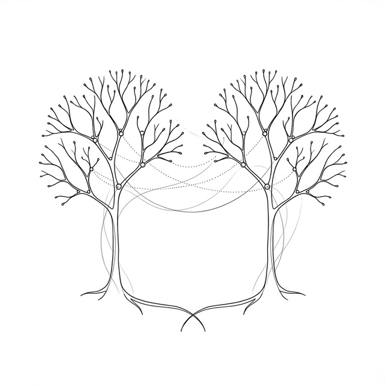

# 第十一章：調整とコミット —— エンジンの青写真を埋める (Fiber Reconciliation & Commit)



## 11.1 ノード形式の統一 (`h` 関数の改造)

**🧙‍♂️**：前章では、 Fiber エンジンの壮大な青写真を構築した。これからコードを書き、 `performUnitOfWork` と `commitRoot` という二つのブラックボックスを埋めていこう。だがその前に、エンジンに入力されるデータの形式が統一されていることを確認しておく必要がある。

**🐼**： `h()` 関数が生成する仮想 DOM ツリーのことですね？

**🧙‍♂️**：そうだ。旧エンジンでは、純粋なテキストはただの裸の文字列であることが多かった。だが Fiber エンジンでは、すべてのノードがオブジェクトであり、 `type` と `props` を持っていなければならん。もし探索アルゴリズムが `children` 配列を処理している最中に、突如として文字列にぶつかったら、連結リスト構造全体が崩壊してしまう。

**🐼**：では、文字列もオブジェクトで包む必要があるのですね？ 標準的な外殻を被せるように。

**🧙‍♂️**：その通りだ。 `h()` 関数を改造しよう。ついでに `.flat()` を使って入れ子の配列も処理できるようにしておく：

```javascript
function h(type, props, ...children) {
  return {
    type,
    props: {
      ...props,
      children: children.flat().map(child =>
        typeof child === "object"
          ? child
          // 形式を統一：オブジェクトでない子要素を特殊な TEXT_ELEMENT オブジェクトで包む
          : { type: "TEXT_ELEMENT", props: { nodeValue: child, children: [] } }
      ),
    },
  };
}
```

**🐼**：巧妙ですね！ `TEXT_ELEMENT` は私たち独自のタグというわけだ。これで全ノードが標準的なオブジェクトになり、Fiber 探索アルゴリズムは一律に `type` と `props` を読み取れるようになります。それにテキストノードは `children: []` を持っているので、それが末端のノード（葉ノード）であることが分かり、それ以上深く進むこともありません。

## 11.2 エンジン状態の初期化

**🧙‍♂️**：積み木は揃った。前章で触れたグローバル変数を、実際にコードに落とし込んでいこう。 `render` 関数が呼ばれるたびに、「新しい図面」の起草（Render Phase）が始まる。

```javascript
let currentRoot = null;    // 完成図（現在画面に表示されているツリー）
let wipRoot = null;        // 下書き用紙（構築中の新しいツリー）
let workInProgress = null; // 探索用カーソル
let deletions = null;      // ゴミ箱：比較プロセスで見つかった削除予定の旧ノードを収集する

function render(element, container) {
  // 1. 新しい下書き用紙のルートノードを作成
  wipRoot = {
    dom: container,
    props: { children: [element] },
    alternate: currentRoot,  // 👈 重要：alternate ポインタで旧完成図と繋ぐ
  };
  
  // 2. ゴミ箱を空にする
  deletions = [];
  
  // 3. カーソルを起点に置き、workLoop の稼働を待つ
  workInProgress = wipRoot;
}
```

**🐼**：前章で描いた図と全く同じですね！ 下書き用紙（ `wipRoot` ）が用意され、密かに元の図面（ `alternate` ）と繋がりました。

## 11.3 第一のブラックボックスを暴く：performUnitOfWork

**🧙‍♂️**：ブラウザが暇になると、 `workLoop` は `performUnitOfWork` を繰り返し呼び出す。この関数は呼ばれるたびに **一つのノード** だけを処理する。やるべきことは三つだ：

1. そのノードにまだ実際の DOM がなければ、それを作成する（ただしマウントはしない）。
2. **調整 (Reconcile)**： その子要素のために新しい Fiber ノードを作成し、古い図面と比較する。
3. 前章で決めた「迷ングルール」（下、右、上）に従って、次に処理すべきノードを返す。

```javascript
function performUnitOfWork(fiber) {
  // 1. DOM を作成（まだ下書き段階なので、ページにはマウントしない！）
  if (!fiber.dom) {
    fiber.dom = createDom(fiber);
  }

  // 2. 子ノードを調整（核心となるブラックボックスの中身）
  const elements = fiber.props.children;
  reconcileChildren(fiber, elements);

  // 3. 迷路のナビゲーションルール：次のノードを返す
  if (fiber.child) return fiber.child;
  let nextFiber = fiber;
  while (nextFiber) {
    if (nextFiber.sibling) return nextFiber.sibling;
    nextFiber = nextFiber.return;
  }
  return null;
}
```

**🐼**： `createDom` は簡単そうですね、 `type` に基づいて要素を作り属性を設定するだけでしょう？ 気になるのは第二ステップの `reconcileChildren` です。どうやって比較を行うのですか？

### 調整 (Reconciliation)：検査官の仕事

**🧙‍♂️**：お前が検査官になったと想像してみろ。 `reconcileChildren` 関数の中で、お前は左手に **新しい子要素のリスト** （さっき書いた `h()` 関数から来たもの）を持ち、右手に **旧図面の子連結リスト** （ `fiber.alternate.child` で取得したもの）を持っている。

お前は最初の子から始めて、左右を一つずつ同時に見比べていくのだ。

```
左手 = 下書きにある新しい要素    右手 = 完成図にある旧 Fiber (oldFiber)
```

もし左右のノードの `type` が同じ（例えばどちらも `h1` ）だと気づいたら、どうする？

**🐼**：タイプが同じなら、わざわざ `document.createElement` をやり直す必要はありませんね！ 旧 Fiber が持っているあの実際の DOM ノードをそのまま「拝借」して新しい下書きに載せ、変化した属性だけを更新すればいいはずです。

**🧙‍♂️**：完璧な直感だ。では `type` が違ったら？

**🐼**：それはもう古いものは使い物にならないということですから、新しく作り直す必要があります。

**🧙‍♂️**：その通り。 Render Phase では実際のページに触れてはならんので、検査官の仕事は **「付箋を貼る」** ことだけだ。新しく作成された Fiber ノードに `effectTag` （効果タグ）という属性を追加する：

- type が同じ： **`"UPDATE"`** という付箋を貼る。
- 新要素はあるが旧要素がない（または type が違う）： **`"PLACEMENT"`** という付箋を貼る（新規作成）。
- 余分な旧要素がある： それを `deletions` ゴミ箱に放り込み、 **`"DELETION"`** という付箋を貼る。

```javascript
function reconcileChildren(wipFiber, elements) {
  let index = 0;
  // 旧ツリーの対応する階層にある最初の子供（「右手」の起点）を取得
  let oldFiber = wipFiber.alternate && wipFiber.alternate.child;
  let prevSibling = null;

  // 新要素が終わるか、あるいは旧ノードが終わるまでループを続ける
  while (index < elements.length || oldFiber != null) {
    const element = elements[index];
    let newFiber = null;

    // タイプが同じか比較
    const sameType = oldFiber && element && element.type === oldFiber.type;

    if (sameType) {
      // ✅ type が同じ：旧 DOM を再利用し、UPDATE 付箋を貼る
      newFiber = {
        type: oldFiber.type,
        props: element.props,
        dom: oldFiber.dom,     // 👈 直接再利用！コストの高い DOM 作成を回避
        return: wipFiber,
        alternate: oldFiber,
        effectTag: "UPDATE",
      };
    }
    if (element && !sameType) {
      // 🆕 新要素を発見（または type が違う）：DOM を新規作成する必要あり。PLACEMENT 付箋を貼る
      newFiber = {
        type: element.type,
        props: element.props,
        dom: null,
        return: wipFiber,
        alternate: null,
        effectTag: "PLACEMENT",
      };
    }
    if (oldFiber && !sameType) {
      // 🗑️ 余分な旧ノード：対応する新要素がないため、削除が必要
      oldFiber.effectTag = "DELETION";
      deletions.push(oldFiber); // ゴミ箱へ。Commit Phase で一括処理する
    }

    // カーソルを進める：右手を次の旧ノードへ
    if (oldFiber) {
      oldFiber = oldFiber.sibling;
    }

    // 新しく生成した Fiber を連結リストとして繋ぐ
    if (index === 0) {
      wipFiber.child = newFiber;
    } else if (element) {
      prevSibling.sibling = newFiber;
    }
    prevSibling = newFiber;
    index++;
  }
}
```

**🐼**：わかりました！ `reconcileChildren` は子ノードを Fiber 連結リストに変換するだけでなく、ついでに新旧の比較まで終わらせてしまうのですね。しかもページに影響を与えるすべての操作は `effectTag` という小さな付箋として抽象化されている。 Render Phase は本当にただ「下書き」をしているだけで、何も起きていないのですね！

## 11.4 第二のブラックボックスを暴く：commitRoot

**🧙‍♂️**： `workInProgress` が `null` になったら、それは下書き用紙を最後まで描き終えたことを意味する。すべての付箋は貼り終えた。ここからは **Commit Phase (コミットフェーズ)** だ。このフェーズは同期的であり、一気に実行される。

**🐼**：つまり、付箋を見て仕事をする場所ですね。 `PLACEMENT` なら `appendChild` し、 `UPDATE` なら属性を書き換える。

**🧙‍♂️**：その通りだ。まずは `deletions` ゴミ箱にある削除タスクを片付け、それから新しい下書きツリー全体を探索して、すべての付箋の内容を実行していく。

```javascript
function commitRoot() {
  // 1. まずゴミ箱にあるノードをページから消し去る
  deletions.forEach(commitWork);
  
  // 2. 次に新しい下書きツリー上の新規作成と更新を処理する
  commitWork(wipRoot.child);
  
  // 3. 仕事完了！ 下書き用紙を新しい完成図として設定し、次回の更新に備える
  currentRoot = wipRoot;
  wipRoot = null;
}

function commitWork(fiber) {
  if (!fiber) return;

  // 実際の DOM を持っている親ノードを探す
  let domParentFiber = fiber.return;
  while (!domParentFiber.dom) {
    domParentFiber = domParentFiber.return;
  }
  const domParent = domParentFiber.dom;

  // 付箋に従って仕事をする
  if (fiber.effectTag === "PLACEMENT" && fiber.dom != null) {
    domParent.appendChild(fiber.dom);
  } else if (fiber.effectTag === "UPDATE" && fiber.dom != null) {
    updateDom(fiber.dom, fiber.alternate.props, fiber.props);
  } else if (fiber.effectTag === "DELETION") {
    commitDeletion(fiber, domParent);
    return; // ⚠️ 削除後は即座にリターン！ その子ノードを辿る必要はない
  }

  commitWork(fiber.child);
  commitWork(fiber.sibling);
}
```

**🐼**：なぜ削除操作の後は `return` して、探索を続けないのですか？

**🧙‍♂️**：木が根っこから切り倒されたなら、枝葉のことはもう気にしなくていいだろう。すでに削除された旧ノードの子ツリーを探索し続けるのは非常に危険だ。それらには前回の更新の古い付箋が残っている可能性があり、それが「ゾンビノード」を復活させてしまう原因になる。

**🐼**：なるほど！ あと `updateDom` と `createDom` ですが、これらは旧エンジン（第五章）で書いた、あの属性比較ロジックと同じですよね？ 追加された属性を見つけてセットし、なくなった属性を消し、イベントリスナーを特別に扱う、という。

**🧙‍♂️**：全くその通りだ。底レイヤーの DOM 操作には何の変化もない。 Fiber が変えたのは「いつ更新するか」（探索しながら更新するのをやめて、一括でコミットする）であって、「どう DOM を更新するか」ではないのだ。

## 11.5 時代の交代

**🐼**：師父、一つ一つ解き明かしていただいたおかげで、今、胸のすくような思いです。第五章から第十一章にかけて、私たちはエンジンの世代交代を自らの手で成し遂げたのですね。

**🧙‍♂️**：最後に表を使って、お別れの挨拶をしよう：

| 概念 | 旧エンジン (Stack 構成) | 新エンジン (Fiber 構成) |
| :--- | :--- | :--- |
| 動作方式 | 再帰探索。中断不可 | タイムスライシング (`workLoop`)。随時停止可能 |
| フェーズ分割 | 比較しながら DOM を変更 | **Render** (下書き) と **Commit** (一括提出) に分離 |
| データ構造 | VNode ツリー (`children` 配列) | Fiber 連結リスト (`child`, `sibling`, `return`) |
| 状態の保存 | JS コールスタックが自動保存 | `workInProgress` カーソルが明示的に保存 |
| 差異のマーキング | 実際の DOM を直接修正 | `effectTag` (`UPDATE`, `PLACEMENT`, `DELETION`) で後回しにする |
| 新旧比較 | 旧ツリーと新ツリーを渡して `patch` | `alternate` ポインタで `currentRoot` (完成図) と繋いで比較 |

---

### 📦 やってみよう

以下のコードを `ch11.html` として保存しよう。これはタイムスライシングと完全な調整能力を備えた、私たちが作る最初の本格的な Fiber エンジンだ：

```html
<!DOCTYPE html>
<html lang="ja">
<head>
  <meta charset="UTF-8">
  <title>Chapter 11 — The Complete Fiber Engine</title>
  <style>
    body { font-family: sans-serif; padding: 20px; }
    h1 { color: #0066cc; }
    button { padding: 8px 16px; font-size: 14px; cursor: pointer; }
    #log { margin-top: 20px; font-family: monospace; background: #fdfdfd; border: 1px solid #ddd; padding: 10px; height: 150px; overflow-y: auto; }
  </style>
</head>
<body>
  <div id="app"></div>
  <div id="log"></div>

  <script>
    const logEl = document.getElementById('log');
    function log(msg) {
      const p = document.createElement('div');
      p.textContent = msg;
      logEl.prepend(p);
    }

    // === 1. ノード形式の統一。テキストは自動的に TEXT_ELEMENT で包む ===
    function h(type, props, ...children) {
      return {
        type,
        props: {
          ...props,
          children: children.flat().map(child =>
            typeof child === "object"
              ? child
              : { type: "TEXT_ELEMENT", props: { nodeValue: child, children: [] } }
          )
        }
      };
    }

    // === 2. エンジン状態の初期化 ===
    let currentRoot = null;
    let wipRoot = null;
    let workInProgress = null;
    let deletions = [];

    function render(element, container) {
      wipRoot = {
        dom: container,
        props: { children: [element] },
        alternate: currentRoot  // 完成図と繋ぐ
      };
      deletions = [];
      workInProgress = wipRoot;
      log('🚀 render() が呼ばれました。 Render Phase を開始します...');
    }

    // === 3. タイムスライシングとエンジンの鼓動 ===
    function workLoop(deadline) {
      let shouldYield = false;
      while (workInProgress && !shouldYield) {
        workInProgress = performUnitOfWork(workInProgress);
        shouldYield = deadline.timeRemaining() < 1;
      }
      
      // Render Phase 終了。 Commit Phase へ
      if (!workInProgress && wipRoot) {
        log('✅ Render Phase 完了！ Commit Phase に入ります...');
        commitRoot();
      }
      requestIdleCallback(workLoop);
    }
    requestIdleCallback(workLoop);

    // ブラウザをアクティブに保ち、idle 回調を安定して発生させる
    function keepAwake() { requestAnimationFrame(keepAwake); }
    requestAnimationFrame(keepAwake);

    // === 4. ブラックボックス 1：Render Phase (調整と下書き) ===
    function performUnitOfWork(fiber) {
      if (!fiber.dom) {
        fiber.dom = createDom(fiber);
      }
      reconcileChildren(fiber, fiber.props.children);

      // 次のノードを返す（下 -> 右 -> 上）
      if (fiber.child) return fiber.child;
      let nextFiber = fiber;
      while (nextFiber) {
        if (nextFiber.sibling) return nextFiber.sibling;
        nextFiber = nextFiber.return;
      }
      return null;
    }

    function reconcileChildren(wipFiber, elements) {
      let index = 0;
      let oldFiber = wipFiber.alternate && wipFiber.alternate.child;
      let prevSibling = null;

      while (index < elements.length || oldFiber != null) {
        const element = elements[index];
        let newFiber = null;
        const sameType = oldFiber && element && element.type === oldFiber.type;

        if (sameType) {
          // 旧 DOM を再利用
          newFiber = {
            type: oldFiber.type, props: element.props, dom: oldFiber.dom,
            return: wipFiber, alternate: oldFiber, effectTag: "UPDATE"
          };
        }
        if (element && !sameType) {
          // 新 DOM を作成
          newFiber = {
            type: element.type, props: element.props, dom: null,
            return: wipFiber, alternate: null, effectTag: "PLACEMENT"
          };
        }
        if (oldFiber && !sameType) {
          // 削除マーク
          oldFiber.effectTag = "DELETION";
          deletions.push(oldFiber);
        }

        if (oldFiber) oldFiber = oldFiber.sibling;
        if (index === 0) wipFiber.child = newFiber;
        else if (element) prevSibling.sibling = newFiber;

        prevSibling = newFiber;
        index++;
      }
    }

    // === 5. ブラックボックス 2：Commit Phase (一気に更新) ===
    function commitRoot() {
      deletions.forEach(commitWork); 
      commitWork(wipRoot.child);     
      currentRoot = wipRoot;         
      wipRoot = null;
      log('🎉 Commit Phase 完了！ ページが更新されました。');
    }

    function commitWork(fiber) {
      if (!fiber) return;
      
      let domParentFiber = fiber.return;
      while (!domParentFiber.dom) domParentFiber = domParentFiber.return;
      const domParent = domParentFiber.dom;

      if (fiber.effectTag === "PLACEMENT" && fiber.dom != null) {
        domParent.appendChild(fiber.dom);
      } else if (fiber.effectTag === "UPDATE" && fiber.dom != null) {
        updateDom(fiber.dom, fiber.alternate.props, fiber.props);
      } else if (fiber.effectTag === "DELETION") {
        commitDeletion(fiber, domParent);
        return; 
      }

      commitWork(fiber.child);
      commitWork(fiber.sibling);
    }

    function commitDeletion(fiber, domParent) {
      if (fiber.dom) domParent.removeChild(fiber.dom);
      else commitDeletion(fiber.child, domParent); 
    }

    // === 6. 底レイヤーの DOM 操作 ===
    function createDom(fiber) {
      const dom = fiber.type === "TEXT_ELEMENT"
        ? document.createTextNode("")
        : document.createElement(fiber.type);

      updateDom(dom, {}, fiber.props);

      return dom;
    }

    function updateDom(dom, prevProps, nextProps) {
      // ステップ 1：古い属性とイベントリスナーを削除
      for (const key in prevProps) {
        if (key === "children") continue;
        if (!(key in nextProps) || prevProps[key] !== nextProps[key]) {
          if (key.startsWith("on")) {
            // イベントリスナー：古いものを削除
            dom.removeEventListener(key.slice(2).toLowerCase(), prevProps[key]);
          } else if (!(key in nextProps)) {
            // 属性：古いものがあり新しいものがない場合はクリア
            dom[key] = "";
          }
        }
      }
      // ステップ 2：新しい属性とイベントリスナーを追加または更新
      for (const key in nextProps) {
        if (key === "children") continue;
        if (prevProps[key] !== nextProps[key]) {
          if (key.startsWith("on")) {
            dom.addEventListener(key.slice(2).toLowerCase(), nextProps[key]);
          } else {
            dom[key] = nextProps[key];
          }
        }
      }
    }

    // === アプリ層のデモ ===
    // Hooks がまだ未実装のため、ここではグローバル変数で状態をシミュレートします
    let counter = 1;
    function getAppVNode() {
      return h('div', { id: 'container' },
        h('h1', null, 'Fiber エンジン稼働中'),
        h('p', null, `現在のレンダリング回数: ${counter}`),
        h('button', { onclick: () => { counter++; renderApp(); } }, 'Fiber の更新をトリガー')
      );
    }

    function renderApp() {
      render(getAppVNode(), document.getElementById('app'));
    }

    // 初回マウント
    renderApp();
  </script>
</body>
</html>
```
