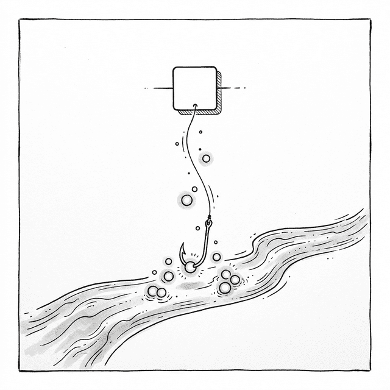

# 第十二章：Hooks —— 関数の記憶 (The Memory of Functions)



## 12.1 歴史の重荷を捨てる

ポーは完成したばかりの強力な Fiber エンジンを眺めていた。

**🐼**：師父、私たちは今、いつでも中断と再開ができる Render Phase と、超高速で同期的な Commit Phase を手に入れました。ですが、以前書いた `class Component` は、この新しいアーキテクチャだと少し不都合がある気がしますが……？

**🧙‍♂️**：その通りだ。第八章（再利用の苦境）で直面した問題を覚えているか？ クラスコンポーネント間でロジックを再利用しようとして HOC や Render Props を使った結果、「ラッパー地獄 (Wrapper Hell)」に陥ってしまったな。

**🐼**：もちろんです！ あのラッパー地獄によってコンポーネントツリーが底なしに深くなり、第九章の「ブラウザの停滞」危機を引き起こした。だからこそ、三章もかけて全く新しい Fiber エンジンを構築したのですよね。

**🧙‍♂️**：そうだ。そして Fiber アーキテクチャにおいて Render Phase がタイムスライシング下で動作する以上、コンポーネントインスタンスの `render()` メソッドは、途中で破棄されたり、複数回呼び出されたりする可能性がある（より優先度の高いタスクが割り込んだ場合など）。そうなると、 `class` のライフサイクル（ `constructor` や初期のライフサイクルにある副作用ロジックなど）は予期せぬバグを引き起こしやすくなり、クラスコンポーネントは極めて不安定で、かつ重苦しいものになってしまったのだ。

**🐼**：それなら、いっそ `class` を完全に捨ててしまえばいいのではないですか？

**🧙‍♂️**：それこそが React チームの考えだった。2018年の React Conf で、Sophie Alpert と Dan Abramov は正式に **Hooks** を提案した。彼らの目標は明確だった。関数コンポーネントにクラスコンポーネントと同等の能力を持たせつつ、 `class` がもたらすすべての煩わしさを回避することだ。

**🐼**：でも、関数コンポーネントにどうやって「状態」を持たせるのですか？ 関数は呼び出されるたびにゼロから始まるものでしょう？

**🧙‍♂️**：良い質問だ。まずは、どこに問題があるのかを見てみよう。

## 12.2 関数の「健忘症」

**🧙‍♂️**：下にあるのは、単純な TodoItem 関数コンポーネントだ：

```javascript
function TodoItem(props) {
  return h('div', { className: 'item' }, props.text);
}
```

これには `this` の混乱もなければ、巨大で難解なライフサイクルもない。同じ入力 (Props) を与えれば、常に同じ UI スナップショットを返す。それは天生的に「宣言的」な本質、 `UI = f(state)` を体現している。

**🐼**：ですが致命的な欠点があります。 **記憶がないこと** です。師父、見てください。もしこのコンポーネントに、自分が何回クリックされたかを覚えさせたいとしたら：

```javascript
function Counter() {
  let count = 0; // ローカル変数
  
  return h('button', { 
    onclick: () => {
      count++;
      console.log('最新の count は:', count);
      update(); // 再レンダリングをトリガー
    }
  }, `クリック回数: ${count}`);
}
```

クリックするたびに、クロージャの中の `count` は確かに増えています。ですが、 `update()` を呼んで再レンダリングすると、 `Counter()` 関数が **再び実行** されます。実行されると、 `let count = 0` がまた初期化されてしまう。画面には永遠に `0` と表示されたままです。

**🧙‍♂️**：関数コンポーネントを **金魚** 🐟 に例えてみろ。呼び出されるたびに全く新しい魚になり、一秒前に何があったか全く覚えていない。彼らに「記憶」を持たせるには、金魚鉢の外に記憶を保存する場所を作らなければならん。

**🐼**：金魚鉢の外？ つまり……状態を関数の外部に置くということですか？

## 12.3 最初の試み：グローバル変数

**🧙‍♂️**：そうだ。最も直感的な案は、状態をグローバルに置くことだ。

```javascript
let globalState;

function useState(initialValue) {
  if (globalState === undefined) {
    globalState = initialValue;
  }
  
  function setState(newValue) {
    globalState = newValue;
    update(); // 再レンダリングをトリガー
  }
  
  return [globalState, setState];
}
```

このような「純粋関数が外部から状態を取り戻すのを助ける」特殊な関数を、 **"Hook (フック)"** と呼ぶ。

**🐼**：フック？

**🧙‍♂️**：釣り針 🪝 のようなものだ。お前の純粋関数は本来ただの自由な魚だが、Hook によってエンジンの内部メカニズムに **引っかかる (Hook into)** ことで、状態を読み書きする超能力を得るのだ。

使い方はこうなる：

```javascript
function Counter() {
  const [count, setCount] = useState(0);
  return h('h1', { onclick: () => setCount(count + 1) }, count);
}
```

**🐼**：お見事！ ですが、もしページに **二つの** `Counter` があったら？

**🧙‍♂️**：大惨事だ。二つの `Counter` が同じ `globalState` を共有し、互いに上書きし合ってしまう。

**🐼**：なら、グローバル変数を **グローバル配列** にアップグレードしてはどうでしょう？ 各 `useState` が呼び出された順に配列の自分の位置から値を取るようにするのです：

```javascript
let hooksArray = [];
let hookIndex = 0;

function useState(initialValue) {
  const currentIndex = hookIndex;
  
  if (hooksArray[currentIndex] === undefined) {
    hooksArray[currentIndex] = initialValue;
  }
  
  function setState(newValue) {
    hooksArray[currentIndex] = newValue;
    update();
  }
  
  hookIndex++;
  return [hooksArray[currentIndex], setState];
}
```

**🧙‍♂️**：よろしい。配列案なら、一つのコンポーネント内で `useState` を複数回呼び出せる。だが、もっと大きな場面を想像してみろ。

**🐼**：100個のコンポーネントがそれぞれ 3つずつ `useState` を使っていたら……300個の状態が一つの巨大な配列に押し込められることになりますね。 React はどれがどのコンポーネントのものか、どうやって判断するのですか？ コンポーネントがアンマウントされたら、配列のインデックスがズレてしまいませんか？

**🧙‍♂️**：お前はグローバル配列案の脆さを一瞬で見抜いたな。さて、私たちが三章かけて築き上げてきた、真のアーキテクチャに戻る時だ。

## 12.4 記憶を Fiber に委ねる —— コンポーネントごとの「引き出し」

### 比喩：一人に一つのチェスト

**🧙‍♂️**： Fiber アーキテクチャにおいて、各コンポーネントは一つの Fiber ノードに対応している。 **各 Fiber ノードは、引き出しのついた小さなチェストである** 🗄️ と想像してみろ：

```
Fiber: <Counter title="カウンター A">
┌──────────────────────────┐
│ 引き出し 0: count = 0     │  ← 1回目の useState
│ 引き出し 1: step  = 1     │  ← 2回目の useState
└──────────────────────────┘

Fiber: <Counter title="カウンター B">
┌──────────────────────────┐
│ 引き出し 0: count = 0     │  ← 1回目の useState
│ 引き出し 1: step  = 1     │  ← 2回目の useState
└──────────────────────────┘
```

各コンポーネントは **自分専用のチェスト** （ `fiber.hooks` 配列）を持っており、互いに干渉することはない。 `useState` が呼ばれるたびに、順番に 0番目、1番目の引き出しを開けていくのだ。

**🐼**：それなら `Counter` がいくつあっても、状態が混ざることはありませんね！ ですが具体的にはどう実装するのですか？

### 技術的なマッピング：wipFiber と hookIndex

**🧙‍♂️**：必要なのは、二つの「グローバルポインタ」だけだ：

| 変数 | 意味 | 比喩 |
|------|------|------|
| `wipFiber` | 現在レンダリング中の Fiber ノード | 「今、どのチェストを開けているか」 |
| `hookIndex` | 現在何回目の `useState` 呼び出しであるか | 「今、何番目の引き出しを引いているか」 |

エンジンが関数コンポーネントのレンダリングを開始するたびに、以下の三つのことを行う：

```javascript
function updateFunctionComponent(fiber) {
  // ① ポインタを現在の Fiber に向ける（このチェストを開ける）
  wipFiber = fiber;
  // ② 引き出しのカウンタをリセット（0番目の引き出しから始める）
  hookIndex = 0;
  // ③ 新しい hooks 配列を用意する
  wipFiber.hooks = [];
  
  // 関数コンポーネントを実行し、子要素を得る
  const children = [fiber.type(fiber.props)];
  reconcileChildren(fiber, children);
}
```

**🐼**：なるほど。だから `Counter()` 関数の中で `useState(0)` が呼ばれたとき、 `useState` は単に `wipFiber.hooks[hookIndex]` にアクセスして状態を取得すればいいわけですね！

**🧙‍♂️**：そうだ。そして Fiber には `alternate` ポインタ（前回のレンダリング時の Fiber を指す）があるため、「古いチェスト」から前回の値を取り出すことも容易にできる。

### 最小版 useState：読み取りのみ

まずは「どうやって前回の状態を読み取るか」に絞った、最小バージョンを書いてみよう：

```javascript
function useState(initial) {
  // 古い Fiber の同じ位置にある引き出しから、古い値を取得しようと試みる
  const oldHook =
    wipFiber.alternate &&
    wipFiber.alternate.hooks &&
    wipFiber.alternate.hooks[hookIndex];

  const hook = {
    state: oldHook ? oldHook.state : initial,
  };

  wipFiber.hooks.push(hook); // 新しいチェストに入れる
  hookIndex++;               // 次の useState のために準備
  return [hook.state, null]; // setState は後で追加
}
```

**🐼**：待ってください、具体的な例で一通り追わせてください：

### 推論：Counter の初回レンダリング

`Counter({ title: "カウンター A" })` があり、その関数内で二回 `useState` が呼ばれると仮定します：

```
初回レンダリング Counter A：
  wipFiber = Counter_A の Fiber ノード
  hookIndex = 0
  wipFiber.alternate = null（初回なので古い Fiber はない）

  ① useState(0)
     → oldHook = null
     → hook.state = 0（初期値を使用）
     → wipFiber.hooks = [{ state: 0 }]
     → hookIndex は 1 になる
     → [0, ...] を返す

  ② useState(1)
     → oldHook = null
     → hook.state = 1（初期値を使用）
     → wipFiber.hooks = [{ state: 0 }, { state: 1 }]
     → hookIndex は 2 になる
     → [1, ...] を返す
```

**🧙‍♂️**：正しい。では、ユーザーがボタンをクリックした後は？

### 推論：Counter の二回目レンダリング

```
ユーザーがクリック → 再レンダリングがトリガー → Counter A が再び呼び出される
  wipFiber = Counter_A の新しい Fiber ノード
  wipFiber.alternate = 前回の Fiber（hooks: [{ state: 3 }, { state: 1 }] を持っている）
  hookIndex = 0

  ① useState(0)
     → oldHook = alternate.hooks[0] = { state: 3 }
     → hook.state = 3（古い引き出しから値を取得。初期値は無視！）
     → [3, ...] を返す

  ② useState(1)
     → oldHook = alternate.hooks[1] = { state: 1 }
     → hook.state = 1（古い引き出しから値を取得）
     → [1, ...] を返す
```

**🐼**：わかりました！ `initial` 引数は **最初のレンダリングの時だけ** 有効で、それ以降は毎回古い Fiber の対応する位置から値を取ってくるのですね。これが関数の「記憶」の正体ですか！

### 「完全再実行」モデル：この核心メカニズムに名前をつける

**🧙‍♂️**：先へ進む前に、これから数章にわたって一貫して登場する核心的なメカニズムに名前をつけよう。これを **「完全再実行」モデル** と呼ぶことにする。

状態が変化するたびに、React は前回の実行結果に「パッチ」を当てるのではなく、コンポーネント関数を **最初から最後まで丸ごと再実行** し、全く新しい UI スナップショットを生成する。そして Reconciliation を通じて差分を見つけ出し、DOM を更新する。 Fiber は `hook.state` を「古い引き出し」から取り出す役割を担い、今回の再実行が前回の状態を「覚えている」ように仕向ける。しかし、それ以外の関数内のすべての変数や式は、ゼロから計算し直されるのだ。

**🐼**：つまりレンダリングのたびに、あの金魚は全く新しい金魚になるけれど、金魚鉢の外から前の金魚の DNA だけを引き継いでいる、といった感じでしょうか？

**🧙‍♂️**：その比喩は非常に的を射ている。このモデルは、私たちに `UI = f(state)` というシンプルで純粋な思考の枠組みを与えてくれる。と同時に、これからお前が直面することになる二つの大きな課題ももたらすのだ。

一つ目は、もし関数の中に「一度だけやるべきこと」（タイマーの起動やネットワークリクエストなど）があった場合、再実行のたびにそれが繰り返されてしまい、災難を招くということ。二つ目は、もし関数の中に「非常に重い計算」（一万件のデータのフィルタリングなど）があった場合、些細な再レンダリングのたびにそれが再計算され、パフォーマンスの無駄が生じるということだ。 **第十三章の内容はすべて、この「完全再実行」モデルの下で、いかにこれら二つの課題に適切に対処するか、という問いへの答えになっている。**

## 12.5 setState に更新をトリガーさせる

**🧙‍♂️**：では、最も重要な部分を補おう。 `setState` はどうやってエンジンに再レンダリングをさせるのか？

**🐼**： `setState` は二つのことをする必要がありますよね？ ① 新しい値を記録すること。 ② エンジンに「仕事開始」を伝えること。

**🧙‍♂️**：その通りだ。だが細かな点がある。 `setState` は一フレーム内で複数回呼ばれる可能性がある（連続で二回クリックされるなど）。そのため、 `state` を直接上書きするのではなく、 **キュー (queue)** を使って更新リクエストを溜めておく。そして次回のレンダリング時に、キューにあるすべての更新を一気に「清算」するのだ。

```javascript
function useState(initial) {
  const oldHook =
    wipFiber.alternate &&
    wipFiber.alternate.hooks &&
    wipFiber.alternate.hooks[hookIndex];

  const hook = {
    state: oldHook ? oldHook.state : initial,
    queue: oldHook ? oldHook.queue : [],       // 更新キュー
    setState: oldHook ? oldHook.setState : null,
  };

  // キューを清算：溜まっている更新を順番に適用する
  hook.queue.forEach(action => {
    hook.state = typeof action === 'function'
      ? action(hook.state) // 関数型更新をサポート：setCount(c => c + 1)
      : action;            // 直接代入もサポート：setCount(5)
  });
  hook.queue.length = 0; // 処理済みのキューを空にする

  // 初回レンダリング時に setState を作成
  if (!hook.setState) {
    hook.setState = action => {
      hook.queue.push(action);   // ① 更新リクエストをキューに入れる
      // ② エンジンに「仕事開始」を伝える —— 新しい wipRoot を作成する
      wipRoot = {
        dom: currentRoot.dom,
        props: currentRoot.props,
        alternate: currentRoot,
      };
      workInProgress = wipRoot;
      deletions = [];
    };
  }

  wipFiber.hooks.push(hook);
  hookIndex++;
  return [hook.state, hook.setState];
}
```

**🐼**：全体の流れを確認させてください：

> 1. ユーザーがボタンをクリック → `setCount(c => c + 1)` を呼び出す
> 2. `setCount` が `c => c + 1` を `hook.queue` にプッシュする
> 3. `setCount` が新しい `wipRoot` を作成し、エンジンが新しい Render Phase を開始する
> 4. エンジンが Counter の Fiber を探索 → `updateFunctionComponent` を呼び出す
> 5. `Counter()` が実行される → 内部で `useState(0)` が呼ばれる
> 6. `useState` が古い Fiber から `oldHook` を取り出し、 `queue` に `c => c + 1` があるのを見つける
> 7. `action(oldHook.state)` を実行 → 新しい `state` を得る
> 8. `[新 state, setState]` を返し、Counter は新しい UI をレンダリングする

**🧙‍♂️**：その通りだ。これが Hooks の完全なライフサイクルだ。

## 12.6 Hooks の鉄則：if 文の中に書いてはならない

**🐼**：待ってください、一つ思いつきました。 `useState` は `hookIndex` （引き出しの番号）を頼りに状態を対応させていますよね。もしこんな風に書いたらどうなりますか：

```javascript
function BadCounter() {
  const [count, setCount] = useState(0);
  
  if (count > 5) {
    const [warning, setWarning] = useState('多すぎます！');
  }
  
  const [step, setStep] = useState(1);
  return /* ... */;
}
```

**🧙‍♂️**：大惨事の幕開けだ。二つのケースを推論してみよう：

```
count = 3 の時（if 文が実行されない）：
  引き出し 0 → count    ✓
  引き出し 1 → step     ✓

count = 6 の時（if 文が実行された）：
  引き出し 0 → count    ✓
  引き出し 1 → warning  ← 本来は step であるべき場所！
  引き出し 2 → step     ← 引き出しが一つ増えて、ズレてしまった
```

**🐼**：引き出しがめちゃくちゃです！ `hookIndex` は呼び出し順に増えていくので、あるレンダリングで `useState` の呼び出し回数や順序が前回と変わってしまうと、それ以降のすべての引き出し番号がズレてしまうのですね。

**🧙‍♂️**：だからこそ、React には一つの鉄則がある：

> **Hook は必ず関数の最上位 (Top Level) で呼び出さなければならない。条件文、ループ、あるいはネストされた関数の中で呼び出してはならない。**

毎回レンダリング時の呼び出し順序と回数が完全に一致することを保証して初めて、「番号で引き出しを特定する」という仕組みが正しく機能するのだ。

| ✅ 正しい書き方 | ❌ 誤った書き方 |
|------------|------------|
| 関数体の最上部で `useState` を呼ぶ | `if` 文の中で `useState` を呼ぶ |
| 毎回のレンダリングで呼び出し回数を変えない | ループの中で動的に `useState` を呼ぶ |
| 呼び出し順序を変えない | 早すぎる `return` の後に呼び出す |

## 12.7 歴史的な瞬間：2018 React Conf

**🧙‍♂️**：コードの手を止めて、歴史の現場に戻ってみよう。

2018年10月の React Conf で、Sophie Alpert はまずクラスコンポーネントの三つの大きな痛みを示した：

1. **ロジックの再利用が難しい** —— HOC / Render Props がラッパー地獄を招く
2. **ライフサイクルが断片化している** —— 関連するロジックが異なるライフサイクルメソッドに分散する
3. **`this` が混乱を招く** —— イベント処理での `this` バインドなど、初心者の罠が多い

**🐼**：それは私たちがこれまでの道のりで身にしみて感じてきた問題ですね！

**🧙‍♂️**：そうだ。そして Dan Abramov が登壇し、 `useState` と `useEffect` のライブデモを行った。会場からは驚きの声が上がった。関数コンポーネントが状態と副作用を持てるようになったのだからな！

これが Hooks の誕生だ。それは突如現れた「新しい糖衣構文」ではない。 **再利用の苦境** （第八章）→ **ブラウザの停滞** （第九章）→ **Fiber アーキテクチャ** （第十、十一章）と歩んできた道の結果として、必然的に生まれた産物なのだ。

**🐼**：待ってください。Dan がステージで見せた `useEffect` とは何ですか？ 私たちはまだ `useState` しか実装していません。

**🧙‍♂️**：それこそが次章のテーマだ。 「完全再実行」のメンタルモデルが頭に入っていれば、なぜ `useEffect` が存在しなければならないのか、そしてそれが再実行による被害からいかにしてお前の関数を守るのか、すぐに理解できるはずだ。

## 12.8 試してみよう：全コード

以下は `useState` を含む完全な mini-React エンジンだ。ブラウザでそのまま実行できる。二つの独立した `Counter` 関数コンポーネントが、それぞれの状態を維持している様子を確認してほしい。

```html
<!DOCTYPE html>
<html>
<head>
  <meta charset="UTF-8">
  <title>Chapter 12 - Hooks: The Memory of Functions</title>
  <style>
    body { font-family: sans-serif; padding: 20px; text-align: center; }
    .counter { max-width: 400px; margin: 20px auto; border: 1px solid #999; }
    button { margin: 10px 20px; font-size: 16px; cursor: pointer; }
  </style>
</head>
<body>
  <div id="app"></div>
  <script>
    // === 仮想 DOM ファクトリ関数 ===
    function h(type, props, ...children) {
      return {
        type,
        props: {
          ...props,
          children: children.flat().map(child =>
            typeof child === "object" ? child : { type: "TEXT_ELEMENT", props: { nodeValue: child, children: [] } }
          ),
        },
      };
    }

    // === Fiber エンジン（第十、十一章で構築したもの） ===
    let workInProgress = null;
    let currentRoot = null;
    let wipRoot = null;
    let deletions = [];
    let wipFiber = null;
    let hookIndex = null;

    function render(element, container) {
      wipRoot = { dom: container, props: { children: [element] }, alternate: currentRoot };
      deletions = [];
      workInProgress = wipRoot;
    }

    function workLoop(deadline) {
      let shouldYield = false;
      while (workInProgress && !shouldYield) {
        workInProgress = performUnitOfWork(workInProgress);
        shouldYield = deadline.timeRemaining() < 1;
      }
      if (!workInProgress && wipRoot) commitRoot();
      requestIdleCallback(workLoop);
    }
    requestIdleCallback(workLoop);

    function performUnitOfWork(fiber) {
      const isFunctionComponent = fiber.type instanceof Function;
      if (isFunctionComponent) updateFunctionComponent(fiber);
      else updateHostComponent(fiber);

      if (fiber.child) return fiber.child;
      let nextFiber = fiber;
      while (nextFiber) {
        if (nextFiber.sibling) return nextFiber.sibling;
        nextFiber = nextFiber.return;
      }
      return null;
    }

    // === 第十二章新規追加：関数コンポーネントレンダリング + Hooks ===
    function updateFunctionComponent(fiber) {
      // グローバルポインタをセットし、useState が現在どの Fiber にいるか知るようにする
      wipFiber = fiber;
      hookIndex = 0;
      wipFiber.hooks = []; // 新しい hooks 配列を用意する（「チェストを開ける」）
      const children = [fiber.type(fiber.props)];
      reconcileChildren(fiber, children);
    }

    function updateHostComponent(fiber) {
      if (!fiber.dom) fiber.dom = createDom(fiber);
      reconcileChildren(fiber, fiber.props.children);
    }

    function createDom(fiber) {
      const dom = fiber.type === "TEXT_ELEMENT"
        ? document.createTextNode("")
        : document.createElement(fiber.type);
      updateDom(dom, {}, fiber.props);
      return dom;
    }

    function updateDom(dom, prevProps, nextProps) {
      for (const k in prevProps) {
        if (k !== 'children') {
          if (!(k in nextProps) || prevProps[k] !== nextProps[k]) {
            if (k.startsWith('on')) dom.removeEventListener(k.slice(2).toLowerCase(), prevProps[k]);
            else if (!(k in nextProps)) {
              if (k === 'className') dom.removeAttribute('class');
              else if (k === 'style') dom.style.cssText = '';
              else dom[k] = '';
            }
          }
        }
      }
      for (const k in nextProps) {
        if (k !== 'children' && prevProps[k] !== nextProps[k]) {
          if (k.startsWith('on')) dom.addEventListener(k.slice(2).toLowerCase(), nextProps[k]);
          else {
            if (k === 'className') dom.setAttribute('class', nextProps[k]);
            else if (k === 'style' && typeof nextProps[k] === 'string') dom.style.cssText = nextProps[k];
            else dom[k] = nextProps[k];
          }
        }
      }
    }

    function reconcileChildren(wipFiber, elements) {
      let index = 0;
      let oldFiber = wipFiber.alternate && wipFiber.alternate.child;
      let prevSibling = null;

      while (index < elements.length || oldFiber != null) {
        const element = elements[index];
        let newFiber = null;
        const sameType = oldFiber && element && element.type === oldFiber.type;

        if (sameType) {
          newFiber = { type: oldFiber.type, props: element.props, dom: oldFiber.dom, return: wipFiber, alternate: oldFiber, effectTag: "UPDATE" };
        }
        if (element && !sameType) {
          newFiber = { type: element.type, props: element.props, dom: null, return: wipFiber, alternate: null, effectTag: "PLACEMENT" };
        }
        if (oldFiber && !sameType) {
          oldFiber.effectTag = "DELETION";
          deletions.push(oldFiber);
        }

        if (oldFiber) oldFiber = oldFiber.sibling;
        if (index === 0) wipFiber.child = newFiber;
        else if (element) prevSibling.sibling = newFiber;
        
        prevSibling = newFiber;
        index++;
      }
    }

    function commitRoot() {
      deletions.forEach(commitWork);
      commitWork(wipRoot.child);
      currentRoot = wipRoot;
      wipRoot = null;
    }

    function commitWork(fiber) {
      if (!fiber) return;
      let domParentFiber = fiber.return;
      while (!domParentFiber.dom) domParentFiber = domParentFiber.return;
      const domParent = domParentFiber.dom;

      if (fiber.effectTag === "PLACEMENT" && fiber.dom != null) domParent.appendChild(fiber.dom);
      else if (fiber.effectTag === "UPDATE" && fiber.dom != null) updateDom(fiber.dom, fiber.alternate.props, fiber.props);
      else if (fiber.effectTag === "DELETION") {
        commitDeletion(fiber, domParent);
        return;
      }

      commitWork(fiber.child);
      commitWork(fiber.sibling);
    }
    
    function commitDeletion(fiber, domParent) {
      if (fiber.dom) domParent.removeChild(fiber.dom);
      else commitDeletion(fiber.child, domParent);
    }

    // === Hooks API ===
    function useState(initial) {
      // 古い Fiber の同じ位置にある引き出しから、前回の hook オブジェクトを取り出す
      const oldHook =
        wipFiber.alternate &&
        wipFiber.alternate.hooks &&
        wipFiber.alternate.hooks[hookIndex];

      const hook = {
        state: oldHook ? oldHook.state : initial,
        queue: oldHook ? oldHook.queue : [],
        setState: oldHook ? oldHook.setState : null,
      };

      // キューを清算：溜まっている更新リクエストを順番に state に適用
      hook.queue.forEach(action => {
        hook.state = typeof action === 'function' ? action(hook.state) : action;
      });
      hook.queue.length = 0;

      if (!hook.setState) {
        hook.setState = action => {
          hook.queue.push(action);
          // 新しい wipRoot を作成し、ツリー全体の再レンダリングをトリガーする
          wipRoot = {
            dom: currentRoot.dom,
            props: currentRoot.props,
            alternate: currentRoot,
          };
          workInProgress = wipRoot;
          deletions = [];
        };
      }

      wipFiber.hooks.push(hook);
      hookIndex++;
      return [hook.state, hook.setState];
    }

    // === アプリ層：二つの独立した Counter が、それぞれの状態を維持している ===
    function Counter({ title }) {
      const [count, setCount] = useState(0);
      const [step, setStep] = useState(1);

      return h('div', { className: 'counter' },
        h('h2', null, title),
        h('p', null, `現在のカウント: ${count}`),
        h('button', { onclick: () => setCount(c => c + step) }, `+${step}`),
        h('button', { onclick: () => setStep(s => s + 1) }, 'ステップを増やす')
      );
    }

    function App() {
      return h('div', null,
        h('h1', null, 'Hooks: The Memory of Functions'),
        h('p', null, '下に二つの独立した関数コンポーネントがあります。それぞれが自分の状態を「記憶」しています。'),
        h(Counter, { title: "カウンター A" }),
        h(Counter, { title: "カウンター B" })
      );
    }

    render(h(App, null), document.getElementById('app'));
  </script>
</body>
</html>
```
