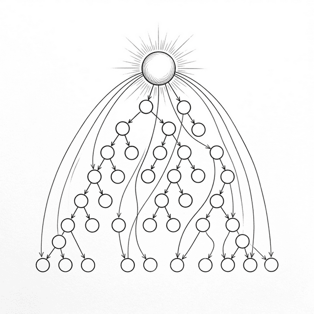

# 第十四章：状態管理と階層を超える架け橋 (Context and State)



ポーは前章までで学んだ Hooks を駆使して、大規模な ToDo アプリを構築していた。 `useState` でローカル状態を管理し、 `useEffect` で副作用を処理し、 `useMemo` で重い計算を最適化した。だがすぐに、四つの宝では解決できない新しい問題に突き当たった。

## 14.1 階層を突き抜ける痛み (Prop Drilling)

**🐼**：師父、私のアプリの構造は大体こんな感じになっています：

```text
App
├── Header            ← user.name が必要
├── Sidebar
│   └── UserProfile   ← user.name, user.avatar が必要
└── Main
    └── Content
        └── TodoList
            └── TodoItem  ← theme.color が必要
```

ユーザーの名前は `App` コンポーネントの State にありますが、 `Header` と深い入れ子になった `UserProfile` で使いたい。テーマカラーも `App` にありますが、五層も深い `TodoItem` まで渡す必要があります。これらの Props がどう渡されているか見てください：

```javascript
function App() {
  const [user] = useState({ name: 'ポー', avatar: '🐼' });
  const [theme] = useState({ color: '#0066cc' });

  return h('div', null, [
    h(Header,  { user: user }),                    // 渡す
    h(Sidebar, { user: user }),                    // 渡す
    h(Main,    { user: user, theme: theme }),       // 渡す
  ]);
}

function Main({ user, theme }) {
  // Main 自体は user を使いませんが、下に渡さなければなりません！
  return h(Content, { user: user, theme: theme }); // 渡す
}

function Content({ user, theme }) {
  // Content も user を使いませんが、下に渡さなければなりません！
  return h(TodoList, { user: user, theme: theme }); // 渡す
}
```

すべての階層で `user` と `theme` を渡していますが、中間の層（ `Main` 、 `Content` ）はこれらのデータを全く必要としていません！ 彼らはただの「運び屋」で、受け取っては横流ししているだけです。

**🧙‍♂️**：それが **Prop Drilling（プロップ・ドリリング）** だ。アプリの階層が深くなると、このパターンには二つの問題が生じる。ノイズ（中間コンポーネントが無関係な Props の受け渡しを強いられること）と、脆さ（もし `TodoItem` に新しい `locale` 属性を追加したくなったら、 **経路上のすべてのコンポーネント** を修正しなければならなくなる）だ。

**🐼**：解決策にはどのようなものがありますか？

**🧙‍♂️**：二つの道がある。一つは共有状態を「外に括りだして」グローバルな器（Redux など）に入れ、どんなコンポーネントからでも直接購読できるようにすること。もう一つは、データを信号のようにコンポーネントツリーの中に「貫通」させて、中間層を経由せずに渡すこと（Context API）だ。

だがその二つの道を話す前に、まずお前がすぐに必要になる道具を紹介しておこう —— `useReducer` だ。

## 14.2 状態ロジックの集中管理：useReducer

**🐼**： `useReducer` ？ それは `useState` と何が違うのですか？

**🧙‍♂️**：状態のロジックが複雑になってくると、 `useState` では収拾がつかなくなる。お前の ToDo リストに、どんどん操作が増えていく場面を想像してみろ：

```javascript
// useState で複雑な状態を管理：複数の setter があり、ロジックが散乱する
function TodoApp() {
  const [todos, setTodos] = useState([]);
  const [filter, setFilter] = useState('all');
  const [loading, setLoading] = useState(false);

  // 追加：
  const addTodo = (text) => setTodos(prev => [...prev, { text, done: false }]);
  // 削除：
  const removeTodo = (i) => setTodos(prev => prev.filter((_, idx) => idx !== i));
  // 完了状態の切り替え（同時に loading も更新したい）：複数の setter を書くことに……
}
```

**🐼**：これは乱雑に見えますね。操作のたびに新しい状態を手動で組み立てる必要があります。

**🧙‍♂️**： `useReducer` の発想は、すべての状態変化ロジックを一つの **純粋関数（Reducer）** に集約し、 **「アクション (Action)」を dispatch する** ことで更新をトリガーするというものだ：

```javascript
// Reducer：純粋関数であり、「あるアクションを受け取ったとき、状態がどう変化するか」を記述する
function todosReducer(state, action) {
  switch (action.type) {
    case 'ADD':
      return { ...state, todos: [...state.todos, { text: action.text, done: false }] };
    case 'REMOVE':
      return { ...state, todos: state.todos.filter((_, i) => i !== action.index) };
    case 'TOGGLE':
      return {
        ...state,
        todos: state.todos.map((t, i) =>
          i === action.index ? { ...t, done: !t.done } : t
        )
      };
    default:
      return state;
  }
}

function TodoApp() {
  const [state, dispatch] = useReducer(todosReducer, { todos: [], filter: 'all' });

  return h('div', null, [
    h('button', { onclick: () => dispatch({ type: 'ADD', text: '牛乳を買う' }) }, '追加'),
    // ...
  ]);
}
```

**🐼**：面白いですね！ すべての状態変化に明確な「名前」（ `action.type` ）が付き、ロジックが一箇所にまとまるので、追跡やデバッグが容易になりそうです。

**🧙‍♂️**：本質を突いているな。 `useReducer` は実のところ `useState` の変種に過ぎん —— 分散していた setter を一箇所に引き抜き、関数にまとめただけだ。このパターンを覚えておけ。これから見る Redux は、まさにこの Reducer を **コンポーネントの内部** から **グローバルな倉庫** へと移したものだからだ。

## 14.3 グローバルな状態：createStore (Mini-Redux)

**🧙‍♂️**：Prop Drilling を解決する第一の道は、共有状態をコンポーネントツリーの外に括りだし、 **グローバルで予測可能な器** に入れることだ。

**🐼**：公共の「倉庫」のようなものですか？

**🧙‍♂️**：その通り。それが **Redux** (2015) の核心的な理念だ。さっき見た `useReducer` と全く同じだ —— ただ Store がコンポーネントツリーの外にあり、どんなコンポーネントからでも直接購読できる、という点が違うだけだ。極小版を実装してみよう：

```javascript
function createStore(reducer, initialState) {
  let state = initialState;
  let listeners = [];

  return {
    getState() {
      return state;
    },

    dispatch(action) {
      // Reducer: 純粋関数。 (旧状態, アクション) → 新状態
      state = reducer(state, action);
      // すべての購読者に通知
      listeners.forEach(fn => fn());
    },

    subscribe(fn) {
      listeners.push(fn);
      // 購読解除のための関数を返す
      return () => {
        listeners = listeners.filter(l => l !== fn);
      };
    }
  };
}
```

以下は mini-redux の完全な動作プロセスを示す例だ：

```javascript
// 1. Reducer を定義：「あるアクションを受け取ったとき、状態がどう変化するか」を記述
function counterReducer(state, action) {
  switch (action.type) {
    case 'INCREMENT': return { ...state, count: state.count + 1 };
    case 'DECREMENT': return { ...state, count: state.count - 1 };
    default: return state;
  }
}

// 2. Store を作成：初期状態 + Reducer
const store = createStore(counterReducer, { count: 0 });

// 3. 状態変化を購読： dispatch のたびに自動的にトリガーされる
store.subscribe(() => {
  const { count } = store.getState();
  document.getElementById('display').textContent = 'Count: ' + count;
});

// 4. ユーザー操作 → Action を dispatch → Reducer が新状態を計算 → 購読者に通知
document.getElementById('inc-btn').addEventListener('click', () => {
  store.dispatch({ type: 'INCREMENT' });
});
```

この流れに注目しろ： **ユーザー操作 → dispatch → reducer → 新状態 → 購読者が UI を更新**。データ流は常に一方向で、予測可能だ。

**🐼**：第三章の `EventEmitter` に似ていますね！ データが変化したときに購読者に通知する、という点が。

**🧙‍♂️**：そうだが、決定的な違いがある。状態の更新は必ず `dispatch` + `reducer` を通さなければならず、それは **純粋関数** であるということだ。これにより状態の変化が予測可能になり（同じ入力なら常に同じ出力）、さらには記録や再生（Time Travel Debugging）も可能になるのだ。

**🐼**：でも、手動で `subscribe` したり手動で UI を更新したりする必要がありますね。もっと簡潔な方法はないのですか？

## 14.4 Fiber 時代の Context API

**🧙‍♂️**：単純なグローバルデータ（テーマ、ユーザー情報、言語設定など）のために、 React は **Context API** を提供している。旧来のコンポーネントアーキテクチャでは少し難解だったが、我々の Fiber アーキテクチャなら、実装は赤子の手をひねるより簡単だ。

**🐼**：なぜ簡単なのですか？

**🧙‍♂️**：Fiber のデータ構造を覚えているか？ 各 Fiber ノードは `return` ポインタを持っていて、自分の父親を指している。ということは、お前がコンポーネントツリーのどんな深い場所にいようとも、 **ルートノードへと直通する安全な通路** を持っているということだ。

```javascript
function createContext(defaultValue) {
  return {
    _currentValue: defaultValue, // 予備のデフォルト値
  };
}

// 特殊な目印（type === ContextProvider）を持つ、普通のラッパーコンポーネント
function ContextProvider(props) {
  // 本質的には children をレンダリングするだけだが、
  // その Fiber ノードには context と value が載っており、
  // 子孫が「受け取り」に来るのを待っている。
  return props.children;
}
```

深い階層にある子コンポーネントで `useContext` を呼び出すとき、起きることは非常に直感的だ —— `return` ポインタを辿って、この Context を提供している最初のノードが見つかるまで上へと登っていけばいい：

```javascript
function useContext(contextType) {
  let currentFiber = wipFiber;
  
  // return ポインタを辿って、上へ上へと登る！
  while (currentFiber) {
    if (
      currentFiber.type === ContextProvider && 
      currentFiber.props.context === contextType
    ) {
      // この先祖の props から値を「くすねる」！
      return currentFiber.props.value;
    }
    currentFiber = currentFiber.return;
  }
  
  // ルートまで登っても Provider が見つからなければ、デフォルト値を返す
  return contextType._currentValue;
}
```

**🐼**：おお！ これこそまさにスコープチェーン (Scope Chain) のコンポーネントツリー版ですね！ 内部のコンポーネントが値を必要としたとき、自分になければ父親に聞き、父親になければおじいさんに聞き……最も近い Context を提供している先祖を見つけるまで続ける、と。

**🧙‍♂️**：その通りだ。さらに `useContext` は Render Phase で発生するため、先祖の `value` が変わって子コンポーネントが再描画される際、再び上へと登れば自然と新しい値を取得できるのだ。

ただし、本物の React の Context はこれよりもう少し複雑だ。パフォーマンスの問題を解決する必要があるからだ。 Provider の `value` が変化したとき、もし途中のコンポーネントが `React.memo` で更新をブロックしていたら、その先にある子コンポーネントはどうやって通知を受け取り強制更新を行うのか？ React のソースコードでは、その障壁を突破するために精巧な依存関係収集メカニズムが組まれている。だがメンタルモデルとしては、 **「蔓を辿って上へ登る」** ことこそが Context の本質だ。

## 14.5 状態管理の全景と未来

**🐼**： Redux と Context があれば、私はすべての状態管理の武器を手に入れたことになりますか？

**🧙‍♂️**：この二つのパターンは依然としてエコシステムの屋台骨だ。だが、より複雑な現代のアプリでは、それぞれに新たな悩みも見えてきている。 Redux のボイラープレート（Action、Reducer、Store）はあまりに煩雑だ。一方 Context は、値が更新されると購読しているすべてのコンポーネントが再実行されるため、細粒度な **「正確な更新」** 能力に欠けている。

そのため、状態管理の「未来」は二つの方向へと進化しつつある。一つは **ミニマリズム** （Zustand など。 Redux を大幅に簡略化し、Hook ベースの正確な購読メカニズムを使用する）。もう一つは **アトミック（原子化）な状態** （Jotai / Recoil など。状態を無数の極小な「原子」に解体し、原子が変化したときに本当にそれを使っているコンポーネントだけを更新する。これにより Context のパフォーマンス問題を根本から解決する）。

**🐼**：どうやら、「正確な更新」こそがみんなが追い求めている究極の目標なのですね？

**🧙‍♂️**：核心を突いたな！ その追求は、React とは根本的に異なるフレームワークの設計さえ生み出した。次は、その全く異なる設計を見てみよう。そしてそれを通じて、もう一度「完全再実行」モデルの本質を問い直してみるのだ。

## 14.6 延長線上にある読み物：React vs Signals (SolidJS)

**🧙‍♂️**：ポーよ、React の状態管理を学んだお前に、全く異なるメンタルモデルを見せておこう —— **SolidJS の Signals** だ。

React の核心的な前提は、「状態が変わるたびに、コンポーネント関数全体を **再実行する** 」ことだった（第十二章で学んだあの「完全再実行」モデルだ）。 SolidJS のやり方はその真逆だ —— コンポーネント関数は **一度だけ** 実行され、状態が変化したときは対応する DOM ノードを直接更新する。 Virtual DOM も Diff も必要ない。

```javascript
// React： count が変わるたびに、関数全体が再実行される
function Counter() {
  const [count, setCount] = useState(0);
  return <h1>Count: {count}</h1>;
}

// SolidJS： 関数は一度だけ実行される。 count() は「購読」である
function Counter() {
  const [count, setCount] = createSignal(0);
  return <h1>Count: {count()}</h1>;  // このテキストノードだけが直接更新される
}
```

| 次元 | React (再実行) | SolidJS (Signals) |
|:-----|:-----------------|:-------------------|
| **メンタルモデル** | シンプル —— 「レンダリングのたびにスナップショットを作る」 | リアクティブの理解が必要 —— 「どれが Signal か」 |
| **デフォルトの性能** | memo/useMemo による手動最適化が必要 | デフォルトで最適 —— 正確な更新 |
| **コードの一貫性** | 高い —— コンポーネントはただの関数 | 「罠」がある —— props を分割代入するとリアクティブが失われる |
| **並行能力** | ✅ レンダリングの中断と再開が可能 | ❌ 同期的な更新。タイムスライシングの実現が困難 |

**🐼**：それじゃあ、React の「完全再実行」モデルは、ただパフォーマンスを無駄にしているだけじゃないですか？ 前章で `useMemo` や `useCallback` の話を聴いたとき、商品リストの例は本当にパフォーマンスの災難だと思いましたよ。モードを切り替えるだけでページ全体を計算し直すなんて。

**🧙‍♂️**：そうだ。だから React では、その「全ツリー再実行」によるパフォーマンスの崩壊を防ぐために、開発者が **手動で** `useMemo` や `useCallback` 、 `React.memo` を使い、「これは再計算しなくていい」「これは作り直さなくていい」とフレームワークに教えてやる必要がある。

**🐼**：SolidJS なら、そんな細かい手直しはそもそも必要ないってことですよね？

**🧙‍♂️**：その通りだ。 SolidJS では、状態が更新されたときに関連する DOM ノードだけが再評価される。関数が新しく作られることはない。これが表にある「デフォルトの性能」の意味だ —— **SolidJS はデフォルトで正確な更新を行い、 React は開発者の手動最適化を必要とする** 。

**🐼**：なら、開発者に負担を強いる React のモデルに、何かメリットはあるのですか？

**🧙‍♂️**：鍵となるのは、 React のレンダリングプロセスが単に「関数を呼び出して VNode データ構造を生成する」だけであり、 DOM を直接操作しないという点だ。これは、プロセスが **純粋であり、破棄可能である** ことを意味する。 React はレンダリングを途中で止めて、ユーザー入力を優先し、後でまた戻って再開することができる。これこそが第十一章で学んだ並行モードの基礎なのだ。

対して SolidJS の Signal の変化は直接 DOM を修正する —— 中間の「計画段階」がないため、中断できるものも何もない。速くて正確だが、並行能力は手に入らないのだ。

**🐼**：つまり React の「完全再実行」は単なる欠点ではなく、むしろ **並行モードを可能にするためのもの** なのですね？

**🧙‍♂️**：まさにその通りだ。これは二つのアーキテクチャの **根本的なトレードオフ** なのだ。 React は「冗長な計画段階を設けることで中断可能性を得る」ことを選び、 SolidJS は「正確な直接更新を行うことでデフォルトの性能を得る」ことを選んだ。正解はなく、場面に応じた最適な選択があるだけだ。

### SolidJS の「罠」

**🧙‍♂️**：最後にお前に Signals のメンタルモデルにおける **非直感的な挙動** を見せておこう。そうして初めて、公平な判断ができる。

```javascript
// SolidJS の罠：分割代入がリアクティブを「殺す」
function Greeting(props) {
  // ❌ 分割代入した瞬間に、 name はただの静的な値になり、変化を追跡できなくなる！
  const { name } = props;
  return <h1>Hello, {name}</h1>;  // name は永遠に初期値のまま

  // ✅ 常に props.name を使ってリアクティブを維持しなければならない
  return <h1>Hello, {props.name}</h1>;
}

// React ではこの問題は起きない！ 毎回再実行され、毎回最新の値を取得するからだ。
```

```javascript
// SolidJS の罠：早すぎる評価がリアクティブを「殺す」
function App() {
  const [count, setCount] = createSignal(0);

  // ❌ コンポーネントの設定段階で直接計算してしまうと、一度きりしか実行されない！
  const doubled = count() * 2;  // 永遠に 0 のまま

  // ✅ 関数で包んで「遅延評価」を維持しなければならない
  const doubled = () => count() * 2;

  return <p>Doubled: {doubled()}</p>;
}
```

**🐼**：わかりました。 React のメンタルモデルの方が **寛容** ですね —— 毎回再実行されるから、どんな式を書いても最新の値が取れる。 SolidJS のメンタルモデルは **効率的** ですが、常に「リアクティブの鎖がどこで切れるか」を意識していなければならない。

**🧙‍♂️**：それが各フレームワークが選んだ **核心となるトレードオフ** だ。完璧な答えはない。お前自身の目で確かめていくがいい。

## 14.7 比較一覧

| 案 | 長所 | 短所 | 適した場面 |
|:-----|:-----|:-----|:---------|
| **Prop Drilling** | シンプル、明示的、追跡可能 | 深い入れ子で冗長になり、変更コストが高い | 平坦なコンポーネントツリー |
| **useReducer** | 複雑な状態ロジックを集中管理 | あくまでローカル状態であり、コンポーネント間での共有はできない | 単一コンポーネント内の複雑な状態 |
| **Redux** | 予測可能、Time Travel Debug | 大量のボイラープレート（Action、Reducer、Store）が必要 | 大規模アプリ、複雑な状態ロジック |
| **Context API** | 軽量、外部ライブラリ不要 | パフォーマンスの問題（全コンポーネント再レンダリング） | 更新頻度の低いグローバルデータ |
| **原子化 (Jotai/Recoil)** | 正確な更新、最小限の記述 | API が新しく、エコシステムが比較的小さい | 中〜大規模アプリ、精密な制御 |

---

### 📦 やってみよう

以下のコードを `ch14.html` として保存しよう。これは Fiber 環境下へ全面的にアップグレードされた完全なアプリだ（Context による貫通バインディングと Mini-Redux による状態管理メカニズムを含む）：

```html
<!DOCTYPE html>
<html lang="ja">
<head>
  <meta charset="UTF-8">
  <title>Chapter 14 — Context and State (Fiber Version)</title>
  <style>
    body { font-family: sans-serif; padding: 20px; max-width: 600px; margin: 0 auto; background: #f9f9f9; }
    .card { border: 1px solid #ddd; border-radius: 8px; padding: 15px; margin: 15px 0; background: white; }
    .card h3 { margin-top: 0; }
    button { padding: 6px 12px; cursor: pointer; margin: 4px; border-radius: 4px; border: 1px solid #ccc; background: #eee; }
    li { padding: 8px 0; border-bottom: 1px solid #eee; display: flex; justify-content: space-between; align-items: center; list-style: none; }
    li .task-content { display: flex; align-items: center; gap: 8px; }
    li.done span { text-decoration: line-through; color: #999; }
    li .delete-btn { background: #ff4444; color: white; border: none; padding: 4px 8px; border-radius: 4px; cursor: pointer; }
    input[type="text"] { padding: 8px; width: 60%; border-radius: 4px; border: 1px solid #ccc; }
    #stats { font-size: 14px; color: #666; margin-top: 10px; }
    #empty-msg { color: #999; font-style: italic; font-size: 14px; margin-top: 10px; }
    #log { background: #282c34; color: #abb2bf; padding: 10px; border-radius: 4px; font-family: monospace; font-size: 13px; max-height: 150px; overflow-y: auto; margin-top: 20px; }
  </style>
</head>
<body>
  <h1>State Management (Fiber & Hooks)</h1>
  <div id="app"></div>
  <div id="log"></div>

  <script>
    // ============================================
    // 1. 底レイヤーエンジン: Mini-React (Fiber + Hooks)
    // ============================================
    function h(type, props, ...children) {
      return {
        type,
        props: {
          ...props,
          children: children.flat().map(child =>
            typeof child === "object" ? child : { type: "TEXT_ELEMENT", props: { nodeValue: child, children: [] } }
          )
        }
      };
    }

    let workInProgress = null, currentRoot = null, wipRoot = null, deletions = null;
    let wipFiber = null, hookIndex = null;

    function render(element, container) {
      wipRoot = { dom: container, props: { children: [element] }, alternate: currentRoot };
      deletions = [];
      workInProgress = wipRoot;
    }

    function workLoop(deadline) {
      let shouldYield = false;
      while (workInProgress && !shouldYield) {
        workInProgress = performUnitOfWork(workInProgress);
        shouldYield = deadline.timeRemaining() < 1;
      }
      if (!workInProgress && wipRoot) commitRoot();
      requestIdleCallback(workLoop);
    }
    requestIdleCallback(workLoop);

    function performUnitOfWork(fiber) {
      const isFunctionComponent = fiber.type instanceof Function;
      if (isFunctionComponent) {
        wipFiber = fiber;
        hookIndex = 0;
        wipFiber.hooks = [];
        const children = [fiber.type(fiber.props)].flat();
        reconcileChildren(fiber, children);
      } else {
        if (!fiber.dom) fiber.dom = createDom(fiber);
        reconcileChildren(fiber, fiber.props.children);
      }
      if (fiber.child) return fiber.child;
      let nextFiber = fiber;
      while (nextFiber) {
        if (nextFiber.sibling) return nextFiber.sibling;
        nextFiber = nextFiber.return;
      }
      return null;
    }

    function createDom(fiber) {
      const dom = fiber.type === "TEXT_ELEMENT" ? document.createTextNode("") : document.createElement(fiber.type);
      updateDom(dom, {}, fiber.props);
      return dom;
    }

    function updateDom(dom, prevProps, nextProps) {
      for (const k in prevProps) {
        if (k !== 'children') {
          if (!(k in nextProps) || prevProps[k] !== nextProps[k]) {
            if (k.startsWith('on')) dom.removeEventListener(k.slice(2).toLowerCase(), prevProps[k]);
            else if (!(k in nextProps)) {
              if (k === 'className') dom.removeAttribute('class');
              else if (k === 'style') dom.style.cssText = '';
              else dom[k] = '';
            }
          }
        }
      }
      for (const k in nextProps) {
        if (k !== 'children' && prevProps[k] !== nextProps[k]) {
          if (k.startsWith('on')) dom.addEventListener(k.slice(2).toLowerCase(), nextProps[k]);
          else {
            if (k === 'className') dom.setAttribute('class', nextProps[k]);
            else if (k === 'style' && typeof nextProps[k] === 'string') dom.style.cssText = nextProps[k];
            else dom[k] = nextProps[k];
          }
        }
      }
    }

    function reconcileChildren(wipFiber, elements) {
      let index = 0, oldFiber = wipFiber.alternate && wipFiber.alternate.child, prevSibling = null;
      while (index < elements.length || oldFiber != null) {
        const element = elements[index];
        let newFiber = null;
        const sameType = oldFiber && element && element.type === oldFiber.type;

        if (sameType) newFiber = { type: oldFiber.type, props: element.props, dom: oldFiber.dom, return: wipFiber, alternate: oldFiber, effectTag: "UPDATE" };
        if (element && !sameType) newFiber = { type: element.type, props: element.props, dom: null, return: wipFiber, alternate: null, effectTag: "PLACEMENT" };
        if (oldFiber && !sameType) { oldFiber.effectTag = "DELETION"; deletions.push(oldFiber); }

        if (oldFiber) oldFiber = oldFiber.sibling;
        if (index === 0) wipFiber.child = newFiber;
        else if (element) prevSibling.sibling = newFiber;
        prevSibling = newFiber;
        index++;
      }
    }

    function commitRoot() {
      deletions.forEach(commitWork);
      commitWork(wipRoot.child);
      commitEffects(wipRoot.child);
      currentRoot = wipRoot;
      wipRoot = null;
    }

    function commitWork(fiber) {
      if (!fiber) return;
      let domParentFiber = fiber.return;
      while (!domParentFiber.dom) domParentFiber = domParentFiber.return;
      const domParent = domParentFiber.dom;

      if (fiber.effectTag === "PLACEMENT" && fiber.dom != null) domParent.appendChild(fiber.dom);
      else if (fiber.effectTag === "UPDATE" && fiber.dom != null) updateDom(fiber.dom, fiber.alternate.props, fiber.props);
      else if (fiber.effectTag === "DELETION") {
        commitDeletion(fiber, domParent);
        return;
      }

      commitWork(fiber.child);
      commitWork(fiber.sibling);
    }
    
    function commitDeletion(fiber, domParent) {
      if (fiber.dom) domParent.removeChild(fiber.dom);
      else commitDeletion(fiber.child, domParent);
    }

    function commitEffects(fiber) {
      if (!fiber) return;
      if (fiber.hooks) {
        fiber.hooks.forEach(hook => {
          if (hook.tag === 'effect' && hook.hasChanged && hook.callback) {
            if (hook.cleanup) hook.cleanup();
            hook.cleanup = hook.callback();
          }
        });
      }
      commitEffects(fiber.child);
      commitEffects(fiber.sibling);
    }

    function useState(initial) {
      const oldHook = wipFiber.alternate && wipFiber.alternate.hooks && wipFiber.alternate.hooks[hookIndex];
      const hook = { 
        state: oldHook ? oldHook.state : initial, 
        queue: oldHook ? oldHook.queue : [],
        setState: oldHook ? oldHook.setState : null
      };
      
      hook.queue.forEach(action => hook.state = typeof action === 'function' ? action(hook.state) : action);
      hook.queue.length = 0;

      if (!hook.setState) {
        hook.setState = action => {
          hook.queue.push(action);
          wipRoot = { dom: currentRoot.dom, props: currentRoot.props, alternate: currentRoot };
          workInProgress = wipRoot;
          deletions = [];
        };
      }
      wipFiber.hooks.push(hook);
      hookIndex++;
      return [hook.state, hook.setState];
    }

    function useEffect(callback, deps) {
      const oldHook = wipFiber.alternate && wipFiber.alternate.hooks && wipFiber.alternate.hooks[hookIndex];
      let hasChanged = true;
      if (oldHook && deps) hasChanged = deps.some((dep, i) => !Object.is(dep, oldHook.deps[i]));
      const hook = { tag: 'effect', callback, deps, hasChanged, cleanup: oldHook ? oldHook.cleanup : undefined };
      wipFiber.hooks.push(hook);
      hookIndex++;
    }

    // ============================================
    // 2. 新規追加：Context メカニズム
    // ============================================
    function createContext(defaultValue) {
      return { _currentValue: defaultValue };
    }
    
    // ContextProvider は children を透過的に渡す役割。
    // その Fiber ノードに context と value を持たせ、子孫が useContext で探せるようにする
    function ContextProvider(props) {
      return props.children;
    }

    function useContext(contextType) {
      let currentFiber = wipFiber;
      // return ポインタを辿って、最も近い Provider を探す
      while (currentFiber) {
        if (currentFiber.type === ContextProvider && currentFiber.props.context === contextType) {
          return currentFiber.props.value;
        }
        currentFiber = currentFiber.return;
      }
      return contextType._currentValue; // 見つからなければデフォルト値を返す
    }

    // ============================================
    // 3. 新規追加：Mini-Redux
    // ============================================
    const logEl = document.getElementById('log');
    function log(msg) {
      const line = document.createElement('div');
      line.textContent = '➤ ' + msg;
      logEl.prepend(line);
    }

    function createStore(reducer, initial) {
      let state = initial;
      let listeners = [];
      return {
        getState: () => state,
        dispatch: (action) => {
          state = reducer(state, action);
          listeners.forEach(fn => fn());
        },
        subscribe: (fn) => {
          listeners.push(fn);
          return () => { listeners = listeners.filter(l => l !== fn); };
        }
      };
    }

    function todosReducer(state, action) {
      switch (action.type) {
        case 'ADD_TODO':
          log('dispatch: ADD_TODO "' + action.text + '"');
          return { ...state, todos: [...state.todos, { text: action.text, done: false }] };
        case 'REMOVE_TODO':
          log('dispatch: REMOVE_TODO index=' + action.index);
          return { ...state, todos: state.todos.filter((_, i) => i !== action.index) };
        case 'TOGGLE_TODO':
          log('dispatch: TOGGLE_TODO index=' + action.index);
          return {
            ...state,
            todos: state.todos.map((t, i) => i === action.index ? { ...t, done: !t.done } : t)
          };
        default:
          return state;
      }
    }

    const store = createStore(todosReducer, { 
      todos: [
        { text: 'Learn React', done: true }, 
        { text: 'Build Mini-React', done: false }
      ] 
    });

    // カスタム Hook：外部の Redux Store を Fiber のレンダリングに接続する
    // useEffect がマウント時に store を購読し、アンマウント時に購読解除（クリーンアップ）を行う
    function useStore(store) {
      const [state, setState] = useState(store.getState());
      
      useEffect(() => {
        const unsubscribe = store.subscribe(() => {
          setState(store.getState());
        });
        return unsubscribe; // 購読解除関数をクリーンアップとして返す
      }, [store]); 
      
      return state;
    }

    // ============================================
    // 4. ビジネスアプリ
    // ============================================
    const ThemeContext = createContext('#0066cc');

    function TodoApp() {
      const state = useStore(store); 
      const [inputValue, setInputValue] = useState('');

      const doneCount = state.todos.filter(t => t.done).length;

      return h('div', { className: 'card' },
        h('h3', null, 'My Todo List (Fiber & Hooks)'),
        h('div', null,
          h('input', { 
            type: 'text',
            placeholder: 'Add a task', 
            value: inputValue, 
            oninput: e => setInputValue(e.target.value) 
          }),
          h('button', { 
            id: 'add-btn',
            onclick: () => {
              if (!inputValue.trim()) return;
              store.dispatch({ type: 'ADD_TODO', text: inputValue });
              setInputValue('');
            }
          }, 'Add')
        ),
        h('p', { id: 'stats' }, `完了 ${doneCount} / 合計 ${state.todos.length} 件`),
        h('p', { id: 'empty-msg', style: `display: ${state.todos.length === 0 ? 'block' : 'none'}` }, 'データなし'),
        h('ul', { style: 'padding-left: 0; margin-bottom: 0;' }, state.todos.map((todo, i) => h(TodoItem, { text: todo.text, done: todo.done, index: i })))
      );
    }

    function TodoItem({ text, done, index }) {
      // useContext： Fiber.return チェーンを辿って ThemeContext の Provider を探す。 Props を経由しない！
      const themeColor = useContext(ThemeContext);
      
      return h('li', done ? { className: 'done' } : null,
        h('div', { className: 'task-content' }, 
          h('input', Object.assign({ type: 'checkbox', onchange: () => store.dispatch({ type: 'TOGGLE_TODO', index }) }, done ? { checked: true } : {})), 
          h('span', { style: `color: ${done ? '#999' : themeColor}; font-weight: bold;` }, text)
        ),
        h('button', { className: 'delete-btn', onclick: () => store.dispatch({ type: 'REMOVE_TODO', index }) }, '×')
      );
    }

    function App() {
      const [isBlue, setIsBlue] = useState(true);
      const currentColor = isBlue ? '#0066cc' : '#cc6600';

      return h('div', null,
        // ContextProvider が子ツリーを包み、 value の変化は次回のレンダリング時に useContext で自動取得される
        h(ContextProvider, { context: ThemeContext, value: currentColor },
          h('div', { className: 'card' },
            h('h3', null, 'Context API Demo'),
            h('p', null, '下の ToDo リストの文字色は、 Fiber.return を通じて階層を超えて直接伝えられています：'),
            h('div', { style: `padding: 10px; border-radius: 4px; color: white; background: ${currentColor}` },
              `現在のグローバル色: ${currentColor}`
            ),
            h('button', { onclick: () => setIsBlue(!isBlue), style: 'margin-top: 10px' }, 'テーマ色を切り替え')
          ),
          h(TodoApp, null)
        )
      );
    }

    render(h(App, null), document.getElementById('app'));
    log('アプリが起動し、 Fiber アーキテクチャ下で動作しています');
  </script>
</body>
</html>
```
