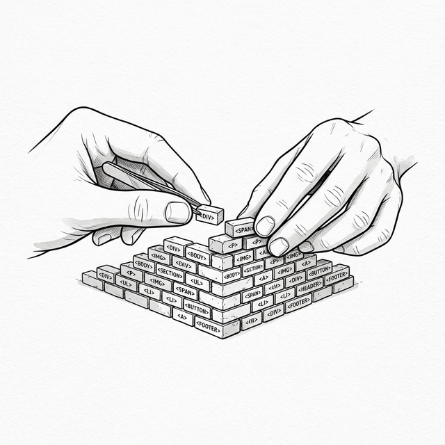

# 第一章：原生 DOM —— 一切的起点 (The Raw DOM)



## 1.1 从零开始的挑战


 Student 轻轻敲了敲门，走进了房间。Master 正在闭目养神，面前放着一杯热茶。

**Student**：Master，我想要学习 React。我听说它是构建现代 Web 应用的最佳工具，我想知道它是如何工作的。

**Master**：React 确实是一把利剑。但通过它，你想要解决什么问题呢？

**Student**：解决……构建界面的问题？大家都说用它写代码更清晰，维护更容易。

**Master**：为了理解“清晰”，我们必须先见识“混沌”。如果不理解痛楚，就无法感激良药。在开始学习 React 之前，我们要先回到原点。

**Student**：回到原点？

**Master**：是的。忘掉所有的框架。没有 React，没有 Vue，也没有 Angular。请用最原始的 JavaScript，构建一个 **待办事项列表 (Todo List)**。
需求如下：

1.  有一个输入框和“添加”按钮。
2.  点击按钮，将输入框的内容添加到下方的列表中。
3.  双击列表项，将其删除。

**Student**：只用原生 JavaScript 吗？这听起来并不复杂。我会尝试一下。

## 1.2 Student 的尝试 (The Imperative Way)

Student 打开编辑器，创建了 `index.html` 和 `app.js`。一段时间后，他展示了自己的成果。

**HTML:**
```html
<!DOCTYPE html>
<html>
<body>
  <div id="app">
    <h1>My Todo List</h1>
    <input type="text" id="todo-input" placeholder="Add a task">
    <button id="add-btn">Add</button>
    <ul id="todo-list"></ul>
  </div>
  <script src="app.js"></script>
</body>
</html>
```

**JavaScript (app.js):**
```javascript
const input = document.getElementById('todo-input');
const addBtn = document.getElementById('add-btn');
const list = document.getElementById('todo-list');

addBtn.addEventListener('click', function() {
  const value = input.value;
  
  if (!value) return; // 忽略空值

  // 1. 创建 li 元素
  const li = document.createElement('li');
  
  // 2. 设置内容
  li.textContent = value;
  
  // 3. 添加删除功能（双击删除）
  li.addEventListener('dblclick', function() {
    list.removeChild(li);
  });

  // 4. 添加到 ul 中
  list.appendChild(li);

  // 5. 清空输入框
  input.value = '';
});
```

**Student**：Master，我完成了。逻辑很直观：获取输入，创建元素，绑定事件，插入 DOM。这就是最纯粹的 JavaScript，不是吗？

## 1.3 痛点分析：命令式编程

**Master**：代码确实可以运行。但是，Student，当你编写这段代码时，你的思维方式是怎样的？

**Student**：我在思考步骤。首先拿到值，然后造个标签，再把它放进去……

**Master**：正是如此。这就是 **命令式编程 (Imperative Programming)** 。你像一个工头，指挥着浏览器这个工人，一步一步地告诉它该做什么。

*   “去获取那个元素。”
*   “创建一个新节点。”
*   “修改它的文本。”
*   “把它插到那里。”

**Student**：给计算机下达指令，这难道不是编程的本义吗？

**Master**：对于简单的任务，这确实有效。但如果需求变得复杂呢？
假设现在的需求变更：**“当列表为空时，显示'暂无数据'；当有数据时，隐藏这句话。”**

**Student**：那我可以在添加和删除的时候，加一个检查判断。

```javascript
// Student 修改后的代码片段
function checkEmpty() {
  if (list.children.length === 0) {
    emptyMsg.style.display = 'block';
  } else {
    emptyMsg.style.display = 'none';
  }
}

// 在添加逻辑末尾调用
addBtn.addEventListener('click', function() {
   // ... 添加逻辑 ...
   checkEmpty();
});

// 在删除逻辑末尾调用
// ... list.removeChild(li); checkEmpty(); ...
```

**Master**：好的，第二个需求变更来了：**“给每个 todo 增加一个复选框，标记完成/未完成。并在列表上方实时显示'已完成 X / 总共 Y 项'的统计。”**

**Student**：嗯……那我需要给每个 `li` 创建一个 `checkbox`，绑定 `change` 事件来切换样式。统计的话，我需要在 添加、删除、以及每次切换复选框的时候，都去遍历一遍列表里的所有元素来计数……

```javascript
// 创建 checkbox
const checkbox = document.createElement('input');
checkbox.type = 'checkbox';
checkbox.addEventListener('change', function() {
  if (checkbox.checked) {
    li.style.textDecoration = 'line-through';
    li.style.color = '#999';
  } else {
    li.style.textDecoration = 'none';
    li.style.color = '#000';
  }
  updateStats(); // 每次切换都要更新统计
});
li.prepend(checkbox);

// 统计函数
function updateStats() {
  const allItems = list.querySelectorAll('li');
  const doneItems = list.querySelectorAll('li input:checked');
  statsEl.textContent = `已完成 ${doneItems.length} / 总共 ${allItems.length} 项`;
}

// 别忘了：添加、删除的时候也要调用 updateStats()!
```

**Master**：你发现了吗？仅仅两个需求变更，你的代码已经变得面目全非了。每当你修改 UI 的一部分（添加、删除、切换状态），你都必须记得去更新 **所有** 与之关联的部分（空状态提示 **和** 统计数字）。一旦遗漏一个 `updateStats()` 调用，界面就会出 Bug。
随着应用变大，这种手动维护的依赖关系会像藤蔓一样缠绕在一起，最终变成难以维护的 **面条代码 (Spaghetti Code)**。

**Student**：我明白您的意思了。手动管理每一个状态的同步确实很累。

## 1.4 性能隐患：回流与重绘 (Reflow & Repaint)

**Master**：除了维护性的问题，还有一个隐藏的代价——**性能**。
当你执行 `list.appendChild(li)` 时，浏览器并非只是简单的“画上去”。

**Student**：它还需要做什么？

**Master**：它必须重新计算布局（Reflow），确定每个元素的位置和大小，然后重新绘制（Repaint）。
如果你在一个循环中操作 DOM：

```javascript
for (let i = 0; i < 1000; i++) {
  const li = document.createElement('li');
  li.textContent = 'Item ' + i;
  list.appendChild(li);
  li.offsetHeight; // 强制浏览器立即计算布局，阻止批量优化
}
```

这就像是你每搬一块砖，就要求工人重新测量整栋楼的尺寸。虽然现代浏览器会做优化（批量合并），但这种"随心所欲"的修改方式，始终潜藏着性能风险。

别急，之后我会给你一个 demo，你将亲手体验一键插入 5000 个任务后的卡顿。

## 1.5 状态的迷失 (State vs DOM)

**Master**：最后一个，也是最根本的问题。Student，在这个应用中，**数据 (State)** 究竟在哪里？

**Student**：数据……就是列表里的那些 `li` 元素吧？checkbox 的选中状态也在 DOM 上。

**Master**：没错。你的数据 **寄生在 DOM 之中**。

- 要统计数量？你去数 DOM 节点。
- 要获取内容？你去读 DOM 的文本。
- 要判断完成？你去查 checkbox 的 `checked` 属性。

这意味着，**DOM 既是你的展示层 (View)，又是你的数据层 (Model)**。
当 UI 变得复杂，比如一个大型表格或即时通讯软件，你需要从成千上万个 DOM 节点中“搜刮”数据来处理逻辑，那将是一场灾难。

**Student**：那么，正确的方式是什么？

**Master**：在于 **分离**。数据 (State) 应该是唯一的真相来源，而视图 (View) 只是它的投影。当数据改变时，视图应该自动更新以反映最新的状态，而不是由我们手动去一处处修补 DOM。
但在原生 JavaScript 的时代，要做到这一点，我们需要付出巨大的努力。

## 1.6 回头看看这段路

**Master**：现在，你看到了原生 DOM 操作的局限性了吗？

1. **命令式**：繁琐的步骤指令，每个需求变更都导致代码膨胀。
2. **性能**：昂贵的 DOM 操作，缺乏批量更新意识。
3. **耦合**：数据与视图混杂，“真相”散落在 DOM 各处。

**Student**：是的，Master。功能越多，需要手动同步的地方就越多，漏掉任何一处都是 Bug。这样写下去，迟早会被自己的代码淹没。我们该如何改进呢？

**Master**：为了从繁琐的指令中解脱，我们必须改变思考方式。我们不应再像工头一样下达“如何做”的指令，而应该直接描述“要什么”。

**Student**：描述“要什么”？如果不一步步告诉浏览器怎么做，它怎么知道怎么画呢？

**Master**：我们可以把界面看作一段文本，一段描述结构的字符串。与其精雕细琢每一块砖，不如直接打印整面墙。

**Student**：这听起来……有点粗暴。

**Master**：是的，但这开启了一个新的时代。

---

### 📦 目前的成果

将以下代码保存为 `ch01.html`，用浏览器打开即可运行：

> ⚠️ **关于下方 Demo 的说明**：在 Demo 代码中，我们故意在每次 `appendChild` 之后调用 `li.offsetHeight`。这会**强制**浏览器立即计算布局（同步回流），模拟在复杂真实应用中（如大型数据表格或富文本编辑器）会遇到的重量级 DOM 操作。如果没有这个强制回流，现代浏览器会批量处理 DOM 操作，卡顿就不会那么明显。我们用它来让性能问题**清晰可见**。

```html
<!DOCTYPE html>
<html lang="zh-CN">
<head>
  <meta charset="UTF-8">
  <title>Chapter 1 — Raw DOM Todo List</title>
  <style>
    body { font-family: sans-serif; max-width: 500px; margin: 40px auto; }
    li { cursor: pointer; padding: 6px 0; display: flex; align-items: center; gap: 8px; }
    li:hover { color: #999; }
    li.done span { text-decoration: line-through; color: #999; }
    #empty-msg { color: #999; font-style: italic; }
    #stats { font-size: 14px; color: #666; margin-top: 10px; }
    .perf-btn { margin-top: 20px; background: #ff4444; color: white; border: none; padding: 8px 16px; cursor: pointer; border-radius: 4px; }
    .perf-btn:hover { background: #cc0000; }
  </style>
</head>
<body>
  <h1>My Todo List</h1>
  <input type="text" id="todo-input" placeholder="Add a task">
  <button id="add-btn">Add</button>
  <p id="empty-msg">暂无数据</p>
  <p id="stats">已完成 0 / 总共 0 项</p>
  <ul id="todo-list"></ul>

  <hr>
  <p><strong>性能实验：</strong>点击下方按钮，一次性插入 5000 个任务，<br>观察浏览器的卡顿。</p>
  <button class="perf-btn" id="perf-btn">⚡ 插入 5000 个任务</button>

  <script>
    const input = document.getElementById('todo-input');
    const addBtn = document.getElementById('add-btn');
    const list = document.getElementById('todo-list');
    const emptyMsg = document.getElementById('empty-msg');
    const statsEl = document.getElementById('stats');

    // === 痛点 1: 每次状态变化，都要手动同步多处 UI ===
    function checkEmpty() {
      emptyMsg.style.display = list.children.length === 0 ? 'block' : 'none';
    }

    function updateStats() {
      const allItems = list.querySelectorAll('li');
      const doneItems = list.querySelectorAll('li.done');
      statsEl.textContent = `已完成 ${doneItems.length} / 总共 ${allItems.length} 项`;
    }

    function addTodoItem(text) {
      const li = document.createElement('li');

      // 创建 checkbox
      const checkbox = document.createElement('input');
      checkbox.type = 'checkbox';
      checkbox.addEventListener('change', function() {
        if (checkbox.checked) {
          li.classList.add('done');
        } else {
          li.classList.remove('done');
        }
        updateStats(); // 别忘了更新统计！
      });

      // 创建文本
      const span = document.createElement('span');
      span.textContent = text;

      li.appendChild(checkbox);
      li.appendChild(span);

      // 删除功能
      li.addEventListener('dblclick', function() {
        list.removeChild(li);
        checkEmpty();    // 别忘了更新空状态！
        updateStats();   // 别忘了更新统计！
      });

      list.appendChild(li);
      // ⚠️ 强制同步回流（详见上方说明）
      li.offsetHeight;
      checkEmpty();      // 别忘了更新空状态！
      updateStats();     // 别忘了更新统计！
    }

    addBtn.addEventListener('click', function() {
      const value = input.value.trim();
      if (!value) return;
      addTodoItem(value);
      input.value = '';
    });

    // === 痛点 2: 性能实验 — 大量 DOM 操作的卡顿 ===
    document.getElementById('perf-btn').addEventListener('click', function() {
      const start = performance.now();
      for (let i = 0; i < 5000; i++) {
        addTodoItem('Task #' + (i + 1));
      }
      const elapsed = (performance.now() - start).toFixed(0);
      alert(`插入 5000 个 DOM 节点耗时：${elapsed}ms\n\n(在此过程中，浏览器完全无法响应你的操作)`);
    });

    checkEmpty();
    updateStats();
  </script>
</body>
</html>
```

*(下一章：模板时代——UI 即字符串)*
