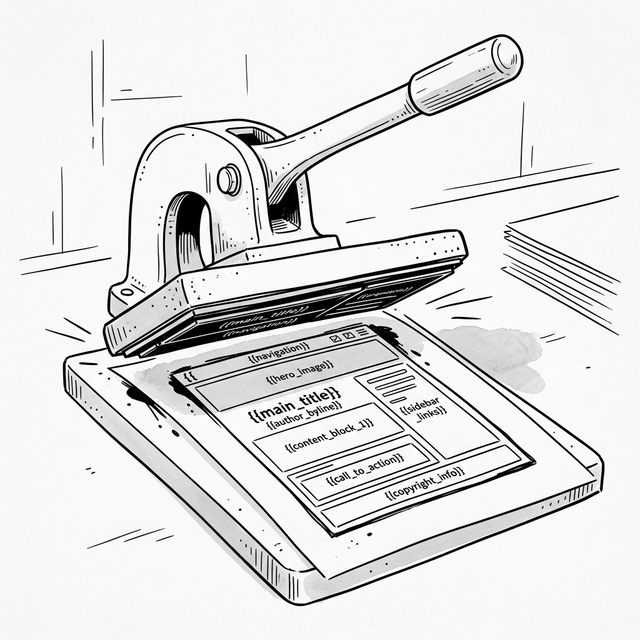

# 第二章：模板时代 —— UI 即字符串 (The Template Era)



## 2.1 描述而非指令

Po 再次来到 Shifu 的房间。他的神情比上次轻松了一些，但依然带着困惑。

**🐼**：Shifu，上次您说“把界面看作一段文本”。回去后我试了一下，直接拼接 HTML 字符串确实比一个一个创建节点要快得多。比如第一章的渲染逻辑：

```javascript
function renderApp() {
  let html = '<h1>My Todo List</h1>'
           + '<input type="text" id="todo-input" placeholder="Add a task">'
           + '<button onclick="addTodo()">Add</button>'
           + '<ul>';
  
  for (let i = 0; i < todos.length; i++) {
    html += '<li>' + todos[i] + '</li>';
  }
  
  html += '</ul>';
  app.innerHTML = html;
}
```

现在只需要一次性调用 `innerHTML`！

**🧙‍♂️**：不再像工头一样指挥每一块砖的去向，感觉如何？

**🐼**：感觉自由了。我只需要关心“它看起来应该是什么样”，而不是“怎么把它造出来”。但是……

**🧙‍♂️**：但是？

**🐼**：代码变得很难看。各种引号、加号满天飞。

**🧙‍♂️**：那是因为你还在用原始的语言。让我们来创造一种简单的 **模板 (Template)** 语法，让数据填入骨架之中。

## 2.2 简单的模板引擎

**🧙‍♂️**：我们需要一个函数，它接受一个包含“坑位”的字符串模板，和一些数据，然后返回填好数据的 HTML。

**🐼**：像这样吗？

```javascript
const template = '<li>{{content}}</li>';
const data = { content: 'Buy Milk' };
// 期望结果: <li>Buy Milk</li>
```

**🧙‍♂️**：正是。试着实现它。

Po 思考片刻，写下了一个基于正则表达式的简单实现。

```javascript
function render(template, data) {
  return template.replace(/\{\{(\w+)\}\}/g, function(match, key) {
    return data[key] || '';
  });
}

// 使用
const task = { content: 'Learn React' };
const html = render('<li>{{content}}</li>', task);
console.log(html); // <li>Learn React</li>
```

**🧙‍♂️**：很好。这是模板引擎的核心原理——用数据填充模板中的“坑位”。ES6 的模板字符串 (Template Literals) 实际上就是同样的概念，只是由语言原生支持，更加方便：

```javascript
// 我们的 render 函数：
render('<li>{{content}}</li>', { content: task })

// ES6 模板字符串（本质相同，但语法更简洁）：
`<li>${task}</li>`
```

**🐼**：明白了！模板字符串就是语言内置的模板引擎。

**🧙‍♂️**：没错。现在，用这个思路重构你的 Todo List。不再有 `document.createElement`，不再有 `appendChild`。

## 2.3 用模板重写 Todo List

**🐼**：好的！

```javascript
const app = document.getElementById('app');
const state = {
  todos: [
    { text: 'Learn JavaScript', done: true },
    { text: 'Learn Templates', done: false }
  ],
  inputValue: ''
};

function renderApp() {
  const html = `
    <div class="card">
      <h3>My Todo List</h3>
      <div>
        <input type="text" id="todo-input" value="${state.inputValue}">
        <button id="add-btn">Add</button>
      </div>
      <p id="stats">总共 ${state.todos.length} 项</p>
      <ul style="padding-left: 0;">
        ${state.todos.map((todo, index) => `
          <li class="${todo.done ? 'done' : ''}">
            <div class="task-content">
              <input type="checkbox" class="toggle-btn" data-index="${index}" ${todo.done ? 'checked' : ''}>
              <span>${todo.text}</span>
            </div>
            <button class="delete-btn" data-index="${index}">×</button>
          </li>
        `).join('')}
      </ul>
    </div>
  `;
  
  // 1. 毁灭与重建
  app.innerHTML = html;

  // 2. 重新寻找节点并绑定事件（展示模板时代的痛点！）
  document.getElementById('todo-input').addEventListener('input', (e) => {
    state.inputValue = e.target.value;
    // 每次输入都会导致整个视图重绘
    renderApp(); 
  });

  document.getElementById('add-btn').addEventListener('click', () => {
    if (!state.inputValue) return;
    state.todos.push({ text: state.inputValue, done: false });
    state.inputValue = '';
    renderApp();
  });

  document.querySelectorAll('.delete-btn').forEach(btn => {
    btn.addEventListener('click', (e) => {
      const index = e.target.dataset.index;
      state.todos.splice(index, 1);
      renderApp();
    });
  });

  document.querySelectorAll('.toggle-btn').forEach(checkbox => {
    checkbox.addEventListener('change', (e) => {
      const index = e.target.dataset.index;
      state.todos[index].done = !state.todos[index].done;
      renderApp();
    });
  });
}

// 初始化
renderApp();
```

**🐼**：哇，结构一目了然。我只需要修改数据 `state`，然后调用 `renderApp()`，界面就自动更新了。统计数字也不用手动同步了——它就在模板里，随数据自动变化！

**🧙‍♂️**：你察觉到了精妙之处。在第一章里，你需要手动调用 `updateStats()` 来同步统计数字。现在，统计数字只是状态的 **衍生物**——只要状态变了，重新渲染整个模板，一切都自动同步。
你这种写法本质上就是 **声明式编程 (Declarative Programming)** 的雏形——你声明了“状态对应的视图是什么”，而不用关心状态变化时如何去更新视图。

## 2.4 毁灭与重建 (The Blow-away Problem)

**🧙‍♂️**：但是，Po，去试用一下你的新作品。试着在输入框里打几个字。

Po 在浏览器里打开页面，点击输入框，输入了字母 “A”。
突然，输入框失去了焦点（Focus）。他必须重新点击输入框才能输入下一个字母 “B”。再次输入，焦点又丢了。

**🐼**：这是怎么回事？每打一个字，我就得重新点一下输入框？这简直没法用！

**🧙‍♂️**：思考一下整条链路。当你按下 “A” 键的那一刻，发生了什么？

```
按下 "A"
  → 触发 input 事件
    → updateInput() 调用 renderApp()
      → renderApp() 生成新 HTML 字符串
        → app.innerHTML = html  ← 旧的 DOM 树被全部销毁！
          → 浏览器用新 DOM 替代旧 DOM
            → 新 input 没有焦点 → 你必须重新点击
```

**🐼**：啊，我明白了！每打一个字，整棵 DOM 树就被销毁重建一次！

**🧙‍♂️**：没错。这就好比因为你要换一个灯泡，所以把整栋房子推倒重建。

*   因为 DOM 是新创建的，之前的输入框元素已经“死”了。
*   新的输入框虽然长得一样，但它是一个全新的元素。
*   全新的元素当然没有焦点，也没有你的光标位置。

这就是 **“毁灭与重建” (The Destruction and Recreation)** 的代价。简单粗暴，但用户体验极差。

## 2.5 安全隐患 (XSS)

**🧙‍♂️**：除了体验问题，还有一个更可怕的魔鬼隐藏在字符串中。
如果我添加这样一个任务，会发生什么？

```javascript
state.todos.push('');
renderApp();
```

**🐼**：模板会把它直接拼接到 HTML 里……然后浏览器会把它当成真的 `` 标签执行……天哪，我的脚本被执行了！

**🧙‍♂️**：这就是 **跨站脚本攻击 (XSS)**。字符串是愚钝的，它分不清“用户的文本”和“开发者的代码”。在模板时代，你必须时刻警惕，小心翼翼地转义每一个用户输入，否则你的应用就是黑客的游乐场。

这不是“弹个窗”的玩笑——在现实世界中，攻击者可以通过 XSS 窃取用户的 Cookie 和 Session Token，从而劫持用户会话。

**🐼**：等等——在第一章里，我们用 `textContent` 来设置列表项的文本。那样不会有这个问题吧？

**🧙‍♂️**：没错！`textContent` 把所有内容当作纯文本处理，所以 `` 会被显示为字面文字，而不会被执行。但 `innerHTML` 会把字符串当成 HTML 代码来解析。这就是便利的代价——字符串模板写着方便，却给攻击打开了大门。

这正是后来的框架（React、Vue）不再使用字符串来描述 UI 的原因。它们使用**结构化对象**。用户输入会被自动转义——除非你显式使用 `dangerouslySetInnerHTML` 或 `v-html`。

## 2.6 历史的脚注：Logic-less Templates (2009-2010)

**🧙‍♂️**：我们的简单的 `render` 函数其实就是模板引擎的雏形。在 2009 年左右，为了解决字符串拼接的混乱，出现了 **Mustache.js**。

> **背景**：Mustache 主张 “Logic-less templates”（无逻辑模板）。它认为模板里不应该有 `if`/`for` 这样的逻辑，所有的逻辑都应该在数据层处理好。

**🧙‍♂️**：后来，**Handlebars.js (2010)** 在此基础上增加了更多的功能（Helper functions），成为了当时最流行的模板引擎。人们开始习惯将数据和 HTML 结构分离。

```html
<!-- Handlebars 风格 -->
<ul>
  {{#each todos}}
    <li>{{this}}</li>
  {{/each}}
</ul>
```

**🐼**：`{{each}}` 和 `{{this}}`……这和我们刚才写的 `render` 函数的 `{{key}}` 语法很像！原来我们重新发明了模板引擎。

**🧙‍♂️**：是的。模板的思想深深影响了后来的框架。但无论模板语法多高级，只要它最终是编译成 HTML 字符串并赋值给 `innerHTML`，它就逃不脱“毁灭与重建”的宿命。

## 2.7 再往前一步

**🧙‍♂️**：模板让我们从命令式的泥潭中脱身，第一次看见了声明式编程的曙光。但它并非完美的终点。

1.  **性能与体验**：`innerHTML` 的全量更新导致了“失去焦点”和性能浪费。
2.  **安全性**：字符串拼接天然容易导致 XSS。

**🐼**：我们既想要声明式的简洁（数据变了就重新生成界面），又不想每次都“推倒重建”，该怎么办呢？
如果我们能知道 **具体是哪一部分数据变了**，只更新那一部分，不就好了吗？

**🧙‍♂️**：你触碰到了问题的核心。为了实现这一点，我们需要一种机制来监听数据的变化，并在变化发生时，精准地手术式更新 DOM。

**🐼**：就像给数据装上“报警器”？

**🧙‍♂️**：是的。那是一个充满精巧设计的时代，也是一个复杂度开始爆炸的时代。

---

### 📦 实践一下

将以下代码保存为 `ch02.html`，体验字符串模板带来的声明式写法，以及全量重绘导致的焦点丢失和潜在的 XSS 风险：

```html
<!DOCTYPE html>
<html lang="zh-CN">
<head>
  <meta charset="UTF-8">
  <title>Chapter 2 — Template Engine</title>
  <style>
    body { font-family: sans-serif; padding: 20px; max-width: 600px; margin: 0 auto; background: #f9f9f9; }
    .card { border: 1px solid #ddd; border-radius: 8px; padding: 15px; margin: 15px 0; background: white; }
    .card h3 { margin-top: 0; }
    button { padding: 6px 12px; cursor: pointer; margin: 4px; border-radius: 4px; border: 1px solid #ccc; background: #eee; }
    li { padding: 8px 0; border-bottom: 1px solid #eee; display: flex; justify-content: space-between; align-items: center; list-style: none; }
    li .task-content { display: flex; align-items: center; gap: 8px; }
    li.done span { text-decoration: line-through; color: #999; }
    li .delete-btn { background: #ff4444; color: white; border: none; padding: 4px 8px; border-radius: 4px; cursor: pointer; }
    input[type="text"] { padding: 8px; width: 60%; border-radius: 4px; border: 1px solid #ccc; }
    #stats { font-size: 14px; color: #666; margin-top: 10px; }
  </style>
</head>
<body>
  <div id="app"></div>

  <script>
    const app = document.getElementById('app');
    
    // 1. 状态
    const state = {
      todos: [
        { text: 'Learn JavaScript', done: true },
        { text: 'Learn Templates', done: false }
      ],
      inputValue: ''
    };

    // 2. 简单的模板函数
    // 这是一个极简实现，主要演示原理
    function renderApp() {
      // 没有任何 Diff，直接生成全量 HTML 字符串
      const html = `
        <div class="card">
          <h3>My Todo List</h3>
          <div>
            <input type="text" id="todo-input" value="${state.inputValue}" placeholder="Add a task">
            <button id="add-btn">Add</button>
          </div>
          <p id="stats">总共 ${state.todos.length} 项</p>
          <ul id="todo-list" style="padding-left: 0; margin-bottom: 0;">
            ${state.todos.map((todo, index) => `
              <li class="${todo.done ? 'done' : ''}">
                <div class="task-content">
                  <input type="checkbox" class="toggle-btn" data-index="${index}" ${todo.done ? 'checked' : ''}>
                  <span>${todo.text}</span>
                </div>
                <button class="delete-btn" data-index="${index}">×</button>
              </li>
            `).join('')}
          </ul>
          <p style="color:red; font-size:12px;">提示：尝试在输入框打字，注意焦点的丢失</p>
        </div>
        <div class="card">
          <p style="font-size:12px; margin-top: 0;">🔓 <strong>XSS 实验</strong>：在下方输入框输入<br>
          <code>&lt;img src=x onerror=alert("Hacked!")&gt;</code><br>然后点击 "Inject"，观察发生了什么。</p>
          <input type="text" id="xss-input" placeholder="输入恶意 HTML...">
          <button id="inject-btn">Inject</button>
        </div>
      `;
      
      // 3. 毁灭与重建：性能杀手 & 体验杀手
      app.innerHTML = html;

      // 4. 重建 DOM 后，必须重新绑定所有事件 (痛点展现)
      const inputEl = document.getElementById('todo-input');
      if (inputEl) {
        inputEl.addEventListener('input', (e) => {
          state.inputValue = e.target.value; 
          renderApp(); // 每次按键都重绘！
        });
        // 为了体验，我们可以刻意不去做获得焦点的 hack，让用户体会“失去焦点”
      }

      const addBtn = document.getElementById('add-btn');
      if (addBtn) {
        addBtn.addEventListener('click', () => {
          if (!state.inputValue) return;
          state.todos.push({ text: state.inputValue, done: false });
          state.inputValue = '';
          renderApp();
        });
      }

      document.querySelectorAll('.delete-btn').forEach(btn => {
        btn.addEventListener('click', (e) => {
          const index = e.target.dataset.index;
          state.todos.splice(index, 1);
          renderApp();
        });
      });

      document.querySelectorAll('.toggle-btn').forEach(checkbox => {
        checkbox.addEventListener('change', (e) => {
          const index = e.target.dataset.index;
          state.todos[index].done = !state.todos[index].done;
          renderApp();
        });
      });

      // XSS 实验事件绑定
      const injectBtn = document.getElementById('inject-btn');
      if (injectBtn) {
        injectBtn.addEventListener('click', () => {
          const xssInput = document.getElementById('xss-input');
          if (!xssInput || !xssInput.value) return;
          state.todos.push({ text: xssInput.value, done: false });
          renderApp();
        });
      }
    }

    // 初始化渲染
    renderApp();
  </script>
</body>
</html>
```