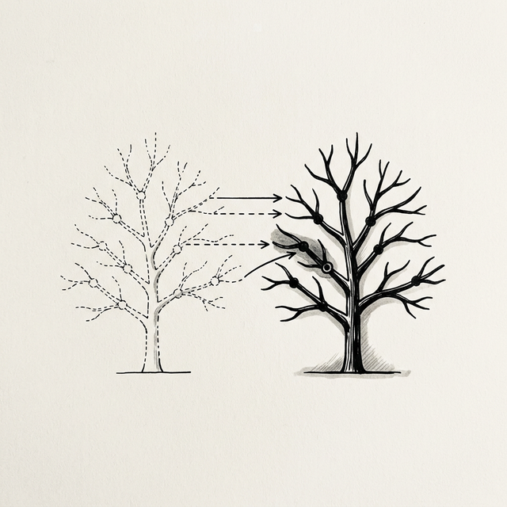

# 第五章：虚拟 DOM —— 解决性能危机的钥匙 



## 5.1 廉价的替身

Student 拿着上一章生成的 `vdom` 对象，若有所思。我们继续用 Counter 例子来完成引擎的核心部分。

**Student**：Master，我承认 `UI = f(state)` 的理念很美。但是，每次状态改变都生成这么一大堆对象，还要去对比差异，难道不会比直接操作 DOM 更慢吗？

**Master**：这是一个常见的误解。Student，告诉我，在浏览器中创建一个 `div` 元素（真实 DOM）和创建一个普通的 JavaScript 对象（虚拟 DOM），哪个更昂贵？

**Student**：我想……应该是真实 DOM 吧？因为它身上背负着浏览器的各种属性、样式、事件监听器。

**Master**：没错。真实的 DOM 就像是一个装备齐全的重装骑士，而 JavaScript 对象只是写在纸上的名字。你可以瞬间创建成千上万个对象，但创建同样数量的真实节点会让浏览器卡死。
虚拟 DOM (Virtual DOM) 就是真实 DOM 的 **廉价替身**。我们在替身身上进行演练（Diff），确切知道需要做什么动作后，再让重装骑士（真实 DOM）去执行。

## 5.2 制造替身 (h function)

**Master**：首先，我们需要一个工具函数来帮我们快速生成虚拟节点。在 React 社区，它通常被称为 `h` (Hyperscript) 或者 `createElement`。

**Student**：这个简单。

```javascript
function h(tag, props, children) {
  return {
    tag,
    props: props || {},
    children: children || []
  };
}

// 使用示例
const vnode = h('div', { id: 'app' }, [
  h('h1', null, ['Hello World']),
  h('p', null, ['This is a VNode'])
]);
```

**Master**：很好。注意，`h` 函数约定 `children` 始终是一个 **数组**，数组中的元素可以是字符串（文本节点）或另一个 VNode 对象。在后续的 `mount` 和 `patch` 中，我们会增加一些防御性处理（比如当 children 是单个字符串时的情形），以增强健壮性。

现在我们需要一个 `mount` 函数，把这个虚拟的树变成真实的树，挂载到页面上。

**Student**：这也不难。递归遍历就行了。

```javascript
function mount(vnode, container) {
  // 处理文本节点
  if (typeof vnode === 'string' || typeof vnode === 'number') {
    const textNode = document.createTextNode(vnode);
    container.appendChild(textNode);
    return textNode;
  }

  // 1. 创建真实元素
  const el = (vnode.el = document.createElement(vnode.tag));

  // 2. 处理属性 (Props)
  for (const key in vnode.props) {
    if (key.startsWith('on')) {
      el.addEventListener(key.slice(2).toLowerCase(), vnode.props[key]);
    } else {
      el.setAttribute(key, vnode.props[key]);
    }
  }

  // 3. 处理子节点
  // 防御性处理：children 可能是字符串（简写）或数组（标准）
  // 字符串形式如 h('p', null, 'Hello')，数组形式如 h('p', null, ['Hello'])
  if (typeof vnode.children === 'string') {
    el.textContent = vnode.children;
  } else {
    vnode.children.forEach(child => {
      // 文本节点：直接创建 TextNode
      if (typeof child === 'string' || typeof child === 'number') {
        el.appendChild(document.createTextNode(child));
      } else {
        // VNode 对象：递归挂载
        mount(child, el);
      }
    });
  }

  // 4. 挂载
  container.appendChild(el);
}
```

## 5.3 核心算法：Diff (patch function)

**Master**：关键时刻到了。如果状态变了，我们生成了一棵新的树 `newVNode`。我们要如何对比它和旧树 `oldVNode` 的差异，并只更新变动的部分？

**Student**：这听起来情况很多……

**Master**：我们可以把情况简化为几种：

1.  **节点类型变了**（比如 `div` 变成了 `p`）：直接把旧的换成新的。
2.  **节点类型一样**：
    *   **属性变了**：更新属性。
    *   **子节点变了**：递归对比子节点。

为了保持简单，我们先不处理列表排序（那是另一个深渊），只处理简单的替换。

下面这张流程图展示了 `patch` 的核心决策过程：



> ⚠️ **简化说明**：我们的 `patch` 假设 `oldVNode` 和 `newVNode` 都是带 `.tag` 属性的元素对象。如果一个是文本节点（纯字符串），另一个是元素对象，函数不会正确处理。文本↔元素的转换在*父级*层面（children 循环内部）处理。真正的 React 通过统一的 Fiber 节点类型系统来解决这个问题。

**Student**：我来试试。

```javascript
function patch(oldVNode, newVNode) {
  // 情况 1: 标签类型不同 → 替换整个节点
  if (oldVNode.tag !== newVNode.tag) {
    const parent = oldVNode.el.parentNode;
    // 先创建新的 DOM 树
    const tempContainer = document.createElement('div');
    mount(newVNode, tempContainer);
    // 用新节点替换旧节点
    parent.replaceChild(newVNode.el, oldVNode.el);
    return;
  }

  // 情况 2: 标签一样，复用 DOM 节点
  const el = (newVNode.el = oldVNode.el);

  // 2.1 更新属性 (Props)
  const oldProps = oldVNode.props || {};
  const newProps = newVNode.props || {};

  // 添加/更新属性
  for (const key in newProps) {
    if (oldProps[key] !== newProps[key]) {
      if (key.startsWith('on')) {
        const eventName = key.slice(2).toLowerCase();
        if (oldProps[key]) el.removeEventListener(eventName, oldProps[key]);
        el.addEventListener(eventName, newProps[key]);
      } else {
        el.setAttribute(key, newProps[key]);
      }
    }
  }

  // 移除旧的属性
  for (const key in oldProps) {
    if (!(key in newProps)) {
      if (key.startsWith('on')) {
        const eventName = key.slice(2).toLowerCase();
        el.removeEventListener(eventName, oldProps[key]);
      } else {
        el.removeAttribute(key);
      }
    }
  }

  // 2.2 更新子节点 (Children)
  const oldChildren = oldVNode.children;
  const newChildren = newVNode.children;

  // 简化处理：如果新旧 children 类型不同（字符串 vs 数组），
  // 直接清空并重新渲染
  if (typeof newChildren === 'string') {
    if (oldChildren !== newChildren) {
      el.textContent = newChildren;
    }
  } else if (typeof oldChildren === 'string') {
    // 旧的是字符串，新的是数组 → 清空后挂载
    el.textContent = '';
    newChildren.forEach(child => mount(child, el));
  } else {
    // 都是数组：逐个比较
    const commonLength = Math.min(oldChildren.length, newChildren.length);
    
    // 1. 更新共有的节点
    for (let i = 0; i < commonLength; i++) {
      const oldChild = oldChildren[i];
      const newChild = newChildren[i];
      
      // 处理文本节点 vs 文本节点
      if ((typeof oldChild === 'string' || typeof oldChild === 'number') && 
          (typeof newChild === 'string' || typeof newChild === 'number')) {
        if (oldChild !== newChild) {
          el.childNodes[i].textContent = newChild;
        }
      } 
      // 处理 VNode vs VNode
      else if (typeof oldChild === 'object' && typeof newChild === 'object') {
        patch(oldChild, newChild);
      } 
      // 类型不同 → 替换
      else {
        const tempContainer = document.createElement('div');
        if (typeof newChild === 'string' || typeof newChild === 'number') {
          el.replaceChild(document.createTextNode(newChild), el.childNodes[i]);
        } else {
          mount(newChild, tempContainer);
          el.replaceChild(newChild.el, el.childNodes[i]);
        }
      }
    }
    
    // 2. 添加新节点
    if (newChildren.length > oldChildren.length) {
      newChildren.slice(oldChildren.length).forEach(child => mount(child, el));
    }
    
    // 3. 删除多余节点
    if (newChildren.length < oldChildren.length) {
      for (let i = oldChildren.length - 1; i >= commonLength; i--) {
        el.removeChild(el.childNodes[i]);
      }
    }
  }
}
```

**Student**：呼……即使是简化版，这也比我想象的要复杂。

**Master**：是的。Diff 算法是 Virtual DOM 的心脏。React 在这里做了大量的优化，比如：

*   **同层比较**：React 只会对比同一层级的节点，不会跨层级移动。
*   **Key 属性**：在列表中，通过 `key` 来识别节点的移动，而不是傻傻地一个个对比。

### Key 的重要性

**Student**：Master，什么时候需要 `key`？

**Master**：想象你有一个列表 `['A', 'B', 'C']`，然后变成了 `['C', 'A', 'B']`（只是顺序变了）。没有 `key` 的情况下，我们的 `patch` 会怎么做？

**Student**：它会按索引逐个对比：
- 位置 0: 'A' → 'C'，更新文本
- 位置 1: 'B' → 'A'，更新文本
- 位置 2: 'C' → 'B'，更新文本

它做了 3 次文本更新！

**Master**：但如果每个节点都有一个唯一的 `key`（比如 `key: 'a'`, `key: 'b'`, `key: 'c'`），React 就能识别出“这三个节点都还在，只是换了位置”，然后通过移动 DOM 节点来完成——这可能比重新创建更高效。在我们的简化版中不实现 `key`，但在真实的 React 中，这是列表渲染性能的关键。

## 5.4 完整的闭环

**Master**：现在，把这一章的 `patch` 和上一章的 `render` 结合起来，我们就得到了 React 的雏形。

1.  初始化：`const oldVNode = render(state); mount(oldVNode, app);`
2.  更新：
    ```javascript
    state.count++;
    const newVNode = render(state);
    patch(oldVNode, newVNode);
    oldVNode = newVNode; // 更新引用
    ```

**Student**：我明白了！
虽然我们在逻辑上是“重新生成了整个 UI 树”，但在底层，你通过 `patch` 函数，把这个操作转换成了几个简单的 DOM 更新指令。
这就是为什么 React 既能写得像模板一样简单，又能跑得像手动优化一样快！

**Master**：正是。你已经掌握了 React 的静态核心。
但是，现在的 UI 还是“死”的，只是数据的投影。如果我想让 UI 拥有自己的生命——比如一个组件有自己的状态，有自己的生命周期，该怎么办？

**Student**：组件？生命周期？

**Master**：是的。下一章，我们将把这一堆零散的函数，封装成强大的积木。

---

### 📦 目前的成果

将以下代码保存为 `ch05.html`，这是我们第一个真正工作的 **Mini-React** 原型！
打开浏览器的开发者工具控制台，你可以看到 patch 执行了哪些 DOM 操作。

```html
<!DOCTYPE html>
<html lang="zh-CN">
<head>
  <meta charset="UTF-8">
  <title>Chapter 5 — Virtual DOM Implementation</title>
  <style>
    body { font-family: sans-serif; padding: 20px; }
    button { padding: 5px 10px; cursor: pointer; }
    .active { color: red; font-weight: bold; }
    #log { background: #f5f5f5; padding: 10px; margin-top: 15px; border-radius: 4px; 
           font-family: monospace; font-size: 12px; max-height: 200px; overflow-y: auto; }
  </style>
</head>
<body>
  <div id="app"></div>
  <h3>Patch Log (看看 Diff 具体做了什么)：</h3>
  <div id="log"></div>

  <script>
    const logEl = document.getElementById('log');
    function patchLog(msg) {
      const line = document.createElement('div');
      line.textContent = '→ ' + msg;
      logEl.prepend(line);
      console.log('[PATCH]', msg);
    }

    // === Chapter 5 Code: h, mount, patch ===

    // 1. h 函数 (Create VNode)
    function h(tag, props, children) {
      return { tag, props: props || {}, children: children || [] };
    }

    // 2. mount 函数 (VNode -> DOM)
    function mount(vnode, container) {
      if (typeof vnode === 'string' || typeof vnode === 'number') {
        container.appendChild(document.createTextNode(vnode));
        return;
      }

      const el = (vnode.el = document.createElement(vnode.tag));
      
      // 处理 props
      for (const key in vnode.props) {
        if (key.startsWith('on')) {
          el.addEventListener(key.slice(2).toLowerCase(), vnode.props[key]);
        } else {
          el.setAttribute(key, vnode.props[key]);
        }
      }

      // 处理 children
      if (typeof vnode.children === 'string') {
        el.textContent = vnode.children;
      } else {
        vnode.children.forEach(child => {
          if (typeof child === 'string' || typeof child === 'number') {
            el.appendChild(document.createTextNode(child));
          } else {
            mount(child, el);
          }
        });
      }

      container.appendChild(el);
    }

    // 3. patch 函数 (Diff) — 带日志版
    function patch(oldVNode, newVNode) {
      if (oldVNode.tag !== newVNode.tag) {
        patchLog(`REPLACE <${oldVNode.tag}> with <${newVNode.tag}>`);
        const parent = oldVNode.el.parentNode;
        const tempContainer = document.createElement('div');
        mount(newVNode, tempContainer);
        parent.replaceChild(newVNode.el, oldVNode.el);
        return;
      }

      const el = (newVNode.el = oldVNode.el);
      const oldProps = oldVNode.props || {};
      const newProps = newVNode.props || {};

      // 更新 Props
      for (const key in newProps) {
        if (oldProps[key] !== newProps[key]) {
          if (key.startsWith('on')) {
            const eventName = key.slice(2).toLowerCase();
            if (oldProps[key]) el.removeEventListener(eventName, oldProps[key]);
            el.addEventListener(eventName, newProps[key]);
          } else {
            patchLog(`SET ATTR <${newVNode.tag}>.${key} = "${newProps[key]}"`);
            el.setAttribute(key, newProps[key]);
          }
        }
      }
      // 移除旧 Props
      for (const key in oldProps) {
        if (!(key in newProps)) {
          if (key.startsWith('on')) {
            el.removeEventListener(key.slice(2).toLowerCase(), oldProps[key]);
          } else {
            patchLog(`REMOVE ATTR <${newVNode.tag}>.${key}`);
            el.removeAttribute(key);
          }
        }
      }

      // 更新 Children
      const oldCh = oldVNode.children;
      const newCh = newVNode.children;

      if (typeof newCh === 'string') {
        if (oldCh !== newCh) {
          patchLog(`SET TEXT <${newVNode.tag}> = "${newCh}"`);
          el.textContent = newCh;
        }
      } else if (typeof oldCh === 'string') {
        el.textContent = '';
        newCh.forEach(c => mount(c, el));
      } else {
        const commonLen = Math.min(oldCh.length, newCh.length);
        for (let i = 0; i < commonLen; i++) {
          const oc = oldCh[i], nc = newCh[i];
          if ((typeof oc === 'string' || typeof oc === 'number') &&
              (typeof nc === 'string' || typeof nc === 'number')) {
            if (oc !== nc) {
              patchLog(`UPDATE TEXT child[${i}]: "${oc}" → "${nc}"`);
              el.childNodes[i].textContent = nc;
            }
          } else if (typeof oc === 'object' && typeof nc === 'object') {
            patch(oc, nc);
          } else {
            if (typeof nc === 'string' || typeof nc === 'number') {
              el.replaceChild(document.createTextNode(nc), el.childNodes[i]);
            } else {
              const tmp = document.createElement('div');
              mount(nc, tmp);
              el.replaceChild(nc.el, el.childNodes[i]);
            }
          }
        }
        if (newCh.length > oldCh.length) {
          patchLog(`ADD ${newCh.length - oldCh.length} new children`);
          newCh.slice(oldCh.length).forEach(c => mount(c, el));
        }
        if (newCh.length < oldCh.length) {
          patchLog(`REMOVE ${oldCh.length - newCh.length} old children`);
          for (let i = oldCh.length - 1; i >= commonLen; i--) {
            el.removeChild(el.childNodes[i]);
          }
        }
      }
    }

    // --- 应用逻辑 ---

    let state = { count: 0 };
    let prevVNode = null;

    function render(state) {
      return h('div', { id: 'container' }, [
        h('h1', { style: state.count % 2 === 0 ? 'color:blue' : 'color:red' }, 
          ['Current Count: ' + state.count]),
        h('button', { onclick: () => { state.count++; update(); } }, 
          ['Increment']),
        h('p', null, ['Open DevTools to see that only changed DOM nodes are updated!'])
      ]);
    }

    function update() {
      patchLog('--- New render cycle ---');
      const newVNode = render(state);
      if (!prevVNode) {
        mount(newVNode, document.getElementById('app'));
      } else {
        patch(prevVNode, newVNode);
      }
      prevVNode = newVNode;
    }

    update();
  </script>
</body>
</html>
```

*(下一章：组件与组合——构建 UI 的积木)*
