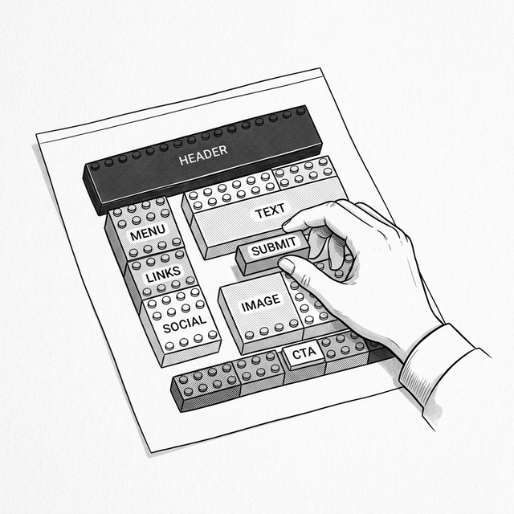

# 第六章：组件与组合 —— 构建 UI 的积木 (Components & Composition)



## 6.1 乐高积木的思想

Student 审视着上一章的代码。`render` 函数返回了一棵庞大的 VNode 树，所有的界面元素都混在一起。

**Student**：Master，现在我的 `render` 函数越来越大了。如果我要做一个包含导航栏、侧边栏、内容区的复杂页面，这个函数将变成一个几百行的巨无霸。

**Master**：你的痛点是什么？

**Student**：我想把这个巨大的函数拆开，不然每次改一个地方就要在几百行里翻来翻去。

**Master**：如果你可以把 `TodoList` 单独拿出来，当作一个独立的积木块，让它自己管自己的渲染逻辑，然后在需要的地方“放进去”，会怎样？

**Student**：那我就可以把不同的 UI 部分拆成一个个独立的积木，然后像乐高一样拼装在一起！

## 6.2 分离的哲学

**Master**：你的直觉是对的。但在开始之前，我们需要讨论一个哲学问题：**HTML、CSS、JavaScript 分别放在不同的文件里，这算不算“分离”？**

**Student**：当然算啊，这是 Web 开发的基本原则。

**Master**：那叫 **技术分离 (Separation of Technologies)**，而不是 **关注点分离 (Separation of Concerns)**。
想象一下，你有一个 `Button` 组件。它的结构 (HTML)、样式 (CSS)、行为 (JavaScript) 分散在三个不同的文件中。当你想修改这个按钮的行为时，你必须在三个文件之间来回跳转。它们虽然在不同的文件里，但它们分明在处理 **同一个关注点**：按钮。

**Master**：React 的做法更激进——它甚至不用模板语法，而是直接在 JavaScript 中描述结构。还记得我们的 `h('div', { id: 'app' }, [...])` 吗？React 提供了一种叫 **JSX** 的语法糖，让你可以写 `<div id="app">...</div>` 这样类似 HTML 的代码，但它最终会被编译器转换成 `h()` 函数调用——本质上和我们写的完全一样。UI 和逻辑本就是不可分割的，同一个组件的渲染逻辑、事件处理、甚至样式，都可以内聚在一起。

| 传统 Web 开发 | React 组件化 |
|:---|:---|
| `button.html` + `button.css` + `button.js` | `Button.jsx`（含结构、样式、逻辑）|
| 按**技术类型**分文件 | 按**功能关注点**分组件 |
| 修改按钮需要跳转 3 个文件 | 所有相关代码在同一处 |

## 6.3 升级引擎 

**Master**：现在，让我们把“组件”这个概念引入到我们的 Mini-React 中。
一个组件，本质上就是一个“拥有自己渲染逻辑的函数（或类）”。

**Student**：好的。用一个类来表示组件？

**Master**：是的。让我们从最简单的开始。

### 升级 `mount` 和 `patch`

下面这张流程图展示了升级后的引擎如何区分处理组件节点和普通 HTML 节点：



**Student**：首先，我需要修改 `mount` 函数，让它能够识别自定义组件。

```javascript
// 之前，mount 只认识字符串标签 (如 'div', 'p')
// 现在，如果 tag 是一个类（函数），就把它当作组件来处理

class Component {
  constructor(props) {
    this.props = props || {};
  }

  render() {
    // 子类必须实现
    throw new Error('Component must implement render()');
  }
}

// 升级后的 mount
function mount(vnode, container) {
  // 文本节点
  if (typeof vnode === 'string' || typeof vnode === 'number') {
    container.appendChild(document.createTextNode(vnode));
    return;
  }

  // 🆕 组件节点
  if (typeof vnode.tag === 'function') {
    const instance = new vnode.tag(vnode.props);
    vnode._instance = instance;
    const subTree = instance.render();
    instance._vnode = subTree;
    mount(subTree, container);
    vnode.el = subTree.el;
    return;
  }

  // 普通 HTML 标签节点（与上一章相同）
  const el = (vnode.el = document.createElement(vnode.tag));

  for (const key in vnode.props) {
    if (key.startsWith('on')) {
      el.addEventListener(key.slice(2).toLowerCase(), vnode.props[key]);
    } else {
      el.setAttribute(key, vnode.props[key]);
    }
  }

  if (typeof vnode.children === 'string') {
    el.textContent = vnode.children;
  } else {
    (vnode.children || []).forEach(child => {
      if (typeof child === 'string' || typeof child === 'number') {
        el.appendChild(document.createTextNode(child));
      } else {
        mount(child, el);
      }
    });
  }

  container.appendChild(el);
}
```

**Master**：很好。现在 `mount` 能处理组件了。但是当状态变化时，`patch` 也需要知道如何更新组件。

> 💡 **注意**：当 `patch` 遇到 `newVNode.tag` 是函数（组件）而 `oldVNode.tag` 是字符串（普通标签）时，或者反过来，我们会判定为“不同类型”，直接替换整个节点。这是一个合理的简化——一个 `div` 变成了一个 `TodoItem` 组件，说明 UI 结构已经根本性地变了。

**Student**：

```javascript
// 升级后的 patch（增加组件处理）
function patch(oldVNode, newVNode) {
  // 🆕 如果是组件节点
  if (typeof newVNode.tag === 'function') {
    if (oldVNode.tag === newVNode.tag) {
      // 同类型组件：更新 Props，重新渲染
      const instance = (newVNode._instance = oldVNode._instance);
      instance.props = newVNode.props;
      const oldSubTree = instance._vnode;
      const newSubTree = instance.render();
      instance._vnode = newSubTree;
      patch(oldSubTree, newSubTree);
      newVNode.el = newSubTree.el;
    } else {
      // 不同类型的组件：替换
      const parent = oldVNode.el.parentNode;
      mount(newVNode, parent);
      parent.replaceChild(newVNode.el, oldVNode.el);
    }
    return;
  }

  // ---- 以下与上一章相同 ----

  if (typeof oldVNode === 'string' || typeof newVNode === 'string') {
    return; // 文本节点在父级处理
  }

  if (oldVNode.tag !== newVNode.tag) {
    const parent = oldVNode.el.parentNode;
    const tmp = document.createElement('div');
    mount(newVNode, tmp);
    parent.replaceChild(newVNode.el, oldVNode.el);
    return;
  }

  const el = (newVNode.el = oldVNode.el);
  const oldProps = oldVNode.props || {};
  const newProps = newVNode.props || {};

  for (const key in newProps) {
    if (oldProps[key] !== newProps[key]) {
      if (key.startsWith('on')) {
        const evt = key.slice(2).toLowerCase();
        if (oldProps[key]) el.removeEventListener(evt, oldProps[key]);
        el.addEventListener(evt, newProps[key]);
      } else {
        el.setAttribute(key, newProps[key]);
      }
    }
  }
  for (const key in oldProps) {
    if (!(key in newProps)) {
      if (key.startsWith('on')) {
        el.removeEventListener(key.slice(2).toLowerCase(), oldProps[key]);
      } else {
        el.removeAttribute(key);
      }
    }
  }

  // Children diffing (同上一章)
  const oldCh = oldVNode.children || [];
  const newCh = newVNode.children || [];
  
  if (typeof newCh === 'string') {
    if (oldCh !== newCh) el.textContent = newCh;
  } else if (typeof oldCh === 'string') {
    el.textContent = '';
    newCh.forEach(c => mount(c, el));
  } else {
    const commonLen = Math.min(oldCh.length, newCh.length);
    for (let i = 0; i < commonLen; i++) {
      const oc = oldCh[i], nc = newCh[i];
      if ((typeof oc === 'string') && (typeof nc === 'string')) {
        if (oc !== nc) el.childNodes[i].textContent = nc;
      } else if (typeof oc === 'object' && typeof nc === 'object') {
        patch(oc, nc);
      }
    }
    if (newCh.length > oldCh.length) {
      newCh.slice(oldCh.length).forEach(c => mount(c, el));
    }
    if (newCh.length < oldCh.length) {
      for (let i = oldCh.length - 1; i >= commonLen; i--) {
        el.removeChild(el.childNodes[i]);
      }
    }
  }
}
```

**Master**：现在，我们的引擎既能挂载组件，也能更新组件了。这是一个关键的进步。

## 6.4 Props：组件之间的桥梁

**Master**：现在，假设你想做一个 `Greeting` 组件来显示问候语。

**Student**：简单！

```javascript
class Greeting extends Component {
  render() {
    return h('h2', null, ['Hello, Alice!']);
  }
}
```

**Master**：很好。但现在页面上需要两个问候语——一个给 Alice，一个给 Bob。你打算怎么做？

**Student**：嗯……写两个组件？`GreetingAlice` 和 `GreetingBob`？

**Master**：如果有 100 个用户呢？写 100 个组件？

**Student**：那肯定不行。我需要一种方式，在 **创建组件的时候** 从外面把名字传进去，就像调用函数时传参数一样——`h(Greeting, { name: 'Alice' })` 和 `h(Greeting, { name: 'Bob' })` 用的是同一个组件，只是参数不同。

**Master**：你自己推导出来了。这个"组件的参数"就叫 **Props (Properties)**。

```javascript
class Greeting extends Component {
  render() {
    return h('h2', null, ['Hello, ' + this.props.name + '!']);
  }
}

// 同一个组件，不同的 Props
h(Greeting, { name: 'Alice' })  // → Hello, Alice!
h(Greeting, { name: 'Bob' })    // → Hello, Bob!
```

**Student**：原来如此！Props 就是组件的参数——从外部传入，组件内部使用。

等一下，我注意到了一件事。`h(Greeting, { name: 'Alice' })` 这个写法，和我们之前写 HTML 节点时的 `h('div', { id: 'app' })` 非常像！第二个参数的位置，一个是 HTML 属性，一个是组件的 Props？

**Master**：好眼力。这正是 `h` 函数设计的精妙之处——对于 HTML 标签，第二个参数是 DOM 属性（`id`、`class`、`onclick` 等）；对于组件，第二个参数就是 Props。统一的语法，不同的含义。这让你在组合 HTML 节点和组件时，写法完全一致。

**Master**：而且有两条铁律：

1.  **Props 是只读的 (Read-only)**：子组件不能修改 Props，就像函数不应该修改传入的参数。
2.  **数据向下流 (Data flows down)**：数据从父组件流向子组件，而不是反过来。

**Student**：那反过来呢？如果子组件里有一个删除按钮，用户点击后，子组件怎么告诉父组件"这个 item 被删了"？

**Master**：好问题。答案是 **回调函数 (Callback)**。父组件通过 Props 传一个函数给子组件，子组件在合适的时机调用它。

```javascript
// 父组件
class TodoApp extends Component {
  render() {
    return h('div', null, [
      h(TodoItem, { 
        text: 'Buy Milk', 
        onDelete: () => { console.log('Item deleted!'); }  // 👈 传递回调
      })
    ]);
  }
}

// 子组件
class TodoItem extends Component {
  render() {
    return h('li', null, [
      this.props.text,
      h('button', { 
        onclick: this.props.onDelete  // 👈 调用回调
      }, ['Delete'])
    ]);
  }
}
```

**Student**：所以数据 **向下** 流（通过 Props），事件 **向上** 冒泡（通过回调函数）。

**Master**：这就是 React 单向数据流的全部。看起来简单，但这种简单是前三章混乱之后的 **有意设计**。它让数据的流动方向始终可预测、可追踪。

## 6.5 组合大于继承

**Master**：注意，我们没有使用继承来组合组件。`TodoApp` 不是继承自 `TodoItem`。它们是通过 **组合 (Composition)** 拼装在一起的。
在 React 的世界观里，**组合大于继承 (Composition Over Inheritance)**。

**Student**：这比在 MVC 框架里用继承来复用 View 逻辑要灵活得多。

**Master**：没错。组件本质上就是一个返回 VNode 树的函数（或类）。你可以在任何你想要的地方嵌套使用它们。

**Student**：组件能接受**其他组件**作为内容吗？像一个包装器？

**Master**：当然！在 React 中，这通过一个特殊的 prop 叫 `children` 来实现：

```javascript
class Card extends Component {
  render() {
    return h('div', { class: 'card' }, this.props.children);
  }
}

h(Card, { children: [
  h('h2', null, ['标题']),
  h('p', null, ['任何内容都可以放进来！'])
]})
```

这是 React 中最常见的组合形式——像 `Card`、`Modal`、`Layout` 这样的包装组件不需要知道包含什么内容。

> 💡 **JSX 解密**：在真实的 React 项目中，你会用 JSX 语法来编写组件，它看起来像 HTML，但实际上会被编译器（如 Babel）转换为函数调用：
>
> ```javascript
> // 你写的 JSX：
> <button onClick={handleClick}>Add</button>
>
> // 编译器转换为：
> React.createElement('button', { onClick: handleClick }, 'Add')
>
> // 这与我们的 h() 函数完全一样！
> h('button', { onclick: handleClick }, ['Add'])
> ```
>
> 所以 JSX 不是魔法——它只是 `createElement` / `h()` 的语法糖。

## 6.6 拼图完成了一半

**Master**：今天你学到了：

1.  **组件** 是 UI 的基本单位，封装了结构、逻辑和样式。
2.  **Props** 让父组件向子组件传递数据，回调函数让子组件通知父组件。
3.  **组合大于继承**，组件通过嵌套而非继承来复用。
4.  我们的 `mount` 和 `patch` 都已升级，支持组件的挂载和更新。

**Student**：但是，Master，目前组件只能接收 Props。如果我想让组件自己管理一些内部数据呢？比如一个计数器组件，它需要记住自己的数字。

**Master**：你说的是组件的 **状态 (State)**。与 Props 不同，State 是组件自己拥有的、可变的记忆。这是下一章的内容。

---

### 📦 目前的成果

将以下代码保存为 `ch06.html`，它展示了组件的挂载、Props 传递、和父子组件通信：

```html
<!DOCTYPE html>
<html lang="zh-CN">
<head>
  <meta charset="UTF-8">
  <title>Chapter 6 — Components & Composition</title>
  <style>
    body { font-family: sans-serif; padding: 20px; }
    .todo-item { padding: 8px; border-bottom: 1px solid #eee; display: flex; justify-content: space-between; align-items: center; }
    .todo-item button { background: #ff4444; color: white; border: none; padding: 3px 8px; cursor: pointer; border-radius: 3px; }
    .card { border: 1px solid #ddd; padding: 15px; border-radius: 8px; margin-top: 10px; }
  </style>
</head>
<body>
  <div id="app"></div>

  <script>
    // === Mini-React Engine (cumulative from ch05) ===
    
    function h(tag, props, children) {
      return { tag, props: props || {}, children: children || [] };
    }

    class Component {
      constructor(props) { this.props = props || {}; }
      render() { throw new Error('Component must implement render()'); }
    }

    function mount(vnode, container) {
      if (typeof vnode === 'string' || typeof vnode === 'number') {
        container.appendChild(document.createTextNode(vnode));
        return;
      }
      if (typeof vnode.tag === 'function') {
        const instance = new vnode.tag(vnode.props);
        vnode._instance = instance;
        const subTree = instance.render();
        instance._vnode = subTree;
        mount(subTree, container);
        vnode.el = subTree.el;
        return;
      }
      const el = (vnode.el = document.createElement(vnode.tag));
      for (const key in vnode.props) {
        if (key.startsWith('on')) {
          el.addEventListener(key.slice(2).toLowerCase(), vnode.props[key]);
        } else {
          el.setAttribute(key, vnode.props[key]);
        }
      }
      if (typeof vnode.children === 'string') {
        el.textContent = vnode.children;
      } else {
        (vnode.children || []).forEach(child => {
          if (typeof child === 'string' || typeof child === 'number') {
            el.appendChild(document.createTextNode(child));
          } else {
            mount(child, el);
          }
        });
      }
      container.appendChild(el);
    }

    function patch(oldVNode, newVNode) {
      // Component nodes
      if (typeof newVNode.tag === 'function') {
        if (oldVNode.tag === newVNode.tag) {
          const instance = (newVNode._instance = oldVNode._instance);
          instance.props = newVNode.props;
          const oldSub = instance._vnode;
          const newSub = instance.render();
          instance._vnode = newSub;
          patch(oldSub, newSub);
          newVNode.el = newSub.el;
        } else {
          const parent = oldVNode.el.parentNode;
          mount(newVNode, parent);
          parent.replaceChild(newVNode.el, oldVNode.el);
        }
        return;
      }

      if (oldVNode.tag !== newVNode.tag) {
        const parent = oldVNode.el.parentNode;
        const tmp = document.createElement('div');
        mount(newVNode, tmp);
        parent.replaceChild(newVNode.el, oldVNode.el);
        return;
      }

      const el = (newVNode.el = oldVNode.el);
      const oldProps = oldVNode.props || {};
      const newProps = newVNode.props || {};
      for (const key in newProps) {
        if (oldProps[key] !== newProps[key]) {
          if (key.startsWith('on')) {
            const evt = key.slice(2).toLowerCase();
            if (oldProps[key]) el.removeEventListener(evt, oldProps[key]);
            el.addEventListener(evt, newProps[key]);
          } else {
            el.setAttribute(key, newProps[key]);
          }
        }
      }
      for (const key in oldProps) {
        if (!(key in newProps)) {
          if (key.startsWith('on')) el.removeEventListener(key.slice(2).toLowerCase(), oldProps[key]);
          else el.removeAttribute(key);
        }
      }

      const oldCh = oldVNode.children || [];
      const newCh = newVNode.children || [];
      if (typeof newCh === 'string') {
        if (oldCh !== newCh) el.textContent = newCh;
      } else if (typeof oldCh === 'string') {
        el.textContent = '';
        newCh.forEach(c => mount(c, el));
      } else {
        const commonLen = Math.min(oldCh.length, newCh.length);
        for (let i = 0; i < commonLen; i++) {
          const oc = oldCh[i], nc = newCh[i];
          if (typeof oc === 'string' && typeof nc === 'string') {
            if (oc !== nc) el.childNodes[i].textContent = nc;
          } else if (typeof oc === 'object' && typeof nc === 'object') {
            patch(oc, nc);
          }
        }
        if (newCh.length > oldCh.length) newCh.slice(oldCh.length).forEach(c => mount(c, el));
        if (newCh.length < oldCh.length) {
          for (let i = oldCh.length - 1; i >= commonLen; i--) el.removeChild(el.childNodes[i]);
        }
      }
    }

    // === Application Components ===

    // 子组件：TodoItem
    class TodoItem extends Component {
      render() {
        return h('div', { class: 'todo-item' }, [
          this.props.text,
          h('button', { onclick: this.props.onDelete }, ['Delete'])
        ]);
      }
    }

    // 父组件：App
    let state = {
      todos: ['Learn JavaScript', 'Build Mini-React', 'Master Components']
    };

    function renderApp(state) {
      return h('div', null, [
        h('h1', null, ['Todo List (Components)']),
        h('p', null, [`Total: ${state.todos.length} items`]),
        h('div', { class: 'card' }, 
          state.todos.map((text, i) =>
            h(TodoItem, {
              text: text,
              onDelete: () => {
                state.todos = state.todos.filter((_, idx) => idx !== i);
                update();
              }
            })
          )
        )
      ]);
    }

    let prevVNode = null;

    function update() {
      const newVNode = renderApp(state);
      if (!prevVNode) {
        mount(newVNode, document.getElementById('app'));
      } else {
        patch(prevVNode, newVNode);
      }
      prevVNode = newVNode;
    }

    update();
  </script>
</body>
</html>
```

*(下一章：类组件与生命周期——给组件赋予记忆和时间概念)*
