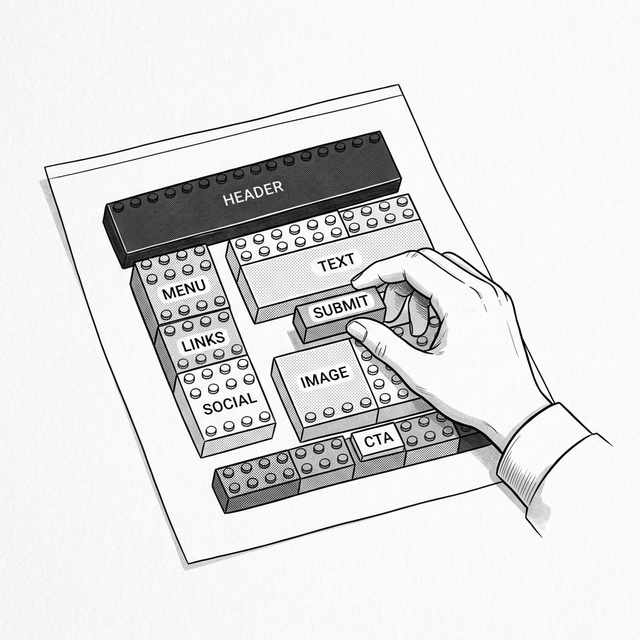
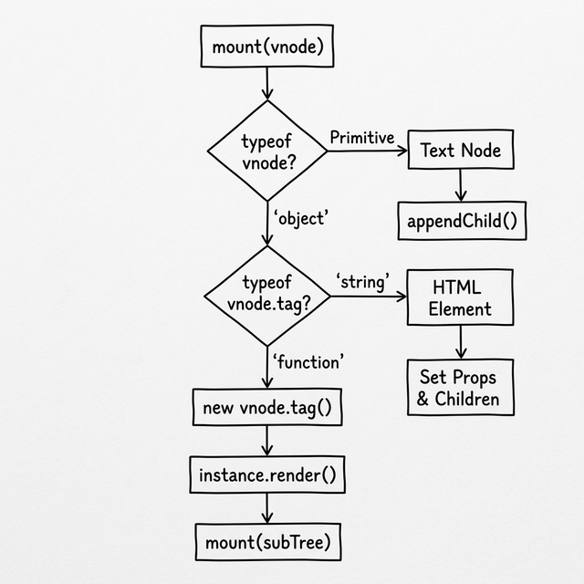
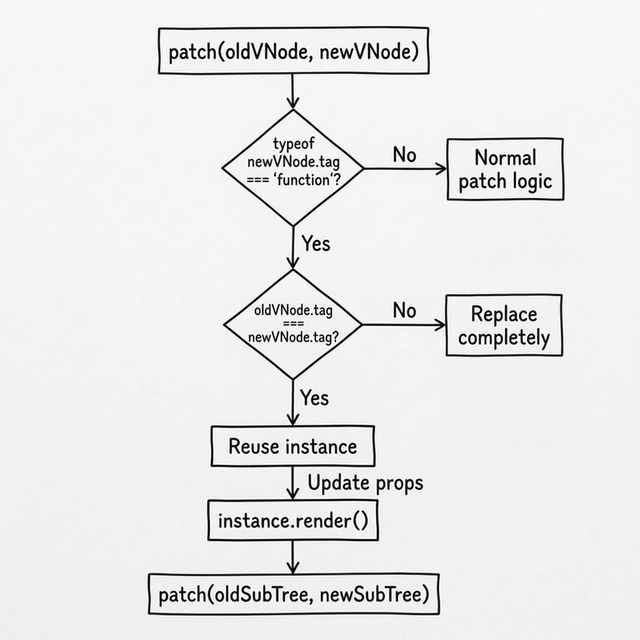

# 第六章：组件与组合 (Components & Composition)



## 6.1 拆分巨大的 `render`

Po 审视着使用 Mini-React 写成的代码。`render` 函数返回了一棵庞大的 VNode 树，所有的界面元素都混在一起。

**🐼**：Shifu，现在我的 `render` 函数越来越大了。如果我要做一个包含导航栏、侧边栏、内容区的复杂页面，这个函数将变成一个几百行的巨无霸，每次修改都需要在里面翻找。

**🧙‍♂️**：如果你可以把不同的“UI 区块”单独拿出来，让它自己管自己的渲染逻辑，然后在需要的地方放进去，会怎样？

**🐼**：那我就可以把不同的 UI 部分拆成一个个独立的函数或类，然后像积木一样拼装在一起。

**🧙‍♂️**：是的。React 的核心设计理念之一，就是把 UI 按**功能关注点**而非技术类型来组织。一个按钮的结构、样式、行为虽然分别是 HTML、CSS 和 JavaScript，但它们处理的是同一件事。把它们放在一起，比分散在三个文件里更合理。

## 6.2 组件长什么样

**🧙‍♂️**：假设我们已经把页面拆分成了多个独立组件，预期的组合方式应该像这样：

```javascript
function renderApp() {
  return h('div', { id: 'app' }, [
    h(Header, { title: '我的任务清单' }),
    h(TodoList, null, [
      h(TodoItem, { text: 'Learn JavaScript', done: true }),
      h(TodoItem, { text: 'Build Mini-React', done: false })
    ]),
    h(Footer, null)
  ]);
}
```

**🐼**：等一下！`h()` 函数的第一个参数 `tag`，以前我们一直传的是代表 HTML 标签的字符串（比如 `'div'`）。但在这里，`Header`、`TodoItem` 是类或函数本身？

**🧙‍♂️**：是的。你可以像使用原生 HTML 元素一样，把自定义的组件平级地互相嵌套和组装。等同于随时创造新的“HTML 标签”。

**🐼**：但我们的引擎底层目前还不认识这些“自定义标签”。如果遇到 `tag` 不是字符串的节点，`mount` 和 `patch` 肯定会报错。

**🧙‍♂️**：这就是我们接下来要解决的问题。

> 💡 **JSX 提示**：在真实的 React 项目中，你会用 JSX 来写 `<TodoItem text="Buy Milk" />`，它会被编译器转换为 `React.createElement(TodoItem, { text: 'Buy Milk' })`——和我们的 `h(TodoItem, { text: 'Buy Milk' })` 是一回事。

## 6.3 升级引擎

**🧙‍♂️**：要让引擎认识组件，我们先得定义“组件”是什么。本质上，一个组件就是一个拥有自己渲染逻辑的类。

```javascript
class Component {
  constructor(props) {
    this.props = props || {};
  }

  render() {
    throw new Error('Component must implement render()');
  }
}
```

**🐼**：有了这个基础类，就可以通过继承它来编写 UI 组件。由于类的本质是函数，所以当我们在 `h()` 里传入一个组件类时，`vnode.tag` 的类型就会变成 `'function'`。引擎就可以通过这一点区分普通 HTML 节点和组件节点。



### 升级 `mount`

**🧙‍♂️**：在 `mount` 里，如果遇到 `vnode.tag` 是 `'function'`，你应该怎么把它渲染出来？

**🐼**：我需要用 `new` 把它实例化，同时把 `vnode.props` 传给构造函数。有了实例，就可以调用它的 `render()` 方法，拿到一棵 VNode 子树。然后递归调用 `mount`，把这棵子树挂载到页面上。

**🧙‍♂️**：思路清晰。但在挂载时，我们需要为未来的更新（`patch`）做准备。如果以后 `patch` 要更新这个组件，你觉得它需要哪些信息？

**🐼**：嗯……首先需要这个组件的实例，这样才能更新 props 并重新调用 `render()`。其次，还需要旧的 VNode 子树来和新子树做对比。

**🧙‍♂️**：对。我们可以把实例保存在 `vnode._instance` 上，把旧子树保存在 `instance._vnode` 上。最后，别忘了 `patch` 操作真实 DOM 时需要的那个桥梁——`vnode.el`。

**🐼**：但是普通节点有自己的 DOM 元素，组件本身只是逻辑，并没有对应的真实 DOM 标签啊？

**🧙‍♂️**：想想看，组件在页面上占据的物理位置是由什么决定的？

**🐼**：由它内部渲染出的子树决定！所以它的 `vnode.el` 应该借用它子树根节点的 DOM。

**🧙‍♂️**：正是。把这段逻辑写出来。

```javascript
  function mount(vnode, container) {
    if (typeof vnode === 'string' || typeof vnode === 'number') {
      container.appendChild(document.createTextNode(vnode));
      return;
    }

    // 处理组件节点
    if (typeof vnode.tag === 'function') {
      const instance = new vnode.tag(vnode.props); // 实例化组件
      vnode._instance = instance;                  // 保存实例
      const subTree = instance.render();           // 获取内部的 VNode 子树
      instance._vnode = subTree;                   // 保存旧子树
      mount(subTree, container);                   // 递归挂载子树
      vnode.el = subTree.el;                       // 借用子树的 DOM 作为自己的位置标识
      return;
    }

    // 普通 HTML 标签节点的挂载逻辑（与上一章相同）
    // ...
  }
```

### 升级 `patch`

**🧙‍♂️**：现在我们来处理更新的情况。当 `patch` 遇到两个组件节点时，如果新旧节点的 `tag` 不是同一个组件类（比如 `TodoItem` 变成了 `Header`），我们直接判定为完全不同的节点，走原有逻辑替换。如果前后是同一个组件类，你会怎么更新？

**🐼**：我可以复用刚才在 `mount` 里建立的结构：
1. 从 `oldVNode` 拿到旧实例：`const instance = oldVNode._instance`，并传给 `newVNode` 复用。
2. 刷新实例上的属性：`instance.props = newVNode.props`。
3. 用更新后的实例再次调用 `render()`，拿到新的 VNode 子树。
4. 从 `instance._vnode` 拿到旧子树，把新旧子树交给 `patch` 递归处理。

**🧙‍♂️**：是的。组件更新机制巧妙地把更新转交给了底层的 `patch` 逻辑。

```javascript
  function patch(oldVNode, newVNode) {
    // 处理组件节点
    if (typeof newVNode.tag === 'function') {
      if (oldVNode.tag === newVNode.tag) {
        // 同类型组件：复用实例，更新 props，重新渲染
        const instance = (newVNode._instance = oldVNode._instance);
        instance.props = newVNode.props;
        const oldSubTree = instance._vnode;
        const newSubTree = instance.render();
        instance._vnode = newSubTree;
        patch(oldSubTree, newSubTree);  // 递归交给底层处理
        newVNode.el = newSubTree.el;
      } else {
        // 不同类型的组件：直接替换
        const parent = oldVNode.el.parentNode;
        mount(newVNode, parent);
        parent.replaceChild(newVNode.el, oldVNode.el);
      }
      return;
    }

    // ---- 处理普通 HTML 节点的逻辑（与上一章相同） ----
    // ...
  }
```



## 6.4 Props：组件之间的桥梁

**🧙‍♂️**：现在，假设你想做一个 `Greeting` 组件来显示问候语：

```javascript
class Greeting extends Component {
  render() {
    return h('h2', null, ['Hello, Alice!']);
  }
}
```

**🧙‍♂️**：如果页面上需要同时向 Alice 和 Bob 问候，你打算怎么复用这个组件？

**🐼**：我需要在创建组件的时候从外面把名字传进去，就像调用函数时传参数一样。

**🧙‍♂️**：是的。这个“组件的参数”就叫 **Props (Properties)**。

```javascript
class Greeting extends Component {
  render() {
    return h('h2', null, ['Hello, ' + this.props.name + '!']);
  }
}

h(Greeting, { name: 'Alice' })  // → Hello, Alice!
h(Greeting, { name: 'Bob' })    // → Hello, Bob!
```

**🐼**：我注意到 `h(Greeting, { name: 'Alice' })` 和写 HTML 节点时的 `h('div', { id: 'app' })` 写法一模一样。对 HTML 标签，第二个参数是 DOM 属性；对组件，第二个参数就是 Props。

**🧙‍♂️**：对。Props 有两条铁律：
1. **只读 (Read-only)**：子组件不能修改 Props，就像函数不应该修改传入的参数。
2. **数据向下流 (Data flows down)**：数据从父组件流向子组件，而不是反过来。

**🐼**：如果子组件里有一个删除按钮，用户点击后，子组件怎么通知父组件？

**🧙‍♂️**：回想一下，除了字符串和数字，JavaScript 里还有什么可以作为对象的属性传递？

**🐼**：函数！父组件可以通过 Props 传一个回调函数给子组件，子组件在被点击时调用它？

**🧙‍♂️**：是的。这就是**回调函数 (Callback)**。

```javascript
// 父组件
class TodoApp extends Component {
  render() {
    return h('div', null, [
      h(TodoItem, { 
        text: 'Buy Milk', 
        onDelete: () => { console.log('Item deleted!'); }  // 👈 向下传递回调
      })
    ]);
  }
}

// 子组件
class TodoItem extends Component {
  render() {
    return h('li', null, [
      this.props.text,
      h('button', { 
        onclick: this.props.onDelete  // 👈 触发时调用回调
      }, ['Delete'])
    ]);
  }
}
```

**🐼**：数据通过 Props 向下流，事件通过回调函数向上冒泡。这保证了数据的流动方向始终可追踪。

## 6.5 组合大于继承

**🧙‍♂️**：注意，我们没有使用继承来复用组件。`TodoApp` 不继承自 `TodoItem`，它们通过**组合 (Composition)** 拼装在一起。这是 React 的另一个核心理念：**组合大于继承**。

**🐼**：组件能接受其他组件作为内部的内容吗？就像一个 `div` 可以包含其他元素那样。

**🧙‍♂️**：既然所有属性都是通过 Props 传递的，你可以通过什么属性把子元素传进去？

**🐼**：我可以约定一个特殊的属性，比如 `children`，把它传给组件内部渲染：

```javascript
class Card extends Component {
  render() {
    // 渲染时，把传入的 children 作为自己的子节点
    return h('div', { className: 'card' }, this.props.children);
  }
}

h(Card, { children: [
  h('h2', null, ['标题']),
  h('p', null, ['任何内容都可以放进来！'])
]})
```

**🧙‍♂️**：是的。像 `Card` 这样的包装组件只负责提供容器，不需要知道内部是什么。在真实的 React 中，JSX 会自动把嵌套内容填入 `props.children`。

## 6.6 拼图完成了一半

**🐼**：我现在能看清整体了。引擎根本不认识“组件”这个概念，它只认识 VNode。是 `mount` 和 `patch` 在遇到函数类型的 `tag` 时，自动把组件“翻译”成引擎能处理的 VNode 子树。

**🧙‍♂️**：是的。组件是写给人看的抽象，VNode 才是引擎真正运行的语言。今天你构建的这套机制，已经支撑起了 React 组件树的运转逻辑。但你有没有注意到，我们的组件现在有一个局限——它只能依赖从外部传入的 Props。每次渲染，它都是一张白纸。

**🐼**：组件没有自己的状态？

**🧙‍♂️**：是的。如果一个按钮需要记住自己被点击了几次，现在的组件做不到。下一课，我们会给组件赋予记忆，这会引出 React 的**State（状态）**与**生命周期**。

---

### 📦 实践一下

将以下代码保存为 `ch06.html`，它展示了组件的挂载、Props 传递和父子组件通信：

```html
<!DOCTYPE html>
<html lang="zh-CN">
<head>
  <meta charset="UTF-8">
  <title>Chapter 6 — Components & Composition</title>
  <style>
    body { font-family: sans-serif; padding: 20px; max-width: 600px; margin: 0 auto; background: #f9f9f9; }
    .card { border: 1px solid #ddd; border-radius: 8px; padding: 15px; margin: 15px 0; background: white; }
    .card h3 { margin-top: 0; }
    button { padding: 6px 12px; cursor: pointer; margin: 4px; border-radius: 4px; border: 1px solid #ccc; background: #eee; }
    li { padding: 8px 0; border-bottom: 1px solid #eee; display: flex; justify-content: space-between; align-items: center; list-style: none; }
    li .task-content { display: flex; align-items: center; gap: 8px; }
    li.done span { text-decoration: line-through; color: #999; }
    li .delete-btn { background: #ff4444; color: white; border: none; padding: 4px 8px; border-radius: 4px; cursor: pointer; }
    input[type="text"] { padding: 8px; width: 60%; border-radius: 4px; border: 1px solid #ccc; }
    #stats { font-size: 14px; color: #666; margin-top: 10px; }
  </style>
</head>
<body>
  <div id="app"></div>

  <script>
    // === Mini-React Engine (第五章累积 + 本章升级) ===

    function h(tag, props, children) {
      return { tag, props: props || {}, children: children || [] };
    }

    class Component {
      constructor(props) { this.props = props || {}; }
      render() { throw new Error('Component must implement render()'); }
    }

    function mount(vnode, container) {
      if (typeof vnode === 'string' || typeof vnode === 'number') {
        container.appendChild(document.createTextNode(vnode));
        return;
      }
      // 🆕 组件节点
      if (typeof vnode.tag === 'function') {
        const instance = new vnode.tag(vnode.props);
        vnode._instance = instance;
        const subTree = instance.render();
        instance._vnode = subTree;
        mount(subTree, container);
        vnode.el = subTree.el;
        return;
      }
      const el = (vnode.el = document.createElement(vnode.tag));
      for (const key in vnode.props) {
        if (key.startsWith('on')) {
          el.addEventListener(key.slice(2).toLowerCase(), vnode.props[key]);
        } else {
          if (key === 'className') el.setAttribute('class', vnode.props[key]);
          else if (key === 'style' && typeof vnode.props[key] === 'string') el.style.cssText = vnode.props[key];
          else el.setAttribute(key, vnode.props[key]);
        }
      }
      if (typeof vnode.children === 'string') {
        el.textContent = vnode.children;
      } else {
        (vnode.children || []).forEach(child => {
          if (typeof child === 'string' || typeof child === 'number') {
            el.appendChild(document.createTextNode(child));
          } else {
            mount(child, el);
          }
        });
      }
      container.appendChild(el);
    }

    function patch(oldVNode, newVNode) {
      // 🆕 组件节点
      if (typeof newVNode.tag === 'function') {
        if (oldVNode.tag === newVNode.tag) {
          const instance = (newVNode._instance = oldVNode._instance);
          instance.props = newVNode.props;
          const oldSub = instance._vnode;
          const newSub = instance.render();
          instance._vnode = newSub;
          patch(oldSub, newSub);
          newVNode.el = newSub.el;
        } else {
          const parent = oldVNode.el.parentNode;
          mount(newVNode, parent);
          parent.replaceChild(newVNode.el, oldVNode.el);
        }
        return;
      }

      if (oldVNode.tag !== newVNode.tag) {
        const parent = oldVNode.el.parentNode;
        const tmp = document.createElement('div');
        mount(newVNode, tmp);
        parent.replaceChild(newVNode.el, oldVNode.el);
        return;
      }

      const el = (newVNode.el = oldVNode.el);
      const oldProps = oldVNode.props || {};
      const newProps = newVNode.props || {};
      for (const key in newProps) {
        if (oldProps[key] !== newProps[key]) {
          if (key.startsWith('on')) {
            const evt = key.slice(2).toLowerCase();
            if (oldProps[key]) el.removeEventListener(evt, oldProps[key]);
            el.addEventListener(evt, newProps[key]);
          } else {
            if (key === 'className') el.setAttribute('class', newProps[key]);
            else if (key === 'style' && typeof newProps[key] === 'string') el.style.cssText = newProps[key];
            else el.setAttribute(key, newProps[key]);
          }
        }
      }
      for (const key in oldProps) {
        if (!(key in newProps)) {
          if (key.startsWith('on')) el.removeEventListener(key.slice(2).toLowerCase(), oldProps[key]);
          else if (key === 'className') el.removeAttribute('class');
          else if (key === 'style') el.style.cssText = '';
          else el.removeAttribute(key);
        }
      }

      const oldChildren = oldVNode.children || [];
      const newChildren = newVNode.children || [];
      if (typeof newChildren === 'string') {
        if (oldChildren !== newChildren) el.textContent = newChildren;
      } else if (typeof oldChildren === 'string') {
        el.textContent = '';
        newChildren.forEach(c => mount(c, el));
      } else {
        const commonLength = Math.min(oldChildren.length, newChildren.length);
        for (let i = 0; i < commonLength; i++) {
          const oldChild = oldChildren[i], newChild = newChildren[i];
          if (typeof oldChild === 'string' && typeof newChild === 'string') {
            if (oldChild !== newChild) el.childNodes[i].textContent = newChild;
          } else if (typeof oldChild === 'object' && typeof newChild === 'object') {
            patch(oldChild, newChild);
          } else {
            if (typeof newChild === 'string' || typeof newChild === 'number') {
              el.replaceChild(document.createTextNode(newChild), el.childNodes[i]);
            } else {
              const tmp = document.createElement('div');
              mount(newChild, tmp);
              el.replaceChild(newChild.el, el.childNodes[i]);
            }
          }
        }
        if (newChildren.length > oldChildren.length) newChildren.slice(oldChildren.length).forEach(c => mount(c, el));
        if (newChildren.length < oldChildren.length) {
          for (let i = oldChildren.length - 1; i >= commonLength; i--) el.removeChild(el.childNodes[i]);
        }
      }
    }

    // === 应用组件 ===

    // 子组件：TodoItem
    class TodoItem extends Component {
      render() {
        return h('li', this.props.done ? { className: 'done' } : null, [
          h('div', { className: 'task-content' }, [
            h('input', Object.assign({ type: 'checkbox', onchange: this.props.onToggle }, this.props.done ? { checked: true } : {})),
            h('span', null, [this.props.text])
          ]),
          h('button', { className: 'delete-btn', onclick: this.props.onDelete }, ['×'])
        ]);
      }
    }

    // 父组件：App
    let state = {
      todos: [
        { text: 'Learn JavaScript', done: true },
        { text: 'Build Mini-React', done: false },
        { text: 'Understand Components', done: false }
      ]
    };

    function renderApp(state) {
      const doneCount = state.todos.filter(t => t.done).length;
      return h('div', { className: 'card' }, [
        h('h3', null, ['My Todo List (Components)']),
        h('p', { id: 'stats' }, [`已完成 ${doneCount} / 总共 ${state.todos.length} 项`]),
        h('ul', { style: 'padding-left: 0; margin-bottom: 0;' },
          state.todos.map((todo, i) =>
            h(TodoItem, {
              text: todo.text,
              done: todo.done,
              onToggle: () => { todo.done = !todo.done; update(); },
              onDelete: () => { state.todos = state.todos.filter((_, idx) => idx !== i); update(); }
            })
          )
        )
      ]);
    }

    let prevVNode = null;
    function update() {
      const newVNode = renderApp(state);
      if (!prevVNode) {
        mount(newVNode, document.getElementById('app'));
      } else {
        patch(prevVNode, newVNode);
      }
      prevVNode = newVNode;
    }

    update();
  </script>
</body>
</html>
