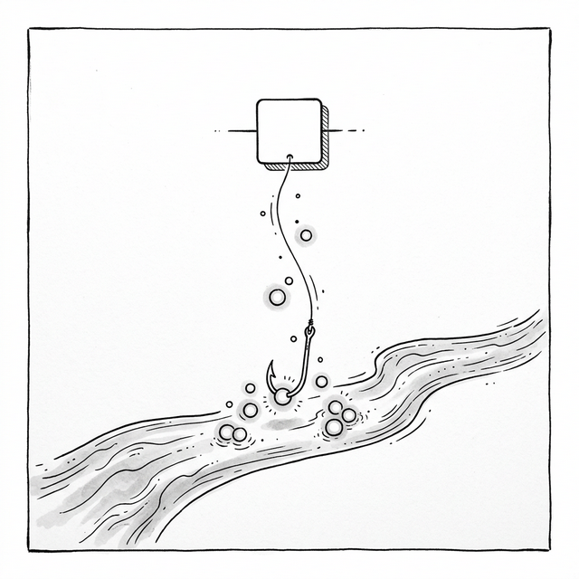

# 第九章：Hooks —— 函数式的文艺复兴 (The Functional Renaissance)



## 9.1 回到函数

Student 在上一章经历了 Mixins、HOC 和 Render Props 的洗礼后，感到疲惫不堪。

**Student**：Master，我已经受够了那些包装器了。HOC 把我的组件树搞得像俄罗斯套娃，Render Props 让我的代码变成了回调地狱。归根结底，它们都在用“组件结构”来包装“行为逻辑”。

**Master**：说得好。那么，最纯粹的“行为”应该用什么来表示？

**Student**：……函数？

**Master**：没错。函数是最基本的代码组织单位。如果一段逻辑可以被封装在一个函数里，然后在任何地方调用，那就不需要什么 HOC 或 Render Props 了。但类组件有一个限制——**逻辑（状态、副作用）和组件生命周期紧密耦合在 `this` 上**。
如果我们能让 **函数组件** 也拥有状态和副作用，一切就解开了。

## 9.2 简化引擎：告别 Class

**Master**：在动手实现 Hooks 之前，我们先做一件事——**简化我们的 Mini-React 引擎**。

既然函数组件不再需要 `class`、`this`、`new` 这些机制，我们可以移除上一章为类组件添加的所有"重量"。对比一下：

> 💡 **说明**：下面的 diff 展示了从 Ch06-08 引擎中移除的部分。每章的 Demo HTML 含独立引擎副本，这个简化只影响 Hooks 版本。之前章节的类组件引擎仍然有效。

```diff
 // mount 函数的变化
 function mount(vnode, container) {
   if (typeof vnode === 'string' || typeof vnode === 'number') {
     container.appendChild(document.createTextNode(vnode)); return;
   }
-  // ❌ 移除：类组件分支（不再需要 new、实例、生命周期）
-  if (typeof vnode.tag === 'function') {
-    const instance = new vnode.tag(vnode.props);
-    vnode._instance = instance;
-    const sub = instance.render();
-    instance._vnode = sub;
-    mount(sub, container);
-    vnode.el = sub.el;
-    if (instance.componentDidMount) instance.componentDidMount();
-    return;
-  }
   const el = (vnode.el = document.createElement(vnode.tag));
   // ... 其余不变 ...
 }
```

```diff
 // patch 函数的变化
 function patch(o, n) {
-  // ❌ 移除：类组件的 patch 逻辑（实例复用、props 更新等）
-  if (typeof n.tag === 'function') {
-    if (o.tag === n.tag) {
-      const inst = (n._instance = o._instance);
-      inst.props = n.props;
-      const os = inst._vnode, ns = inst.render();
-      inst._vnode = ns;
-      patch(os, ns);
-      n.el = ns.el;
-    } else { ... }
-    return;
-  }
   if (o.tag !== n.tag) {
     // ... 其余不变 ...
   }
 }
```

**Student**：删掉了这么多代码！`class Component` 基类也不需要了？

**Master**：不需要了。没有 `class Component`，没有 `this.state`，没有 `this.setState()`，没有 `componentDidMount`。

函数组件只是一个 **普通函数**——调用它，返回 VNode 树，就这么简单。状态和副作用由另一套机制来提供。现在让我们来实现这套机制。


## 9.3 让函数拥有记忆：useState 

**Master**：一个普通函数每次执行完就“忘记”一切。它没有 `this.state`。我们该怎么让它“记住”上一次的状态？

**Student**：嗯……也许可以把状态存在某个函数外部的地方？这样函数执行完，值还在。

**Master**：对，函数执行完就消失了，但如果有一个外部的“储物柜”呢？比如一个数组——第一个 `useState` 用格子 0，第二个用格子 1……每次函数重新执行，按同样的顺序打开格子，就能找回上次的值。

**Student**：原来如此！这就是闭包的妙用——每个 `setState` 都“锁死”了自己对应的格子编号。

**Master**：正是。让我们来实现它。

```javascript
// Hooks 的运行时存储
let hooks = [];     // 所有 hooks 的值存在这里
let hookIndex = 0;  // 当前 hook 的索引

function useState(initialValue) {
  const currentIndex = hookIndex;
  
  // 首次调用时，用初始值；后续调用时，用已存储的值
  if (hooks[currentIndex] === undefined) {
    hooks[currentIndex] = initialValue;
  }
  
  // setState：更新存储的值，并触发重新渲染
  const setState = (newValue) => {
    hooks[currentIndex] = newValue;
    rerender(); // 触发整个组件的重新渲染
  };
  
  hookIndex++;
  return [hooks[currentIndex], setState];
}
```

> ⚠️ **限制说明**：我们的 `hooks` 和 `hookIndex` 是模块级的全局变量，这意味着我们的 Hooks 实现只能支持 **一个根组件**。如果有两个函数组件，它们的 hooks 会混在一起。在真实的 React 中，每个组件实例都有自己独立的 hooks 数组，通过 Fiber 节点来存储。

**Student**：等等，这个 `currentIndex` 是关键！它用闭包 “锁死” 了每个 `useState` 对应的数组位置。第一次调用 `useState` 用索引 0，第二次用索引 1……

**Master**：对。这就好比给每个 Hook 分配了一个 **编号**。每次组件渲染时，Hooks 必须以相同的顺序被调用，这样编号才不会乱。

> ⚠️ **另一个限制**：我们的 `setState` 只支持直接赋值：`setState(5)`。真正的 React 还支持**函数式更新**：`setState(prev => prev + 1)`。当多次更新依赖前一个值时很重要——直接赋值会导致闭包陈旧 Bug。当新值依赖旧值时，请始终使用 `setState(c => c + 1)` 而非 `setState(count + 1)`。

## 9.4 Hooks 规则 (Rules of Hooks)

**Student**：所以如果我把 `useState` 放在 `if` 语句里……

```javascript
function Counter() {
  const [count, setCount] = useState(0);
  
  if (count > 5) {
    const [warning, setWarning] = useState('Too high!'); // ❌ 有条件调用！
  }
  
  // ...
}
```

**Master**：第一次渲染时，`count` 是 0，条件不满足，只有一个 Hook（索引 0）。但当 `count` 变成 6 时，条件满足了，突然多出了一个 Hook。这时候索引全乱了！

**Student**：就像扣扣子一样，第一颗扣错了，后面全歪了。

**Master**：完美的比喻。这就是 **Hooks 规则**：

1.  **只在顶层调用 Hooks**：不在 `if`、`for`、嵌套函数里调用。
2.  **只在 React 函数组件或自定义 Hooks 中调用 Hooks**：不在普通函数里调用（自定义 Hook 本质上也是函数，但以 `use` 开头命名，这是约定）。

这不是一个“最佳实践”，而是机制决定的 **硬性约束**。

## 9.5 管理副作用：useEffect

**Student**：那生命周期方法呢？`componentDidMount` 和 `componentWillUnmount` 怎么用函数实现？

**Master**：用 `useEffect`。

**Student**：`useEffect`？"副作用"？这名字听起来像是什么坏事情——"你的代码有副作用"。

**Master**：哈哈，"副作用"（Side Effect）不是贬义词。在函数式编程中，**纯函数** 的定义是"给定相同输入，总是返回相同输出，不改变外部世界"。而 **副作用** 就是"改变了外部世界的操作"：发起网络请求、操作 DOM、启动定时器、订阅事件——这些都是"效果"（Effect），它们超出了"给定输入→返回输出"的范畴。

**Student**：这么说，`useEffect` 的意思是"使用一个效果"？

**Master**：正是。函数组件本身是一个纯粹的"状态→UI"映射。但现实中你总需要做一些"额外的事"。`useEffect` 就是告诉框架："这个函数有副作用，请在渲染完成后帮我执行它。"

没有 `useEffect`，函数组件就只能是一个无法与外部世界交互的纯函数——不能主动获取数据，不能监听事件，不能设置定时器。`useEffect` 让函数组件拥有了与真实世界交互的能力，同时保持了声明式的风格。

```javascript
function useEffect(callback, deps) {
  const currentIndex = hookIndex;
  const prevDeps = hooks[currentIndex];
  
  // 判断依赖是否变化
  let hasChanged = true;
  if (prevDeps !== undefined) {
    hasChanged = deps 
      ? deps.some((dep, i) => dep !== prevDeps[i])
      : true; // 没有依赖数组 = 每次都执行
  }
  
  if (hasChanged) {
    // 清理上一次的副作用
    if (hooks[currentIndex + 1]) {
      hooks[currentIndex + 1](); // 执行 cleanup 函数
    }
    
    // 执行副作用
    // 注意：真实 React 中 useEffect 是异步的（在 paint 之后执行）
    // 我们的简化版是同步的
    const cleanup = callback();
    hooks[currentIndex + 1] = cleanup; // 保存 cleanup 函数
  }
  
  hooks[currentIndex] = deps;
  hookIndex += 2; // 占两个位置：deps + cleanup
}
```

> **⚠️ 注意**：真实的 React 中，`useEffect` 的回调是在浏览器 **绘制 (paint) 之后异步执行** 的（通过 React 的内部调度器触发）。这对性能至关重要——它不会阻塞渲染。而 `useLayoutEffect` 才是在 DOM 更新后、paint 之前同步执行的。我们的简化版为了教学目的是同步执行的。

## 9.6 持久化的盒子：useRef

**Student**：如果我需要一个跨渲染持久化的值，但**不想**改变它时触发重渲染呢？比如存储 DOM 引用或定时器 ID？

**Master**：那就是 `useRef`。它是最简单的 Hook——一个跨渲染持久化的可变容器：

```javascript
function useRef(initialValue) {
  const currentIndex = hookIndex;
  
  // 只在第一次创建对象，后续复用同一个引用
  if (hooks[currentIndex] === undefined) {
    hooks[currentIndex] = { current: initialValue };
  }
  
  hookIndex++;
  return hooks[currentIndex];
}
```

**Student**：它和 `useState` 很像，但不触发重渲染？

**Master**：对！`useRef` 返回的 `{ current: ... }` 始终是同一个对象引用。修改 `.current` 不会触发重渲染——它只是一个静默的储物格。

```javascript
const inputRef = useRef(null);     // 存储 DOM 引用
const timerRef = useRef(null);     // 存储定时器 ID
const renderCount = useRef(0);     // 计数渲染但不触发重渲染

renderCount.current++;  // 不会触发重渲染
```

**Student**：`useState` 是给触发重渲染的值，`useRef` 是给需要静默持久化的值？

**Master**：完全正确。`useState` = 响应式记忆，`useRef` = 沉默的记忆。

## 9.7 函数组件的闭环

**Master**：现在，让我们把这些拼合起来，看看一个函数组件如何运作。

```javascript
// 渲染系统的核心
let currentRenderFn = null;
let currentContainer = null;
let currentVNode = null;

function rerender() {
  hookIndex = 0; // 重置索引，这样 useState 重新从 0 开始
  const newVNode = currentRenderFn();
  if (currentVNode) {
    patch(currentVNode, newVNode);
  }
  currentVNode = newVNode;
}

function renderApp(fn, container) {
  currentRenderFn = fn;
  currentContainer = container;
  hookIndex = 0;
  const vnode = fn();
  mount(vnode, container);
  currentVNode = vnode;
}

// --- 使用 ---
function Counter() {
  const [count, setCount] = useState(0);

  useEffect(() => {
    document.title = 'Count: ' + count;
  }, [count]);

  return h('div', null, [
    h('h1', null, ['Count: ' + count]),
    h('button', { onclick: () => setCount(count + 1) }, ['Increment'])
  ]);
}

renderApp(Counter, document.getElementById('app'));
```

**Student**：太简单了！没有 `class`，没有 `this`，没有 `bind`，就是纯粹的函数调用。

## 9.8 Custom Hooks：逻辑的终极复用

**Master**：还记得第八章里那个“追踪鼠标位置”的需求吗？用 Hooks 来实现它会是什么样？

```javascript
// Custom Hook：useMouse
function useMouse() {
  const [pos, setPos] = useState({ x: 0, y: 0 });

  useEffect(() => {
    const handler = (e) => setPos({ x: e.clientX, y: e.clientY });
    window.addEventListener('mousemove', handler);
    return () => window.removeEventListener('mousemove', handler); // cleanup!
  }, []);

  return pos;
}
```

**Student**：就这样？！只有 7 行代码？

**Master**：对比一下第八章的三种方案：

```
┌─────────────────────────────────────────────────────────┐
│ Chapter 8 (HOC):                                        │
│   function withMouse(WrappedComponent) {                │
│     return class WithMouse extends Component {          │
│       constructor(props) { ... state ... bind ... }     │
│       componentDidMount() { ... addEventListener ... }  │
│       componentWillUnmount() { ... removeEvent... }     │
│       _onMouseMove(e) { ... setState ... }              │
│       render() { return h(WrappedComponent, {...}) }    │
│     };                                                  │
│   }                                                     │
│   const Enhanced = withMouse(MyComponent);  // 改变组件树 │
│                                                         │
│ Chapter 9 (Hook):                                       │
│   function useMouse() {                                 │
│     const [pos, setPos] = useState({x:0, y:0});         │
│     useEffect(() => { ... }, []);                       │
│     return pos;                                         │
│   }                                                     │
│   const pos = useMouse();  // 不改变组件树！              │
└─────────────────────────────────────────────────────────┘
```

**Student**：差异太明显了：
- HOC 需要创建一个新类、管理 `this`、包装组件层级。
- Hook 只是一个函数调用，像调用 `Math.max()` 一样自然。

**Master**：而且你可以自由组合多个 Hooks，不会有 Wrapper Hell：

```javascript
function Dashboard() {
  const mouse = useMouse();
  const windowSize = useWindowSize();
  const user = useUser();
  const theme = useTheme();
  // 四个逻辑清清楚楚，没有嵌套！
  return h('div', null, ['...']);
}
```

## 9.9 历史的脚注：2018 React Conf

**Master**：2018 年的 React Conf 上，**Sophie Alpert** 和 **Dan Abramov** 正式发布了 Hooks 提案。

```
// Dan 在台上演示了一段代码
// 把 Class 组件的逻辑一点一点地用 Hooks 重写
// 台下的观众从安静变成了惊呼
```

那一刻，React 社区开始了一场安静的革命。Hooks 不是一个新的特性，而是一种新的编程范式——它让你用 **函数的组合** 来构建复杂的行为，而不是用 **类的继承** 或 **组件的嵌套**。

Hooks 不是改良，而是对 React 核心理念的 **重新表达**。`UI = f(state)` 这个公式里的 `f` 一直就是一个函数。Facebook 只是花了五年时间才真正让 `f` 可以是一个 *纯粹的* 函数——不需要 `class`，不需要 `this`，不需要生命周期方法。useState 和 useEffect 只是让函数拥有了记忆和感知，仅此而已

---

### 📦 目前的成果

将以下代码保存为 `ch09.html`：

```html
<!DOCTYPE html>
<html lang="zh-CN">
<head>
  <meta charset="UTF-8">
  <title>Chapter 9 — Hooks</title>
  <style>
    body { font-family: sans-serif; padding: 20px; }
    .card { border: 1px solid #ddd; border-radius: 8px; padding: 15px; margin: 10px 0; }
    button { padding: 8px 16px; font-size: 16px; cursor: pointer; margin: 4px; }
    .counter { font-size: 48px; font-weight: bold; color: #0066cc; }
    .mouse { color: #666; font-size: 14px; }
  </style>
</head>
<body>
  <div id="app"></div>

  <script>
    // === Mini-React Engine (cumulative) ===
    function h(tag, props, children) {
      return { tag, props: props || {}, children: children || [] };
    }

    function mount(vnode, container) {
      if (typeof vnode === 'string' || typeof vnode === 'number') {
        container.appendChild(document.createTextNode(vnode)); return;
      }
      const el = (vnode.el = document.createElement(vnode.tag));
      for (const k in vnode.props) {
        if (k.startsWith('on')) el.addEventListener(k.slice(2).toLowerCase(), vnode.props[k]);
        else el.setAttribute(k, vnode.props[k]);
      }
      if (typeof vnode.children === 'string') el.textContent = vnode.children;
      else (vnode.children||[]).forEach(c => {
        if (typeof c === 'string' || typeof c === 'number') el.appendChild(document.createTextNode(c));
        else mount(c, el);
      });
      container.appendChild(el);
    }

    function patch(o, n) {
      if (o.tag !== n.tag) {
        const p = o.el.parentNode, t = document.createElement('div');
        mount(n, t); p.replaceChild(n.el, o.el); return;
      }
      const el = (n.el = o.el);
      const op = o.props||{}, np = n.props||{};
      for (const k in np) {
        if (op[k] !== np[k]) {
          if (k.startsWith('on')) {
            const e = k.slice(2).toLowerCase();
            if (op[k]) el.removeEventListener(e, op[k]);
            el.addEventListener(e, np[k]);
          } else el.setAttribute(k, np[k]);
        }
      }
      for (const k in op) {
        if (!(k in np)) {
          if (k.startsWith('on')) el.removeEventListener(k.slice(2).toLowerCase(), op[k]);
          else el.removeAttribute(k);
        }
      }
      const oc = o.children||[], nc = n.children||[];
      if (typeof nc === 'string') { if (oc !== nc) el.textContent = nc; }
      else if (typeof oc === 'string') { el.textContent = ''; nc.forEach(c => mount(c, el)); }
      else {
        const cl = Math.min(oc.length, nc.length);
        for (let i = 0; i < cl; i++) {
          const a = oc[i], b = nc[i];
          if (typeof a === 'string' && typeof b === 'string') { if (a !== b) el.childNodes[i].textContent = b; }
          else if (typeof a === 'object' && typeof b === 'object') patch(a, b);
        }
        if (nc.length > oc.length) nc.slice(oc.length).forEach(c => mount(c, el));
        if (nc.length < oc.length) for (let i = oc.length-1; i >= cl; i--) el.removeChild(el.childNodes[i]);
      }
    }

    // === Hooks Implementation ===
    let hooks = [];
    let hookIndex = 0;
    let currentRenderFn = null;
    let currentVNode = null;
    let currentContainer = null;

    function useState(initial) {
      const idx = hookIndex;
      if (hooks[idx] === undefined) hooks[idx] = initial;
      const setState = (val) => {
        hooks[idx] = val;
        rerender();
      };
      hookIndex++;
      return [hooks[idx], setState];
    }

    function useEffect(cb, deps) {
      const idx = hookIndex;
      const prev = hooks[idx];
      let changed = true;
      if (prev) {
        changed = deps ? deps.some((d, i) => d !== prev[i]) : true;
      }
      if (changed) {
        if (hooks[idx + 1]) hooks[idx + 1](); // cleanup
        // Note: Real React runs effects async after paint.
        // Our simplified version runs synchronously.
        const cleanup = cb();
        hooks[idx + 1] = cleanup;
      }
      hooks[idx] = deps;
      hookIndex += 2;
    }

    function rerender() {
      hookIndex = 0;
      const newVNode = currentRenderFn();
      if (currentVNode) patch(currentVNode, newVNode);
      else mount(newVNode, currentContainer);
      currentVNode = newVNode;
    }

    function renderApp(fn, container) {
      currentRenderFn = fn;
      currentContainer = container;
      rerender();
    }

    // === Custom Hook: useMouse ===
    function useMouse() {
      const [pos, setPos] = useState({ x: 0, y: 0 });
      useEffect(() => {
        const handler = (e) => setPos({ x: e.clientX, y: e.clientY });
        window.addEventListener('mousemove', handler);
        return () => window.removeEventListener('mousemove', handler);
      }, []);
      return pos;
    }

    // === App ===
    function App() {
      const [count, setCount] = useState(0);
      const mouse = useMouse();

      useEffect(() => {
        document.title = 'Count: ' + count;
      }, [count]);

      return h('div', null, [
        h('h1', null, ['Hooks Demo']),
        
        h('div', { class: 'card' }, [
          h('div', { class: 'counter' }, [String(count)]),
          h('button', { onclick: () => setCount(count + 1) }, ['Increment']),
          h('button', { onclick: () => setCount(0) }, ['Reset']),
        ]),

        h('div', { class: 'card' }, [
          h('p', { class: 'mouse' }, [
            'Custom Hook useMouse(): x=' + mouse.x + ', y=' + mouse.y
          ]),
          h('p', { class: 'mouse' }, [
            'No wrapper components needed! Just a function call.'
          ])
        ]),
      ]);
    }

    renderApp(App, document.getElementById('app'));
  </script>
</body>
</html>
```

*(下一章：状态管理之战——从 Prop Drilling 到 Context 到 Redux)*
