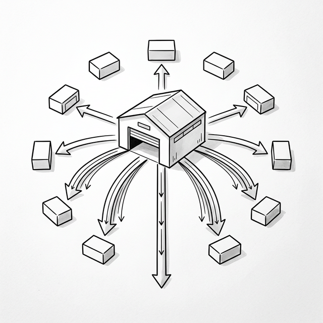

# 第十章：状态管理之战 (State Management Wars)



## 10.1 层层传递的痛 (Prop Drilling)

Student 兴高采烈地用前几章学到的组件和 Hooks 构建了一个较大的 Todo 应用。但很快，他碰到了新问题。

**Student**：Master，我的应用结构大概像这样：

```
App
├── Header            ← 需要 user.name
├── Sidebar
│   └── UserProfile   ← 需要 user.name, user.avatar
└── Main
    └── Content
        └── TodoList
            └── TodoItem  ← 需要 theme.color
```

**Student**：用户的名字在 `App` 组件的 State 里，但需要在 `Header` 和深层嵌套的 `UserProfile` 里使用。主题颜色也在 `App` 里，但要传到五层深的 `TodoItem`。看看这些 Props 是怎么传的：

```javascript
function App() {
  const [user] = useState({ name: 'Student', avatar: '🧑' });
  const [theme] = useState({ color: '#0066cc' });

  return h('div', null, [
    h(Header,  { user: user }),                    // 传
    h(Sidebar, { user: user }),                    // 传
    h(Main,    { user: user, theme: theme }),       // 传
  ]);
}

function Main({ user, theme }) {
  // Main 自己不用 user，但必须往下传！
  return h(Content, { user: user, theme: theme }); // 传
}

function Content({ user, theme }) {
  // Content 也不用 user，但也必须往下传！
  return h(TodoList, { user: user, theme: theme }); // 传
}

function TodoList({ user, theme }) {
  // TodoList 只需要 theme，但也得接收 user 再传下去……
  return h('div', null, [
    // ... items ...
  ]);
}
```

**Student**：每一层都在传 `user` 和 `theme`，但中间的层（`Main`、`Content`）根本不需要这些数据！它们只是 “快递员”，接收后无脑转发。

**Master**：这就是 **Prop Drilling（属性钻孔）**。当应用层级加深时，这种模式有两大问题：

1.  **噪音**：中间组件被迫接受和传递与自身无关的 Props。
2.  **脆弱性**：如果要给 `TodoItem` 增加一个新的 `locale` 属性，你需要修改**整条链路上的所有组件**。

## 10.2 全局状态：createStore (Mini-Redux)

**Master**：解决 Prop Drilling 的第一种思路是——把共享的状态提取到组件树之外，放在一个 **全局的、可预测的容器** 里。

**Student**：就像一个公共的“仓库”？

**Master**：正是。这就是 **Redux** (2015) 的核心理念。让我们实现一个极简版。

```javascript
function createStore(reducer, initialState) {
  let state = initialState;
  let listeners = [];

  return {
    getState() {
      return state;
    },

    dispatch(action) {
      // Reducer: 纯函数，(旧状态, 动作) → 新状态
      state = reducer(state, action);
      // 通知所有订阅者
      listeners.forEach(fn => fn());
    },

    subscribe(fn) {
      listeners.push(fn);
      // 返回取消订阅的函数
      return () => {
        listeners = listeners.filter(l => l !== fn);
      };
    }
  };
}
```

下面是一个完整的使用示例，展示 mini-redux 的完整工作流程：

```javascript
// 1. 定义 Reducer：描述"当收到某个动作时，状态如何变化"
function counterReducer(state, action) {
  switch (action.type) {
    case 'INCREMENT': return { ...state, count: state.count + 1 };
    case 'DECREMENT': return { ...state, count: state.count - 1 };
    default: return state;
  }
}

// 2. 创建 Store：初始状态 + Reducer
const store = createStore(counterReducer, { count: 0 });

// 3. 订阅状态变化：每次 dispatch 后自动触发
store.subscribe(() => {
  const { count } = store.getState();
  document.getElementById('display').textContent = 'Count: ' + count;
});

// 4. 用户操作 → dispatch Action → Reducer 计算新状态 → 通知订阅者
document.getElementById('inc-btn').addEventListener('click', () => {
  store.dispatch({ type: 'INCREMENT' });
});

document.getElementById('dec-btn').addEventListener('click', () => {
  store.dispatch({ type: 'DECREMENT' });
});
```

注意这个流程：**用户操作 → dispatch → reducer → 新状态 → 订阅者更新 UI**。整个数据流是单向的、可预测的。

**Student**：这很像第三章的 `EventEmitter`！数据变化时通知订阅者。

**Master**：是的，但有一个关键区别：状态更新必须通过 `dispatch` + `reducer`，这是一个 **纯函数**。这意味着：

*   状态变化可预测（给定输入，总是相同输出）。
*   可以被记录和回放（Time Travel Debugging）。

**Student**：但我还是需要手动 `subscribe`、手动更新 UI。有没有更简洁的方式？

## 10.3 Context API：轻量级的共享

**Master**：对于简单的全局数据（如主题、用户信息、语言设置），React 提供了 **Context API**——不需要像 Redux 那样设置 Store 和 Reducer，直接“跳过”中间层传值。

让我们实现一个极简版：

```javascript
// 极简 Context 实现
function createContext(defaultValue) {
  const context = {
    _value: defaultValue,
    _subscribers: [],
    
    Provider: function(props) {
      context._value = props.value;
      // 通知所有消费者更新
      context._subscribers.forEach(fn => fn());
    }
  };
  return context;
}

function useContext(context) {
  // 在真实 React 中，这会订阅 context 的变化
  // 我们的简化版直接返回当前值
  return context._value;
}

// 使用
const ThemeContext = createContext({ color: '#0066cc' });

// 在顶层设置
ThemeContext.Provider({ value: { color: 'red' } });

// 在任何深层组件中直接读取，无需 Prop Drilling！
function TodoItem() {
  const theme = useContext(ThemeContext);
  return h('li', { style: 'color:' + theme.color }, ['Task']);
}
```

**Student**：太棒了！不用一层层传了！任何组件都可以直接读取 Context 的值。

> ⚠️ **简化说明**：我们的极简版 Context 只是一个存值的对象。真实的 React Context API 深度集成在**组件树**中——Provider 是组件树中的一个节点，用类似 `h(ThemeContext.Provider, { value: ... }, children)` 的方式包裹子组件。子组件通过 `useContext` 读取**最近的** Provider 上面的值。这意味着同一个 Context 可以在树的**不同层级有不同的值**（比如一个区域蓝色主题，另一个区域红色主题）。我们的简化版完全跳过了这个基于树的系统。

**Master**：但 Context 有一个重要的 **性能陷阱**：当 Context 的值变化时，**所有** 消费该 Context 的组件都会重新渲染，即使它只用了 Context 中的某一个字段。

```javascript
const AppContext = createContext({ user: '...', theme: '...', locale: '...' });

// ❌ 即使只有 locale 变了，Header 也会重新渲染！
function Header() {
  const ctx = useContext(AppContext);
  return h('h1', null, ['Hello, ' + ctx.user]);
}
```

**Master**：这就是为什么 Context 适合 **低频变化的数据**（主题、语言），而不适合 **高频变化的数据**（鼠标位置、动画帧数）。

## 10.4 原子化状态 (Atomic State)

**Master**：为了解决 Context 的性能问题和 Redux 的样板代码问题，社区提出了 **原子化状态 (Atomic State)** 的方案。

**Student**：原子化是什么意思？

**Master**：意思是把状态拆成最小的单元——每个状态值都是一个独立的“原子 (Atom)”。组件只订阅它使用的那个原子，其他原子变化时不受影响。

```javascript
// Jotai/Recoil 风格的原子化状态（概念示意）
// 每个 atom 是独立的、可订阅的状态单元

function atom(initialValue) {
  let value = initialValue;
  let subscribers = new Set();

  return {
    get: () => value,
    set: (newValue) => {
      value = newValue;
      subscribers.forEach(fn => fn(value));
    },
    subscribe: (fn) => {
      subscribers.add(fn);
      return () => subscribers.delete(fn);
    }
  };
}

// 独立的原子
const countAtom = atom(0);
const userAtom = atom({ name: 'Student' });

// countAtom 变化时，只有订阅了 countAtom 的组件会更新
// userAtom 变化时，只有订阅了 userAtom 的组件会更新
```

**Student**：这就像第三章的“细粒度更新”，但在状态管理层面实现了！

**Master**：没错。历史总是螺旋上升的。而说到细粒度更新，有一个框架把这个思想推到了极致——**SolidJS** 的 **Signals**。让我们来做一次深度对比。

## 10.5 延伸阅读：React vs Signals (SolidJS)

**Master**：Student，在你学习了 React 的状态管理之后，我想让你看看一种完全不同的心智模型——**SolidJS 的 Signals**。

React 的核心假设是：每次状态变化，整个组件函数 **重新执行**。SolidJS 的做法完全相反——组件函数只执行 **一次**，状态变化时直接更新对应的 DOM 节点，不需要 Virtual DOM 和 Diff。

```javascript
// React：每次 count 变化，整个函数重新执行
function Counter() {
  const [count, setCount] = useState(0);
  return <h1>Count: {count}</h1>;
}

// SolidJS：函数只执行一次，count() 是一个"订阅"
function Counter() {
  const [count, setCount] = createSignal(0);
  return <h1>Count: {count()}</h1>;  // 只有这个文本节点被直接更新
}
```

| 维度 | React (重新执行) | SolidJS (Signals) |
|:-----|:-----------------|:-------------------|
| **心智模型** | 简单——“每次渲染就是一个快照” | 需要理解响应式——“哪些值是 Signal” |
| **默认性能** | 需要 memo/useMemo 手动优化 | 默认最优——精准更新 |
| **代码一致性** | 高——组件就是普通函数 | 有 “陷阱”——解构 props 会丢失响应式 |
| **并发能力** | ✅ 可以中断和恢复渲染 | ❌ 同步更新，难以实现时间切片 |

**Student**：那 React 的"全部重新执行"模型岂不是白白浪费了性能？

**Master**：确实有代价。让我用一个具体的例子来展示这个代价有多大：

```javascript
// React：父组件状态变化 → 所有子组件都重新执行
function ProductPage() {
  const [products] = useState(hugeProductList);  // 10,000 件商品
  const [keyword, setKeyword] = useState('');
  const [darkMode, setDarkMode] = useState(false);

  // ❌ 每次切换 darkMode 时，这个过滤 + 统计也会重新执行
  //    即使 products 和 keyword 根本没变！
  const filtered = products.filter(p =>
    p.name.includes(keyword) || p.description.includes(keyword)
  );
  const stats = {
    count: filtered.length,
    avgPrice: filtered.reduce((s, p) => s + p.price, 0) / filtered.length,
    maxPrice: Math.max(...filtered.map(p => p.price)),
  };

  // ❌ 每次 ProductPage 重新执行，都会创建一个新的函数对象
  //    导致 ProductList 认为 props 变了，也跟着重新渲染
  const handleAddToCart = (id) => { /* ... */ };

  return h('div', { class: darkMode ? 'dark' : 'light' }, [
    h(SearchBar, { keyword, setKeyword }),
    h(StatsPanel, { stats }),           // ← stats 是新对象，每次都触发重渲染
    h(ProductList, { items: filtered, onAdd: handleAddToCart }),
    //                                    ↑ filtered 是新数组，onAdd 是新函数
    //                                      即使只切换了 darkMode，这里也全部重新渲染！
  ]);
}
```

**Master**：看到了吗？用户只是切换了一下深色模式，**整个 `ProductPage` 函数重新执行**。这意味着：

1. 10,000 件商品被重新过滤、价格统计被重新计算——即使 `products` 和 `keyword` 根本没变。
2. `handleAddToCart` 被重新创建——它是一个新的函数对象。
3. `ProductList` 收到了"新的" props（因为 `filtered` 和 `handleAddToCart` 是新的引用），10,000 个 `ProductItem` 子组件也跟着重新渲染。

这就是为什么 React 引入了三个"记忆化"工具：

```javascript
// ✅ useMemo：只有依赖项变了才重新计算
const filtered = useMemo(
  () => products.filter(p =>
    p.name.includes(keyword) || p.description.includes(keyword)
  ),
  [products, keyword]  // 只有 products 或 keyword 变化时才重新过滤
);

const stats = useMemo(
  () => ({
    count: filtered.length,
    avgPrice: filtered.reduce((s, p) => s + p.price, 0) / filtered.length,
    maxPrice: Math.max(...filtered.map(p => p.price)),
  }),
  [filtered]
);

// ✅ useCallback：只有依赖项变了才创建新函数
const handleAddToCart = useCallback(
  (id) => { /* ... */ },
  []  // 无依赖，函数永远是同一个引用
);

// ✅ React.memo：只有 props 真正变化时才重新渲染子组件
const ProductList = React.memo(function ProductList({ items, onAdd }) {
  // 只有 items 或 onAdd 的引用变了才执行
  return h('ul', null, items.map(p => h(ProductItem, { ...p, onAdd })));
});
```

**Student**：`useMemo` 看起来和我们在第九章实现的 `useEffect` 很像？都是"检查依赖项是否变化"。

**Master**：本质上是同一个机制。`useEffect` 在依赖变化时 **执行副作用**，`useMemo` 在依赖变化时 **缓存计算结果**。让我们把它加到引擎里——只需要几行代码：

```javascript
function useMemo(factory, deps) {
  const idx = hookIndex;
  const prevDeps = hooks[idx];
  let hasChanged = true;
  if (prevDeps) {
    hasChanged = deps.some((dep, i) => dep !== prevDeps[i]);
  }
  if (hasChanged) {
    hooks[idx + 1] = factory();  // 依赖变了，重新计算
  }
  hooks[idx] = deps;
  hookIndex += 2;
  return hooks[idx + 1];  // 返回缓存的值
}
```

**Student**：真的就这么简单？和 `useEffect` 几乎一模一样，只是用 `factory()` 的返回值代替了 `callback()` 的副作用。

**Master**：对。而 `useCallback(fn, deps)` 更简单——它只是 `useMemo(() => fn, deps)` 的语法糖，缓存的是一个函数引用。这三个"记忆化"工具的本质都是同一个操作：**对比依赖数组，决定是否需要重新计算**。

**Student**：等一下……所以 React 开发者需要 **手动** 告诉框架"这个不用重新算"、"这个不用重新创建"？SolidJS 根本不需要这些？

**Master**：对。在 SolidJS 中，`sortedTodos` 只会在 `todos` Signal 变化时自动重新计算，函数不会被重新创建。这就是表格中"默认性能"那一行的含义——**SolidJS 默认就是精准更新，React 需要开发者手动优化**。

**Student**：那 React 这种模型除了给开发者添负担，还有什么好处？

**Master**：关键在于 React 的渲染过程只是“调用函数，生成 VNode 数据结构”——它不直接操作 DOM。这意味着这个过程是**纯粹的、可丢弃的**：React 可以渲染到一半就暂停，先去处理用户输入，之后再回来继续。这正是第 11 章并发模式的基础。

而 SolidJS 的 Signal 变化直接修改 DOM——没有中间的“规划阶段”，所以也就没有什么可以暂停的东西。更快、更精准，但换不来并发能力。

**Student**：所以 React 的“全部重新执行”不只是缺陷，它反而 **使得并发模式成为可能**？

**Master**：正是如此。这是两种架构的**根本权衡**——React 选择了“用冗余的规划阶段换取可中断性”，SolidJS 选择了“用精准的直接更新换取默认性能”。没有完美的答案。

而且 React 团队也意识到了 `useMemo`/`useCallback` 的心智负担。他们开发了 **React Compiler**，目标是在编译阶段自动插入这些记忆化优化，让开发者不再需要手动处理。

### SolidJS 的“陷阱”

**Master**：最后，我要让你看到 Signals 心智模型中的一些 **非直觉行为**，这样你才能做出公平的评判。

```javascript
// SolidJS 的陷阱：解构会"杀死"响应式
function Greeting(props) {
  // ❌ 解构后，name 变成了一个静态值，不再追踪变化！
  const { name } = props;
  return <h1>Hello, {name}</h1>;  // name 永远是初始值

  // ✅ 必须用 props.name 或 mergeProps 保持响应式
  return <h1>Hello, {props.name}</h1>;
}

// React 中不存在这个问题！因为每次都重新执行，每次都拿到最新的值。
```

```javascript
// SolidJS 的陷阱：提前求值会"杀死"响应式
function App() {
  const [count, setCount] = createSignal(0);

  // ❌ 在组件设置阶段求值，只执行一次！
  const doubled = count() * 2;  // 永远是 0

  // ✅ 必须用函数包裹，保持"惰性求值"
  const doubled = () => count() * 2;

  return <p>Doubled: {doubled()}</p>;
}
```

**Student**：我明白了。React 的心智模型更 **宽容**——因为每次重新执行，所以不管你写什么表达式，它都会拿到最新值。SolidJS 的心智模型更 **高效**——但你必须理解“什么时候响应式链断了”。

**Master**：这是每个框架选择的 **核心权衡**。没有完美的答案，只有不同场景下的最佳选择。

## 10.6 对比一览

| 方案 | 优点 | 缺点 | 适用场景 |
|:-----|:-----|:-----|:---------|
| **Prop Drilling** | 简单、显式、可追踪 | 深层嵌套时冗余，修改链路长 | 扁平组件树 |
| **Redux** | 可预测、Time Travel Debug | 大量样板代码（Action、Reducer、Store） | 大规模应用、复杂状态逻辑 |
| **Context API** | 轻量、无需外部库 | 性能问题（全组件重渲染） | 低频变化的全局数据 |
| **原子化 (Jotai/Recoil)** | 精准更新、最小样板 | API 较新、生态较小 | 中大型应用、精细控制 |


### 📦 目前的成果

将以下代码保存为 `ch10.html`，完整可运行：

```html
<!DOCTYPE html>
<html lang="zh-CN">
<head>
  <meta charset="UTF-8">
  <title>Chapter 10 — State Management</title>
  <style>
    body { font-family: sans-serif; padding: 20px; max-width: 600px; margin: 0 auto; }
    .card { border: 1px solid #ddd; border-radius: 8px; padding: 15px; margin: 15px 0; }
    .card h3 { margin-top: 0; }
    button { padding: 6px 12px; cursor: pointer; margin: 4px; }
    li { padding: 6px 0; border-bottom: 1px solid #eee; display: flex; justify-content: space-between; }
    li button { background: #ff4444; color: white; border: none; padding: 3px 8px; border-radius: 3px; }
    input { padding: 6px; width: 60%; }
    #log { background: #f5f5f5; padding: 10px; border-radius: 4px; font-family: monospace; font-size: 12px; max-height: 120px; overflow-y: auto; }
  </style>
</head>
<body>
  <h1>State Management Wars</h1>
  <div id="app"></div>

  <script>
    // === Mini-React Engine (self-contained) ===
    function h(tag, props, children) {
      return { tag, props: props || {}, children: children || [] };
    }
    function mount(vnode, container) {
      if (typeof vnode === 'string' || typeof vnode === 'number') {
        container.appendChild(document.createTextNode(vnode)); return;
      }
      const el = (vnode.el = document.createElement(vnode.tag));
      for (const k in vnode.props) {
        if (k.startsWith('on')) el.addEventListener(k.slice(2).toLowerCase(), vnode.props[k]);
        else el.setAttribute(k, vnode.props[k]);
      }
      if (typeof vnode.children === 'string') el.textContent = vnode.children;
      else (vnode.children||[]).forEach(c => {
        if (typeof c === 'string' || typeof c === 'number') el.appendChild(document.createTextNode(c));
        else mount(c, el);
      });
      container.appendChild(el);
    }
    function patch(o, n) {
      if (o.tag !== n.tag) {
        const p = o.el.parentNode, t = document.createElement('div');
        mount(n, t); p.replaceChild(n.el, o.el); return;
      }
      const el = (n.el = o.el);
      const op = o.props||{}, np = n.props||{};
      for (const k in np) {
        if (op[k] !== np[k]) {
          if (k.startsWith('on')) {
            const e = k.slice(2).toLowerCase();
            if (op[k]) el.removeEventListener(e, op[k]);
            el.addEventListener(e, np[k]);
          } else el.setAttribute(k, np[k]);
        }
      }
      for (const k in op) {
        if (!(k in np)) {
          if (k.startsWith('on')) el.removeEventListener(k.slice(2).toLowerCase(), op[k]);
          else el.removeAttribute(k);
        }
      }
      const oc = o.children||[], nc = n.children||[];
      if (typeof nc === 'string') { if (oc !== nc) el.textContent = nc; }
      else if (typeof oc === 'string') { el.textContent = ''; nc.forEach(c => mount(c, el)); }
      else {
        const cl = Math.min(oc.length, nc.length);
        for (let i = 0; i < cl; i++) {
          const a = oc[i], b = nc[i];
          if (typeof a === 'string' && typeof b === 'string') { if (a !== b) el.childNodes[i].textContent = b; }
          else if (typeof a === 'object' && typeof b === 'object') patch(a, b);
        }
        if (nc.length > oc.length) nc.slice(oc.length).forEach(c => mount(c, el));
        if (nc.length < oc.length) for (let i = oc.length-1; i >= cl; i--) el.removeChild(el.childNodes[i]);
      }
    }

    // === createStore (Mini-Redux) ===
    function createStore(reducer, initial) {
      let state = initial;
      let listeners = [];
      return {
        getState: () => state,
        dispatch: (action) => {
          state = reducer(state, action);
          listeners.forEach(fn => fn());
        },
        subscribe: (fn) => {
          listeners.push(fn);
          return () => { listeners = listeners.filter(l => l !== fn); };
        }
      };
    }

    // === Application ===
    const logEl = (function() {
      // Pre-create log element
      const d = document.createElement('div');
      d.id = 'log'; 
      return d;
    })();

    function log(msg) {
      const line = document.createElement('div');
      line.textContent = '→ ' + msg;
      logEl.prepend(line);
    }

    // Reducer
    function todosReducer(state, action) {
      switch (action.type) {
        case 'ADD_TODO':
          log('dispatch: ADD_TODO "' + action.text + '"');
          return { ...state, todos: [...state.todos, action.text] };
        case 'REMOVE_TODO':
          log('dispatch: REMOVE_TODO index=' + action.index);
          return { ...state, todos: state.todos.filter((_, i) => i !== action.index) };
        default:
          return state;
      }
    }

    const store = createStore(todosReducer, {
      todos: ['Learn React', 'Build Mini-React']
    });

    let inputValue = '';
    let currentVNode = null;

    function renderApp() {
      const todos = store.getState().todos;
      return h('div', null, [
        // Todo Input
        h('div', { class: 'card' }, [
          h('h3', null, ['Mini-Redux Todo List']),
          h('div', null, [
            h('input', { 
              id: 'todo-input',
              placeholder: 'Add a task',
              value: inputValue
            }),
            h('button', { 
              onclick: () => {
                const input = document.getElementById('todo-input');
                const val = input.value.trim();
                if (!val) return;
                store.dispatch({ type: 'ADD_TODO', text: val });
                inputValue = '';
              }
            }, ['Add']),
          ]),
          h('p', null, ['Total: ' + todos.length + ' items']),
          h('ul', null,
            todos.map((text, i) =>
              h('li', null, [
                text,
                h('button', { onclick: () => store.dispatch({ type: 'REMOVE_TODO', index: i }) }, ['×'])
              ])
            )
          )
        ]),

        // Log Panel
        h('div', { class: 'card' }, [
          h('h3', null, ['📋 Redux Action Log']),
        ]),
      ]);
    }

    function update() {
      const newVNode = renderApp();
      if (!currentVNode) {
        mount(newVNode, document.getElementById('app'));
        // Append log panel after first mount
        document.querySelector('.card:last-child').appendChild(logEl);
      } else {
        patch(currentVNode, newVNode);
      }
      currentVNode = newVNode;
    }

    // Subscribe to store changes
    store.subscribe(update);

    // Initial render
    update();
    log('Store initialized with ' + store.getState().todos.length + ' todos');

    // === Mini Context Demo ===
    // (追加在 Redux Demo 下方)
    const ctxRoot = document.createElement('div');
    ctxRoot.className = 'card';
    ctxRoot.innerHTML = `
      <h3>🌈 Mini Context Demo</h3>
      <p>Theme color is read from Context, not passed via Props:</p>
      <div id="ctx-display" style="padding:10px;border-radius:4px;color:white;background:#0066cc">
        Current theme: #0066cc
      </div>
      <button id="ctx-toggle" style="margin-top:8px">Toggle Theme Color</button>
    `;
    document.getElementById('app').appendChild(ctxRoot);

    // Simple Context implementation
    const ThemeContext = { _value: '#0066cc' };
    let isBlue = true;
    document.getElementById('ctx-toggle').addEventListener('click', () => {
      isBlue = !isBlue;
      ThemeContext._value = isBlue ? '#0066cc' : '#cc6600';
      const el = document.getElementById('ctx-display');
      el.style.background = ThemeContext._value;
      el.textContent = 'Current theme: ' + ThemeContext._value;
      log('Context value changed to ' + ThemeContext._value);
    });
  </script>
</body>
</html>
```

*(下一章：从并发到服务器——React 的未来)*
