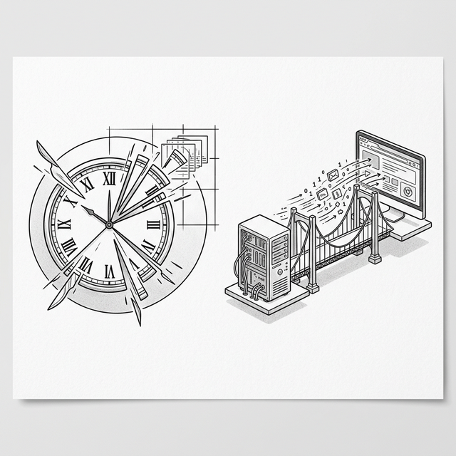

# 第十一章：从并发到服务器 —— React 的未来 (Concurrent & Server Components)



## 11.1 最后一块拼图

Student 已经走过了漫长的旅程。从原生 DOM 到模板、从数据绑定到 Virtual DOM、从类组件到 Hooks、从 Prop Drilling 到全局状态管理……

**Student**：Master，感觉我们已经构建了 React 的大部分核心。还有什么遗漏的吗？

**Master**：我们构建的一切都有一个共同的假设：**渲染是同步的、一次性完成的**。当你调用 `setState` 或 `rerender` 时，整个 VNode 树的生成和 Diff 是一口气做完的。

**Student**：这有什么问题吗？

**Master**：想象一下，你的 Todo List 有 10,000 条数据，用户在输入框里打了一个字。你的代码会这样执行：

1.  用户按键 → 触发 `setState`
2.  重新渲染整棵 10,000 节点的 VNode 树（100ms）
3.  Diff + Patch（50ms）
4.  这 150ms 期间，浏览器 **完全卡住** —— 用户的光标不闪，页面不响应，滚动停滞。

**Student**：这就是那种"打字有延迟"的感觉？

**Master**：是的。JavaScript 是单线程的。当你的渲染函数占据了主线程 150ms，浏览器就没有机会去处理用户的交互、动画和绘制。

## 11.2 时间切片 (Time Slicing)

**Master**：解决思路是：**不要一口气做完，而是把工作切成小块，每做一小块就把主线程还给浏览器**。

**Student**：切成小块？但我怎么知道什么时候该停下来呢？

**Master**：想象你在切蛋糕——每切一块就问一下："还有客人在等吗？" 如果有，就先把刀放下，让客人先吃到蛋糕，然后再继续切。浏览器提供了一个 API 叫 `requestIdleCallback`，它会在浏览器空闲时调用你的函数，并告诉你"你还有多少毫秒可以用"。

```javascript
function timeSlicedWork(tasks) {
  let index = 0;

  function doChunk(deadline) {
    // deadline.timeRemaining() 告诉我们还剩多少空闲时间
    while (index < tasks.length && deadline.timeRemaining() > 1) {
      tasks[index]();  // 执行一个任务
      index++;
    }

    if (index < tasks.length) {
      // 还有任务没做完，等下一个空闲期继续
      requestIdleCallback(doChunk);
    } else {
      console.log('All work done!');
    }
  }

  requestIdleCallback(doChunk);
}
```

**Student**：这样即使有 10,000 个任务，浏览器也不会卡住——因为每次只做几十个，然后让出主线程去处理用户交互？

**Master**：对。React 18 的 **Concurrent Mode（并发模式）** 正是基于这个思想。它引入了两个关键概念：

*   **可中断的渲染**：渲染过程可以被暂停和恢复。
*   **优先级调度**：用户输入的优先级高于数据加载，所以输入框应该优先响应。
React 并没有直接使用 `requestIdleCallback`（因为浏览器支持不一致且调度精度不够），而是在 `scheduler` 包中基于 `MessageChannel` 实现了自己的协作式调度器。但核心思想相同：把长任务拆成小块，在帧间隙中执行。

## 11.3 Suspense：优雅的等待

**Master**：接下来我们面对另一个问题——**异步数据**。
在没有 Suspense 的时代，获取数据的代码通常是这样的：

```javascript
function UserProfile() {
  const [user, setUser] = useState(null);
  const [loading, setLoading] = useState(true);

  useEffect(() => {
    fetchUser().then(data => {
      setUser(data);
      setLoading(false);
    });
  }, []);

  if (loading) return h('p', null, ['Loading...']);
  return h('div', null, ['Hello, ' + user.name]);
}
```

**Student**：这有什么问题？

**Master**：三个：

1.  **瀑布请求 (Waterfall)**：组件渲染后才开始 fetch，子组件的 fetch 要等父组件完成后才能开始。
2.  **Loading 状态爆炸**：每个组件都要自己管理 `loading`/`error` 状态，到处都是 `if (loading)` 判断。
3.  **竞态条件 (Race Condition)**：如果用户快速切换页面，先发出的请求可能在后发出的请求之后返回。

**Master**：Suspense 的核心思想是一个 **逆天的操作**：组件在数据未就绪时 **直接 throw 一个 Promise**，React 捕获这个 Promise，渲染 fallback UI，等 Promise resolve 后重新渲染。

```javascript
// Suspense 的核心原理（极简模拟）
function createResource(fetchFn) {
  let status = 'pending';
  let result;
  let promise = fetchFn().then(
    data => { status = 'success'; result = data; },
    error => { status = 'error'; result = error; }
  );

  return {
    read() {
      switch (status) {
        case 'pending': throw promise;   // 🔥 把 Promise 直接 throw 出去！
        case 'error':   throw result;
        case 'success': return result;
      }
    }
  };
}

// "Suspense 边界" 捕获被 throw 的 Promise
function renderWithSuspense(componentFn, fallbackFn, container) {
  try {
    const vnode = componentFn();
    mount(vnode, container);
  } catch (thrown) {
    if (thrown instanceof Promise) {
      // 渲染 fallback
      const fallback = fallbackFn();
      mount(fallback, container);
      // 等 Promise 完成后重新渲染
      thrown.then(() => {
        container.innerHTML = '';
        renderWithSuspense(componentFn, fallbackFn, container);
      });
    } else {
      throw thrown; // 真正的错误，继续抛出
    }
  }
}

// 使用
const userResource = createResource(() => 
  fetch('/api/user').then(r => r.json())
);

function UserProfile() {
  const user = userResource.read(); // 数据没好就 throw！
  return h('div', null, ['Hello, ' + user.name]);
}
```

**Student**：什么! 把 Promise 当异常 throw 出去？

**Master**：但它解决了所有三个问题：

1.  **无瀑布**：数据获取可以在渲染之前就开始（Render-as-you-fetch）。
2.  **无 Loading 状态管理**：组件代码里根本看不到 `loading`。
3.  **统一边界**：一个 Suspense 边界就能处理所有子组件的加载状态。

## 11.4 SPA 的局限

**Master**：Student，到目前为止，我们构建的一切——从虚拟 DOM 到 Hooks，从状态管理到并发渲染——都运行在 **同一个地方**。

**Student**：浏览器？

**Master**：对。用户访问你的网站时，浏览器下载了一个 HTML 文件，然后加载 JavaScript，JavaScript 在浏览器中从零开始构建整个 UI。这种模式叫做 **SPA (Single-Page Application)**。

**Student**：这不就是我们一直在做的吗？打开 `ch05.html`，JavaScript 接管一切。

**Master**：正是。现在想象一下，你把 Todo List 发布到了互联网上。一个真实用户打开你的页面，他的浏览器会收到什么？

**Student**：一个 HTML 文件，里面有一个空的 `<div id="app"></div>`，加上一个 `<script>` 标签？

**Master**：没错。让我们看看这意味着什么。在 JavaScript 加载并执行完成之前，用户看到的是什么？

**Student**：……空白页面？

**Master**：对。**白屏**。这个空白可能持续 1-3 秒——取决于 JavaScript 的大小和用户的网速。现在再想另一个问题：Google 的搜索引擎爬虫访问你的页面时，它看到了什么？

**Student**：也是那个空的 `<div id="app">`？因为爬虫不一定会执行 JavaScript……

**Master**：你现在看到了 SPA 的三大致命问题：

```
┌──────────────────────────────────────────────────────┐
│  SPA 的三大问题                                       │
│                                                      │
│  1. 首屏白屏 (White Flash)                            │
│     空 HTML → 下载 JS → 执行 JS → 才能看到内容        │
│     用户等待时间 = 网络延迟 + JS 解析 + 渲染           │
│                                                      │
│  2. SEO 不友好                                        │
│     搜索引擎看到的是空 <div>，无法索引你的内容          │
│                                                      │
│  3. Bundle 无限膨胀                                   │
│     所有页面的代码打包到一个 JS 文件                    │
│     功能越多 → Bundle 越大 → 首屏越慢                  │
└──────────────────────────────────────────────────────┘
```

**Student**：等一下……以前没有 SPA 的时候是怎么做的？传统网站不就是服务器直接返回完整的 HTML 吗？比如 PHP、Ruby on Rails？

**Master**：你已经闻到了正确的方向。

## 11.5 SSR：回到服务器

**Master**：如果服务器先把 React 组件渲染成 HTML 字符串，发送给浏览器呢？

**Student**：你是说……在服务器上运行我们的 `render` 函数？

**Master**：正是。还记得我们的 `h()` 函数吗？它返回的是一个普通的 JavaScript 对象——VNode。这个对象不依赖浏览器，它在 Node.js 上一样可以生成。我们只需要一个额外的函数，把 VNode **转成 HTML 字符串**：

```javascript
// 核心概念：把 VNode 渲染成 HTML 字符串
function renderToString(vnode) {
  // 文本节点：直接返回文本（转义 HTML 特殊字符）
  if (typeof vnode === 'string' || typeof vnode === 'number') {
    return escapeHtml(String(vnode));
  }

  // 元素节点：拼接 HTML 标签
  let html = '<' + vnode.tag;

  // 处理属性（跳过事件处理器——它们属于客户端）
  for (const key in vnode.props) {
    if (key.startsWith('on')) continue; // ⚡ 事件在服务端无意义
    html += ' ' + key + '="' + escapeHtml(vnode.props[key]) + '"';
  }
  html += '>';

  // 递归渲染子节点
  const children = vnode.children || [];
  if (typeof children === 'string') {
    html += escapeHtml(children);
  } else {
    for (const child of children) {
      html += renderToString(child);
    }
  }

  html += '</' + vnode.tag + '>';
  return html;
}

function escapeHtml(str) {
  return str.replace(/&/g, '&amp;')
            .replace(/</g, '&lt;')
            .replace(/>/g, '&gt;')
            .replace(/"/g, '&quot;');
}
```

**Student**：这就是 React 的 `renderToString`？

**Master**：简化版，但原理一样。现在来看整个流程的变化：

```
SPA 流程：
  浏览器请求 → 服务器返回空 HTML → 下载 JS → 执行 JS → 用户看到内容
                                  ↑
                              白屏等待

SSR 流程：
  浏览器请求 → 服务器运行 renderToString → 返回完整 HTML → 用户立刻看到内容
                                                        → 下载 JS → Hydration
```

**Student**：用户立刻就能看到内容了！但等一下……`renderToString` 会跳过事件处理器（`onclick` 等），那页面虽然看起来有内容，但按钮点了没反应？

**Master**：关键问题。这就引出了 SSR 中最重要的概念——**Hydration（水合）**。

服务器给了你 **骨架**（HTML 结构），客户端 JavaScript 加载完成后，会在这个现有的 DOM 上 **附着事件处理器和状态**，让它变得可交互。这个过程叫做 Hydration——就像给干燥的骨骼注入水分，让它活过来。

```
          服务器                              客户端
    ┌──────────────┐                  ┌──────────────────┐
    │ renderToString│     HTML 字符串   │                  │
    │              │ ──────────────→  │ 1. 用户看到内容   │
    │ <div>        │                  │    （不可交互）    │
    │  <h1>Hello   │                  │                  │
    │  <button>+1  │                  │ 2. JS 加载完成    │
    │ </div>       │                  │                  │
    └──────────────┘                  │ 3. Hydration:     │
                                      │    遍历现有 DOM   │
                                      │    附着 onclick   │
                                      │    恢复 state     │
                                      │                  │
                                      │ 4. 页面可交互！   │
                                      └──────────────────┘
```

**Student**：我理解了！服务器负责"画面"，客户端负责"灵魂"。但这是不是意味着客户端的 JS Bundle 也没有变小？所有的组件代码还是要发送到客户端？

**Master**：你发现了 SSR 的关键局限。SSR 的三大代价：

1.  **服务器压力**：每次用户请求，服务器都要执行一次渲染。100 个用户同时访问 = 100 次渲染。
2.  **TTFB 延迟 (Time To First Byte)**：用户必须等服务器渲染完成才能收到第一个字节的响应。
3.  **全量 Hydration**：客户端仍然需要加载 **所有** 组件的 JavaScript，然后遍历整棵 DOM 树去"认领"每个节点。即使某些组件永远不需要交互。

**Student**：第三点听起来特别浪费。比如一篇博客文章的正文——它就是静态的文字，为什么还要发送 JS 代码到客户端，再 Hydrate 一遍？

**Master**：记住这个问题。我们一会会回来。

## 11.6 SSG 与 ISR：静态的诱惑

**Student**：Master，如果页面的内容不会频繁变化——比如一篇博客文章——那为什么每次用户请求都要重新渲染呢？能不能提前把 HTML 生成好？

**Master**：你刚刚推导出了 **SSG (Static Site Generation)**。

SSG 的思路是：在 **构建时（build time）** 就运行 `renderToString`，把每个页面都渲染成一个 `.html` 文件，部署到 CDN 上。用户请求时，CDN 直接返回静态文件——不需要任何服务器计算。

```
SSR：用户请求 → 服务器实时渲染 → 返回 HTML（每次都要算）
SSG：构建时渲染 → 生成 .html 文件 → 部署到 CDN → 用户请求 → CDN 直接返回
```

**Student**：这就像是提前烤好的面包，顾客来了直接拿。比现烤（SSR）快多了！但有个问题——如果博客文章更新了，我得重新构建整个网站？

**Master**：如果你的网站有 10,000 篇文章，改一篇就重新构建 10,000 个页面，确实不太现实。这就是 **ISR (Incremental Static Regeneration)** 解决的问题。

ISR 的思路是：给每个页面设置一个 **有效期**。页面首次生成后是静态的，但到了有效期，下一个用户请求时就在后台重新生成一个新的版本。

**Student**：就像面包的保质期？过期了就自动重新烤一个？

**Master**：正是。来整理一下我们目前见过的所有渲染策略：

| 策略 | 渲染时机 | 优点 | 缺点 | 适用场景 |
|:-----|:---------|:-----|:-----|:---------|
| **SPA** | 客户端运行时 | 交互体验流畅 | 首屏白屏、SEO 差 | 后台管理系统、Web 应用 |
| **SSR** | 每次请求时 | SEO 好、首屏快 | 服务器压力大、TTFB 慢 | 动态内容（社交、电商） |
| **SSG** | 构建时 | 极快、零服务器成本 | 内容更新需重新构建 | 博客、文档、营销页 |
| **ISR** | 构建时 + 定期刷新 | 兼顾速度和时效性 | 可能短暂看到旧内容 | 新闻、产品页 |

**Student**：每种方案都是前一种的"补丁"，解决了旧问题又带来了新问题。

**Master**：这就是技术演进的本质。而且你注意到没有——不管是 SSR、SSG 还是 ISR，它们都有一个共同的遗留问题。

**Student**：全量 Hydration？服务器渲染了 HTML，但客户端还是要加载 **所有** 组件的 JS，把整棵 DOM 树重新"认领"一遍。

**Master**：正是。现在让我们来解决这个问题。

## 11.7 React Server Components (RSC)

**Master**：让我们回到那个关键问题——全量 Hydration 的浪费。看看一个典型的博客页面：

```
BlogPage
├── Header          ← 有一个搜索框，需要交互
├── ArticleBody     ← 纯文本和图片，完全静态
│   └── 3000 字正文
├── CodeBlock       ← 语法高亮的代码块，静态
├── CommentList     ← 评论列表，从数据库读取
│   └── 100 条评论
└── LikeButton      ← 点赞按钮，需要交互
```

**Student**：五个组件中，真正需要交互（需要 JavaScript）的只有 `Header` 和 `LikeButton`。`ArticleBody`、`CodeBlock`、`CommentList` 都是纯展示的。

**Master**：但在传统 SSR 中，所有五个组件的 JS 代码都会被发送到客户端，客户端会对整棵 DOM 树做 Hydration。想想那 3000 字正文和 100 条评论——它们的组件代码加起来可能有 50KB，客户端下载并执行了这 50KB 的 JS，只是为了"确认一下这些静态文本不需要事件处理器"。

**Student**：太浪费了。如果能告诉 React "这些组件是纯服务端的，不需要发 JS 到客户端"就好了。

**Master**：这就是 **React Server Components (RSC)** 的核心洞见。

### Server Component vs Client Component

**Master**：RSC 把组件分成了两类：

```
┌─────────────────────────┐     ┌─────────────────────────┐
│     Server Component     │     │     Client Component     │
│                         │     │                         │
│  ✅ 可以 await db.query() │     │  ✅ 可以 useState/useEffect│
│  ✅ 可以读文件系统        │     │  ✅ 可以响应用户交互      │
│  ✅ 可以访问密钥/token    │     │  ✅ 可以访问浏览器 API    │
│                         │     │                         │
│  ❌ 不能用 useState      │     │  ❌ 不能直接访问数据库    │
│  ❌ 不能用 useEffect     │     │  ❌ 不能读服务器文件      │
│  ❌ 不能监听事件         │     │                         │
│                         │     │                         │
│  📦 零 JS 发送到客户端   │     │  📦 JS Bundle 发送到客户端│
└─────────────────────────┘     └─────────────────────────┘
```

**Student**：所以 Server Component 的代码从来不会出现在用户浏览器的 JS Bundle 里？

**Master**：对。这意味着 `ArticleBody`、`CodeBlock`、`CommentList` 可以是 Server Component——它们在服务器上渲染完就结束了，零 JS 送到客户端。只有 `Header` 和 `LikeButton` 是 Client Component，只有它们的 JS 代码需要下载和 Hydration。

### RSC 不是 SSR

**Student**：等一下，Server Component 在服务器上渲染……这和 SSR 有什么区别？

**Master**：关键区别在于 **输出格式**。

*   **SSR** 的输出是 **HTML 字符串**。客户端收到 HTML 后，还需要加载组件的 JS 代码来"认领"这些 DOM 节点（Hydration）。
*   **RSC** 的输出是 **RSC Payload**——一种可序列化的组件树描述。它不是 HTML，而是一种中间格式，客户端的 React 可以直接把它融入组件树中。

**Student**：RSC Payload？这是什么格式？

**Master**：让我用一个简化的例子来展示。假设我们在服务器上有这样的组件：

```javascript
// 服务器组件（概念代码，需要全栈环境运行）
async function BlogPost({ id }) {
  const post = await db.query('SELECT * FROM posts WHERE id = ?', [id]);
  
  return h('article', null, [
    h('h1', null, [post.title]),
    h('p', null, [post.content]),
    // LikeButton 是 Client Component——标记为 "client:" 引用
    { $$typeof: 'client-reference', module: './LikeButton.js', props: { postId: id } }
  ]);
}
```

服务器把这棵树渲染后，生成的 RSC Payload（简化版）大致是：

```json
{
  "type": "article",
  "props": {},
  "children": [
    { "type": "h1", "children": ["深入理解 React Server Components"] },
    { "type": "p",  "children": ["RSC 把组件分为两类……（3000字正文）"] },
    { "$$typeof": "client-reference", "module": "./LikeButton.js", "props": { "postId": 42 } }
  ]
}
```

**Student**：我看懂了！`h1` 和 `p` 的内容已经被渲染成了最终值（标题和正文文本），不需要客户端再执行任何 JS。但 `LikeButton` 被保留为一个 **引用**——客户端看到 `"client-reference"` 后，才会去加载 `LikeButton.js` 并渲染它。

**Master**：精确！这就是 RSC 的精髓：

1.  Server Component 的输出被 **内联** 到 Payload 中（纯数据，零 JS）。
2.  Client Component 被表示为一个 **引用**（"去加载这个 JS 文件"）。
3.  客户端收到 Payload 后，把静态部分直接渲染为 DOM，只对 Client Component 部分加载 JS 和做 Hydration。

**Student**：这样就不需要全量 Hydration 了！只有标记为 Client Component 的部分才需要 JS。

### 模拟 RSC 的思路

**Master**：我们无法在单个 HTML 文件中运行真正的 RSC——它需要服务器环境。但我们可以 **模拟它的核心思想**：Server Component 预先渲染 → 生成 Payload → 客户端消费 Payload。

```javascript
// === 模拟 RSC 的核心流程 ===

// 第一步："服务器端"——把组件渲染成 RSC Payload
function serverRender(componentFn, props) {
  const vnode = componentFn(props);
  return resolveToPayload(vnode);
}

function resolveToPayload(node) {
  if (typeof node === 'string' || typeof node === 'number') {
    return node;  // 文本直接保留
  }
  if (node.$$typeof === 'client-reference') {
    // Client Component：保留引用，不在"服务端"渲染
    return node;
  }
  // 普通元素或 Server Component：递归解析
  return {
    type: node.tag,
    props: node.props,
    children: (node.children || []).map(c => resolveToPayload(c))
  };
}

// 第二步："客户端"——消费 Payload，构建真实 DOM
// 遇到 client-reference 时，加载对应的 Client Component 并渲染
function clientRender(payload, clientComponents, container) {
  const vnode = payloadToVNode(payload, clientComponents);
  mount(vnode, container);
}

function payloadToVNode(node, registry) {
  if (typeof node === 'string' || typeof node === 'number') {
    return node;
  }
  if (node.$$typeof === 'client-reference') {
    // 从注册表中找到 Client Component 并执行
    const componentFn = registry[node.module];
    return componentFn(node.props);
  }
  return h(
    node.type,
    node.props,
    node.children.map(c => payloadToVNode(c, registry))
  );
}
```

**Student**：`serverRender` 把组件树"压平"成纯数据，`clientRender` 再把数据"充气"成 VNode。Client Component 在客户端才被真正执行。

**Master**：对。在我们的 demo 中，"服务端"和"客户端"在同一个 HTML 文件里——但数据传递的方式（通过 Payload 而不是直接共享函数引用）完整地模拟了 RSC 的核心机制。

> 💡 **注意**：真正的 RSC 需要全栈环境（如 Next.js App Router）。如果你想亲手体验真正的 RSC，可以通过 `npx create-next-app` 创建一个 Next.js 项目，选择 App Router 即可。在 App Router 中，默认所有组件都是 Server Component，只有标记了 `'use client'` 的文件才是 Client Component。

**Student**：所以 SSR 和 RSC 可以结合使用？

**Master**：不仅可以，在 Next.js 中它们就是这样工作的。首次请求中：

1.  RSC 在服务器上运行 Server Component，生成 RSC Payload。
2.  SSR 把 RSC Payload + Client Component 一起渲染为 HTML 字符串，发给浏览器。
3.  浏览器立刻显示 HTML（首屏快）。
4.  JS 加载后，只对 Client Component 部分做 Hydration（Bundle 小）。

**Student**：这不就是回到了 PHP 的时代？在服务器上写数据查询和 UI？

**Master**：表面上是循环，本质上是螺旋上升。PHP 返回的是 HTML 字符串——客户端无法理解它的结构。RSC 返回的是 **可序列化的组件树**——客户端可以无缝地将它与交互式的 Client Component 结合、实现无刷新导航、流式传输。这是一种用 20 年后的技术重新审视 20 年前的简洁。

## 11.8 回望旅途：你已经"重新发明"了 React

**Master**：Student，在我们讨论未来之前，让我们先回头看看你在这趟旅程中做了什么。

```
你从零开始，亲手构建了：

Ch01  document.createElement     → 感受了命令式的痛苦
Ch02  render(template, data)     → 发明了声明式的模板
Ch03  EventEmitter + Model       → 创造了观察者模式的数据绑定
Ch04  UI = f(state)              → 领悟了 React 的核心思想
Ch05  h() + mount() + patch()    → 实现了虚拟 DOM 引擎
Ch06  Component + Props          → 构建了组件系统
Ch07  setState + Lifecycle       → 赋予了组件记忆和时间感
Ch08  HOC + Render Props         → 体验了类组件逻辑复用的困境
Ch09  useState + useEffect       → 发明了 Hooks
Ch10  createStore + Context      → 构建了状态管理方案
Ch11  requestIdleCallback        → 理解了并发调度
      throw Promise              → 理解了 Suspense
      renderToString             → 理解了 SSR
      RSC Payload                → 理解了 Server Components

这就是 React 的核心。
```

**Student**：……原来 React 不是魔法。它是你在对的时间做的一系列精妙的工程权衡。

## 11.9 终章：道与器

**Master** 缓缓饮了一口茶。窗外的天色渐暗。

**Master**：Student，你还记得第一天走进来时，你想学什么吗？

**Student**：……我想学 React。我以为它是一个工具。

**Master**：现在呢？

**Student**：现在我明白了。React 不只是一个库。它是一系列 **工程决策** 的结晶——每一个决策都来自一个真实的痛点：

*   命令式太累？→ 声明式。
*   全量重绘太慢？→ Virtual DOM Diff。
*   逻辑耦合在 `this` 上？→ Hooks。
*   数据穿越层级太难？→ Context / 状态管理。
*   同步渲染阻塞用户？→ 并发调度。
*   SPA 首屏白屏？→ SSR / SSG。
*   全量 Hydration 浪费？→ Server Components。

每一个"解决方案"都带来了新的"问题"，而新的"问题"又催生了新的"解决方案"。
这就是技术演进的本质。

**Master**：正是如此。最好的技术不是凭空发明的，而是在解决真实问题的过程中，自然而然地生长出来的。你今天走过的路，就是过去二十年来数千名工程师走过的路。

**Student**：如果有一天 React 被更好的东西取代了呢？

**Master**：那也没关系。因为你理解的不仅仅是 React 的 API，更是 **UI 开发中永恒的权衡**：

*   声明式 vs 命令式
*   全量更新 vs 细粒度更新
*   运行时灵活性 vs 编译时优化
*   开发体验 vs 运行性能
*   客户端渲染 vs 服务端渲染

无论未来的框架叫什么名字，它们都逃不出这些维度的抉择。而你，已经拥有了在这些维度之间自如游走的能力。

**Student** 深深鞠了一躬。

**Student**：谢谢您，Master。

**Master** 微微一笑。

**Master**：去吧，去构建你自己的世界。

---

### 📦 目前的成果

将以下代码保存为 `ch11.html`，体验 Time Slicing、Suspense、`renderToString` 和 RSC Payload 的简化模拟：

*(完整代码见 `code/11.html`)*
```html
<!DOCTYPE html>
<html lang="zh-CN">
<head>
  <meta charset="UTF-8">
  <title>Chapter 11 — Concurrent, Suspense, SSR & RSC</title>
  <style>
    body { font-family: sans-serif; padding: 20px; max-width: 700px; margin: 0 auto; background: #fafafa; }
    .card { border: 1px solid #ddd; border-radius: 8px; padding: 15px; margin: 15px 0; background: #fff; }
    .card h3 { margin-top: 0; }
    button { padding: 8px 16px; cursor: pointer; margin: 4px; }
    .bar { height: 20px; background: #0066cc; transition: width 0.1s; border-radius: 4px; margin: 4px 0; }
    .blocked { background: #ff4444; }
    .status { font-family: monospace; font-size: 13px; color: #666; }
    input { padding: 6px; width: 60%; }
    .loading { color: #999; font-style: italic; }
    .user-card { background: #f0f8ff; padding: 10px; border-radius: 4px; margin-top: 10px; }
    pre { background: #f5f5f5; padding: 12px; border-radius: 6px; font-size: 12px; overflow-x: auto; white-space: pre-wrap; word-wrap: break-word; max-height: 300px; overflow-y: auto; }
    .html-output { background: #e8f5e9; padding: 12px; border-radius: 6px; margin-top: 8px; border: 1px dashed #4caf50; }
    .label { font-size: 11px; color: #888; text-transform: uppercase; letter-spacing: 1px; margin-bottom: 4px; }
    .rsc-server { background: #fff3e0; border-left: 4px solid #ff9800; padding: 10px; margin: 8px 0; border-radius: 0 6px 6px 0; }
    .rsc-client { background: #e3f2fd; border-left: 4px solid #2196f3; padding: 10px; margin: 8px 0; border-radius: 0 6px 6px 0; }
    .arrow { text-align: center; font-size: 24px; color: #999; margin: 4px 0; }
  </style>
</head>
<body>
  <h1>Chapter 11 — Full Demo</h1>
  
  <!-- Demo 1: Time Slicing -->
  <div class="card">
    <h3>1. Time Slicing: 可中断的渲染</h3>
    <p>下方模拟 500 个渲染任务（每个都包含耗时计算）。<br>"阻塞模式"会卡住输入框，"切片模式"保持流畅。</p>
    <input type="text" id="test-input" placeholder="试试在渲染期间打字...">
    <div>
      <button id="btn-blocking">⛔ Start Blocking Render</button>
      <button id="btn-sliced">✅ Start Time-Sliced Render</button>
    </div>
    <p class="status" id="render-status">Ready</p>
    <div id="bars"></div>
  </div>

  <!-- Demo 2: Suspense -->
  <div class="card">
    <h3>2. Suspense: throw Promise 模式</h3>
    <p>点击按钮模拟数据加载。组件在数据未就绪时 throw 一个 Promise。</p>
    <button id="btn-suspense">🔄 Load User Data</button>
    <div id="suspense-root">
      <p class="loading">点击上方按钮开始</p>
    </div>
  </div>

  <!-- Demo 3: renderToString (SSR) -->
  <div class="card">
    <h3>3. renderToString: 服务端渲染模拟</h3>
    <p>点击按钮，观察 VNode 如何被转换成 HTML 字符串（SSR 的核心）。</p>
    <button id="btn-ssr">🖥️ Run renderToString</button>
    <div id="ssr-root"></div>
  </div>

  <!-- Demo 4: RSC Payload -->
  <div class="card">
    <h3>4. RSC Payload: Server Component 模拟</h3>
    <p>模拟 RSC 的核心流程：Server Component 渲染 → RSC Payload → 客户端消费。</p>
    <button id="btn-rsc">🚀 Simulate RSC Flow</button>
    <div id="rsc-root"></div>
  </div>

  <script>
    // === Mini-React Engine (minimal) ===
    function h(tag, props, children) {
      return { tag, props: props || {}, children: children || [] };
    }
    function mount(vnode, container) {
      if (typeof vnode === 'string' || typeof vnode === 'number') {
        container.appendChild(document.createTextNode(vnode)); return;
      }
      const el = (vnode.el = document.createElement(vnode.tag));
      for (const k in vnode.props) {
        if (k.startsWith('on')) el.addEventListener(k.slice(2).toLowerCase(), vnode.props[k]);
        else el.setAttribute(k, vnode.props[k]);
      }
      if (typeof vnode.children === 'string') el.textContent = vnode.children;
      else (vnode.children||[]).forEach(c => {
        if (typeof c === 'string' || typeof c === 'number') el.appendChild(document.createTextNode(c));
        else mount(c, el);
      });
      container.appendChild(el);
    }

    // === Demo 1: Time Slicing ===
    const barsEl = document.getElementById('bars');
    const statusEl = document.getElementById('render-status');

    // 模拟耗时的组件渲染（使用 V8 难以优化掉的数学运算）
    function heavyWork() {
      let sum = 0;
      for (let j = 0; j < 500000; j++) {
        sum += Math.sin(j) * Math.sqrt(j);
      }
      return sum;
    }

    function createBars(count) {
      barsEl.innerHTML = '';
      const tasks = [];
      for (let i = 0; i < count; i++) {
        tasks.push(() => {
          heavyWork();  // 模拟耗时的组件渲染计算
          const bar = document.createElement('div');
          bar.className = 'bar';
          bar.style.width = Math.random() * 80 + 20 + '%';
          barsEl.appendChild(bar);
        });
      }
      return tasks;
    }

    document.getElementById('btn-blocking').addEventListener('click', () => {
      statusEl.textContent = 'Rendering (BLOCKING)... 试试在输入框打字';
      barsEl.innerHTML = '';
      // 用 rAF 确保上面的状态文字先绘制到屏幕，再开始阻塞
      requestAnimationFrame(() => {
        const start = performance.now();
        const tasks = createBars(500);
        tasks.forEach(t => t());
        const elapsed = (performance.now() - start).toFixed(0);
        statusEl.textContent = `Done (blocking): ${elapsed}ms — 期间输入框完全卡住！`;
      });
    });

    document.getElementById('btn-sliced').addEventListener('click', () => {
      statusEl.textContent = 'Rendering (TIME-SLICED)... 试试在输入框打字';
      barsEl.innerHTML = '';
      const tasks = createBars(500);
      let index = 0;
      const start = performance.now();

      function doChunk(deadline) {
        while (index < tasks.length && deadline.timeRemaining() > 1) {
          tasks[index]();
          index++;
        }
        statusEl.textContent = `Rendering: ${index}/${tasks.length} — 输入框依然流畅！`;
        if (index < tasks.length) {
          requestIdleCallback(doChunk);
        } else {
          const elapsed = (performance.now() - start).toFixed(0);
          statusEl.textContent = `Done (sliced): ${elapsed}ms — 期间输入框保持流畅！`;
        }
      }

      requestIdleCallback(doChunk);
    });

    // === Demo 2: Suspense ===
    const suspenseRoot = document.getElementById('suspense-root');

    function createResource(fetchFn) {
      let status = 'pending';
      let result;
      let promise = fetchFn().then(
        data => { status = 'success'; result = data; },
        err => { status = 'error'; result = err; }
      );
      return {
        read() {
          if (status === 'pending') throw promise;
          if (status === 'error') throw result;
          return result;
        }
      };
    }

    let userResource = null;

    document.getElementById('btn-suspense').addEventListener('click', () => {
      userResource = createResource(() => 
        new Promise(resolve => 
          setTimeout(() => resolve({ name: 'Student', role: 'React Explorer', level: 42 }), 2000)
        )
      );

      function renderUserUI() {
        try {
          const user = userResource.read();
          return h('div', { class: 'user-card' }, [
            h('strong', null, [user.name]),
            h('p', null, ['Role: ' + user.role]),
            h('p', null, ['Level: ' + String(user.level)]),
            h('em', null, ['✅ Data loaded via Suspense!'])
          ]);
        } catch (thrown) {
          if (thrown instanceof Promise) {
            suspenseRoot.innerHTML = '';
            mount(h('p', { class: 'loading' }, ['⏳ Loading user data... (Suspense fallback)']), suspenseRoot);
            thrown.then(() => {
              suspenseRoot.innerHTML = '';
              const vnode = renderUserUI();
              mount(vnode, suspenseRoot);
            });
            return null;
          }
          throw thrown;
        }
      }

      const result = renderUserUI();
      if (result) {
        suspenseRoot.innerHTML = '';
        mount(result, suspenseRoot);
      }
    });

    // === Demo 3: renderToString (SSR) ===
    const ssrRoot = document.getElementById('ssr-root');

    function escapeHtml(str) {
      return String(str).replace(/&/g, '&amp;').replace(/</g, '&lt;').replace(/>/g, '&gt;').replace(/"/g, '&quot;');
    }

    function renderToString(vnode) {
      if (typeof vnode === 'string' || typeof vnode === 'number') {
        return escapeHtml(String(vnode));
      }
      let html = '<' + vnode.tag;
      for (const key in vnode.props) {
        if (key.startsWith('on')) continue; // 事件在服务端无意义
        html += ' ' + key + '="' + escapeHtml(vnode.props[key]) + '"';
      }
      html += '>';
      const children = vnode.children || [];
      if (typeof children === 'string') {
        html += escapeHtml(children);
      } else {
        for (const child of children) {
          html += renderToString(child);
        }
      }
      html += '</' + vnode.tag + '>';
      return html;
    }

    document.getElementById('btn-ssr').addEventListener('click', () => {
      ssrRoot.innerHTML = '';

      // 1. 构建 VNode（和我们一直用的 h() 一样）
      const vnode = h('div', { class: 'todo-app' }, [
        h('h2', null, ['My Todo List']),
        h('ul', null, [
          h('li', null, ['Learn React']),
          h('li', null, ['Build Mini-React']),
          h('li', null, ['Understand SSR']),
        ]),
        h('button', { onclick: 'alert("hi")' }, ['Click me (will be skipped in SSR)'])
      ]);

      // 2. renderToString — 把 VNode 变成 HTML 字符串
      const htmlString = renderToString(vnode);

      // 展示 VNode
      const vnodeLabel = document.createElement('p');
      vnodeLabel.className = 'label';
      vnodeLabel.textContent = '① VNode (JavaScript 对象)';
      ssrRoot.appendChild(vnodeLabel);

      const vnodePre = document.createElement('pre');
      vnodePre.textContent = JSON.stringify(vnode, (k, v) => typeof v === 'function' ? '[Function]' : v, 2);
      ssrRoot.appendChild(vnodePre);

      // 展示 HTML 字符串
      const htmlLabel = document.createElement('p');
      htmlLabel.className = 'label';
      htmlLabel.textContent = '② renderToString 输出 (HTML 字符串)';
      ssrRoot.appendChild(htmlLabel);

      const htmlPre = document.createElement('pre');
      // 格式化 HTML 以便阅读
      htmlPre.textContent = htmlString.replace(/></g, '>\n<');
      ssrRoot.appendChild(htmlPre);

      // 展示渲染结果
      const renderLabel = document.createElement('p');
      renderLabel.className = 'label';
      renderLabel.textContent = '③ 浏览器渲染结果 (注意：onclick 被跳过了，按钮没有事件)';
      ssrRoot.appendChild(renderLabel);

      const renderDiv = document.createElement('div');
      renderDiv.className = 'html-output';
      renderDiv.innerHTML = htmlString;
      ssrRoot.appendChild(renderDiv);
    });

    // === Demo 4: RSC Payload ===
    const rscRoot = document.getElementById('rsc-root');

    // "Server Component": 生成 VNode 树，其中包含 client-reference
    function BlogPage(props) {
      // 模拟服务器端数据获取（现实中这里可以是 db.query）
      const post = {
        title: '深入理解 React Server Components',
        content: 'RSC 允许某些组件只在服务器上运行，零 JS 发送到客户端……',
        author: 'Master'
      };

      return h('article', null, [
        h('h2', null, [post.title]),
        h('p', null, [post.content]),
        h('p', { style: 'color: #666; font-size: 13px;' }, ['作者: ' + post.author]),
        // LikeButton 标记为 Client Component
        { $$typeof: 'client-reference', module: 'LikeButton', props: { postId: props.id } }
      ]);
    }

    // "Server": 把组件树解析为 RSC Payload
    function resolveToPayload(node) {
      if (typeof node === 'string' || typeof node === 'number') return node;
      if (node.$$typeof === 'client-reference') return node;
      return {
        type: node.tag,
        props: node.props || {},
        children: (node.children || []).map(c => resolveToPayload(c))
      };
    }

    function serverRender(componentFn, props) {
      const vnode = componentFn(props);
      return resolveToPayload(vnode);
    }

    // "Client": 消费 Payload，遇到 client-reference 时执行 Client Component
    function payloadToVNode(node, registry) {
      if (typeof node === 'string' || typeof node === 'number') return node;
      if (node.$$typeof === 'client-reference') {
        const fn = registry[node.module];
        return fn(node.props);
      }
      return h(
        node.type,
        node.props,
        (node.children || []).map(c => payloadToVNode(c, registry))
      );
    }

    // Client Component: LikeButton（有交互，需要 JS）
    function LikeButton(props) {
      let count = 0;
      const btnId = 'like-btn-' + props.postId;
      // 用 setTimeout 延迟绑定事件（因为 DOM 还没挂载）
      setTimeout(() => {
        const btn = document.getElementById(btnId);
        if (btn) btn.addEventListener('click', () => {
          count++;
          btn.textContent = '❤️ Liked (' + count + ')';
        });
      }, 0);
      return h('button', { id: btnId, style: 'background:#ff6b6b;color:white;border:none;padding:8px 16px;border-radius:20px;cursor:pointer;font-size:14px;' }, ['❤️ Like']);
    }

    // Client Component 注册表
    const clientRegistry = { 'LikeButton': LikeButton };

    document.getElementById('btn-rsc').addEventListener('click', () => {
      rscRoot.innerHTML = '';

      // Step 1: Server renders the component tree
      const serverLabel = document.createElement('div');
      serverLabel.className = 'rsc-server';
      serverLabel.innerHTML = '<strong>🖥️ 服务器端</strong>：运行 BlogPage Server Component';
      rscRoot.appendChild(serverLabel);

      const payload = serverRender(BlogPage, { id: 42 });

      const payloadLabel = document.createElement('p');
      payloadLabel.className = 'label';
      payloadLabel.textContent = 'RSC Payload（传输到客户端的数据，不包含任何 JS 函数）';
      rscRoot.appendChild(payloadLabel);

      const payloadPre = document.createElement('pre');
      payloadPre.textContent = JSON.stringify(payload, null, 2);
      rscRoot.appendChild(payloadPre);

      // Arrow
      const arrow = document.createElement('div');
      arrow.className = 'arrow';
      arrow.textContent = '⬇️ 网络传输（纯 JSON，零 JS）';
      rscRoot.appendChild(arrow);

      // Step 2: Client consumes the payload
      const clientLabel = document.createElement('div');
      clientLabel.className = 'rsc-client';
      clientLabel.innerHTML = '<strong>🌐 客户端</strong>：消费 Payload + 执行 Client Component (LikeButton)';
      rscRoot.appendChild(clientLabel);

      const renderLabel = document.createElement('p');
      renderLabel.className = 'label';
      renderLabel.textContent = '最终渲染结果（LikeButton 按钮可点击交互）';
      rscRoot.appendChild(renderLabel);

      const renderDiv = document.createElement('div');
      renderDiv.className = 'html-output';
      rscRoot.appendChild(renderDiv);

      // Actually render using the payload
      const vnode = payloadToVNode(payload, clientRegistry);
      mount(vnode, renderDiv);
    });
  </script>
</body>
</html>
```
