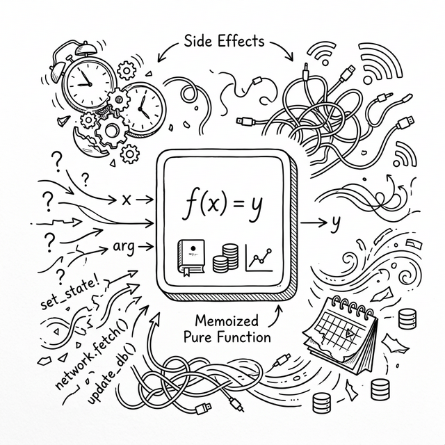

# 第十三章：副作用与护城河 —— 重构时间的秩序 (Effects and Memoization)



Po 盯着上一章写好的 `useState` 实现，脑子里还回响着 Shifu 最后那句话——*"函数里的一切，都会在每次状态变化时从头执行一遍。"*

## 13.1 副作用的困境

**🐼**：Shifu，我想把第七章的 `Timer` 计时器改成函数组件了！有了 `useState`，这应该很简单吧？

```javascript
// 尝试 1：致命错误
function Timer() {
  const [time, setTime] = useState(0);

  // 渲染时直接启动定时器？！
  setInterval(() => {
    setTime(t => t + 1);
  }, 1000);

  return h('div', null, ['Time: ', time]);
}
```

**🧙‍♂️**：别急。你知道这段代码会发生什么吗？

**🐼**：组件首次渲染，启动一个 `setInterval`。一秒后，调用 `setTime`。这会导致组件 **重新渲染**……啊！重新渲染就是“完整重执行”——整个函数再跑一遍！

**🧙‍♂️**：没错。第二次渲染时，代码会再次执行到 `setInterval`，于是你启动了 **第二个** 定时器。第三次渲染启动第三个……不到十秒钟，你的浏览器主线程就会被成千上万个定时器淹没，直至崩溃。

这不仅是定时器的问题。任何试图在渲染过程中发送网络请求、修改全局变量、或者直接操作 DOM 的行为，都会导致灾难。在函数式编程中，这些脱离纯粹计算、引发外部世界变化的代码，被称为 **副作用 (Side Effects)**。

**🐼**：在 Class 时代，我们把这些逻辑放在 `componentDidMount` 或 `componentDidUpdate` 里。在函数组件里怎么做？

## 13.2 把副作用隔离到 Commit 之后

**🧙‍♂️**：我们刚才在讨论 Fiber 架构时，特别强调了 **Render 阶段**（随时中断、可能执行多次）和 **Commit 阶段**（一口气完成、修改真实 DOM）。

你认为，副作用应该在哪个阶段发生？

**🐼**：绝对不能在 Render 阶段！因为它可能被打断、重来，如果里面有 API 请求，就会发出去十几次重复的网络请求。另外，如果副作用与 DOM 操作有关（比如获取一个节点的宽度），也必须等到页面真的被更新完毕后再做。所以，**副作用必须在 Commit 阶段之后！**

**🧙‍♂️**：非常准确。这正是 `useEffect` 这个 Hook 存在的原因：**它是纯函数的护城河**。它让你声明一段代码："请不要现在执行，请把它挂载到 Fiber 节点上，**等到所有的 DOM 都更新完毕 (Commit 阶段完成) 之后**，再统一执行它。"

让我们看看如何在我们的极简引擎里实现它：

```javascript
function useEffect(callback, dependencies) {
  // 像 useState 一样，找到之前挂载的 hook
  const oldHook =
    wipFiber.alternate &&
    wipFiber.alternate.hooks &&
    wipFiber.alternate.hooks[hookIndex];

  // 检查依赖数组是否发生变化（如果没传，默认就是有变化）
  let hasChanged = true;
  if (oldHook && oldHook.dependencies) {
    hasChanged = dependencies.some(
        (dep, i) => !Object.is(dep, oldHook.dependencies[i])
      );
  }

  // ⚠️ 注意这里有一个 tag 字段！
  // hooks 数组里会混杂着 useState 的 hook 和 useEffect 的 hook，
  // commitEffects 需要通过 tag 来区分——只处理 effect 类型的 hook，
  // 跳过 useState 的 hook，避免把状态 hook 当作副作用来执行。
  const hook = {
    tag: 'effect',
    callback,
    dependencies,
    hasChanged,
    cleanup: oldHook ? oldHook.cleanup : undefined
  };

  wipFiber.hooks.push(hook);
  hookIndex++;
}
```

**🧙‍♂️**：注意到这里我们只做了一件事：比对依赖（deps），判断是否变化（`hasChanged`），然后把传入的 `callback` 函数原封不动地 **存起来** 放在 `wipFiber` 里。我们并没有立刻执行它。

**🐼**：那它什么时候被调用？

**🧙‍♂️**：在之前的 `commitRoot()` 函数（也就是 DOM 被极速同步重写之后）里。等到一切尘埃落定，我们再遍历所有的 Fiber，集中调用那些 `hasChanged` 为 `true` 的 effect：

```javascript
// 修改我们在第十一章的 commitRoot 函数最后一步：
function commitRoot() {
  deletions.forEach(commitWork);
  commitWork(wipRoot.child);
  
  // 🌟 新增：在所有的 DOM 工作做完后，去触发副作用！
  commitEffects(wipRoot.child);

  currentRoot = wipRoot;
  wipRoot = null;
}

// 遍历整棵树，把 effect 找出来跑一遍
function commitEffects(fiber) {
  if (!fiber) return;
  
  if (fiber.hooks) {
    fiber.hooks.forEach(hook => {
      // 通过 tag 跳过 useState 的 hook，只处理 effect 类型
      if (hook.tag === 'effect' && hook.hasChanged) {
        // 先检查上一次副作用有没有留下“清理函数”，执行它
        if (hook.cleanup) hook.cleanup();
        // 执行新的副作用，并把返回值当作下次清理的函数保存起来
        hook.cleanup = hook.callback(); 
      }
    });
  }

  commitEffects(fiber.child);
  commitEffects(fiber.sibling);
}
```

**🐼**：这就像是整个树渲染完成、DOM 挂载完毕后，再专门派一个人去把所有的“护城河”检查一遍，该触发的触发。

### 清理函数的时序：副作用的“遗愿”

**🐼**：`hook.cleanup` 是什么？为什么要把 `callback()` 的返回值存起来？

**🧙‍♂️**：这是 `useEffect` 最容易让人困惑的地方，值得仔细讲清楚。先看一个例子：

```javascript
useEffect(() => {
  const timer = setInterval(() => setTime(t => t + 1), 1000);
  // 返回一个“清理函数”
  return () => clearInterval(timer);
}, []);
```

你的 effect 返回了一个函数——这个函数就是清理函数。引擎会把它保存在 `hook.cleanup` 里。下次这个 effect 需要再次运行之前，引擎会先调用这个清理函数。

让我们用时间线来看整个过程：

```
首次渲染（count = 0）：
  └─ commitEffects 执行 effect A
       └─ 启动定时器，每秒 +1
       └─ 返回清理函数 a（负责清除这个定时器）
       └─ hook.cleanup = 清理函数 a

count 变化，重新渲染（count = 1）：
  └─ commitEffects 发现 effect B 需要执行（hasChanged = true）
       └─ 先调用 hook.cleanup（= 清理函数 a）→ 清除旧定时器 ✓
       └─ 执行新的 effect B
       └─ 启动新定时器
       └─ hook.cleanup = 清理函数 b

组件卸载：
  └─ 调用 hook.cleanup（= 清理函数 b）→ 清除最后的定时器 ✓
```

**🐼**：啊！所以清理函数不是“只在卸载时运行”，而是在**每次 effect 重新执行前**都会先运行一次，以清除上一次留下的痕迹？

**🧙‍♂️**：正是。这就是为什么定时器不会累积——每次重新执行 effect 之前，旧的定时器都会被清除。

### 依赖数组的三种写法

**🐼**：我注意到 `useEffect` 的第二个参数有时传数组，有时传空数组，有时好像根本不传。这有什么区别？

**🧙‍♂️**：这是初学者最容易踩的坑之一。三种写法含义截然不同：

| 写法 | 含义 | 典型用途 |
|------|------|----------|
| `useEffect(fn, [a, b])` | `a` 或 `b` 的值变化时执行 | 响应特定数据变化（如 `userId` 变化时重新拉取数据） |
| `useEffect(fn, [])` | 只在组件 **首次挂载** 时执行一次 | 初始化操作（订阅、建立连接） |
| `useEffect(fn)` | **每次渲染后** 都执行 | 极少使用，几乎总是 bug 的来源 |

**🐼**：我明白了！有了依赖数组机制，即使组件每秒重新渲染 60 次，只要依赖没变，复杂的网络请求或昂贵的 DOM 查询也不会被重复执行。

## 13.3 逃离响应式牢笼 (useRef)

**🐼**：还有一个小问题。有时候我不想触发重新渲染，我只想要一个能够保存引用（比如一个真实的 DOM 节点，或者一个普通的计数器），并且修改它时 **不要引发组件重绘**。`useState` 一旦调用 `set` 就会触发全局重新大扫除。

**🧙‍♂️**：这就需要一个不会引起波澜的“黑盒子”。我们叫它 `useRef`。它的实现极其简单：

```javascript
function useRef(initialValue) {
  // 本质上就是一个 useState，但我们只取出 ref 对象，
  // 永远不调用它的 setState。
  // 你直接修改 ref.current = 新值，引擎毫不知情，自然也不触发重渲染。
  const [ref] = useState({ current: initialValue });
  return ref;
}
```

之所以修改 `ref.current` 不会触发重渲染，是因为我们只取出了 `useState` 返回的状态，没有使用到 `setState`。

**🐼**：`useRef` 有哪些实际用途？

**🧙‍♂️**：两大类。第一类是**保存不需要触发重绘的变量**，比如记录渲染次数：

```javascript
function App() {
  const renderCount = useRef(0);
  renderCount.current++; // 直接修改，不触发重渲染
  return h('p', null, `渲染了 ${renderCount.current} 次`);
}
```

第二类，也是更常用的一类，是**持有真实的 DOM 节点**。想象你需要在组件挂载后让一个输入框自动获得焦点：

```javascript
function SearchBox() {
  const inputRef = useRef(null);

  useEffect(() => {
    // Commit 阶段完成后，inputRef.current 里已经是真实的 DOM 节点了
    if (inputRef.current) {
      inputRef.current.focus();
    }
  }, []); // 只在首次挂载时执行一次

  // 把 ref 绑定到真实 DOM 节点（React 在 commit 阶段会完成这个赋值）
  return h('input', { ref: inputRef, placeholder: '搜索...' });
}
```

**🐼**：明白了。`useRef` 是逃离“完整重执行”副作用的安全出口——既能在渲染之间保持数据，又不干扰渲染周期。

## 13.4 缓存计算结果 (useMemo)

**🐼**：Shifu，我想起了“完整重执行”模型的另一个隐患。假设我有一个电商页面，商品列表很长……

**🧙‍♂️**：先说说你遇到了什么问题。

**🐼**：你看这段代码：

```javascript
function ProductPage() {
  const [products] = useState(hugeProductList);  // 10,000 件商品
  const [keyword, setKeyword] = useState('');
  const [darkMode, setDarkMode] = useState(false);

  // ❌ 每次切换 darkMode 时，这个过滤 + 统计也会重新执行——
  //    即使 products 和 keyword 根本没变！
  const filtered = products.filter(p =>
    p.name.includes(keyword) || p.description.includes(keyword)
  );
  const stats = {
    count: filtered.length,
    avgPrice: filtered.reduce((s, p) => s + p.price, 0) / filtered.length,
    maxPrice: Math.max(...filtered.map(p => p.price)),
  };

  // ❌ 每次 ProductPage 重新执行，都会创建一个新的函数对象，
  //    导致 ProductList 认为 props 变了，也跟着重新渲染
  const handleAddToCart = (id) => { /* ... */ };

  return h('div', { className: darkMode ? 'dark' : 'light' }, [
    h(SearchBar, { keyword, setKeyword }),
    h(StatsPanel, { stats }),            // ← stats 是新对象，每次都触发重渲染
    h(ProductList, { items: filtered, onAdd: handleAddToCart }),
    //                                    ↑ filtered 是新数组，onAdd 是新函数
    //                                      即使只切换了 darkMode，这里也全部重新渲染！
  ]);
}
```

用户只是切了一个深色模式，`ProductPage` 就被完整重执行一遍。10,000 件商品被重新过滤、价格被重新统计，`handleAddToCart` 被重新创建……`ProductList` 收到了“新的” props（引用变了），10,000 个子组件也跟着全部重新渲染。

**🧙‍♂️**：你精确地描述了“完整重执行”模型的性能代价。这种连锁反应称为 **雪崩式重渲染**。解决它需要一种机制：**能在依赖没变时，直接返回上次的计算结果**。这就是 `useMemo`。

它的逻辑与 `useEffect` 的依赖比对非常相似，但核心区别是：`useEffect` 把回调藏到 Commit 阶段执行，而 `useMemo` **直接在 Render 阶段同步执行一次并缓存结果**。

```javascript
function useMemo(factory, deps) {
  const oldHook =
    wipFiber.alternate &&
    wipFiber.alternate.hooks &&
    wipFiber.alternate.hooks[hookIndex];

  let hasChanged = true;
  if (oldHook && oldHook.deps) {
    hasChanged = deps.some((dep, i) => !Object.is(dep, oldHook.deps[i]));
  }

  const hook = {
    // 如果依赖变了，当场重新计算；没变，直接拿上次存好的旧值
    value: hasChanged ? factory() : oldHook.value,
    deps: deps,
  };

  wipFiber.hooks.push(hook);
  hookIndex++;
  return hook.value;
}
```

**🐼**：`useMemo` 看起来和 `useEffect` 很像？都是“检查依赖项是否变化”。

**🧙‍♂️**：本质上是同一个机制，只是作用时机和目的不同：

| Hook | 依赖变化时做什么 | 执行时机 |
|------|-----------------|----------|
| `useEffect` | 执行副作用 | Commit 阶段之后（异步） |
| `useMemo` | 重新计算并缓存返回值 | Render 阶段（同步） |

看到了吗？如果依赖没变，极其复杂的 `factory()` 回调函数就会被直接跳过，把上次留下的计算结果原封不动还给你。

**🐼**：等等……按照这个逻辑，`useCallback(fn, deps)` 岂不就是 `useMemo(() => fn, deps)` 的语法糖？它只是缓存了一个函数引用。

**🧙‍♂️**：正是。那我们用这些工具来修补刚才的 `ProductPage` 看看：

```javascript
// ✅ useMemo：只有依赖项变了才重新计算
const filtered = useMemo(
  () => products.filter(p =>
    p.name.includes(keyword) || p.description.includes(keyword)
  ),
  [products, keyword]  // 只有 products 或 keyword 变化时才重新过滤
);

const stats = useMemo(
  () => ({
    count: filtered.length,
    avgPrice: filtered.reduce((s, p) => s + p.price, 0) / filtered.length,
    maxPrice: Math.max(...filtered.map(p => p.price)),
  }),
  [filtered]
);

// ✅ useCallback：只有依赖项变了才创建新引用
const handleAddToCart = useCallback(
  (id) => { /* ... */ },
  []  // 无依赖，函数永远是同一个引用
);

// ✅ React.memo（高阶组件）：只有 props 真正变化时才重新渲染子组件
const ProductList = React.memo(function ProductList({ items, onAdd }) {
  return h('ul', null, items.map(p => h(ProductItem, { ...p, onAdd })));
});
```

现在切换深色模式时，`filtered` 引用不变 → `stats` 不变 → `handleAddToCart` 不变 → `ProductList` 的 props 没有变化，整个商品列表不会重新渲染。

**🐼**：我明白了！由于 React 每次都会把整个函数冲刷一遍，我们必须手动用 `useMemo` 保护那些昂贵的计算，用 `useCallback` 保护传给子组件的回调函数引用，从而防止雪崩式的重新渲染！

**🧙‍♂️**：正是如此。其实 React 团队也意识到了这个心智负担太重了。他们后来开发了 **React Compiler**，目标是在编译阶段自动插入这些记忆化代码，让开发者不用再手动写满屏幕的 `useMemo` 和 `useCallback`。

## 13.5 百川入海

**🧙‍♂️**：至此，纯函数集齐了四大法宝：

1. **记忆与触发 (`useState`)**：掌握内部状态，引起天地重绘。
2. **护城河与交互 (`useEffect`)**：隔离副作用，在 Commit 阶段清理战场，与外部系统谈判。
3. **避风港 (`useRef`)**：保存不会引起重绘的变动数据，或持有真实 DOM 节点的引用。
4. **节流阀 (`useMemo` / `useCallback`)**：通过依赖比对，拦截冗余昂贵的计算和函数创建。

这四件法宝的存在，都源于同一个前提——**“完整重执行”模型**。React 每次渲染都把函数跑一遍，Hooks 机制让你精确控制“哪些事情只做一次”、“哪些计算可以跳过”、“哪些值不必重新创建”。

这就是被称为 **Hooks 文艺复兴** 的全貌。你再也不需要把逻辑散落在 `componentDidMount` 或 `componentDidUpdate` 等零碎的生命周期钩子里了。你的心智模型回归到了最高级的状态：纯净、隔离、可组合。

不过，还有一个问题这四件法宝都没能解决——当应用变大，状态需要跨越多层组件传递时，Props 会变成一场“快递噩梦”。这就是第十四章的出发点。

---

### 📦 实践一下

将以下代码保存为 `ch13.html`，这是集成了 `useState`, `useEffect`, `useRef`, `useMemo`, `useCallback` 五大核心 Hooks 的完整演示应用：

```html
<!DOCTYPE html>
<html lang="zh-CN">
<head>
  <meta charset="UTF-8">
  <title>Chapter 13 — The Power of All Hooks</title>
  <style>
    body { font-family: sans-serif; padding: 20px; }
    h1 { color: #0066cc; }
    button { padding: 8px 16px; font-size: 14px; cursor: pointer; margin-right: 8px; margin-bottom: 8px; }
    input { padding: 8px; font-size: 14px; width: 80%; margin-bottom: 10px; }
    .card { border: 1px solid #ddd; padding: 15px; border-radius: 8px; margin-bottom: 20px; max-width: 400px; }
    .log-box { font-family: monospace; background: #282c34; color: #abb2bf; padding: 10px; height: 150px; overflow-y: auto; border-radius: 4px; }
  </style>
</head>
<body>
  <div id="app"></div>

  <script>
    // === 极简 Fiber 引擎 (支持完整 Hooks) ===
    function h(type, props, ...children) {
      return {
        type,
        props: {
          ...props,
          children: children.flat().map(child =>
            typeof child === "object" ? child : { type: "TEXT_ELEMENT", props: { nodeValue: child, children: [] } }
          )
        }
      };
    }

    let workInProgress = null, currentRoot = null, wipRoot = null, deletions = null;
    let wipFiber = null, hookIndex = null;

    function render(element, container) {
      wipRoot = { dom: container, props: { children: [element] }, alternate: currentRoot };
      deletions = [];
      workInProgress = wipRoot;
    }

    function workLoop(deadline) {
      let shouldYield = false;
      while (workInProgress && !shouldYield) {
        workInProgress = performUnitOfWork(workInProgress);
        shouldYield = deadline.timeRemaining() < 1;
      }
      if (!workInProgress && wipRoot) commitRoot();
      requestIdleCallback(workLoop);
    }
    requestIdleCallback(workLoop);

    function performUnitOfWork(fiber) {
      const isFunctionComponent = fiber.type instanceof Function;
      if (isFunctionComponent) {
        wipFiber = fiber;
        hookIndex = 0;
        wipFiber.hooks = [];
        const children = [fiber.type(fiber.props)];
        reconcileChildren(fiber, children);
      } else {
        if (!fiber.dom) fiber.dom = createDom(fiber);
        reconcileChildren(fiber, fiber.props.children);
      }

      if (fiber.child) return fiber.child;
      let nextFiber = fiber;
      while (nextFiber) {
        if (nextFiber.sibling) return nextFiber.sibling;
        nextFiber = nextFiber.return;
      }
      return null;
    }

    function createDom(fiber) {
      const dom = fiber.type === "TEXT_ELEMENT" ? document.createTextNode("") : document.createElement(fiber.type);
      updateDom(dom, {}, fiber.props);
      return dom;
    }

    function updateDom(dom, prevProps, nextProps) {
      for (const k in prevProps) {
        if (k !== 'children') {
          if (!(k in nextProps) || prevProps[k] !== nextProps[k]) {
            if (k.startsWith('on')) dom.removeEventListener(k.slice(2).toLowerCase(), prevProps[k]);
            else if (!(k in nextProps)) {
              if (k === 'className') dom.removeAttribute('class');
              else if (k === 'style') dom.style.cssText = '';
              else dom[k] = '';
            }
          }
        }
      }
      for (const k in nextProps) {
        if (k !== 'children' && prevProps[k] !== nextProps[k]) {
          if (k.startsWith('on')) dom.addEventListener(k.slice(2).toLowerCase(), nextProps[k]);
          else {
            if (k === 'className') dom.setAttribute('class', nextProps[k]);
            else if (k === 'style' && typeof nextProps[k] === 'string') dom.style.cssText = nextProps[k];
            else dom[k] = nextProps[k];
          }
        }
      }
    }

    function reconcileChildren(wipFiber, elements) {
      let index = 0, oldFiber = wipFiber.alternate && wipFiber.alternate.child, prevSibling = null;
      while (index < elements.length || oldFiber != null) {
        const element = elements[index];
        let newFiber = null;
        const sameType = oldFiber && element && element.type === oldFiber.type;

        if (sameType) newFiber = { type: oldFiber.type, props: element.props, dom: oldFiber.dom, return: wipFiber, alternate: oldFiber, effectTag: "UPDATE" };
        if (element && !sameType) newFiber = { type: element.type, props: element.props, dom: null, return: wipFiber, alternate: null, effectTag: "PLACEMENT" };
        if (oldFiber && !sameType) { oldFiber.effectTag = "DELETION"; deletions.push(oldFiber); }

        if (oldFiber) oldFiber = oldFiber.sibling;
        if (index === 0) wipFiber.child = newFiber;
        else if (element) prevSibling.sibling = newFiber;
        prevSibling = newFiber;
        index++;
      }
    }

    function commitRoot() {
      deletions.forEach(commitWork);
      commitWork(wipRoot.child);
      commitEffects(wipRoot.child); // DOM 工作完成后再触发副作用
      currentRoot = wipRoot;
      wipRoot = null;
    }

    function commitWork(fiber) {
      if (!fiber) return;
      let domParentFiber = fiber.return;
      while (!domParentFiber.dom) domParentFiber = domParentFiber.return;
      const domParent = domParentFiber.dom;

      if (fiber.effectTag === "PLACEMENT" && fiber.dom != null) domParent.appendChild(fiber.dom);
      else if (fiber.effectTag === "UPDATE" && fiber.dom != null) updateDom(fiber.dom, fiber.alternate.props, fiber.props);
      else if (fiber.effectTag === "DELETION") {
        commitDeletion(fiber, domParent);
        return;
      }

      commitWork(fiber.child);
      commitWork(fiber.sibling);
    }
    
    function commitDeletion(fiber, domParent) {
      if (fiber.dom) domParent.removeChild(fiber.dom);
      else commitDeletion(fiber.child, domParent);
    }

    function commitEffects(fiber) {
      if (!fiber) return;
      if (fiber.hooks) {
        fiber.hooks.forEach(hook => {
          // tag === 'effect' 区分 useState hook 和 useEffect hook
          if (hook.tag === 'effect' && hook.hasChanged) {
            if (hook.cleanup) hook.cleanup(); // 先执行上一次的清理函数
            if (hook.callback) hook.cleanup = hook.callback(); // 再执行新副作用，保存清理函数
          }
        });
      }
      commitEffects(fiber.child);
      commitEffects(fiber.sibling);
    }

    // === Hooks API ===
    function getOldHook() {
      return wipFiber.alternate && wipFiber.alternate.hooks && wipFiber.alternate.hooks[hookIndex];
    }

    function useState(initial) {
      const oldHook = getOldHook();
      const hook = { 
        state: oldHook ? oldHook.state : initial, 
        queue: oldHook ? oldHook.queue : [],
        setState: oldHook ? oldHook.setState : null
      };
      
      hook.queue.forEach(action => hook.state = typeof action === 'function' ? action(hook.state) : action);
      hook.queue.length = 0;

      if (!hook.setState) {
        hook.setState = action => {
          hook.queue.push(action);
          wipRoot = { dom: currentRoot.dom, props: currentRoot.props, alternate: currentRoot };
          workInProgress = wipRoot;
          deletions = [];
        };
      }
      wipFiber.hooks.push(hook);
      hookIndex++;
      return [hook.state, hook.setState];
    }

    function useEffect(callback, deps) {
      const oldHook = getOldHook();
      let hasChanged = true;
      if (oldHook && deps) {
        hasChanged = deps.some((dep, i) => !Object.is(dep, oldHook.deps[i]));
      }
      // tag: 'effect' 让 commitEffects 能识别并跳过 useState 的 hook
      const hook = { tag: 'effect', callback, deps, hasChanged, cleanup: oldHook ? oldHook.cleanup : undefined };
      wipFiber.hooks.push(hook);
      hookIndex++;
    }

    function useRef(initial) {
      const [ref] = useState({ current: initial });
      return ref;
    }

    function useMemo(factory, deps) {
      const oldHook = getOldHook();
      let hasChanged = true;
      if (oldHook && deps) {
        hasChanged = deps.some((dep, i) => !Object.is(dep, oldHook.deps[i]));
      }
      const hook = { value: hasChanged ? factory() : oldHook.value, deps };
      wipFiber.hooks.push(hook);
      hookIndex++;
      return hook.value;
    }

    function useCallback(callback, deps) {
      return useMemo(() => callback, deps);
    }

    // === 演示应用：观察 useEffect 与 useMemo 的行为 ===
    function App() {
      const [count, setCount] = useState(0);
      const [text, setText] = useState('');
      const renderCount = useRef(0);
      
      // useRef：记录渲染次数，不触发重绘
      renderCount.current++; 

      // useEffect：依赖 count，count 不变时不重新执行
      useEffect(() => {
        console.log("🌊 Effect: 组件挂载或 count 改变了 ->", count);
        return () => console.log("🧹 Cleanup: count 要变化了 ->", count);
      }, [count]);

      // useMemo：依赖 count，文本框输入不会触发重新计算
      const expensiveValue = useMemo(() => {
        console.log("🧮 计算昂贵的字符串...");
        return "✨ 昂贵计算结果: " + count * 100;
      }, [count]);

      return h('div', { className: 'card' },
        h('h2', null, '综合 Hooks 演示'),
        h('p', null, `页面总渲染次数: ${renderCount.current}`),
        h('p', null, `Count 值: ${count}`),
        h('p', { style: 'color: green;' }, expensiveValue),
        h('button', { onclick: () => setCount(c => c + 1) }, '增加数字'),
        h('hr', null),
        h('input', { 
          placeholder: '打字测试（不影响上面的数字和昂贵计算）',
          value: text, 
          oninput: (e) => setText(e.target.value) 
        }),
        h('p', null, `你输入了: ${text}`),
        h('p', { style: 'font-size: 12px; color: gray;' }, '打开 F12 Console 面板，观察 useEffect 和 useMemo 何时被触发')
      );
    }

    render(h(App, null), document.getElementById('app'));
  </script>
</body>
</html>
```