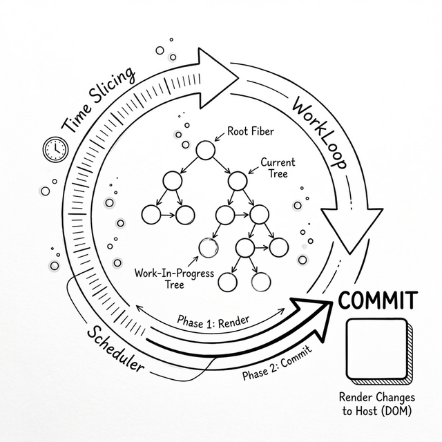

# 附录 A：Mini-React vs React —— 我们简化了什么



在这本书中，我们从最初的同步递归构建（Stack Reconciler），一步步将引擎拉扯、进化到了一个约 **400 行** 的现代化 Fiber 和 Hooks 引擎。它涵盖了 Virtual DOM、时间切片（Time Slicing）、Fiber 协调（Reconciliation）、同步提交（Commit）以及核心 Hooks。

真实的 React 也是从同样的痛点出发，进化到了如今庞大的 Fiber 架构（几十万行代码）。这个附录收录了我们构建的 `mini-react` 最终完整源码，并帮助你理解：**在这个最终的 Fiber 模型中，我们还刻意简化了哪些部分，以及真正的 React 是如何处理核心架构的。**

---

## 真实的 React 还处理了什么？（差异对比）

尽管我们拥有了现代 Fiber 骨架，但为了保持不到 400 行代码的易读性，对比生产代码（几十万行），真正的 React 还处理了大量细节和进阶架构：

### 1. 调度器 (Scheduler) 与优先级模型

我们偷懒使用了浏览器的原生 API `requestIdleCallback`。

**React 现状**：`requestIdleCallback` 并不是所有浏览器都支持，而且不够稳定。真实的 React 团队手写了一个基于 `MessageChannel` 的核心库 `scheduler`。在 React 17/18 引入的并发模式中，还有“车道模型”（Lane Model）——通过位掩码（bitmasks）对不同的任务划分优先级。比如用户点击输入（高优先级）会打断网络请求结果的渲染（低优先级）。我们现在的 `workLoop` 只有一种优先级，按先进先出调度。

### 2. 双缓冲 (Double Buffering) 机制的性能回收

我们每次调用 `setState` 都创建了一个全新的 `wipRoot` 树：

```js
wipRoot = { dom: currentRoot.dom, alternate: currentRoot, ... }
```

**React 现状**：React 为了极力压榨性能，真正的 Fiber 节点会被重用。它拥有一个严格对应的 `current` 树和 `workInProgress` 树。每次渲染更新时，React 并不是创建新的 Fiber 对象，而是重用前一次在旧 Fiber 树上同层级的对象实例。这极大地减轻了 JavaScript 引擎垃圾回收（GC）的负担。

### 3. 合成事件系统 (SyntheticEvent)

在我们的代码里，遇到事件都是直接这样挂载：

```javascript
dom.addEventListener(eventType, nextProps[name]);
```

**React 现状**：真实组件中的 `onClick` 并不是这样绑定的。由于各浏览器的事件对象表现不一致，并且为了提升内存性能，React 在应用顶层（容器级别）挂载了一个全局事件监听器。所有在子组件里触发的事件都会冒泡到顶层被 React 拦截，包装成一个跨浏览器兼容的 `SyntheticEvent` 对象后再去触发我们的回调。

### 4. Diff 算法的复杂度保证

在 `reconcileChildren` 里，我们只是通过数组索引 `index` 把新的 VNode 和对应的旧 Fiber 节点进行对比。

**React 现状**：我们直接忽略了数组节点可能发生顺序变换导致的大规模 DOM 删除与新建问题。React 的 `reconcileChildrenArray` 采用了基于 `key` 属性的算法：如果只是数组顺序打乱，React 可以通过识别 `key` 来调整真实 DOM 的位置（移动而非重建）。这也是为什么在长列表循环里不加 `key` 会收到警告提示的原因。

### 4.5 Render Phase 的内部分工：beginWork 与 completeWork
我们把每个节点的所有工作都放在了 `performUnitOfWork` 里统一处理。

**React 现状**：真实的 React 将 `performUnitOfWork` 内部的职责一分为二——
向下进入节点时调用 `beginWork`（负责执行函数组件、做 Reconciliation），
向上回溯时调用 `completeWork`（负责创建 DOM 节点、将子节点的 flags 向上合并到父节点）。
这种拆分方便 React 在并发中断恢复时精确区分节点的"进入"和"完成"两个时机。
核心的深度优先遍历逻辑与本书完全一致。

### 5. Suspense 与并发

我们在第 15 章讲解了 Suspense，并在教学代码中演示了核心的 `try/catch` 机制。

**React 现状**：真实的 React Fiber 具备强大的"任务抛出与捕获（Throw / Catch）"恢复机制。当 Render 阶段抛出 Promise 时，React 会将渲染"挂起（Suspend）"，将控制权交出，等 Promise resolve 后，由于 Fiber 保存着准确的工作状态，它可以从原位置精密恢复执行。

### 6. SSR (Server-Side Rendering) 与 RSC

我们的 mini-react 是一个完全基于浏览器环境跑的 CSR（客户端渲染）DOM 引擎。真实的 React 拥有独立于宿主环境的 Renderer（使得 `react-native` 可以渲染原生移动端，`react-dom/server` 可以渲染 HTML 字符串）。同时 React 还在底层架构上切割了 Client Component / Server Component，实现了按需加载与无感知的 Hydration。

---

### 总结：从本质看演变

虽然我们的这 400 行代码省略了 React 用来修补性能和边界条件的巨量逻辑，但你依然看到了一颗完整的内脏：**Fiber 如何将长任务打散？`useState` 如何附着在链表中？副作用（Effects）为什么要在构建完 DOM 之后才能被 Commit（提交）？**

掌握了这个心智模型，遇到奇怪的闭包陷阱、或者是 Hooks 报错的时候，多回想一下这根承载了记忆的 Fiber 链条。

---

## 完整的 Mini-React (Fiber) 源码

以下是本书第 9-15 章逐步建立起来的完整 Fiber 引擎，可作为阅读真实 React 源码前的“垫脚石”。

> **关于本文件与各章 Demo 的一点说明**
>
> 各章末尾“实践一下”的 HTML Demo 是为了可以直接粘贴在浏览器里运行而写的，所以没有使用 `export`。本文件作为独立的 ES 模块，使用 `export` 导出公共 API。两者的实现逻辑完全一致。
>
> 另外，`h()` 函数内部使用了一个命名辅助函数 `createTextElement`，而各章 Demo 中将这段逻辑直接内联在 `h()` 里。效果完全等价，命名辅助函数在这里只是让代码更易读。

```javascript
/**
 * mini-react.js — The Way of React (Modern Fiber Architecture)
 *
 * 本书第 9-15 章逐步构建的现代化 Fiber 引擎完整源码。
 * 包含 Fiber 架构、时间切片（Time-Slicing）和挂载在 Fiber 节点上的 Hooks。
 * 本引擎完全取代了第 1-8 章构建的同步递归栈协调器（Stack Reconciler）。
 */

// ============================================
// 虚拟 DOM 工厂函数
// ============================================

export function h(type, props, ...children) {
  return {
    type,
    props: {
      ...props,
      // .flat() 处理嵌套数组（例如 children 里传入了一个数组）
      // 文本节点统一包装成对象，让 Fiber 遍历算法可以一视同仁地处理
      children: children.flat().map(child =>
        typeof child === "object"
          ? child
          : createTextElement(child)
      ),
    },
  };
}

// 将字符串/数字文本包装成统一格式的 VNode 对象
// 各章 Demo 中将这段逻辑直接内联在 h() 里，效果完全等价
function createTextElement(text) {
  return {
    type: "TEXT_ELEMENT",
    props: {
      nodeValue: text,
      children: [],
    },
  };
}

// ============================================
// 全局状态变量（引擎的“仪表盘”）
// ============================================

let workInProgress = null; // 遍历游标：当前待处理的 Fiber 节点
let currentRoot = null;    // 完工蓝图：上一次已提交的 Fiber 树
let wipRoot = null;        // 草稿纸：正在构建中的新 Fiber 树的根
let deletions = null;      // 待删除的旧 Fiber 节点列表

let wipFiber = null;       // 当前正在执行的函数组件对应的 Fiber 节点
let hookIndex = null;      // 当前处理到哪个 Hook 的计数器（“第几个抽屉”）

// ============================================
// 公开 API
// ============================================

export function render(element, container) {
  // 创建草稿根节点，连上旧树（首次挂载时 currentRoot 为 null）
  wipRoot = {
    dom: container,
    props: {
      children: [element],
    },
    alternate: currentRoot,
  };
  deletions = [];
  workInProgress = wipRoot;
}

// ============================================
// 工作循环（时间切片的核心）
// ============================================

function workLoop(deadline) {
  let shouldYield = false;

  // 有任务 且 浏览器还有空闲时间，就持续执行
  while (workInProgress && !shouldYield) {
    workInProgress = performUnitOfWork(workInProgress);
    shouldYield = deadline.timeRemaining() < 1;
  }

  // 游标走到 null 说明 Render Phase 结束，同步进入 Commit Phase
  if (!workInProgress && wipRoot) {
    commitRoot();
  }

  // 让出主线程后，等下一个空闲帧继续
  requestIdleCallback(workLoop);
}

requestIdleCallback(workLoop);

// 处理单个 Fiber 节点，返回下一个要处理的节点
function performUnitOfWork(fiber) {
  const isFunctionComponent = fiber.type instanceof Function;

  if (isFunctionComponent) {
    updateFunctionComponent(fiber);
  } else {
    updateHostComponent(fiber);
  }

  // 导航到下一个节点：优先走 child，否则走 sibling，再否则往上找叔叔
  if (fiber.child) return fiber.child;

  let nextFiber = fiber;
  while (nextFiber) {
    if (nextFiber.sibling) return nextFiber.sibling;
    nextFiber = nextFiber.return; // ← return 指针，指向父节点（对应 React 源码的 return 字段）
  }
  return null;
}

// ============================================
// 组件更新与子节点协调
// ============================================

function updateFunctionComponent(fiber) {
  // 设置全局指针，让 useState/useEffect 知道当前在处理哪个 Fiber 的哪个抽屉
  wipFiber = fiber;
  hookIndex = 0;
  wipFiber.hooks = [];

  // 执行函数组件，得到子 VNode（.flat() 处理组件返回数组的情况）
  const children = [fiber.type(fiber.props)].flat();
  reconcileChildren(fiber, children);
}

function updateHostComponent(fiber) {
  // 原生 DOM 节点：创建真实 DOM（但不挂载，交由 Commit Phase 统一处理）
  if (!fiber.dom) {
    fiber.dom = createDom(fiber);
  }
  reconcileChildren(fiber, fiber.props.children);
}

// 协调子节点：对比新 VNode 和旧 Fiber，贴上 effectTag 工单
function reconcileChildren(wipFiber, elements) {
  let index = 0;
  let oldFiber = wipFiber.alternate && wipFiber.alternate.child;
  let prevSibling = null;

  // 循环条件：新元素没走完 OR 旧 Fiber 没走完（两边都要走到末尾才能发现多余的旧节点）
  while (index < elements.length || oldFiber != null) {
    const element = elements[index];
    let newFiber = null;

    const sameType = oldFiber && element && element.type === oldFiber.type;

    if (sameType) {
      // type 相同：复用旧 DOM，只更新 props
      newFiber = {
        type: oldFiber.type,
        props: element.props,
        dom: oldFiber.dom,      // 直接复用旧的真实 DOM 节点
        return: wipFiber,       // ← return，指向父节点（与 React 源码命名一致）
        alternate: oldFiber,    // 连上旧 Fiber，Commit 时用来对比旧 props
        effectTag: "UPDATE",
      };
    }
    if (element && !sameType) {
      // 有新元素但 type 不同（或没有旧节点）：全新创建
      newFiber = {
        type: element.type,
        props: element.props,
        dom: null,
        return: wipFiber,       // ← return，指向父节点
        alternate: null,
        effectTag: "PLACEMENT",
      };
    }
    if (oldFiber && !sameType) {
      // 有旧节点但没有对应新元素（或 type 不同）：标记删除
      oldFiber.effectTag = "DELETION";
      deletions.push(oldFiber);
    }

    if (oldFiber) oldFiber = oldFiber.sibling;

    if (index === 0) {
      wipFiber.child = newFiber;
    } else if (element) {
      prevSibling.sibling = newFiber;
    }

    prevSibling = newFiber;
    index++;
  }
}

// ============================================
// Commit Phase（同步、不可中断地把改动写入真实 DOM）
// ============================================

function commitRoot() {
  // 先处理删除（被删除的旧 Fiber 不在新树里，需要单独处理）
  deletions.forEach(commitWork);
  // 再处理新增和更新
  commitWork(wipRoot.child);
  // DOM 全部更新完毕后，再统一触发副作用
  commitEffects(wipRoot.child);

  // 新树成为当前树，草稿纸清空
  currentRoot = wipRoot;
  wipRoot = null;
}

function commitWork(fiber) {
  if (!fiber) return;

  // 找到最近的有真实 DOM 的祖先节点
  // 函数组件本身没有 DOM，需要向上跳过，直到找到原生节点
  let domParentFiber = fiber.return; // ← return，指向父节点
  while (!domParentFiber.dom) {
    domParentFiber = domParentFiber.return; // ← return
  }
  const domParent = domParentFiber.dom;

  if (fiber.effectTag === "PLACEMENT" && fiber.dom != null) {
    // 新增：把 DOM 挂到页面上
    domParent.appendChild(fiber.dom);
  } else if (fiber.effectTag === "UPDATE" && fiber.dom != null) {
    // 更新：只修改有变化的属性和事件监听器
    updateDom(fiber.dom, fiber.alternate.props, fiber.props);
  } else if (fiber.effectTag === "DELETION") {
    // 删除：移除旧 DOM，并立即返回，不再递归被删除节点的子树
    // （旧子树上可能残留过期的 effectTag，继续遍历会误把“僵尸节点”插回 DOM）
    commitDeletion(fiber, domParent);
    return;
  }

  commitWork(fiber.child);
  commitWork(fiber.sibling);
}

function commitDeletion(fiber, domParent) {
  if (fiber.dom) {
    domParent.removeChild(fiber.dom);
  } else {
    // 函数组件没有 dom，继续向下找真实 DOM 节点
    commitDeletion(fiber.child, domParent);
  }
}

// 遍历整棵 Fiber 树，在 DOM 操作全部完成后执行所有待触发的副作用
function commitEffects(fiber) {
  if (!fiber) return;

  if (fiber.hooks) {
    fiber.hooks.forEach(hook => {
      // 通过 tag === 'effect' 区分 useEffect 的 hook 和 useState 的 hook
      if (hook.tag === 'effect' && hook.hasChanged && hook.callback) {
        // 先执行上一次副作用留下的清理函数
        if (hook.cleanup) hook.cleanup();
        // 执行新副作用，返回值作为下次的清理函数保存起来
        hook.cleanup = hook.callback();
      }
    });
  }

  commitEffects(fiber.child);
  commitEffects(fiber.sibling);
}

// ============================================
// DOM 工具函数
// ============================================

function createDom(fiber) {
  const dom = fiber.type === "TEXT_ELEMENT"
    ? document.createTextNode("")
    : document.createElement(fiber.type);
  updateDom(dom, {}, fiber.props);
  return dom;
}

function updateDom(dom, prevProps, nextProps) {
  // 第一遍：移除旧的属性和事件监听器
  for (const k in prevProps) {
    if (k !== 'children') {
      if (!(k in nextProps) || prevProps[k] !== nextProps[k]) {
        if (k.startsWith('on')) {
          dom.removeEventListener(k.slice(2).toLowerCase(), prevProps[k]);
        } else if (!(k in nextProps)) {
          // 旧的有、新的没有：清空属性
          if (k === 'className') dom.removeAttribute('class');
          else if (k === 'style') dom.style.cssText = '';
          else dom[k] = '';
        }
      }
    }
  }
  // 第二遍：设置新的属性和事件监听器
  for (const k in nextProps) {
    if (k !== 'children' && prevProps[k] !== nextProps[k]) {
      if (k.startsWith('on')) {
        dom.addEventListener(k.slice(2).toLowerCase(), nextProps[k]);
      } else {
        if (k === 'className') dom.setAttribute('class', nextProps[k]);
        else if (k === 'style' && typeof nextProps[k] === 'string') dom.style.cssText = nextProps[k];
        else dom[k] = nextProps[k];
      }
    }
  }
}

// ============================================
// Hooks API
// ============================================

export function useState(initial) {
  // 从旧 Fiber 的同位置抽屉里取出上次的 hook 对象
  const oldHook =
    wipFiber.alternate &&
    wipFiber.alternate.hooks &&
    wipFiber.alternate.hooks[hookIndex];

  const hook = {
    state: oldHook ? oldHook.state : initial,
    queue: oldHook ? oldHook.queue : [],
    setState: oldHook ? oldHook.setState : null,
  };

  // 清算队列：把所有待处理的更新依次应用到 state 上
  hook.queue.forEach(action => {
    hook.state = typeof action === 'function'
      ? action(hook.state)  // 支持函数式更新：setCount(c => c + 1)
      : action;             // 也支持直接赋值：setCount(5)
  });
  hook.queue.length = 0;

  // 首次渲染时创建 setState（之后复用同一个函数引用）
  if (!hook.setState) {
    hook.setState = action => {
      hook.queue.push(action);
      // 创建新的 wipRoot（草稿纸），触发新一轮 Render Phase
      wipRoot = {
        dom: currentRoot.dom,
        props: currentRoot.props,
        alternate: currentRoot,
      };
      workInProgress = wipRoot;
      deletions = [];
    };
  }

  wipFiber.hooks.push(hook);
  hookIndex++;
  return [hook.state, hook.setState];
}

export function useReducer(reducer, initialState) {
  // useReducer 本质上是 useState 的语法糖：
  // 把“如何更新”这件事从各个 setState 调用处，集中到一个 reducer 纯函数里
  const [state, setState] = useState(initialState);

  function dispatch(action) {
    setState(prevState => reducer(prevState, action));
  }

  return [state, dispatch];
}

export function useEffect(callback, deps) {
  const oldHook =
    wipFiber.alternate &&
    wipFiber.alternate.hooks &&
    wipFiber.alternate.hooks[hookIndex];

  // 比对依赖数组，判断是否需要重新执行副作用
  let hasChanged = true;
  if (oldHook && deps) {
    hasChanged = deps.some((dep, i) => !Object.is(dep, oldHook.deps[i]));
  }

  const hook = {
    tag: 'effect',  // ← 标记类型，让 commitEffects 能区分 useState 和 useEffect 的 hook
    callback,
    deps,
    hasChanged,
    cleanup: oldHook ? oldHook.cleanup : undefined,
  };

  wipFiber.hooks.push(hook);
  hookIndex++;
}

export function useMemo(factory, deps) {
  const oldHook =
    wipFiber.alternate &&
    wipFiber.alternate.hooks &&
    wipFiber.alternate.hooks[hookIndex];

  let hasChanged = true;
  if (oldHook && deps) {
    hasChanged = deps.some((dep, i) => !Object.is(dep, oldHook.deps[i]));
  }

  const hook = {
    // 依赖变了就当场重新计算；没变就返回上次缓存的结果
    value: hasChanged ? factory() : oldHook.value,
    deps,
  };

  wipFiber.hooks.push(hook);
  hookIndex++;
  return hook.value;
}

export function useCallback(callback, deps) {
  // useCallback 就是缓存函数引用的 useMemo 语法糖
  return useMemo(() => callback, deps);
}

export function useRef(initialValue) {
  // useRef 本质上是一个永远不调用 setState 的 useState
  // 直接修改 ref.current 不会触发重新渲染
  const [ref] = useState({ current: initialValue });
  return ref;
}

// ============================================
// Context API（第 14 章）
// ============================================

export function createContext(defaultValue) {
  return {
    _currentValue: defaultValue, // 没有 Provider 包裹时的兜底默认值
  };
}

// ContextProvider 是一个特殊的包装组件：
// 它本身只负责透传 children，但它的 Fiber 节点上挂着 context 和 value，
// 供子孙组件通过 useContext 向上查找时“认领”
export function ContextProvider(props) {
  return props.children;
}

export function useContext(contextType) {
  // 顺着 return 指针一路往上爬，寻找最近的 ContextProvider
  let currentFiber = wipFiber;
  while (currentFiber) {
    if (
      currentFiber.type === ContextProvider &&
      currentFiber.props.context === contextType
    ) {
      // 找到了！从这个祖先的 props 里取出 value
      return currentFiber.props.value;
    }
    currentFiber = currentFiber.return; // ← return，向上爬
  }
  // 一路爬到根节点都没找到 Provider，返回 createContext 时的默认值
  return contextType._currentValue;
}
```